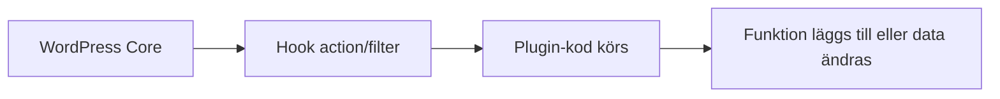

# WordPress plugins

Plugins (tillägg) i WordPress är moduler som lägger till funktionalitet utan att du behöver bygga allt från grunden. När du förstår hur plugins fungerar kan du bygga webbplatser snabbare, men också mer säkert och hållbart.

## Förkunskaper

Innan du börjar bör du ha läst:

- [WordPress](./wordpress.md)
- [Hur wordpress är uppbyggt](./wordpress-uppbyggt.md)
- [WordPress adminpanel](./wordpress-admin.md)

## Vad är ett plugin?

Ett plugin är kod som kopplas in i WordPress och kan:

- lägga till nya funktioner
- ändra beteende i adminpanelen
- påverka hur innehåll visas
- integrera externa tjänster

Exempel: formulär, SEO-stöd, backup, säkerhet, bildoptimering.

## Hur plugins fungerar tekniskt

WordPress erbjuder hooks (krokar) som plugins använder för att ansluta sig till flödet:

- **Action (händelse):** kör kod vid ett visst tillfälle
- **Filter (filter):** ändrar data innan den visas eller sparas



## Exempel: enkel plugin-struktur

Ett minimalt plugin kan bestå av en PHP-fil i mappen `wp-content/plugins`.

```php
<?php
/**
 * Plugin Name: School Site Notice
 */

function school_site_notice() {
	echo '<p style="text-align:center;">Välkommen till kursens testsajt</p>';
}
add_action( 'wp_footer', 'school_site_notice' );
```

Det här visar principen: pluginet registrerar en funktion och kopplar den till en action.

## Nödvändiga plugin-kategorier för de flesta projekt

I de flesta WordPress-projekt behövs minst dessa kategorier:

1. Säkerhet
2. Backup
3. Cache/prestanda
4. SEO
5. Formulär

## Förslag på plugins att börja med

Nedan är en praktisk baslista för kursprojekt och mindre produktionssajter.

### 1) Säkerhet

- **Wordfence Security** eller **Sucuri Security**
- Hjälper med brandvägg, skanning och inloggningsskydd

### 2) Backup

- **UpdraftPlus**
- Skapar backup av filer och databas, och stödjer återställning

### 3) Cache och prestanda

- **WP Super Cache** eller **LiteSpeed Cache** (om servern stödjer det)
- Minskar laddningstid genom cachning (mellanlagring)

### 4) SEO

- **Yoast SEO** eller **Rank Math**
- Hjälper med metadata, sitemap och grundläggande SEO-flöde

### 5) Formulär

- **WPForms Lite** eller **Contact Form 7**
- För kontaktformulär och enklare inmatning från användare

### 6) Bildoptimering (valfritt men starkt rekommenderat)

- **Smush** eller **ShortPixel**
- Komprimerar bilder och förbättrar prestanda

## Hur du väljer plugin på ett säkert sätt

Innan installation, kontrollera alltid:

- Antal aktiva installationer
- Senaste uppdatering
- Kompatibilitet med aktuell WordPress-version
- Omdömen och supportaktivitet

Undvik plugins som inte uppdaterats på länge.

## Vanliga misstag

1. Installera många plugins med överlappande funktioner.
2. Aktivera plugin utan att förstå påverkan på prestanda.
3. Lämna inaktiva plugins installerade i onödan.
4. Uppdatera plugin direkt i produktion utan backup.

## Säkerhet i praktiken

För ett tryggare plugin-arbete:

- Uppdatera regelbundet.
- Ta backup innan större uppdatering.
- Använd staging (testmiljö) före produktion.
- Avinstallera plugins du inte använder.
- Begränsa vem som får installera nya plugins.

## Sammanfattning

Plugins gör WordPress kraftfullt och flexibelt. Med en liten, genomtänkt plugin-bas och bra underhållsrutiner får du en snabbare, säkrare och mer stabil webbplats.

## Reflektionsfrågor

1. Vilka plugin-kategorier är viktigast för en skolwebbplats och varför?
2. Hur undviker du att plugin-miljön blir svår att underhålla?
3. Vilka risker finns med att uppdatera plugins utan testmiljö?
