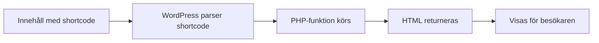

# WordPress shortcodes

Shortcodes (kortkoder) är ett sätt att köra PHP-funktioner direkt från innehåll i WordPress, till exempel i en sida eller ett inlägg.

Exempel:

```text
[my_shortcode]
```

När WordPress ser shortcoden ersätts den med HTML från din funktion.

## Förkunskaper

Innan du börjar är det bra om du har läst:

- [WordPress](./wordpress.md)
- [WordPress adminpanel](./wordpress-admin.md)
- [WordPress teman](./wordpress-teman.md)

## Varför shortcodes?

Shortcodes är användbara när du vill att redaktören ska kunna lägga in dynamiskt innehåll utan att skriva kod.

Vanliga exempel:

- kontaktkort
- listor med senaste inlägg
- custom post type-listor
- sliders och gallerier

## Hur fungerar det?

Du kopplar ett shortcode-namn till en PHP-funktion:

1. `add_shortcode()` registrerar namnet
2. WordPress hittar `[namn]` i innehållet
3. Din funktion körs
4. Funktionen returnerar HTML som visas på sidan



## 1) En första shortcode (utan parametrar)

Lägg i `functions.php` eller i ett plugin:

```php
function school_hello_shortcode() {
	return '<p>Hej från min första shortcode!</p>';
}
add_shortcode( 'school_hello', 'school_hello_shortcode' );
```

Använd i en sida:

```text
[school_hello]
```

### Vad händer i koden?

- `school_hello_shortcode()` skapar innehållet
- `add_shortcode( 'school_hello', ... )` registrerar namnet
- WordPress ersätter `[school_hello]` med texten från funktionen

## 2) Shortcode med parametrar (attributes, attribut)

Nu gör vi en mer flexibel shortcode.

```php
function school_box_shortcode( $atts ) {
	$atts = shortcode_atts(
		array(
			'title' => 'Standardrubrik',
			'text'  => 'Standardtext',
		),
		$atts,
		'school_box'
	);

	return '<div class="school-box"><h3>' . esc_html( $atts['title'] ) . '</h3><p>' . esc_html( $atts['text'] ) . '</p></div>';
}
add_shortcode( 'school_box', 'school_box_shortcode' );
```

Användning:

```text
[school_box title="Välkommen" text="Detta innehåll kommer från en shortcode."]
```

### Varför `shortcode_atts()`?

Funktionen sätter standardvärden. Om redaktören inte skickar in `title` eller `text` så fungerar shortcoden ändå.

## Viktig regel: returnera, inte echo

I en shortcode-funktion ska du nästan alltid använda `return`, inte `echo`.

- `return` skickar tillbaka innehållet till rätt plats i sidan
- `echo` kan skriva ut innehåll på fel ställe i renderingen

## Säkerhet i shortcodes

Använd alltid escaping (escapning) när du skriver ut data:

- `esc_html()` för text
- `esc_url()` för länkar
- `sanitize_text_field()` för indata du vill rensa

Det minskar risk för XSS (cross-site scripting).

## Vanliga nybörjarfel

1. Shortcoden syns som text i sidan
   - Kontrollera att du skrev `[school_hello]` och inte glömde hakparenteser.
2. Inget händer alls
   - Kontrollera att funktionen laddas (rätt fil, aktivt tema/plugin).
3. Fel namn i `add_shortcode`
   - Kontrollera att shortcode-namn och funktionsnamn stämmer.
4. Trasig HTML
   - Kontrollera att alla taggar öppnas/stängs korrekt.

## När passar shortcodes bäst?

Shortcodes passar bra när:

- redaktörer ska kunna placera funktioner var som helst
- du vill återanvända samma funktion på flera sidor
- innehållet är dynamiskt (hämtas från databas)

Om du bygger nyare block-baserat innehåll i Gutenberg kan ett block ibland vara bättre på sikt, men shortcodes är fortfarande vanliga i många projekt.

## Praktisk övning

1. Skapa shortcoden `school_hello` och testa den på en sida.
2. Skapa shortcoden `school_box` och testa två olika varianter med olika `title` och `text`.
3. Lägg till egen CSS-klass i HTML-strängen och styla boxen i temat.
4. Förklara varför `esc_html()` är viktig i båda exemplen.

## Nästa steg

När du kan shortcodes är nästa naturliga steg att:

- skapa en egen post type som visas med shortcode
- bygga plugin som använder shortcode för mer avancerat innehåll

Fortsätt med:

- [Egen post type i WordPress (Portfolio)](./wordpress-custom-post-type.md)
- [WordPress plugins](./wordpress-plugins.md)
