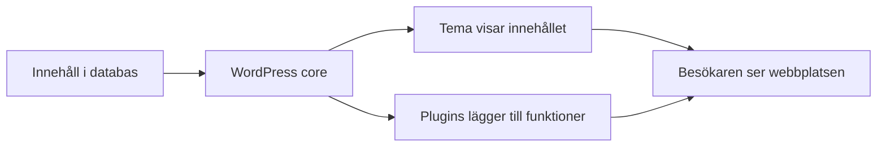

# WordPress teman

Temat (theme) i WordPress styr hur webbplatsens innehåll visas för besökaren. När du förstår hur teman fungerar blir det enklare att välja rätt tema, anpassa designen och undvika vanliga misstag i utveckling och underhåll.

## Förkunskaper

Innan du börjar bör du ha läst:

- [WordPress](./wordpress.md)
- [Hur wordpress är uppbyggt](./wordpress-uppbyggt.md)
- [Installation med Local by Flywheel](./wordpress-local.md)

## Vad är ett tema?

Ett tema är ett paket med filer som bestämmer:

- Layout (hur sidan är uppbyggd)
- Typografi och färger
- Hur inlägg och sidor presenteras
- Vilka widget-områden och menyer som finns

Temat påverkar i första hand **presentationen**, inte själva innehållet i databasen.

## Hur tema, innehåll och plugin hänger ihop



## Vanliga typer av teman

### Färdiga teman

Bra när du vill komma igång snabbt och använda en färdig design.

### Child theme (barntema)

Ett child theme är ett undertema till ett befintligt tema. Du kan då göra ändringar utan att förlora dem vid uppdatering av parent theme (föräldratema).

### Eget tema

Passar när du behöver full kontroll över design, struktur och prestanda.

## Välja tema: en enkel checklista

När du väljer tema, kontrollera att det:

1. Är aktivt underhållet och uppdateras regelbundet.
2. Är responsivt (fungerar i mobil, surfplatta och desktop).
3. Har bra tillgänglighet (accessibility, tillgänglighet).
4. Har tydlig dokumentation.
5. Inte kräver onödigt många externa tillägg.

## Anpassa tema i praktiken

Du kan anpassa ett tema på flera nivåer:

- **Customizer (anpassaren):** färger, logotyp, vissa layoutval.
- **Block editor (blockredigerare):** innehållsblock per sida/inlägg.
- **Egen CSS:** små visuella ändringar.
- **Template-filer:** större strukturändringar i temat.

Börja alltid med små ändringar och testa i lokal miljö innan publicering.

## Kodexempel: registrera meny i tema

Det här exemplet visar ett vanligt steg i ett tema: att registrera en menyplats i `functions.php`.

```php
function school_theme_setup() {
	register_nav_menus(
		array(
			'primary' => __( 'Primary Menu', 'school-theme' ),
		)
	);
}
add_action( 'after_setup_theme', 'school_theme_setup' );
```

När detta är gjort kan du koppla meny i adminpanelen via **Utseende > Menyer**.

## Säkerhet i teman

När du anpassar tema med PHP är det viktigt att skriva ut data säkert.

### Exempel: säker output

```php
$page_title = get_the_title();
echo '<h1>' . esc_html( $page_title ) . '</h1>';
```

Använd även:

- `esc_url()` för URL:er
- `esc_attr()` för attribut i HTML
- `sanitize_text_field()` när du tar emot textinmatning

Det minskar risken för XSS (cross-site scripting).

## Vanliga misstag

1. Ändra direkt i ett externt tema utan child theme.
2. Välja ett tema med för mycket inbyggd funktionalitet som borde ligga i plugin.
3. Göra stora ändringar direkt i produktion istället för lokalt.
4. Glömma att testa tema med olika innehållslängder och skärmstorlekar.

## Sammanfattning

WordPress-teman styr presentationen av innehållet. Med rätt tema och rätt arbetsflöde (lokal testning, tydlig struktur och säker output) blir webbplatsen lättare att underhålla och vidareutveckla.

## Nästa lektion

- [Skapa eget WordPress-tema med _s (Underscores)](./wordpress-theme.md)

## Reflektionsfrågor

1. När är ett färdigt tema ett bättre val än att bygga eget tema?
2. Varför är child theme viktigt när du anpassar ett externt tema?
3. Vilka tre kriterier är viktigast för dig när du väljer tema till ett skarpt projekt?
