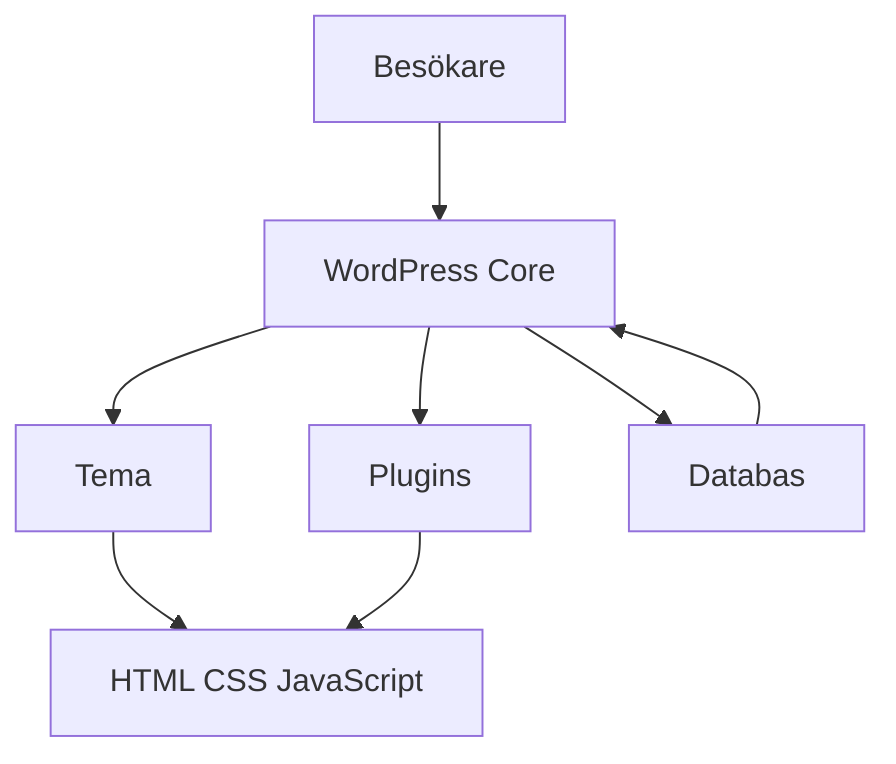

# Hur wordpress är uppbyggt

För att arbeta effektivt i WordPress behöver du förstå hur systemet är uppdelat. När du vet vad som hör till kärnan (core), temat (theme), tilläggen (plugins) och databasen blir det enklare att felsöka, uppdatera och bygga vidare på en webbplats.

## Förkunskaper

Innan du börjar bör du ha läst:

- [WordPress](./wordpress.md)

## Översikt av arkitekturen

WordPress kan ses som fyra huvuddelar som samverkar:

1. Kärnan (core)
2. Temat (theme)
3. Tillägg (plugins)
4. Databasen (database)

## 1. Kärnan (core)

Kärnan är själva WordPress-systemet. Den innehåller grundfunktioner för:

- Inloggning och användare
- Publicering av inlägg och sidor
- Mediebibliotek
- Adminpanel (dashboard)
- API:er (gränssnitt) för teman och plugins

Du ska normalt **inte** ändra filer i kärnan direkt. Vid uppdateringar skrivs sådana ändringar över.

## 2. Temat (theme)

Temat styr hur innehållet visas för besökaren:

- Layout
- Färger och typografi
- Sidmallar (templates)
- Menyer och widget-ytor

Temat hämtar innehåll från WordPress och presenterar det i HTML, CSS och JavaScript.

### Vanliga temafiler

- `style.css` – metadata och grundstilar
- `functions.php` – temats funktioner och hooks
- `index.php` – grundmall
- `single.php` – mall för enskilda inlägg
- `page.php` – mall för sidor

## 3. Tillägg (plugins)

Plugins lägger till funktionalitet utan att du behöver bygga allt själv, till exempel:

- Kontaktformulär
- SEO-stöd
- Säkerhetsfunktioner
- Caching (mellanlagring)

Tekniskt kopplar plugins in sig via hooks (krokar):

- actions (händelser)
- filters (filter)

Det gör att funktioner kan utökas utan att ändra kärnans kod.

## 4. Databasen (database)

WordPress sparar innehåll och inställningar i en databas, oftast MySQL eller MariaDB.

Exempel på data som lagras:

- Inlägg och sidor
- Användare
- Kommentarer
- Inställningar
- Metadata

När en besökare öppnar en sida hämtar WordPress data från databasen och skickar den till temat för rendering (visning).

## Filstruktur i ett WordPress-projekt

I en standardinstallation ser du ofta mappar som:

- `wp-admin/` – admingränssnitt
- `wp-includes/` – interna WordPress-bibliotek
- `wp-content/` – teman, plugins och uppladdade filer

Som utvecklare arbetar du oftast i:

- `wp-content/themes/`
- `wp-content/plugins/`

## Säkerhet och underhåll

För en stabil installation bör du:

1. Uppdatera kärna, tema och plugins regelbundet.
2. Undvika att redigera kärnans filer.
3. Ta backuper av både filer och databas.
4. Begränsa antalet plugins till sådana som verkligen behövs.
5. Ta bort inaktiva teman och plugins som inte används.

## Praktiskt exempel: var ska kod ligga?

En vanlig fråga är: ska kod ligga i temat eller plugin?

- Lägg kod i **tema** om den gäller design/presentation.
- Lägg kod i **plugin** om den gäller funktionalitet som ska finnas kvar även om temat byts.

Exempel:

- Egen sidlayout → tema
- Eget post type (innehållstyp) för "Kurser" → plugin

## Sammanfattning

WordPress är uppbyggt i lager där kärnan hanterar grunden, databasen lagrar innehåll, temat visar innehållet och plugins utökar funktionerna. När du håller isär de delarna blir projektet enklare att utveckla, underhålla och säkra.

## Reflektionsfrågor

1. Varför är det riskabelt att ändra WordPress kärnfiler direkt?
2. Ge ett exempel på funktionalitet som bör ligga i ett plugin istället för i temat.
3. Vilka mappar i WordPress behöver du kunna navigera i som utvecklare?
