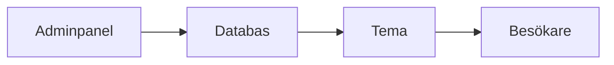

# WordPress

WordPress är ett innehållshanteringssystem (CMS) som används för att bygga och administrera webbplatser utan att skriva all kod från grunden. Det är världens mest använda CMS och fungerar för allt från bloggar till företagswebbar och enklare e-handel.

## Förkunskaper

Innan du går vidare är det bra om du känner till:

- Grundläggande HTML och CSS
- Hur en webbplats publiceras och hostas
- Grundläggande begrepp i CMS (content management system, innehållshanteringssystem)

## Vad är WordPress?

WordPress består av:

- **Kärnan (core)**: själva systemet
- **Teman (themes)**: styr design och layout
- **Tillägg (plugins)**: lägger till funktioner
- **Adminpanel (dashboard)**: gränssnittet där du hanterar innehåll och inställningar

Det finns två vanliga varianter:

- **WordPress.org**: du hostar själv (mest flexibilitet)
- **WordPress.com**: hostad tjänst med olika abonnemang

I den här kursen utgår vi främst från **WordPress.org**.

## Fördelar

- Snabbt att komma igång, även för nybörjare
- Stort ekosystem av teman och plugins
- Bra stöd för SEO och innehållsproduktion
- Enkelt att ge redaktörer tillgång till innehåll
- Stort community med mycket dokumentation och guider

## Nackdelar

- För många plugins kan göra sajten långsam
- Säkerhetsrisker om uppdateringar ignoreras
- Anpassningar kan bli svårunderhållna utan struktur
- Plugin-/temakonflikter kan uppstå vid uppdateringar
- Mer underhåll än statiska webbplatser

## När passar WordPress?

WordPress passar bra när du vill:

- Publicera innehåll löpande (blogg, nyheter, landningssidor)
- Låta icke-utvecklare uppdatera innehåll
- Få en webbplats live snabbt med standardfunktioner

Det passar mindre bra när du behöver:

- Avancerad realtidslogik eller skräddarsydd applikationsfunktionalitet
- Maximal prestanda med minimal drift och attackyta

## Viktiga begrepp att känna till

- **Inlägg**: tidsbaserat innehåll (t.ex. blogg)
- **Sidor**: statiskt innehåll (t.ex. Om oss, Kontakt)
- **Kategorier/Taggar**: struktur för innehåll
- **Gutenberg**: blockredigeraren i WordPress
- **Användarroller**: admin, redaktör, författare med olika behörighet
- **Permalänkar**: URL-struktur för sidor/inlägg

## Kodexempel: registrera en menyplats

Det här exemplet visar hur du registrerar en menyplats i ett tema via `functions.php`.

```php
function school_theme_setup() {
	register_nav_menus(
		array(
			'primary' => __( 'Primary Menu', 'school-theme' ),
		)
	);
}
add_action( 'after_setup_theme', 'school_theme_setup' );
```

När menyplatsen är registrerad kan du koppla en meny via **Utseende > Menyer**.

## Översikt: hur WordPress levererar innehåll



## Viktigt i praktiken

För ett hållbart WordPress-projekt bör du alltid:

1. Hålla WordPress, teman och plugins uppdaterade.
2. Minimera antal plugins och välja välunderhållna alternativ.
3. Ta regelbundna backuper av filer och databas.
4. Använda starka lösenord och minst en admin-användare med säkra inloggningsrutiner.
5. Testa uppdateringar i lokal miljö innan produktion.

## Nästa lektioner

Fortsätt gärna i den här ordningen:

- [Installation med Local by Flywheel](./wordpress-local.md)
- [Skapa eget tema med Underscores](./wordpress-theme.md)

Efter installation kan du börja med att skapa sidor, välja tema och bygga upp en enkel webbplatsstruktur.

## Reflektionsfrågor

1. Vilka typer av projekt tycker du att WordPress passar bäst för, och varför?
2. Vilka risker finns med att installera många plugins, och hur kan du minska de riskerna?
3. Om du skulle bygga en webbplats för en mindre organisation, vilka grundinställningar skulle du prioritera först?


