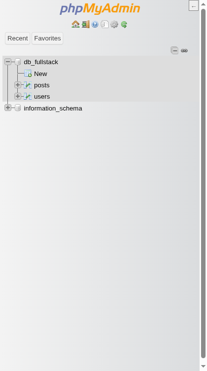
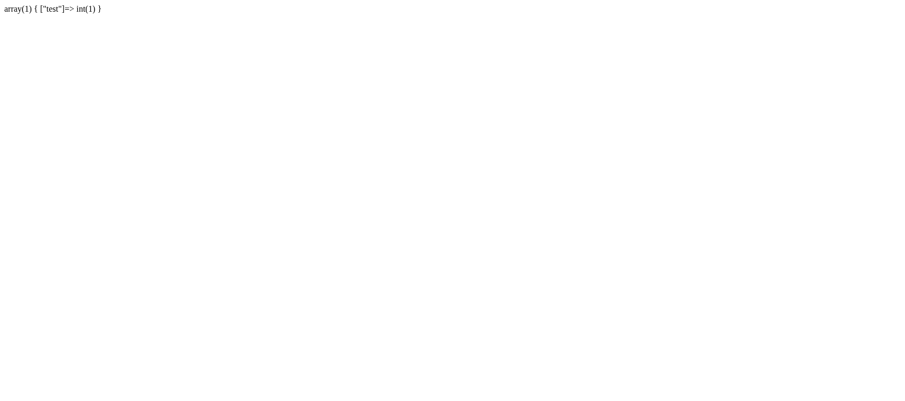

# Bygga en CRUD-applikation: Enkel Blogg

I detta avsnitt bygger vi en komplett men enkel bloggapplikation från grunden med PHP och MariaDB/MySQL. Målet är att praktiskt demonstrera **CRUD**-operationerna (Create, Read, Update, Delete) och integrera andra viktiga webbkoncept som databasinteraktion med PDO, användarautentisering, sessionshantering och filuppladdning.

Vi börjar med en mycket grundläggande struktur och kodstil för att sedan i slutet refaktorera och förbättra koden, bland annat genom att introducera type hinting.

**Applikationens Funktioner:**

*   Användare kan registrera sig och logga in.
*   Inloggade användare kan skapa, redigera och ta bort sina egna blogginlägg.
*   Användare kan ladda upp en bild till varje blogginlägg.
*   Alla besökare kan se listan över blogginlägg och läsa enskilda inlägg.
*   En enkel "admin"-sektion för inloggade användare att hantera sina inlägg.

## 1. Databasdesign

Vi behöver två huvudtabeller: en för användare (`users`) och en för blogginlägg (`posts`).

**`users` tabell:**

```sql
CREATE TABLE users (
    id INT AUTO_INCREMENT PRIMARY KEY,
    username VARCHAR(50) NOT NULL UNIQUE,
    email VARCHAR(100) NOT NULL UNIQUE,
    password_hash VARCHAR(255) NOT NULL, -- Lagrar hashat lösenord
    created_at TIMESTAMP DEFAULT CURRENT_TIMESTAMP
);
```

*   `id`: Unik identifierare för användaren.
*   `username`: Användarnamn för inloggning (unikt).
*   `email`: Användarens e-post (unik).
*   `password_hash`: Lagrar det säkert hashade lösenordet (inte lösenordet i klartext!).
*   `created_at`: När användarkontot skapades.

**`posts` tabell:**

```sql
CREATE TABLE posts (
    id INT AUTO_INCREMENT PRIMARY KEY,
    user_id INT NOT NULL,             -- Vem som skrev inlägget
    title VARCHAR(255) NOT NULL,      -- Inläggets titel
    body TEXT NOT NULL,               -- Innehållet i inlägget
    image_path VARCHAR(255) NULL,     -- Sökväg till uppladdad bild (valfritt)
    created_at TIMESTAMP DEFAULT CURRENT_TIMESTAMP,
    updated_at TIMESTAMP DEFAULT CURRENT_TIMESTAMP ON UPDATE CURRENT_TIMESTAMP, -- När inlägget senast ändrades
    FOREIGN KEY (user_id) REFERENCES users(id) ON DELETE CASCADE -- Koppling till users. Om användaren raderas, raderas även hens inlägg.
);
```

*   `id`: Unik identifierare för inlägget.
*   `user_id`: Referens till `id` i `users`-tabellen. Visar vem som äger inlägget.
*   `title`: Inläggets rubrik.
*   `body`: Brödtexten i inlägget.
*   `image_path`: Sökvägen till den associerade bilden (om någon laddats upp). `NULL` om ingen bild finns.
*   `created_at`: När inlägget skapades.
*   `updated_at`: Uppdateras automatiskt när inlägget ändras.
*   `FOREIGN KEY ...`: Definierar en relation mellan `posts.user_id` och `users.id`. `ON DELETE CASCADE` betyder att om en användare tas bort, tas alla dennes inlägg också bort automatiskt.

Skapa dessa tabeller i din MariaDB/MySQL-databas (t.ex. via phpMyAdmin eller kommandoraden). Vi antar att databasen heter `db_fullstack` som i tidigare exempel.



## 2. Projektstruktur (Initial)

Vi börjar med en väldigt platt och enkel filstruktur. Skapa följande filer och mappar i roten av ditt projekt (t.ex. i `app/public` om du följer `docker-compose`-exemplet):

```
.
├── admin/
│   ├── index.php         # Admin dashboard (lista inlägg, länkar till create/edit/delete)
│   ├── create_post.php   # Formulär & logik för att skapa inlägg
│   ├── edit_post.php     # Formulär & logik för att redigera inlägg
│   └── delete_post.php   # Logik för att ta bort inlägg
├── includes/
│   ├── config.php        # Databasuppgifter och annan konfiguration
│   ├── database.php      # Funktion för att ansluta till databasen (PDO)
│   └── functions.php     # Hjälpfunktioner (vi lägger till här senare)
├── uploads/              # Mapp där uppladdade bilder sparas (måste vara skrivbar för webbservern!)
├── index.php             # Hemsida, listar blogginlägg
├── login.php             # Inloggningsformulär & logik
├── logout.php            # Logik för att logga ut
├── post.php              # Visar ett enskilt blogginlägg
└── register.php          # Registreringsformulär & logik
```

*   `admin/`: Innehåller sidor som endast inloggade användare ska kunna nå.
*   `includes/`: Innehåller återanvändbar kod som konfiguration och databasanslutning.
*   `uploads/`: Här hamnar bilder som användare laddar upp. **VIKTIGT:** Se till att webbservern (Apache i vårt Docker-exempel) har skrivrättigheter till denna mapp!

## 3. Grundläggande Setup

### Konfiguration (`includes/config.php`)

Skapa filen `includes/config.php` och lägg in dina databasuppgifter.

```php
<?php
// includes/config.php

// Databasuppgifter (anpassa efter din miljö)
define('DB_HOST', 'mysql'); // Matchar service-namnet i docker-compose.yml
define('DB_NAME', 'db_fullstack');
define('DB_USER', 'db_user');
define('DB_PASS', 'db_password');

// Teckenkodning för PDO-anslutningen
define('DB_CHARSET', 'utf8mb4');

// Starta sessioner (viktigt för login!)
// Görs en gång här så det gäller alla sidor som inkluderar config.php
if (session_status() === PHP_SESSION_NONE) {
    session_start();
}

// Base URL (valfritt, men kan vara praktiskt för länkar)
// Anpassa port om du använder en annan än 8060
define('BASE_URL', 'http://localhost:8060');

// Sökväg till uppladdningsmappen
define('UPLOAD_PATH', __DIR__ . '/../uploads/'); // __DIR__ ger sökvägen till includes/

// Aktivera felrapportering under utveckling
// Stäng av på en produktionsserver!
ini_set('display_errors', 1);
ini_set('display_startup_errors', 1);
error_reporting(E_ALL);

?>
```

### Mini-exempel: Vad gör PDO-options?

Innan vi bygger `connect_db()` – ett snabbtest för att förstå varför vi sätter vissa options. Skapa tillfälligt en fil `test_pdo.php` (du kan ta bort den efteråt):

```php
<?php
require_once 'includes/config.php';
$pdo = new PDO("mysql:host=" . DB_HOST . ";dbname=" . DB_NAME . ";charset=" . DB_CHARSET, DB_USER, DB_PASS);
$result = $pdo->query("SELECT 1 as test")->fetch();
var_dump($result);  // Vad får du? Både numeriska index (0 => "1") OCH kolumnnamn ("test" => "1")
?>
```

Lägg sedan till denna rad *före* `$result`:

```php
$pdo->setAttribute(PDO::ATTR_DEFAULT_FETCH_MODE, PDO::FETCH_ASSOC);
```

Kör igen. Nu får du bara associativa nycklar (`["test" => "1"]`) – lättare att använda med `$result['test']` istället för att hålla reda på index. Detta är vad `ATTR_DEFAULT_FETCH_MODE` gör.



### Databasanslutning (`includes/database.php`)

Skapa filen `includes/database.php`. Vi använder **PDO (PHP Data Objects)** för att ansluta. PDO ger ett konsekvent sätt att interagera med olika databaser och hjälper till att skydda mot SQL-injektion genom "prepared statements".

```php
<?php
// includes/database.php
require_once 'config.php'; // Inkludera konfigurationen

/**
 * Skapar och returnerar en PDO-databasanslutning.
 *
 * @return PDO PDO-anslutningsobjektet.
 * @throws PDOException Om anslutningen misslyckas.
 */
function connect_db(): PDO {
    // Data Source Name (DSN)
    $dsn = "mysql:host=" . DB_HOST . ";dbname=" . DB_NAME . ";charset=" . DB_CHARSET;

    // Alternativ för PDO-anslutningen
    $options = [
        PDO::ATTR_ERRMODE            => PDO::ERRMODE_EXCEPTION, // Kasta exceptions vid fel
        PDO::ATTR_DEFAULT_FETCH_MODE => PDO::FETCH_ASSOC,       // Hämta resultat som associativa arrayer
        PDO::ATTR_EMULATE_PREPARES   => false,                  // Använd prepared statements
    ];

    try {
        $pdo = new PDO($dsn, DB_USER, DB_PASS, $options);
        return $pdo;
    } catch (PDOException $e) {
        // Logga felet istället för att skriva ut känslig info
        error_log("Database Connection Error: " . $e->getMessage());
        // Visa ett generellt felmeddelande till användaren
        throw new PDOException("Kunde inte ansluta till databasen. Försök igen senare.", (int)$e->getCode());
        // Eller: die("Kunde inte ansluta till databasen. Kontakta administratör.");
    }
}

// För att använda anslutningen på en sida:
// $pdo = connect_db();

?>
```

**Förklaring:**

*   Vi inkluderar `config.php` för att få databasuppgifterna.
*   `$dsn`: En sträng som specificerar databastyp, värd, databasnamn och teckenkodning.
*   `$options`: Viktiga inställningar för PDO:
    *   `PDO::ATTR_ERRMODE => PDO::ERRMODE_EXCEPTION`: Gör att PDO kastar ett undantag (`PDOException`) om ett databasfel inträffar. Detta är att föredra framför att bara få `false` eller varningar, då det ger tydligare felhantering.
    *   `PDO::ATTR_DEFAULT_FETCH_MODE => PDO::FETCH_ASSOC`: Gör att när vi hämtar data (`fetch()`, `fetchAll()`) får vi resultatet som en associativ array (kolumnnamn => värde) istället för både numeriska index och kolumnnamn (vilket är default `PDO::FETCH_BOTH`).
    *   `PDO::ATTR_EMULATE_PREPARES => false`: Tvingar PDO att använda databasserverns inbyggda "prepared statements" istället för att emulera dem i PHP. Detta är generellt säkrare och ibland mer effektivt.
*   `try...catch`: Vi försöker skapa ett nytt `PDO`-objekt. Om det misslyckas (fel lösenord, databasen nere etc.) kastas en `PDOException`. Vi fångar den, loggar det tekniska felet (för utvecklaren) och kastar sedan ett nytt, mer användarvänligt, undantag eller avslutar skriptet med `die()`. **Skriv aldrig ut det detaljerade felet `$e->getMessage()` direkt till användaren i produktion!**

---

**Nästa:** [Del 2: Autentisering](crud-app-2-autentisering.md) – Registrering, inloggning, sessioner och logout
