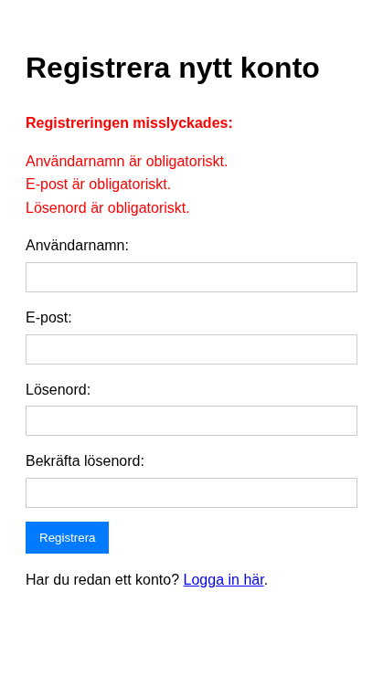
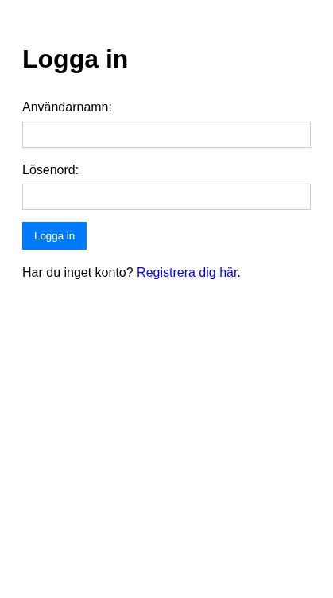
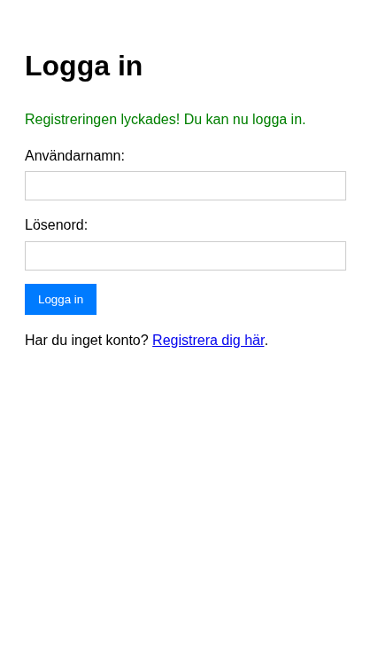

# Del 2: Autentisering

I denna del skapar vi registrering, inloggning, sessionshantering och logout – steg för steg. **Förutsättning:** Du har genomfört [Del 1: Setup och databas](crud-app-1-setup.md).

Vi bygger varje del inkrementellt: först en enkel version som fungerar, sedan lägger vi till mer funktionalitet.

---

## Mini-exempel: Varför hasha lösenord?

Innan vi bygger registrering – förstå varför vi aldrig sparar lösenord i klartext. Skapa tillfälligt `test_hash.php`:

```php
<?php
$password = "mitt_lösenord";
echo "Hash 1: " . password_hash($password, PASSWORD_DEFAULT) . "\n";
echo "Hash 2: " . password_hash($password, PASSWORD_DEFAULT) . "\n";  // Kör igen – olika resultat!
$hash = password_hash($password, PASSWORD_DEFAULT);
echo "Verifierar: " . (password_verify($password, $hash) ? "OK" : "Fel") . "\n";
?>
```

Du ska aldrig spara lösenord i klartext. `password_hash()` skapar en unik sträng varje gång (p.g.a. salt). `password_verify()` kollar om lösenordet stämmer mot hashen – använd den vid inloggning, aldrig `==` mellan hashar.

---

## Mini-exempel: Varför prepared statements?

**Farligt (aldrig gör så här):**

```php
$username = $_POST['username'];  // Tänk om någon skriver: admin' OR '1'='1
$pdo->query("SELECT * FROM users WHERE username = '$username'");  // SQL-injektion!
```

En angripare kan skicka `admin' OR '1'='1` som användarnamn. Då blir SQL-frågan `WHERE username = 'admin' OR '1'='1'` – vilket alltid är sant. Angriparen loggar in som första användaren.

**Säkert:** Prepared statements skickar data separat från SQL-kommandot. Databasen vet att `:username` är *data*, inte kod. Därför använder vi `prepare()`, `bindParam()` och `execute()` i stället för att sätta in variabler direkt i SQL-strängen.

---

## Steg 1: Registrering – minimal version

Börja med det enklaste som behövs för att få registrering att fungera: ett formulär som sparar användare i databasen.

### Steg 1.1: Skapa formuläret

Skapa filen `register.php` med endast HTML-formuläret. Inga fält är validerade än – vi fokuserar på strukturen.

```php
<?php
require_once 'includes/config.php';
require_once 'includes/database.php';

$errors = [];
$username = '';
$email = '';

// POST-hantering kommer i nästa steg
?>
<!DOCTYPE html>
<html lang="sv">
<head>
    <meta charset="UTF-8">
    <meta name="viewport" content="width=device-width, initial-scale=1.0">
    <title>Registrera dig - Enkel Blogg</title>
    <style>
        body { font-family: sans-serif; line-height: 1.6; padding: 20px; }
        .form-group { margin-bottom: 15px; }
        label { display: block; margin-bottom: 5px; }
        input[type="text"], input[type="email"], input[type="password"] {
            width: 100%; padding: 8px; border: 1px solid #ccc; box-sizing: border-box;
        }
        button { padding: 10px 15px; background-color: #007bff; color: white; border: none; cursor: pointer; }
        button:hover { background-color: #0056b3; }
        .error-messages { color: red; margin-bottom: 15px; }
        .error-messages ul { list-style: none; padding: 0; }
    </style>
</head>
<body>
    <h1>Registrera nytt konto</h1>

    <form action="register.php" method="post">
        <div class="form-group">
            <label for="username">Användarnamn:</label>
            <input type="text" id="username" name="username" value="<?php echo htmlspecialchars($username); ?>">
        </div>
        <div class="form-group">
            <label for="email">E-post:</label>
            <input type="email" id="email" name="email" value="<?php echo htmlspecialchars($email); ?>">
        </div>
        <div class="form-group">
            <label for="password">Lösenord:</label>
            <input type="password" id="password" name="password">
        </div>
        <div class="form-group">
            <label for="confirm_password">Bekräfta lösenord:</label>
            <input type="password" id="confirm_password" name="confirm_password">
        </div>
        <button type="submit">Registrera</button>
    </form>

    <p>Har du redan ett konto? <a href="login.php">Logga in här</a>.</p>
</body>
</html>
```

Testa att ladda sidan. Formuläret visas, men skickar ännu ingen data till databasen.


### Steg 1.2: Lägg till POST-hantering

**Nytt i detta steg:** Att kolla `$_SERVER['REQUEST_METHOD']`, hämta data från `$_POST`, och använda prepared statements för INSERT.

Lägg till följande kod *efter* raderna med `$errors`, `$username`, `$email` och *före* `?>`:

```php
// Hantera formulärdata när det skickas (POST request)
if ($_SERVER['REQUEST_METHOD'] === 'POST') {
    $username = trim($_POST['username'] ?? '');
    $email = trim($_POST['email'] ?? '');
    $password = $_POST['password'] ?? '';
    $confirm_password = $_POST['confirm_password'] ?? '';

    // Validering kommer i nästa steg – för nu försöker vi bara spara
    if (true) {  // Tillfälligt – vi byter ut detta mot validering senare
        try {
            $pdo = connect_db();

            // VIKTIGT: Hasha lösenordet – lagra ALDRIG lösenord i klartext!
            $password_hash = password_hash($password, PASSWORD_DEFAULT);

            $stmt = $pdo->prepare("INSERT INTO users (username, email, password_hash) VALUES (:username, :email, :password_hash)");
            $stmt->bindParam(':username', $username);
            $stmt->bindParam(':email', $email);
            $stmt->bindParam(':password_hash', $password_hash);

            if ($stmt->execute()) {
                header('Location: login.php?registered=success');
                exit;
            } else {
                $errors[] = 'Ett fel uppstod vid registrering. Försök igen.';
            }
        } catch (PDOException $e) {
            error_log("Registration Error: " . $e->getMessage());
            $errors[] = 'Databasfel. Kan inte registrera användare just nu.';
        }
    }
}
```

**Förklaring:** `password_hash()` med `PASSWORD_DEFAULT` skapar en säker hash. Varje anrop ger en unik hash även för samma lösenord (p.g.a. salt). Prepared statements med `bindParam` skyddar mot SQL-injektion.

Testa att registrera en användare. Du ska omdirigeras till login.php (som ännu inte finns – det är okej).

---

## Steg 2: Lägg till validering

Nu när grundregistrering fungerar lägger vi till validering för att fånga fel innan de når databasen.

### Försök själv

Innan du tittar på lösningen: Vilka saker bör vi kontrollera innan vi sparar en ny användare? Tänk på tomma fält, e-postformat, lösenordslängd och att lösenorden matchar.

### Valideringslogiken

Ersätt den tillfälliga `if (true)`-villkoret med riktig validering. Hela POST-blocket ska se ut så här:

```php
if ($_SERVER['REQUEST_METHOD'] === 'POST') {
    $username = trim($_POST['username'] ?? '');
    $email = trim($_POST['email'] ?? '');
    $password = $_POST['password'] ?? '';
    $confirm_password = $_POST['confirm_password'] ?? '';

    // Validering
    if (empty($username)) {
        $errors[] = 'Användarnamn är obligatoriskt.';
    }
    if (empty($email)) {
        $errors[] = 'E-post är obligatoriskt.';
    } elseif (!filter_var($email, FILTER_VALIDATE_EMAIL)) {
        $errors[] = 'Ogiltig e-postadress.';
    }
    if (empty($password)) {
        $errors[] = 'Lösenord är obligatoriskt.';
    } elseif (strlen($password) < 6) {
        $errors[] = 'Lösenordet måste vara minst 6 tecken långt.';
    }
    if ($password !== $confirm_password) {
        $errors[] = 'Lösenorden matchar inte.';
    }

    if (empty($errors)) {
        try {
            $pdo = connect_db();

            // Kolla om användarnamn eller e-post redan finns
            $stmt_check = $pdo->prepare("SELECT id FROM users WHERE username = :username OR email = :email");
            $stmt_check->bindParam(':username', $username);
            $stmt_check->bindParam(':email', $email);
            $stmt_check->execute();

            if ($stmt_check->fetch()) {
                $errors[] = 'Användarnamn eller e-postadress är redan registrerad.';
            } else {
                $password_hash = password_hash($password, PASSWORD_DEFAULT);
                $stmt_insert = $pdo->prepare("INSERT INTO users (username, email, password_hash) VALUES (:username, :email, :password_hash)");
                $stmt_insert->bindParam(':username', $username);
                $stmt_insert->bindParam(':email', $email);
                $stmt_insert->bindParam(':password_hash', $password_hash);

                if ($stmt_insert->execute()) {
                    header('Location: login.php?registered=success');
                    exit;
                } else {
                    $errors[] = 'Ett fel uppstod vid registrering. Försök igen.';
                }
            }
        } catch (PDOException $e) {
            error_log("Registration Error: " . $e->getMessage());
            $errors[] = 'Databasfel. Kan inte registrera användare just nu.';
        }
    }
}
```

### Visa felmeddelanden i formuläret

Lägg till detta *ovanför* `<form>`-taggen i HTML-delen:

```php
<?php if (!empty($errors)): ?>
    <div class="error-messages">
        <strong>Registreringen misslyckades:</strong>
        <ul>
            <?php foreach ($errors as $error): ?>
                <li><?php echo htmlspecialchars($error); ?></li>
            <?php endforeach; ?>
        </ul>
    </div>
<?php endif; ?>
```

Lägg också till `required` och `minlength="6"` på lösenordsfälten i formuläret för extra skydd i webbläsaren.



**Du har nu lärt dig:** Validering med `empty()`, `filter_var()` och `strlen()`, att kolla dubbletter i databasen med prepared statements, och att visa fel med `htmlspecialchars()` för att undvika XSS.

---

## Steg 3: Inloggning (`login.php`)

Nu skapar vi inloggningssidan. Flödet: formulär → hämta användare från databasen → verifiera lösenord → spara i session → omdirigera.

### Steg 3.1: Formulär och POST-hantering

Skapa `login.php` med formulär och grundläggande POST-logik:

```php
<?php
require_once 'includes/config.php';
require_once 'includes/database.php';

$errors = [];
$username = '';
$registration_success = isset($_GET['registered']) && $_GET['registered'] === 'success';

if ($_SERVER['REQUEST_METHOD'] === 'POST') {
    $username = trim($_POST['username'] ?? '');
    $password = $_POST['password'] ?? '';

    if (empty($username)) {
        $errors[] = 'Användarnamn är obligatoriskt.';
    }
    if (empty($password)) {
        $errors[] = 'Lösenord är obligatoriskt.';
    }

    if (empty($errors)) {
        try {
            $pdo = connect_db();
            $stmt = $pdo->prepare("SELECT id, username, password_hash FROM users WHERE username = :username");
            $stmt->bindParam(':username', $username);
            $stmt->execute();
            $user = $stmt->fetch();

            // Verifiera lösenord – nästa steg!
            if ($user && password_verify($password, $user['password_hash'])) {
                // Inloggning lyckades – session kommer i nästa steg
                header('Location: admin/index.php');
                exit;
            } else {
                $errors[] = 'Felaktigt användarnamn eller lösenord.';
            }
        } catch (PDOException $e) {
            error_log("Login Error: " . $e->getMessage());
            $errors[] = 'Databasfel. Kan inte logga in just nu.';
        }
    }
}
?>
<!DOCTYPE html>
<html lang="sv">
<head>
    <meta charset="UTF-8">
    <meta name="viewport" content="width=device-width, initial-scale=1.0">
    <title>Logga in - Enkel Blogg</title>
    <style>
        body { font-family: sans-serif; line-height: 1.6; padding: 20px; }
        .form-group { margin-bottom: 15px; }
        label { display: block; margin-bottom: 5px; }
        input[type="text"], input[type="password"] {
            width: 100%; padding: 8px; border: 1px solid #ccc; box-sizing: border-box;
        }
        button { padding: 10px 15px; background-color: #007bff; color: white; border: none; cursor: pointer; }
        button:hover { background-color: #0056b3; }
        .error-messages { color: red; margin-bottom: 15px; }
        .error-messages ul { list-style: none; padding: 0; }
        .success-message { color: green; margin-bottom: 15px; }
    </style>
</head>
<body>
    <h1>Logga in</h1>

    <?php if ($registration_success): ?>
        <p class="success-message">Registreringen lyckades! Du kan nu logga in.</p>
    <?php endif; ?>

    <?php if (!empty($errors)): ?>
        <div class="error-messages">
            <strong>Inloggningen misslyckades:</strong>
            <ul>
                <?php foreach ($errors as $error): ?>
                    <li><?php echo htmlspecialchars($error); ?></li>
                <?php endforeach; ?>
            </ul>
        </div>
    <?php endif; ?>

    <form action="login.php" method="post">
        <div class="form-group">
            <label for="username">Användarnamn:</label>
            <input type="text" id="username" name="username" value="<?php echo htmlspecialchars($username); ?>" required>
        </div>
        <div class="form-group">
            <label for="password">Lösenord:</label>
            <input type="password" id="password" name="password" required>
        </div>
        <button type="submit">Logga in</button>
    </form>

    <p>Har du inget konto? <a href="register.php">Registrera dig här</a>.</p>
</body>
</html>
```

**Viktigt:** Använd `password_verify($password, $user['password_hash'])` – aldrig jämför hashar direkt. `password_verify` hanterar salt och algoritm automatiskt.





---

## Steg 4: Sessioner – spara inloggning och skydda sidor

När användaren loggar in måste vi *komma ihåg* det på andra sidor. Det gör vi med sessioner.

### Hur sessioner fungerar (kort)

1. **`session_start()`** – Startar eller återupptar en session (görs redan i `config.php`).
2. **`$_SESSION`** – En array där vi lagrar data som ska finnas kvar mellan sidladdningar (t.ex. `user_id`).
3. **Session-cookie** – PHP skickar ett session-ID till webbläsaren. Vid varje ny förfrågan skickas ID:t tillbaka så PHP vet vilken session som gäller.

### Steg 4.1: Spara användardata vid inloggning

I `login.php`, *ersätt* raden `header('Location: admin/index.php');` med följande innan omdirigeringen:

```php
if ($user && password_verify($password, $user['password_hash'])) {
    session_regenerate_id(true);  // Säkerhetsåtgärd mot session fixation
    $_SESSION['user_id'] = $user['id'];
    $_SESSION['username'] = $user['username'];

    header('Location: admin/index.php');
    exit;
}
```

Nu sparas användarens ID och användarnamn i sessionen när de loggar in.

### Steg 4.2: Skydda admin-sidor

Admin-sidorna finns inte än, men vi kan förbereda skyddet. I **början** av varje fil i `admin/` (t.ex. `admin/index.php`, `admin/create_post.php`) lägger du till:

```php
<?php
require_once '../includes/config.php';

if (!isset($_SESSION['user_id'])) {
    header('Location: ../login.php?redirect=' . urlencode($_SERVER['REQUEST_URI']));
    exit;
}

$logged_in_user_id = $_SESSION['user_id'];
$logged_in_username = $_SESSION['username'];  // För att visa "Inloggad som ..."

require_once '../includes/database.php';
// ... resten av sidans kod
?>
```

Skapa `admin/index.php` med session-skyddet och en minimal sida:

```php
<?php
require_once '../includes/config.php';

if (!isset($_SESSION['user_id'])) {
    header('Location: ../login.php?redirect=' . urlencode($_SERVER['REQUEST_URI']));
    exit;
}
$logged_in_user_id = $_SESSION['user_id'];
$logged_in_username = $_SESSION['username'];

require_once '../includes/database.php';
?>
<!DOCTYPE html>
<html lang="sv">
<head>
    <meta charset="UTF-8">
    <title>Admin - Enkel Blogg</title>
</head>
<body>
    <h1>Admin Dashboard</h1>
    <p>Välkommen, <?php echo htmlspecialchars($logged_in_username); ?>!</p>
    <p><a href="create_post.php">Skapa nytt inlägg</a></p>
    <p><a href="../index.php">Visa blogg</a> | <a href="../logout.php">Logga ut</a></p>
</body>
</html>
```

Om du inte är inloggad omdirigeras du till login.php. I Del 4 bygger vi ut denna sida till en full admin-panel med lista över dina inlägg.


### Steg 4.3a: Logout – enkel version

Skapa `logout.php` med den enklaste varianten:

```php
<?php
require_once 'includes/config.php';

session_destroy();
header('Location: index.php?logged_out=success');
exit;
?>
```

Testa att logga in och sedan klicka "Logga ut". Fungerar det? Ibland verkar det som att du fortfarande är inloggad vid nästa besök – det beror på att session-cookien kan ligga kvar i webbläsaren. PHP återanvänder då samma session.

### Steg 4.3b: Logout – ta bort cookien också

För att verkligen logga ut måste vi tömma sessionen *och* ta bort session-cookien. Ersätt innehållet i `logout.php` med:

```php
<?php
require_once 'includes/config.php';

$_SESSION = [];  // Töm sessionen först

if (ini_get("session.use_cookies")) {
    $params = session_get_cookie_params();
    setcookie(session_name(), '', time() - 42000,
        $params["path"], $params["domain"],
        $params["secure"], $params["httponly"]
    );
}

session_destroy();
header('Location: index.php?logged_out=success');
exit;
?>
```

`session_get_cookie_params()` ger oss samma inställningar som PHP använde när cookien skapades. Genom att sätta cookien med ett datum i förflutna (`time() - 42000`) säger vi åt webbläsaren att ta bort den. Nu loggas du verkligen ut.


**Du har nu lärt dig:** Att använda `$_SESSION` för att spara inloggningsstatus, att skydda sidor genom att kolla `$_SESSION['user_id']`, och att logga ut genom att tömma sessionen och förstöra cookien.

---

**Föregående:** [Del 1: Setup och databas](crud-app-1-setup.md) | **Nästa:** [Del 3: Skapa och läsa inlägg](crud-app-3-create-read.md)
