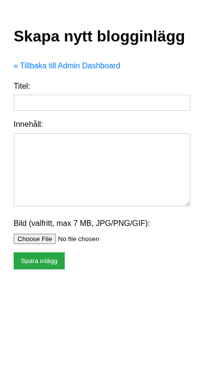

# Del 3: Skapa och läsa inlägg

I denna del skapar vi formuläret för att skapa blogginlägg och sidorna för att visa dem – steg för steg. **Förutsättning:** Du har genomfört [Del 2: Autentisering](crud-app-2-autentisering.md).

Vi börjar med att skapa inlägg *utan* bild, så att grundlogiken fungerar. Sedan lägger vi till bilduppladdning.

---

## Steg 6c: Förbered en enkel modell (`includes/Post.php`)

Innan vi går vidare med fler CRUD-steg skapar vi en enkel modellklass för inlägg. Modellen samlar SQL-frågorna på ett ställe.

Skapa `includes/Post.php`:

```php
<?php
declare(strict_types=1);

class Post
{
    public function __construct(private PDO $pdo)
    {
    }

    public function create(int $userId, string $title, string $body, ?string $imagePath): int
    {
        $stmt = $this->pdo->prepare(
            "INSERT INTO posts (user_id, title, body, image_path)
             VALUES (:user_id, :title, :body, :image_path)"
        );

        $stmt->bindValue(':user_id', $userId, PDO::PARAM_INT);
        $stmt->bindValue(':title', $title);
        $stmt->bindValue(':body', $body);
        $stmt->bindValue(':image_path', $imagePath, $imagePath === null ? PDO::PARAM_NULL : PDO::PARAM_STR);
        $stmt->execute();

        return (int) $this->pdo->lastInsertId();
    }

    public function showOne(int $id): array|false
    {
        $stmt = $this->pdo->prepare(
            "SELECT posts.*, users.username
             FROM posts
             JOIN users ON posts.user_id = users.id
             WHERE posts.id = :id"
        );
        $stmt->bindValue(':id', $id, PDO::PARAM_INT);
        $stmt->execute();

        return $stmt->fetch();
    }

    public function showAll(): array
    {
        $stmt = $this->pdo->query(
            "SELECT posts.*, users.username
             FROM posts
             JOIN users ON posts.user_id = users.id
             ORDER BY posts.created_at DESC"
        );
        return $stmt->fetchAll();
    }

    public function showAllByUser(int $userId): array
    {
        $stmt = $this->pdo->prepare(
            "SELECT id, title, created_at, updated_at
             FROM posts
             WHERE user_id = :user_id
             ORDER BY created_at DESC"
        );
        $stmt->bindValue(':user_id', $userId, PDO::PARAM_INT);
        $stmt->execute();

        return $stmt->fetchAll();
    }

    public function updateOne(int $id, int $userId, string $title, string $body, ?string $imagePath): bool
    {
        $stmt = $this->pdo->prepare(
            "UPDATE posts
             SET title = :title, body = :body, image_path = :image_path
             WHERE id = :id AND user_id = :user_id"
        );

        $stmt->bindValue(':title', $title);
        $stmt->bindValue(':body', $body);
        $stmt->bindValue(':image_path', $imagePath, $imagePath === null ? PDO::PARAM_NULL : PDO::PARAM_STR);
        $stmt->bindValue(':id', $id, PDO::PARAM_INT);
        $stmt->bindValue(':user_id', $userId, PDO::PARAM_INT);

        return $stmt->execute();
    }

    public function deleteOne(int $id, int $userId): bool
    {
        $stmt = $this->pdo->prepare("DELETE FROM posts WHERE id = :id AND user_id = :user_id");
        $stmt->bindValue(':id', $id, PDO::PARAM_INT);
        $stmt->bindValue(':user_id', $userId, PDO::PARAM_INT);

        return $stmt->execute();
    }
}
```

Nu kan vi använda samma modell i flera sidor, istället för att duplicera SQL i varje fil.

---

## Steg 7a: Skapa inlägg – utan bild

### Steg 1: Grundläggande formulär

Skapa `admin/create_post.php` med session-skydd (som i Del 2) och ett enkelt formulär för titel och innehåll:

```php
<?php
require_once '../includes/config.php';

if (!isset($_SESSION['user_id'])) {
    header('Location: ../login.php?redirect=' . urlencode($_SERVER['REQUEST_URI']));
    exit;
}
$logged_in_user_id = $_SESSION['user_id'];

require_once '../includes/database.php';
require_once '../includes/Post.php';

$errors = [];
$title = '';
$body = '';
$post_model = new Post(connect_db());

// POST-hantering kommer i nästa steg
?>
<!DOCTYPE html>
<html lang="sv">
<head>
    <meta charset="UTF-8">
    <meta name="viewport" content="width=device-width, initial-scale=1.0">
    <title>Skapa nytt inlägg - Admin</title>
    <style>
        body { font-family: sans-serif; line-height: 1.6; padding: 20px; }
        .form-group { margin-bottom: 15px; }
        label { display: block; margin-bottom: 5px; }
        input[type="text"], textarea {
            width: 100%; padding: 8px; border: 1px solid #ccc; box-sizing: border-box;
        }
        textarea { min-height: 150px; }
        button { padding: 10px 15px; background-color: #28a745; color: white; border: none; cursor: pointer; }
        button:hover { background-color: #218838; }
        .error-messages { color: red; margin-bottom: 15px; }
        .error-messages ul { list-style: none; padding: 0; }
        a { color: #007bff; text-decoration: none; }
        a:hover { text-decoration: underline; }
    </style>
</head>
<body>
    <h1>Skapa nytt blogginlägg</h1>
    <p><a href="index.php">&laquo; Tillbaka till Admin Dashboard</a></p>

    <form action="create_post.php" method="post">
        <div class="form-group">
            <label for="title">Titel:</label>
            <input type="text" id="title" name="title" value="<?php echo htmlspecialchars($title); ?>" required>
        </div>
        <div class="form-group">
            <label for="body">Innehåll:</label>
            <textarea id="body" name="body" required><?php echo htmlspecialchars($body); ?></textarea>
        </div>
        <button type="submit">Spara inlägg</button>
    </form>
</body>
</html>
```

**OBS:** Länken "Tillbaka till Admin Dashboard" pekar på `admin/index.php`. Se till att du har en `admin/index.php` som visar något (t.ex. en rubrik "Admin Dashboard" och en länk till create_post.php).



### Steg 2: Lägg till POST-hantering och spara i databasen

**Nytt i detta steg:** INSERT till `posts`-tabellen med `user_id` från sessionen.

Lägg till följande *efter* `$body = '';` och *före* `?>`:

```php
if ($_SERVER['REQUEST_METHOD'] === 'POST') {
    $title = trim($_POST['title'] ?? '');
    $body = trim($_POST['body'] ?? '');

    if (empty($title)) {
        $errors[] = 'Titel är obligatoriskt.';
    }
    if (empty($body)) {
        $errors[] = 'Innehåll är obligatoriskt.';
    }

    if (empty($errors)) {
        try {
            $post_model->create($logged_in_user_id, $title, $body, null);
            header('Location: index.php?created=success');
            exit;
        } catch (PDOException $e) {
            error_log("Create Post Error: " . $e->getMessage());
            $errors[] = 'Databasfel. Kan inte spara inlägg just nu.';
        }
    }
}
```

Lägg också till felvisning *ovanför* formuläret:

```php
<?php if (!empty($errors)): ?>
    <div class="error-messages">
        <strong>Inlägget kunde inte sparas:</strong>
        <ul>
            <?php foreach ($errors as $error): ?>
                <li><?php echo htmlspecialchars($error); ?></li>
            <?php endforeach; ?>
        </ul>
    </div>
<?php endif; ?>
```

Testa att skapa ett inlägg. Du ska omdirigeras till admin/index.php (som ännu inte visar inläggen – det kommer i steg 8a).

**Du har nu lärt dig:** Att spara data till en tabell med foreign key (`user_id`), och att använda `PDO::PARAM_NULL` för NULL-värden.

---

## Mini-exempel: Vad finns i $_FILES?

Innan vi lägger till bilduppladdning – se vad PHP faktiskt får. Skapa tillfälligt `test_upload.php`:

```php
<!DOCTYPE html>
<html><body>
<form method="post" enctype="multipart/form-data">
    <input type="file" name="image" accept="image/*">
    <button type="submit">Skicka</button>
</form>
<?php
if ($_SERVER['REQUEST_METHOD'] === 'POST') {
    echo "<pre>";
    print_r($_FILES['image'] ?? 'Ingen fil');
    echo "</pre>";
}
?>
</body></html>
```

Ladda upp en bild och klicka Skicka. Du ser: `name` (originalfilnamn), `type` (t.ex. image/jpeg), `size` (bytes), `tmp_name` (temporär sökväg) och `error` (0 = OK). `tmp_name` är den temporära filen – den försvinner när skriptet slutar. Därför använder vi `move_uploaded_file()` för att flytta den till `uploads/` innan vi sparar sökvägen i databasen.

---

## Steg 7b: Lägg till bilduppladdning

Nu när grundfunktionen fungerar lägger vi till möjlighet att ladda upp en bild till varje inlägg.

### Vad behövs för filuppladdning?

1. **`enctype="multipart/form-data"`** i formuläret – annars skickas inte filer.
2. **`$_FILES`** – innehåller information om uppladdade filer (du såg strukturen i mini-exemplet ovan).
3. **`move_uploaded_file()`** – flyttar filen från temporär mapp till din `uploads/`-mapp.

### Steg 1: Uppdatera formuläret

Ändra `<form>`-taggen till:

```html
<form action="create_post.php" method="post" enctype="multipart/form-data">
```

Lägg till bildfältet *före* submit-knappen:

```html
<div class="form-group">
    <label for="image">Bild (valfritt, max 7 MB, JPG/PNG/GIF):</label>
    <input type="file" id="image" name="image" accept="image/jpeg, image/png, image/gif">
</div>
```

### Steg 2: Hantera uppladdad bild i POST-blocket

**Försök själv:** Vad finns i `$_FILES['image']` när en fil laddas upp? Tänk på: `error`, `tmp_name`, `name`, `type`, `size`.

Lägg till bildhanteringen *inne i* POST-blocket, efter valideringen av titel och body men *före* `if (empty($errors))`. Ersätt också INSERT-delen så att `image_path` används:

```php
if ($_SERVER['REQUEST_METHOD'] === 'POST') {
    $title = trim($_POST['title'] ?? '');
    $body = trim($_POST['body'] ?? '');
    $image = $_FILES['image'] ?? null;
    $image_path = null;

    if (empty($title)) {
        $errors[] = 'Titel är obligatoriskt.';
    }
    if (empty($body)) {
        $errors[] = 'Innehåll är obligatoriskt.';
    }

    // Bildhantering
    if ($image && $image['error'] === UPLOAD_ERR_OK) {
        $allowed_types = ['image/jpeg', 'image/png', 'image/gif'];
        $max_size = 7 * 1024 * 1024;  // 7 MB

        if (!in_array($image['type'], $allowed_types)) {
            $errors[] = 'Ogiltig filtyp. Endast JPG, PNG och GIF är tillåtna.';
        } elseif ($image['size'] > $max_size) {
            $errors[] = 'Filen är för stor. Maxstorlek är 7 MB.';
        } else {
            $file_extension = pathinfo($image['name'], PATHINFO_EXTENSION);
            $unique_filename = uniqid('post_img_', true) . '.' . $file_extension;
            $destination = UPLOAD_PATH . $unique_filename;

            if (move_uploaded_file($image['tmp_name'], $destination)) {
                $image_path = 'uploads/' . $unique_filename;
            } else {
                $errors[] = 'Kunde inte ladda upp bilden. Kontrollera mapprättigheter.';
            }
        }
    } elseif ($image && $image['error'] !== UPLOAD_ERR_NO_FILE) {
        $errors[] = 'Ett fel uppstod vid bilduppladdning. Felkod: ' . $image['error'];
    }

    if (empty($errors)) {
        try {
            $post_model->create($logged_in_user_id, $title, $body, $image_path);
            header('Location: index.php?created=success');
            exit;
        } catch (PDOException $e) {
            error_log("Create Post Error: " . $e->getMessage());
            $errors[] = 'Databasfel. Kan inte spara inlägg just nu.';
            if ($image_path && file_exists(UPLOAD_PATH . basename($image_path))) {
                unlink(UPLOAD_PATH . basename($image_path));
            }
        }
    }
}
```

**Förklaring:** `UPLOAD_PATH` definieras i `config.php` (Del 1). `uniqid()` ger unika filnamn så att filer inte skriver över varandra. Om databasen misslyckas efter att bilden sparats tar vi bort bilden med `unlink()`.


**Du har nu lärt dig:** Filuppladdning med `$_FILES`, `move_uploaded_file()`, validering av filtyp och storlek, och att spara relativ sökväg i databasen.

---

## Mini-exempel: Varför JOIN?

`posts` har `user_id`, men inte användarnamnet. Du kan antingen:

1. **Många frågor:** Hämta alla posts, loopa och göra `SELECT username FROM users WHERE id = ?` för varje inlägg – N+1 frågor.
2. **JOIN:** En fråga som säger "Ge mig posts *och* användarnamnet från users där posts.user_id = users.id".

En fråga istället för många – snabbare och enklare. Vi använder JOIN i både index och post-sidan.

---

## Steg 8a: Lista alla inlägg (`index.php`)

Startsidan ska visa alla blogginlägg. Vi skapar den i roten av projektet (samma nivå som `login.php`).

### Steg 1: Hämta data från databasen

Skapa eller uppdatera `index.php` i projektroten:

```php
<?php
require_once 'includes/config.php';
require_once 'includes/database.php';

$posts = [];
$fetch_error = null;

try {
    $post_model = new Post(connect_db());
    $posts = $post_model->showAll();
} catch (PDOException $e) {
    error_log("Index Page Error: " . $e->getMessage());
    $fetch_error = "Kunde inte hämta blogginlägg just nu. Försök igen senare.";
}
?>
```

**Nytt i detta steg:** `JOIN` för att hämta författarens användarnamn tillsammans med inlägget. `ORDER BY created_at DESC` visar senaste först.

### Steg 2: Visa inläggen i HTML

Lägg till HTML-delen med navigering och listan:

```php
<!DOCTYPE html>
<html lang="sv">
<head>
    <meta charset="UTF-8">
    <meta name="viewport" content="width=device-width, initial-scale=1.0">
    <title>Enkel Blogg</title>
    <style>
        body { font-family: sans-serif; line-height: 1.6; padding: 20px; }
        .post-summary { border: 1px solid #eee; padding: 15px; margin-bottom: 20px; }
        .post-summary h2 { margin-top: 0; }
        .post-meta { font-size: 0.9em; color: #666; margin-bottom: 10px; }
        .post-image-list { max-width: 150px; max-height: 100px; float: right; margin-left: 15px; }
        nav { margin-bottom: 20px; background-color: #f8f9fa; padding: 10px; border-radius: 5px; }
        nav a { margin-right: 15px; text-decoration: none; color: #007bff; }
        nav a:hover { text-decoration: underline; }
        .error-message { color: red; border: 1px solid red; padding: 10px; margin-bottom: 20px; }
        .success-message { color: green; border: 1px solid green; padding: 10px; margin-bottom: 20px; }
    </style>
</head>
<body>
    <nav>
        <a href="index.php">Hem</a>
        <?php if (isset($_SESSION['user_id'])): ?>
            <a href="admin/index.php">Admin Dashboard</a>
            <a href="logout.php">Logga ut (<?php echo htmlspecialchars($_SESSION['username']); ?>)</a>
        <?php else: ?>
            <a href="login.php">Logga in</a>
            <a href="register.php">Registrera dig</a>
        <?php endif; ?>
    </nav>

    <h1>Välkommen till Bloggen!</h1>

    <?php if (isset($_GET['logged_out']) && $_GET['logged_out'] === 'success'): ?>
        <p class="success-message">Du har loggats ut.</p>
    <?php endif; ?>

    <?php if ($fetch_error): ?>
        <p class="error-message"><?php echo htmlspecialchars($fetch_error); ?></p>
    <?php elseif (empty($posts)): ?>
        <p>Det finns inga blogginlägg ännu.</p>
    <?php else: ?>
        <?php foreach ($posts as $post): ?>
            <article class="post-summary">
                <?php if (!empty($post['image_path'])): ?>
                    "
                         alt="Inläggsbild" class="post-image-list">
                <?php endif; ?>
                <h2><?php echo htmlspecialchars($post['title']); ?></h2>
                <div class="post-meta">
                    Publicerad: <?php echo date('Y-m-d H:i', strtotime($post['created_at'])); ?>
                    av <?php echo htmlspecialchars($post['username']); ?>
                </div>
                <p>
                    <?php
                    $summary = htmlspecialchars($post['body']);
                    if (strlen($summary) > 200) {
                        $summary = substr($summary, 0, 200) . '...';
                    }
                    echo nl2br($summary);
                    ?>
                </p>
                <a href="post.php?id=<?php echo $post['id']; ?>">Läs mer &raquo;</a>
                <div style="clear: both;"></div>
            </article>
        <?php endforeach; ?>
    <?php endif; ?>
</body>
</html>
```


**Du har nu lärt dig:** JOIN för att hämta relaterad data, `fetchAll()` för flera rader, `substr()` och `nl2br()` för textvisning.

---

## Steg 8b: Visa enskilt inlägg (`post.php`)

När användaren klickar "Läs mer" ska de se hela inlägget. Sidan tar emot `id` via URL:en (`post.php?id=3`).

### Steg 1: Hämta ID och validera

**Försök själv:** Varför är det farligt att använda `$_GET['id']` direkt i en SQL-fråga? Hur kan `filter_input(INPUT_GET, 'id', FILTER_VALIDATE_INT)` hjälpa?

Skapa `post.php`:

```php
<?php
require_once 'includes/config.php';
require_once 'includes/database.php';
require_once 'includes/Post.php';

$post_id = filter_input(INPUT_GET, 'id', FILTER_VALIDATE_INT);
$post = null;
$fetch_error = null;

if ($post_id === false || $post_id <= 0) {
    $fetch_error = "Ogiltigt inläggs-ID.";
} else {
    try {
        $post_model = new Post(connect_db());
        $post = $post_model->showOne($post_id);
        if (!$post) {
            $fetch_error = "Inlägget hittades inte.";
        }
    } catch (PDOException $e) {
        error_log("View Post Error (ID: $post_id): " . $e->getMessage());
        $fetch_error = "Kunde inte hämta blogginlägget just nu.";
    }
}
?>
```

### Steg 2: Visa inlägget

Lägg till HTML-delen (med samma `<nav>` som index.php):

```php
<!DOCTYPE html>
<html lang="sv">
<head>
    <meta charset="UTF-8">
    <meta name="viewport" content="width=device-width, initial-scale=1.0">
    <title><?php echo $post ? htmlspecialchars($post['title']) : 'Inlägg'; ?> - Enkel Blogg</title>
    <style>
        body { font-family: sans-serif; line-height: 1.6; padding: 20px; }
        .post-content { margin-top: 20px; }
        .post-meta { font-size: 0.9em; color: #666; margin-bottom: 10px; }
        .post-image-full { max-width: 100%; height: auto; margin-bottom: 20px; }
        nav { margin-bottom: 20px; background-color: #f8f9fa; padding: 10px; border-radius: 5px; }
        nav a { margin-right: 15px; text-decoration: none; color: #007bff; }
        nav a:hover { text-decoration: underline; }
        .error-message { color: red; border: 1px solid red; padding: 10px; margin-bottom: 20px; }
    </style>
</head>
<body>
    <nav>
        <a href="index.php">Hem</a>
        <?php if (isset($_SESSION['user_id'])): ?>
            <a href="admin/index.php">Admin Dashboard</a>
            <a href="logout.php">Logga ut (<?php echo htmlspecialchars($_SESSION['username']); ?>)</a>
        <?php else: ?>
            <a href="login.php">Logga in</a>
            <a href="register.php">Registrera dig</a>
        <?php endif; ?>
    </nav>

    <?php if ($fetch_error): ?>
        <p class="error-message"><?php echo htmlspecialchars($fetch_error); ?></p>
    <?php elseif ($post): ?>
        <article class="post-content">
            <h1><?php echo htmlspecialchars($post['title']); ?></h1>
            <div class="post-meta">
                Publicerad: <?php echo date('Y-m-d H:i', strtotime($post['created_at'])); ?>
                av <?php echo htmlspecialchars($post['username']); ?>
                <?php if ($post['created_at'] !== $post['updated_at']): ?>
                    (Senast ändrad: <?php echo date('Y-m-d H:i', strtotime($post['updated_at'])); ?>)
                <?php endif; ?>
            </div>
            <?php if (!empty($post['image_path'])): ?>
                "
                     alt="<?php echo htmlspecialchars($post['title']); ?>" class="post-image-full">
            <?php endif; ?>
            <div><?php echo nl2br(htmlspecialchars($post['body'])); ?></div>
        </article>
        <p><a href="index.php">&laquo; Tillbaka till alla inlägg</a></p>
    <?php endif; ?>
</body>
</html>
```


**Du har nu lärt dig:** `filter_input()` för säker validering av GET-parametrar, prepared statements med `bindParam` för SELECT, och att hantera fall där inlägget inte hittas.

---

**Föregående:** [Del 2: Autentisering](crud-app-2-autentisering.md) | **Nästa:** [Del 4: Uppdatera och radera](crud-app-4-update-delete.md)
