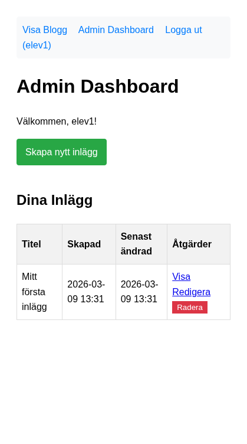
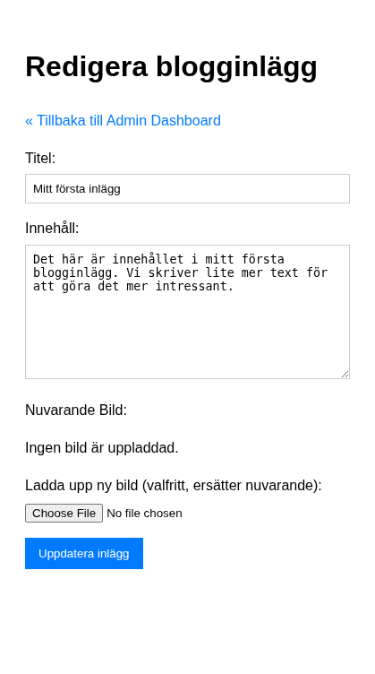

# Del 4: Uppdatera och radera

I denna del implementerar vi redigering, radering och admin-panelen – steg för steg. **Förutsättning:** Du har genomfört [Del 3: Skapa och läsa inlägg](crud-app-3-create-read.md).

Vi börjar med admin-panelen så att du har någonstans att navigera, sedan redigering (först utan bildhantering), sedan radering.

---

## Steg 9a: Adminpanel – grundversion

Admin-panelen är den sida inloggade användare når efter inloggning. Den ska lista användarens inlägg och ge länkar till att skapa, redigera och radera.

### Steg 1: Hämta användarens inlägg

Uppdatera `admin/index.php` (som du skapade minimalt i Del 2) med följande logik:

```php
<?php
require_once '../includes/config.php';

if (!isset($_SESSION['user_id'])) {
    header('Location: ../login.php?redirect=' . urlencode($_SERVER['REQUEST_URI']));
    exit;
}
$logged_in_user_id = $_SESSION['user_id'];
$logged_in_username = $_SESSION['username'];

require_once '../includes/database.php';

$posts = [];
$fetch_error = null;
$success_message = null;

if (isset($_GET['created']) && $_GET['created'] === 'success') {
    $success_message = "Nytt inlägg skapat!";
} elseif (isset($_GET['updated']) && $_GET['updated'] === 'success') {
    $success_message = "Inlägg uppdaterat!";
} elseif (isset($_GET['deleted']) && $_GET['deleted'] === 'success') {
    $success_message = "Inlägg raderat!";
}

try {
    $pdo = connect_db();
    $stmt = $pdo->prepare("SELECT id, title, created_at, updated_at
                           FROM posts
                           WHERE user_id = :user_id
                           ORDER BY created_at DESC");
    $stmt->bindParam(':user_id', $logged_in_user_id, PDO::PARAM_INT);
    $stmt->execute();
    $posts = $stmt->fetchAll();
} catch (PDOException $e) {
    error_log("Admin Index Error: " . $e->getMessage());
    $fetch_error = "Kunde inte hämta dina blogginlägg just nu.";
}
?>
```

**Nytt i detta steg:** `WHERE user_id = :user_id` – varje användare ser bara sina egna inlägg.

### Steg 2: Visa listan med länkar

Lägg till HTML-delen med navigering, länk till "Skapa nytt inlägg" och tabell:

```php
<!DOCTYPE html>
<html lang="sv">
<head>
    <meta charset="UTF-8">
    <meta name="viewport" content="width=device-width, initial-scale=1.0">
    <title>Admin Dashboard - Enkel Blogg</title>
    <style>
        body { font-family: sans-serif; line-height: 1.6; padding: 20px; }
        table { width: 100%; border-collapse: collapse; margin-top: 20px; }
        th, td { border: 1px solid #ddd; padding: 8px; text-align: left; }
        th { background-color: #f2f2f2; }
        nav { margin-bottom: 20px; background-color: #f8f9fa; padding: 10px; border-radius: 5px; }
        nav a { margin-right: 15px; text-decoration: none; color: #007bff; }
        .create-link { display: inline-block; margin-bottom: 20px; background-color: #28a745; color: white; padding: 10px 15px; text-decoration: none; border-radius: 4px; }
        .create-link:hover { background-color: #218838; }
        .error-message { color: red; border: 1px solid red; padding: 10px; margin-bottom: 20px; }
        .success-message { color: green; border: 1px solid green; padding: 10px; margin-bottom: 20px; }
    </style>
</head>
<body>
    <nav>
        <a href="../index.php">Visa Blogg</a>
        <a href="index.php">Admin Dashboard</a>
        <a href="../logout.php">Logga ut (<?php echo htmlspecialchars($logged_in_username); ?>)</a>
    </nav>

    <h1>Admin Dashboard</h1>
    <p>Välkommen, <?php echo htmlspecialchars($logged_in_username); ?>!</p>

    <a href="create_post.php" class="create-link">Skapa nytt inlägg</a>

    <?php if ($success_message): ?>
        <p class="success-message"><?php echo htmlspecialchars($success_message); ?></p>
    <?php endif; ?>

    <?php if ($fetch_error): ?>
        <p class="error-message"><?php echo htmlspecialchars($fetch_error); ?></p>
    <?php elseif (empty($posts)): ?>
        <p>Du har inte skapat några inlägg ännu.</p>
    <?php else: ?>
        <h2>Dina Inlägg</h2>
        <table>
            <thead>
                <tr>
                    <th>Titel</th>
                    <th>Skapad</th>
                    <th>Senast ändrad</th>
                    <th>Åtgärder</th>
                </tr>
            </thead>
            <tbody>
                <?php foreach ($posts as $post): ?>
                    <tr>
                        <td><?php echo htmlspecialchars($post['title']); ?></td>
                        <td><?php echo date('Y-m-d H:i', strtotime($post['created_at'])); ?></td>
                        <td><?php echo date('Y-m-d H:i', strtotime($post['updated_at'])); ?></td>
                        <td>
                            <a href="../post.php?id=<?php echo $post['id']; ?>" target="_blank">Visa</a>
                            <a href="edit_post.php?id=<?php echo $post['id']; ?>">Redigera</a>
                            <!-- Radera-knapp kommer i steg 10 -->
                        </td>
                    </tr>
                <?php endforeach; ?>
            </tbody>
        </table>
    <?php endif; ?>
</body>
</html>
```

Nu har du en fungerande admin-panel. "Redigera"-länken pekar på `edit_post.php` som vi skapar nästa.



---

## Steg 9b: Redigera inlägg – utan bildhantering

Redigering kräver två saker: hämta befintlig data (GET) och spara ändringar (POST). Vi börjar utan bildhantering.

### Steg 1: Hämta inlägget och kontrollera ägarskap

**Försök själv:** Varför måste vi kolla att `$post['user_id']` matchar `$logged_in_user_id`? Vad skulle hända om vi inte gjorde det?

Skapa `admin/edit_post.php`:

```php
<?php
require_once '../includes/config.php';

if (!isset($_SESSION['user_id'])) {
    header('Location: ../login.php?redirect=' . urlencode($_SERVER['REQUEST_URI']));
    exit;
}
$logged_in_user_id = $_SESSION['user_id'];

require_once '../includes/database.php';

$errors = [];
$post_id = filter_input(INPUT_GET, 'id', FILTER_VALIDATE_INT);
$post = null;
$title = '';
$body = '';
$current_image_path = null;

if ($post_id === false || $post_id <= 0) {
    $errors[] = "Ogiltigt inläggs-ID.";
} else {
    try {
        $pdo = connect_db();
        $stmt = $pdo->prepare("SELECT * FROM posts WHERE id = :id");
        $stmt->bindParam(':id', $post_id, PDO::PARAM_INT);
        $stmt->execute();
        $post = $stmt->fetch();

        if (!$post) {
            $errors[] = "Inlägget hittades inte.";
        } elseif ($post['user_id'] != $logged_in_user_id) {
            $errors[] = "Du har inte behörighet att redigera detta inlägg.";
            $post = null;
        } else {
            $title = $post['title'];
            $body = $post['body'];
            $current_image_path = $post['image_path'];
        }
    } catch (PDOException $e) {
        error_log("Edit Post Fetch Error: " . $e->getMessage());
        $errors[] = 'Databasfel. Kan inte hämta inlägg för redigering.';
        $post = null;
    }
}
?>
```

**Viktigt:** `user_id`-kontrollen förhindrar att användare redigerar andras inlägg genom att ändra ID:t i URL:en.

### Steg 2: Hantera POST (uppdatering utan bild)

Lägg till detta *efter* hämtningen och *före* `?>`:

```php
if ($_SERVER['REQUEST_METHOD'] === 'POST' && $post) {
    $title = trim($_POST['title'] ?? '');
    $body = trim($_POST['body'] ?? '');
    $new_image_path = $current_image_path;  // Behåll befintlig bild tills vidare

    if (empty($title)) {
        $errors[] = 'Titel är obligatoriskt.';
    }
    if (empty($body)) {
        $errors[] = 'Innehåll är obligatoriskt.';
    }

    if (empty($errors)) {
        try {
            if (!isset($pdo)) $pdo = connect_db();
            $stmt = $pdo->prepare("UPDATE posts SET title = :title, body = :body, image_path = :image_path WHERE id = :id AND user_id = :user_id");
            $stmt->bindParam(':title', $title);
            $stmt->bindParam(':body', $body);
            $stmt->bindParam(':image_path', $new_image_path, $new_image_path === null ? PDO::PARAM_NULL : PDO::PARAM_STR);
            $stmt->bindParam(':id', $post_id, PDO::PARAM_INT);
            $stmt->bindParam(':user_id', $logged_in_user_id, PDO::PARAM_INT);

            if ($stmt->execute()) {
                header('Location: index.php?updated=success&id=' . $post_id);
                exit;
            } else {
                $errors[] = 'Ett fel uppstod när inlägget skulle uppdateras.';
            }
        } catch (PDOException $e) {
            error_log("Update Post Error: " . $e->getMessage());
            $errors[] = 'Databasfel. Kan inte uppdatera inlägg just nu.';
        }
    }
}
```

**Nytt i detta steg:** `UPDATE` med `WHERE id = :id AND user_id = :user_id` – dubbelkollar ägarskap i databasen.

### Steg 3: Formuläret

Lägg till HTML-delen (formuläret visas bara om `$post` finns):

```php
<!DOCTYPE html>
<html lang="sv">
<head>
    <meta charset="UTF-8">
    <meta name="viewport" content="width=device-width, initial-scale=1.0">
    <title>Redigera inlägg - Admin</title>
    <style>
        body { font-family: sans-serif; line-height: 1.6; padding: 20px; }
        .form-group { margin-bottom: 15px; }
        label { display: block; margin-bottom: 5px; }
        input[type="text"], textarea {
            width: 100%; padding: 8px; border: 1px solid #ccc; box-sizing: border-box;
        }
        textarea { min-height: 150px; }
        button { padding: 10px 15px; background-color: #007bff; color: white; border: none; cursor: pointer; }
        .error-messages { color: red; margin-bottom: 15px; }
        .error-messages ul { list-style: none; padding: 0; }
        a { color: #007bff; text-decoration: none; }
    </style>
</head>
<body>
    <h1>Redigera blogginlägg</h1>
    <p><a href="index.php">&laquo; Tillbaka till Admin Dashboard</a></p>

    <?php if (!empty($errors)): ?>
        <div class="error-messages">
            <strong>Inlägget kunde inte uppdateras:</strong>
            <ul>
                <?php foreach ($errors as $error): ?>
                    <li><?php echo htmlspecialchars($error); ?></li>
                <?php endforeach; ?>
            </ul>
        </div>
    <?php endif; ?>

    <?php if ($post): ?>
        <form action="edit_post.php?id=<?php echo $post_id; ?>" method="post">
            <div class="form-group">
                <label for="title">Titel:</label>
                <input type="text" id="title" name="title" value="<?php echo htmlspecialchars($title); ?>" required>
            </div>
            <div class="form-group">
                <label for="body">Innehåll:</label>
                <textarea id="body" name="body" required><?php echo htmlspecialchars($body); ?></textarea>
            </div>
            <button type="submit">Uppdatera inlägg</button>
        </form>
    <?php endif; ?>
</body>
</html>
```

**OBS:** Formulärets `action` inkluderar `?id=<?php echo $post_id; ?>` så att vi vet vilket inlägg som uppdateras vid POST.



Testa att redigera ett inlägg. Titeln och innehållet ska uppdateras.

---

## Steg 9c: Redigering – lägg till bildhantering

Nu lägger vi till möjlighet att ta bort eller ersätta bilden. Vi bryter upp i tre understeg så att varje del blir lättare att följa.

### Steg 9c-1: Visa nuvarande bild och checkbox "Ta bort"

Börja med att uppdatera formuläret. Ändra `<form>` till att använda `enctype="multipart/form-data"` och lägg till bildsektionen *före* submit-knappen:

```html
<form action="edit_post.php?id=<?php echo $post_id; ?>" method="post" enctype="multipart/form-data">
    <!-- ... titel och body ... -->

    <div class="form-group">
        <label>Nuvarande Bild:</label>
        <?php if ($current_image_path): ?>
            <div style="margin: 10px 0;">
                " alt="Nuvarande bild" style="max-width: 200px;">
            </div>
            <label><input type="checkbox" name="delete_image" value="1"> Ta bort nuvarande bild</label>
        <?php else: ?>
            <p>Ingen bild är uppladdad.</p>
        <?php endif; ?>
    </div>

    <button type="submit">Uppdatera inlägg</button>
</form>
```

Lägg till hantering av "Ta bort bild" i POST-blocket. Ersätt raden `$new_image_path = $current_image_path;` med:

```php
$delete_image = isset($_POST['delete_image']);
$new_image_path = $current_image_path;
$image_uploaded = false;  // Används vid städning om databasen misslyckas (steg 9c-3)

if ($delete_image && $current_image_path) {
    if (file_exists(UPLOAD_PATH . basename($current_image_path))) {
        unlink(UPLOAD_PATH . basename($current_image_path));
    }
    $new_image_path = null;
    $current_image_path = null;
}
```

Testa: redigera ett inlägg med bild och kryssa i "Ta bort nuvarande bild". Inlägget ska uppdateras utan bild.

### Steg 9c-2: Ladda upp ny bild (ersätter nuvarande)

Lägg till filfältet i formuläret, *före* submit-knappen:

```html
<div class="form-group">
    <label for="image">Ladda upp ny bild (valfritt, ersätter nuvarande):</label>
    <input type="file" id="image" name="image" accept="image/jpeg, image/png, image/gif">
</div>
```

Lägg till hantering av ny uppladdning i POST-blocket, *efter* `if ($delete_image ...)`-blocket men *före* `if (empty($errors))`:

```php
} elseif ($image && $image['error'] === UPLOAD_ERR_OK) {
    $allowed_types = ['image/jpeg', 'image/png', 'image/gif'];
    $max_size = 5 * 1024 * 1024;

    if (!in_array($image['type'], $allowed_types)) {
        $errors[] = 'Ogiltig filtyp. Endast JPG, PNG och GIF.';
    } elseif ($image['size'] > $max_size) {
        $errors[] = 'Filen är för stor. Max 5 MB.';
    } else {
        $file_extension = pathinfo($image['name'], PATHINFO_EXTENSION);
        $unique_filename = uniqid('post_img_', true) . '.' . $file_extension;
        $destination = UPLOAD_PATH . $unique_filename;

        if (move_uploaded_file($image['tmp_name'], $destination)) {
            if ($current_image_path && file_exists(UPLOAD_PATH . basename($current_image_path))) {
                unlink(UPLOAD_PATH . basename($current_image_path));
            }
            $new_image_path = 'uploads/' . $unique_filename;
            $image_uploaded = true;  // Behövs för städning vid databasfel (steg 9c-3)
        } else {
            $errors[] = 'Kunde inte ladda upp den nya bilden.';
        }
    }
}
```

OBS: Lägg till `$image = $_FILES['image'] ?? null;` i början av POST-blocket. Variabeln `$image_uploaded` sattes redan i steg 9c-1.

Testa att ladda upp en ny bild – den ska ersätta den gamla.

### Steg 9c-3: Städa upp vid databasfel

Om `$stmt->execute()` eller databasen misslyckas efter att vi redan flyttat en ny bild till `uploads/`, måste vi ta bort den filen. Annars blir det kvar "förlorade" filer. Lägg till variabeln `$image_uploaded = true` när en ny bild sparas, och i `else`-grenarna (där vi sätter `$errors[]`) efter `$stmt->execute()`:

```php
if ($image_uploaded && $new_image_path && file_exists(UPLOAD_PATH . basename($new_image_path))) {
    unlink(UPLOAD_PATH . basename($new_image_path));
}
```

Hela POST-blocket med alla tre delar sammansatt:

```php
if ($_SERVER['REQUEST_METHOD'] === 'POST' && $post) {
    $title = trim($_POST['title'] ?? '');
    $body = trim($_POST['body'] ?? '');
    $image = $_FILES['image'] ?? null;
    $delete_image = isset($_POST['delete_image']);
    $new_image_path = $current_image_path;
    $image_uploaded = false;

    if (empty($title)) {
        $errors[] = 'Titel är obligatoriskt.';
    }
    if (empty($body)) {
        $errors[] = 'Innehåll är obligatoriskt.';
    }

    if ($delete_image) {
        if ($current_image_path && file_exists(UPLOAD_PATH . basename($current_image_path))) {
            unlink(UPLOAD_PATH . basename($current_image_path));
        }
        $new_image_path = null;
        $current_image_path = null;
    } elseif ($image && $image['error'] === UPLOAD_ERR_OK) {
        $allowed_types = ['image/jpeg', 'image/png', 'image/gif'];
        $max_size = 5 * 1024 * 1024;

        if (!in_array($image['type'], $allowed_types)) {
            $errors[] = 'Ogiltig filtyp. Endast JPG, PNG och GIF.';
        } elseif ($image['size'] > $max_size) {
            $errors[] = 'Filen är för stor. Max 5 MB.';
        } else {
            $file_extension = pathinfo($image['name'], PATHINFO_EXTENSION);
            $unique_filename = uniqid('post_img_', true) . '.' . $file_extension;
            $destination = UPLOAD_PATH . $unique_filename;

            if (move_uploaded_file($image['tmp_name'], $destination)) {
                if ($current_image_path && file_exists(UPLOAD_PATH . basename($current_image_path))) {
                    unlink(UPLOAD_PATH . basename($current_image_path));
                }
                $new_image_path = 'uploads/' . $unique_filename;
                $image_uploaded = true;
            } else {
                $errors[] = 'Kunde inte ladda upp den nya bilden.';
            }
        }
    }

    if (empty($errors)) {
        try {
            if (!isset($pdo)) $pdo = connect_db();
            $stmt = $pdo->prepare("UPDATE posts SET title = :title, body = :body, image_path = :image_path WHERE id = :id AND user_id = :user_id");
            $stmt->bindParam(':title', $title);
            $stmt->bindParam(':body', $body);
            $stmt->bindParam(':image_path', $new_image_path, $new_image_path === null ? PDO::PARAM_NULL : PDO::PARAM_STR);
            $stmt->bindParam(':id', $post_id, PDO::PARAM_INT);
            $stmt->bindParam(':user_id', $logged_in_user_id, PDO::PARAM_INT);

            if ($stmt->execute()) {
                header('Location: index.php?updated=success&id=' . $post_id);
                exit;
            } else {
                $errors[] = 'Ett fel uppstod när inlägget skulle uppdateras.';
                if ($image_uploaded && $new_image_path && file_exists(UPLOAD_PATH . basename($new_image_path))) {
                    unlink(UPLOAD_PATH . basename($new_image_path));
                }
            }
        } catch (PDOException $e) {
            error_log("Update Post Error: " . $e->getMessage());
            $errors[] = 'Databasfel. Kan inte uppdatera inlägg just nu.';
            if ($image_uploaded && $new_image_path && file_exists(UPLOAD_PATH . basename($new_image_path))) {
                unlink(UPLOAD_PATH . basename($new_image_path));
            }
        }
    }
}
```


**Du har nu lärt dig:** Att hantera tre fall – behålla bild, ta bort bild, ersätta bild – och att städa upp filer om databasen misslyckas.

---

## Steg 10: Radera inlägg

Radering ska ske via **POST**, inte GET. En GET-länk kan triggas av t.ex. en prefetch eller en felaktig klick, vilket kan leda till oavsiktlig radering.

### Steg 1: Skapa delete_post.php

Skapa `admin/delete_post.php`:

```php
<?php
require_once '../includes/config.php';

if (!isset($_SESSION['user_id'])) {
    header('Location: ../login.php');
    exit;
}
$logged_in_user_id = $_SESSION['user_id'];

require_once '../includes/database.php';

$errors = [];

if ($_SERVER['REQUEST_METHOD'] === 'POST') {
    $post_id = filter_input(INPUT_POST, 'post_id', FILTER_VALIDATE_INT);

    if ($post_id === false || $post_id <= 0) {
        $errors[] = "Ogiltigt inläggs-ID.";
    } else {
        try {
            $pdo = connect_db();

            $stmt_fetch = $pdo->prepare("SELECT user_id, image_path FROM posts WHERE id = :id");
            $stmt_fetch->bindParam(':id', $post_id, PDO::PARAM_INT);
            $stmt_fetch->execute();
            $post_data = $stmt_fetch->fetch();

            if (!$post_data) {
                $errors[] = "Inlägget hittades inte.";
            } elseif ($post_data['user_id'] != $logged_in_user_id) {
                $errors[] = "Du har inte behörighet att radera detta inlägg.";
            } else {
                $stmt_delete = $pdo->prepare("DELETE FROM posts WHERE id = :id AND user_id = :user_id");
                $stmt_delete->bindParam(':id', $post_id, PDO::PARAM_INT);
                $stmt_delete->bindParam(':user_id', $logged_in_user_id, PDO::PARAM_INT);

                if ($stmt_delete->execute()) {
                    $image_to_delete = $post_data['image_path'];
                    if ($image_to_delete && file_exists(UPLOAD_PATH . basename($image_to_delete))) {
                        unlink(UPLOAD_PATH . basename($image_to_delete));
                    }
                    header('Location: index.php?deleted=success&id=' . $post_id);
                    exit;
                } else {
                    $errors[] = "Kunde inte radera inlägget.";
                }
            }
        } catch (PDOException $e) {
            error_log("Delete Post Error: " . $e->getMessage());
            $errors[] = 'Databasfel. Kan inte radera inlägg just nu.';
        }
    }
} else {
    $errors[] = "Ogiltig förfrågan. Radering kräver POST.";
}
?>
<!DOCTYPE html>
<html lang="sv">
<head>
    <meta charset="UTF-8">
    <title>Fel vid radering - Admin</title>
    <style>
        body { font-family: sans-serif; line-height: 1.6; padding: 20px; }
        .error-messages { color: red; border: 1px solid red; padding: 10px; margin-bottom: 15px; }
        .error-messages ul { list-style: none; padding: 0; }
        a { color: #007bff; text-decoration: none; }
    </style>
</head>
<body>
    <h1>Fel vid radering</h1>
    <?php if (!empty($errors)): ?>
        <div class="error-messages">
            <ul>
                <?php foreach ($errors as $error): ?>
                    <li><?php echo htmlspecialchars($error); ?></li>
                <?php endforeach; ?>
            </ul>
        </div>
    <?php endif; ?>
    <p><a href="index.php">&laquo; Tillbaka till Admin Dashboard</a></p>
</body>
</html>
```

**Viktigt:** Vi hämtar `image_path` *innan* radering, eftersom vi behöver veta vilken fil som ska tas bort. Efter DELETE finns inte raden kvar.

### Steg 2: Radera-knapp i admin-panelen

I `admin/index.php`, ersätt kommentaren `<!-- Radera-knapp kommer i steg 10 -->` med ett formulär:

```html
<form action="delete_post.php" method="post" style="display: inline;"
      onsubmit="return confirm('Är du säker på att du vill radera detta inlägg?');">
    <input type="hidden" name="post_id" value="<?php echo $post['id']; ?>">
    <button type="submit" style="background-color: #dc3545; color: white; border: none; padding: 3px 8px; cursor: pointer;">Radera</button>
</form>
```

`confirm()` visar en dialog innan formuläret skickas. För titlar med citationstecken kan du använda `htmlspecialchars($post['title'], ENT_QUOTES, 'UTF-8')` i bekräftelsetexten om du vill visa titeln.


**Du har nu lärt dig:** Att använda POST för destruktiva operationer, att radera relaterade filer vid radering av databasrad, och att använda `confirm()` för att undvika misstag.

---

Nu har du en fungerande bloggapplikation med CRUD, autentisering, sessioner och bildhantering.

**Föregående:** [Del 3: Skapa och läsa inlägg](crud-app-3-create-read.md) | **Nästa:** [Del 5: Refaktorering](crud-app-5-refaktorering.md)
