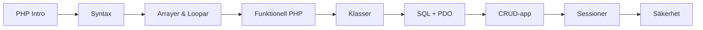

# Fullstack-utveckling med PHP och MySQL

Detta kapitel introducerar fullstack-utveckling med PHP och MySQL för att bygga kompletta webbapplikationer.

## Lärandemål

Efter detta kapitel ska du kunna:

*   Skriva PHP-kod med korrekt syntax, variabler, datatyper och kontrollstrukturer.
*   Använda arrayer och loopar för att hantera data.
*   Tillämpa funktionella tekniker: anonyma funktioner, closures och array-funktioner som `array_map`, `array_filter`, `array_reduce`.
*   Skapa och använda klasser och objekt (OOP-grunder).
*   Skriva SQL-frågor för att hämta, infoga, uppdatera och radera data.
*   Ansluta PHP till MariaDB/MySQL med PDO och prepared statements.
*   Hantera sessioner och cookies för användarautentisering.
*   Tillämpa grundläggande säkerhetsprinciper (XSS, SQL injection, lösenordshantering).
*   Bygga en enkel CRUD-applikation (blogg) från grunden.

## Förkunskaper

Innan du börjar rekommenderas att du har genomgått:

*   **Kapitel 1–5:** HTML, CSS, JavaScript och grundläggande webbkoncept.
*   **Kapitel 6:** Docker-introduktion (för att köra PHP och MySQL lokalt).

## Läsordning

Följande ordning ger en logisk progression:

1.  **Introduktion till PHP** – Vad är PHP, varför använda det, server vs. klient, utvecklingsmiljö.
2.  **PHP Syntax och funktioner** – Taggar, variabler, datatyper, operatorer, kontrollstrukturer, funktioner.
3.  **PHP arrayer och loopar** – Indexerade och associativa arrayer, `foreach`, vanliga array-funktioner.
4.  **Funktionell PHP** – Anonyma funktioner, closures, scope, `array_map`, `array_filter`, `array_reduce`.
5.  **PHP klasser** – OOP-grunder, egenskaper, metoder, konstruktorer, inkapsling.
6.  **MySQL och databaser** – SQL-syntax, tabeller, SELECT, INSERT, UPDATE, DELETE, JOIN. Avslutas med PHP + PDO för att ansluta till databasen.
7.  **CRUD-applikationer** – Bygga en blogg steg för steg (databas, registrering, inloggning, inlägg).
8.  **Sessioner och cookies** – Tillståndshantering, inloggningsstatus.
9.  **Säkerhet** – SQL injection, XSS, lösenordshantering, CSRF, filuppladdning.

*Not:* Sessioner och säkerhet introduceras också i CRUD-appen under bygget. Du kan läsa `sessions.md` och `security.md` parallellt eller efteråt för att fördjupa dig.
