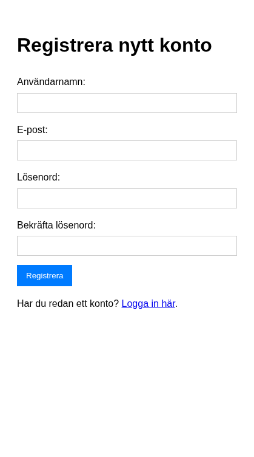
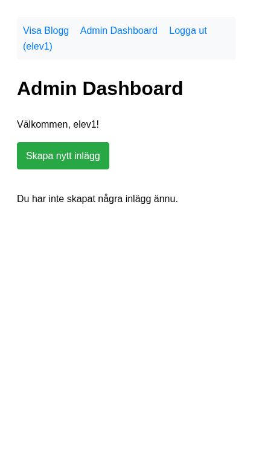

# Del 3: Setup och autentisering

I denna del sätter vi upp databasen och autentiseringen med Laravel – motsvarar [Del 1: Setup och databas](crud-app-1-setup.md) och [Del 2: Autentisering](crud-app-2-autentisering.md) i CRUD-appen.

**Förutsättning:** Du har genomfört [Del 2: Komma igång](laravel-komma-igang.md) och har ett fungerande Laravel-projekt.

---

## Jämförelse med CRUD-appen – Vad motsvarar vad?

I CRUD-appen byggde du autentisering, databaskoppling och tabeller manuellt. Laravel hanterar mycket av detta automatiskt. Här ser du vad som motsvarar vad:

| CRUD-app (Del 1 & 2) | Laravel (denna del) |
|-----------------------|---------------------|
| `includes/config.php` (DB_HOST, DB_NAME, session_start) | `.env` (DB-inställningar) + Breeze (session) |
| `includes/database.php` (connect_db, PDO) | Eloquent (automatisk anslutning via `.env`) |
| `CREATE TABLE users (...)` i phpMyAdmin | `php artisan migrate` (users-tabellen skapas av Breeze) |
| `CREATE TABLE posts (...)` i phpMyAdmin | Migration: `Schema::create('posts', ...)` |
| `register.php` (formulär + validering + password_hash + INSERT) | `/register` (Breeze – färdigt formulär, validering och hashning) |
| `login.php` (formulär + password_verify + session) | `/login` (Breeze – färdigt formulär, verifiering och session) |
| `logout.php` (session_destroy + cookie-radering) | `/logout` (Breeze – POST-route, hanterar allt automatiskt) |
| `if (!isset($_SESSION['user_id']))` i varje admin-fil | `Route::middleware('auth')` + `auth()`-helper |
| `$logged_in_user_id = $_SESSION['user_id']` | `auth()->user()->id` |
| `$logged_in_username = $_SESSION['username']` | `auth()->user()->name` |

### Skillnad: Breeze använder e-post istället för användarnamn

I CRUD-appen loggade du in med **användarnamn**. Laravel Breeze använder **e-post** för inloggning. Båda är vanliga lösningar – Breeze följer Laravels standard. Registrering och inloggning finns på `/register` och `/login`. Breeze skapar vyer i `resources/views/auth/` och routes i `routes/auth.php`. Du behöver inte skriva någon auth-kod själv.

### Vad Breeze automatiserar

När du byggde CRUD-appens Del 2 skrev du manuellt:

- `password_hash()` och `password_verify()` – Breeze hanterar detta internt
- `session_regenerate_id(true)` – Breeze hanterar sessionssäkerhet
-cookie-radering vid logout – Breeze hanterar detta
- Validering av e-post och lösenord vid registrering – Breeses valideringsregler
- Dublett-koll (finns användarnamnet/e-posten redan?) – Breeze kollar detta

Allt detta får du "gratis" med Breeze. Ramverkets autentisering är dessutom genomtestat och följer best practices.

---

## Migrations istället för manuella CREATE TABLE

I CRUD-appen skapade du tabellerna manuellt med `CREATE TABLE`. I Laravel använder vi **migrations** – filer som beskriver databasstrukturen och kan köras med `php artisan migrate`. Det ger versionshantering av databasen och gör det enkelt att återskapa strukturen på en ny miljö.

---

## Steg 1: Installera Laravel Breeze och verifiera autentisering

Laravel Breeze ger dig registrering, inloggning och logout – motsvarar [Del 2: Autentisering](crud-app-2-autentisering.md) där du byggde `register.php`, `login.php` och `logout.php` manuellt.

```bash
composer require laravel/breeze --dev
php artisan breeze:install
```

**Exempel på utdata** för `composer require`:

```
  INFO  Running composer update laravel/breeze
  ...
  - Installing laravel/breeze (v2.x): Extracting archive
```

För `breeze:install` – välj **"Blade"** när du tillfrågas om vilken stack du vill använda. Breeze bygger sedan frontend-assets (npm, vite). Breeze skapar routes, controllers och vyer för auth. Kör sedan:

```bash
php artisan migrate
```

**Exempel på utdata:**

```
  INFO  Running migrations.
  0001_01_01_000000_create_users_table ........ DONE
  0001_01_01_000001_create_cache_table ........ DONE
  0001_01_01_000002_create_jobs_table .......... DONE
```

Nu finns `users`-tabellen (med `name`, `email`, `password` m.m.).

**Kontrollera att det fungerar:** Starta servern med `php artisan serve` och gå till `http://localhost:8000/register`. Registrera en användare med e-post och lösenord. Du ska sedan vara inloggad och se dashboard. Testa att logga ut och logga in igen på `/login`.






---

## Steg 2: Skapa posts-tabellen med migration

Skapa en migration för blogginlägg:

```bash
php artisan make:model Post -m
```

Flaggan `-m` skapar samtidigt en migration. Öppna `database/migrations/xxxx_create_posts_table.php` och uppdatera:

```php
public function up(): void
{
    Schema::create('posts', function (Blueprint $table) {
        $table->id();
        $table->foreignId('user_id')->constrained()->onDelete('cascade');
        $table->string('title');
        $table->text('body');
        $table->string('image_path')->nullable();
        $table->timestamps();
    });
}
```

Detta motsvarar `posts`-tabellen från CRUD-appen: `user_id` (med foreign key och cascade), `title`, `body`, `image_path` (valfri). `timestamps()` lägger till `created_at` och `updated_at`.

Kör migrationen:

```bash
php artisan migrate
```

**Exempel på utdata:**

```
  INFO  Running migrations.
  2026_03_09_140608_create_posts_table ........ DONE
```

(Migrationsfilens namn kan variera – ditt datum/tid visas i stället.)

**Kontrollera att det fungerar:** Öppna din databas (t.ex. phpMyAdmin eller `mysql`-klienten) och verifiera att tabellen `posts` finns med kolumnerna `id`, `user_id`, `title`, `body`, `image_path`, `created_at`, `updated_at`.

---

## Steg 3: Konfigurera Post-modellen och relationer

Öppna `app/Models/Post.php`. Laravel skapar redan grunden. Lägg till fyllbara fält och relationen till User:

```php
protected $fillable = ['user_id', 'title', 'body', 'image_path'];

public function user()
{
    return $this->belongsTo(User::class);
}
```

I `app/Models/User.php`, lägg till den omvända relationen:

```php
public function posts()
{
    return $this->hasMany(Post::class);
}
```

**Jämförelse:** I CRUD-appen skrev du `connect_db()` och PDO-frågor. Här använder du **Eloquent** – modeller som representerar tabeller. `$post->user` hämtar automatiskt användaren för inlägget. Ingen manuell JOIN behövs.

---

## Steg 4: Testa modellen med Tinker

Verifiera att Post-modellen fungerar genom att skapa ett inlägg manuellt:

```bash
php artisan tinker
```

**Exempel på utdata** (Tinker startar en interaktiv PHP-prompt):

```
  Psy Shell v0.12.x (PHP 8.x.x — cli)
  >>> 
```

I Tinker-prompten:

```php
$user = \App\Models\User::first();
$user->posts()->create(['title' => 'Testinlägg', 'body' => 'Detta är ett test.']);
exit
```

**Kontrollera att det fungerar:** Kör `$user->posts` i Tinker – du ska se ditt testinlägg. Du kan också köra `\App\Models\Post::with('user')->first()` för att se att relationen fungerar.

**Exempel på utdata** när du kör `$user->posts`:

```
=> Illuminate\Database\Eloquent\Collection {
     all: [
       App\Models\Post {
         id: 1,
         user_id: 1,
         title: "Testinlägg",
         body: "Detta är ett test.",
         ...
       },
     ],
   }
```

---

## I denna del har du lärt dig

*   Att installera Laravel Breeze för färdig autentisering (registrering, inloggning, logout)
*   Att skapa migrations istället för manuella CREATE TABLE
*   Att konfigurera Eloquent-modeller med `$fillable` och relationer (`belongsTo`, `hasMany`)
*   Att använda Tinker för att testa modeller och relationer
*   Hur CRUD-appens manuella kod (config.php, database.php, register.php, login.php, logout.php) motsvaras av Laravel-funktioner (.env, Eloquent, Breeze)

---

**Föregående:** [Del 2: Komma igång](laravel-komma-igang.md) | **Nästa:** [Del 4: Skapa och läsa inlägg](laravel-crud-4-create-read.md)
