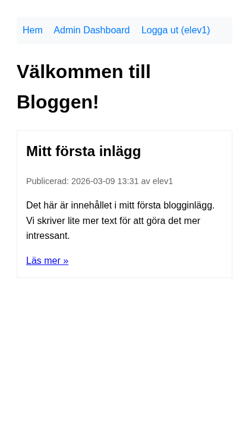

# Del 4: Skapa och läsa inlägg

I denna del implementerar vi Create och Read – motsvarar [Del 3: Skapa och läsa inlägg](crud-app-3-create-read.md) i CRUD-appen. Vi bygger steg för steg: först routes och grundstruktur, sedan skapa inlägg utan bild, därefter lista och visa, admin-panel och till sist bilduppladdning.

**Förutsättning:** Du har genomfört [Del 3: Setup och autentisering](laravel-crud-3-setup.md).

---

## Steg 1: Routes och grundläggande PostController

Börja med att definiera alla routes och en controller som returnerar enkel output. Vi bygger vyer stegvis.

Skapa controllern:

```bash
php artisan make:controller PostController
```

**Exempel på utdata:**

```
  INFO  Controller [app/Http/Controllers/PostController.php] created successfully.
```

Lägg till i `routes/web.php` (under de routes Breeze skapat, men **före** Breeze:s route för `/` om den finns). Om Breeze har satt `/` som dashboard behöver vi ändra det – se avsnittet "Uppdatera startsidan" längst ned.

```php
use App\Http\Controllers\PostController;

Route::get('/', [PostController::class, 'index'])->name('posts.index');
Route::get('/posts/{post}', [PostController::class, 'show'])->name('posts.show');

Route::middleware('auth')->group(function () {
    Route::get('/admin', [PostController::class, 'admin'])->name('posts.admin');
    Route::get('/admin/posts/create', [PostController::class, 'create'])->name('posts.create');
    Route::post('/admin/posts', [PostController::class, 'store'])->name('posts.store');
    Route::get('/admin/posts/{post}/edit', [PostController::class, 'edit'])->name('posts.edit');
    Route::put('/admin/posts/{post}', [PostController::class, 'update'])->name('posts.update');
    Route::delete('/admin/posts/{post}', [PostController::class, 'destroy'])->name('posts.destroy');
});
```

**Nyckelkoncept:**

*   **`Route::middleware('auth')`** – Skyddar admin-routes. Motsvarar `if (!isset($_SESSION['user_id']))` i varje admin-fil. Om användaren inte är inloggad omdirigeras de till login.
*   **`{post}` i URL:en** – **Route model binding**. Laravel hämtar automatiskt Post-modellen baserat på ID. Du behöver inte `filter_input` eller `get_post_by_id()`.

Implementera temporära metoder i `PostController` som bara returnerar text (vi bygger vyer i nästa steg):

```php
<?php

namespace App\Http\Controllers;

use App\Models\Post;
use Illuminate\Http\Request;

class PostController extends Controller
{
    public function index()
    {
        $posts = Post::with('user')->latest()->get();
        return view('posts.index', compact('posts'));
    }

    public function show(Post $post)
    {
        return view('posts.show', compact('post'));
    }

    public function admin()
    {
        $posts = auth()->user()->posts()->latest()->get();
        return view('posts.admin', compact('posts'));
    }

    public function create()
    {
        return view('posts.create');
    }

    public function store(Request $request)
    {
        // Kommer i Steg 2
        return redirect()->route('posts.admin');
    }
}
```

Skapa mappen `resources/views/posts/` och två minimala vyer.

`index.blade.php` (för startsidan):

```blade
@extends('layouts.app')

@section('content')
<h1>Välkommen till Bloggen!</h1>
@forelse($posts as $post)
    <p>{{ $post->title }}</p>
@empty
    <p>Det finns inga blogginlägg ännu.</p>
@endforelse
@endsection
```

`admin.blade.php` (för admin-panelen – vi bygger ut den i Steg 3):

```blade
@extends('layouts.app')

@section('content')
<h1>Admin Dashboard</h1>
<p>Välkommen, {{ auth()->user()->name }}!</p>
<a href="{{ route('posts.create') }}">Skapa nytt inlägg</a>
@foreach($posts as $post)
    <p>{{ $post->title }}</p>
@endforeach
@endsection
```

**OBS:** Create-vyn bygger vi i Steg 2. Om du klickar "Skapa nytt inlägg" innan dess får du fel – det är normalt, gå vidare till Steg 2.

**Kontrollera att det fungerar:** Gå till `/`. Om du har testinlägget från Del 3 (Tinker) ska du se det. Annars ska du se "Det finns inga blogginlägg ännu." Logga in och gå till `/admin` – du ska se admin-panelen med dina inlägg (eller tom lista). Om du får fel om att vyn saknas, kontrollera att `layouts.app` finns (Breeze skapar den).

---

## Steg 2: Skapa inlägg – utan bild

Nu lägger vi till formuläret och `store()`-metoden. Vi börjar **utan** bilduppladdning så att grundlogiken fungerar.

Uppdatera `store()` i PostController:

```php
public function store(Request $request)
{
    $validated = $request->validate([
        'title' => 'required|max:255',
        'body' => 'required',
    ]);

    auth()->user()->posts()->create([
        'title' => $validated['title'],
        'body' => $validated['body'],
        'image_path' => null,
    ]);

    return redirect()->route('posts.admin')->with('success', 'Nytt inlägg skapat!');
}
```

**Nyckelkoncept:** `$request->validate()` ersätter manuell `$errors[]`-logik. Laravel validerar och returnerar fel automatiskt till formuläret om valideringen misslyckas.

Skapa `resources/views/posts/create.blade.php`:

```blade
@extends('layouts.app')

@section('content')
<h1>Skapa nytt blogginlägg</h1>

<form action="{{ route('posts.store') }}" method="POST">
    @csrf
    <div>
        <label for="title">Titel:</label>
        <input type="text" id="title" name="title" value="{{ old('title') }}" required>
        @error('title') <span class="text-red-600">{{ $message }}</span> @enderror
    </div>
    <div>
        <label for="body">Innehåll:</label>
        <textarea id="body" name="body" required>{{ old('body') }}</textarea>
        @error('body') <span class="text-red-600">{{ $message }}</span> @enderror
    </div>
    <button type="submit">Spara inlägg</button>
</form>
@endsection
```

**Blade-tips:** `@error('title')` visar valideringsfel för fältet. `old('title')` återställer värdet om formuläret skickas tillbaka med fel – så användaren inte behöver skriva om allt.


**Kontrollera att det fungerar:** Logga in och gå till `/admin/posts/create`. Skapa ett inlägg med titel och innehåll. Du ska omdirigeras till admin-panelen och se ditt nya inlägg. Testa att skicka formuläret tomt – du ska se valideringsfel.

---

## Steg 3: Admin-panel och lista

Skapa admin-vyn så att du kan se dina inlägg och nå "Skapa nytt inlägg":

Skapa `resources/views/posts/admin.blade.php`:

```blade
@extends('layouts.app')

@section('content')
<h1>Admin Dashboard</h1>
<p>Välkommen, {{ auth()->user()->name }}!</p>

@if(session('success'))
    <p class="text-green-600">{{ session('success') }}</p>
@endif

<a href="{{ route('posts.create') }}">Skapa nytt inlägg</a>

<table>
    <thead>
        <tr><th>Titel</th><th>Skapad</th><th>Åtgärder</th></tr>
    </thead>
    <tbody>
        @foreach($posts as $post)
        <tr>
            <td>{{ $post->title }}</td>
            <td>{{ $post->created_at->format('Y-m-d H:i') }}</td>
            <td>
                <a href="{{ route('posts.show', $post) }}">Visa</a>
                <a href="{{ route('posts.edit', $post) }}">Redigera</a>
                <!-- Radera-knapp kommer i Del 5 -->
            </td>
        </tr>
        @endforeach
    </tbody>
</table>
@endsection
```

**Kontrollera att det fungerar:** Gå till `/admin`. Du ska se dina inlägg i en tabell. Klicka "Skapa nytt inlägg", skapa ett inlägg – du ska se det i listan och få meddelandet "Nytt inlägg skapat!". ("Redigera"-länken ger fel tills Del 5 – det är normalt.)

---

## Steg 4: Förbättra index och show

Uppdatera `resources/views/posts/index.blade.php` så att listan visar mer information:

```blade
@extends('layouts.app')

@section('content')
<h1>Välkommen till Bloggen!</h1>

@forelse($posts as $post)
    <article>
        <h2>{{ $post->title }}</h2>
        <p>Publicerad {{ $post->created_at->format('Y-m-d H:i') }} av {{ $post->user->name }}</p>
        <p>{{ Str::limit($post->body, 200) }}</p>
        <a href="{{ route('posts.show', $post) }}">Läs mer &raquo;</a>
    </article>
@empty
    <p>Det finns inga blogginlägg ännu.</p>
@endforelse
@endsection
```

Skapa `resources/views/posts/show.blade.php`:

```blade
@extends('layouts.app')

@section('content')
<article>
    <h1>{{ $post->title }}</h1>
    <p>Publicerad {{ $post->created_at->format('Y-m-d H:i') }} av {{ $post->user->name }}</p>
    <div>{!! nl2br(e($post->body)) !!}</div>
</article>
<a href="{{ route('posts.index') }}">&laquo; Tillbaka</a>
@endsection
```

**OBS:** `{!! nl2br(e($post->body)) !!}` – vi använder `e()` för att escap:a (skydda mot XSS) och `nl2br()` för radbrytningar. `{!! !!}` skriver ut utan extra escaping eftersom vi redan escap:at med `e()`.

**Kontrollera att det fungerar:** Gå till `/`. Klicka "Läs mer" på ett inlägg – du ska se hela inlägget. Klicka "Tillbaka" – du ska tillbaka till listan.




---

## Steg 5: Bilduppladdning

Lägg till stöd för att ladda upp en bild när man skapar inlägg.

Uppdatera `store()` i PostController:

```php
public function store(Request $request)
{
    $validated = $request->validate([
        'title' => 'required|max:255',
        'body' => 'required',
        'image' => 'nullable|image|max:7168', // 7 MB
    ]);

    $path = null;
    if ($request->hasFile('image')) {
        $path = $request->file('image')->store('posts', 'public');
    }

    auth()->user()->posts()->create([
        'title' => $validated['title'],
        'body' => $validated['body'],
        'image_path' => $path,
    ]);

    return redirect()->route('posts.admin')->with('success', 'Nytt inlägg skapat!');
}
```

Uppdatera `resources/views/posts/create.blade.php` – lägg till `enctype="multipart/form-data"` i form-taggen och bildfältet:

```blade
<form action="{{ route('posts.store') }}" method="POST" enctype="multipart/form-data">
    @csrf
    <div>
        <label for="title">Titel:</label>
        <input type="text" id="title" name="title" value="{{ old('title') }}" required>
        @error('title') <span class="text-red-600">{{ $message }}</span> @enderror
    </div>
    <div>
        <label for="body">Innehåll:</label>
        <textarea id="body" name="body" required>{{ old('body') }}</textarea>
        @error('body') <span class="text-red-600">{{ $message }}</span> @enderror
    </div>
    <div>
        <label for="image">Bild (valfritt, max 7 MB):</label>
        <input type="file" id="image" name="image" accept="image/jpeg,image/png,image/gif">
        @error('image') <span class="text-red-600">{{ $message }}</span> @enderror
    </div>
    <button type="submit">Spara inlägg</button>
</form>
```

Uppdatera `index.blade.php` och `show.blade.php` – lägg till bildvisning där det passar:

I `index.blade.php`, inuti `@forelse`-loopen, före `<h2>`:

```blade
@if($post->image_path)
    image_path) }}" alt="" style="max-width: 150px;">
@endif
```

I `show.blade.php`, efter rubriken:

```blade
@if($post->image_path)
    image_path) }}" alt="{{ $post->title }}" style="max-width: 100%;">
@endif
```

---

## Steg 6: Symbolisk länk för uppladdningar

För att bilder ska vara tillgängliga via webbläsaren måste du skapa en symbolisk länk:

```bash
php artisan storage:link
```

**Exempel på utdata:**

```
  INFO  The [public/storage] link has been connected to [storage/app/public].
```

Detta skapar en länk från `public/storage` till `storage/app/public`. Uppladdade bilder hamnar i `storage/app/public/posts/`.

**Kontrollera att det fungerar:** Skapa ett nytt inlägg med en bild. Du ska se bilden på startsidan och på inläggets sida. Om bilden inte visas, se "Vanliga problem" nedan.

---

## Uppdatera startsidan

Breeze sätter som standard `/` som dashboard för inloggade användare. Vi vill att `/` alltid visar postlistan (som i CRUD-appens `index.php`).

**Så här fixar du det:**

1. Öppna `routes/web.php`.
2. Ta bort eller kommentera bort Breeze:s route för `/` om den finns (t.ex. `Route::get('/', ...)` som pekar på dashboard).
3. Se till att vår route `Route::get('/', [PostController::class, 'index'])` kommer **före** eventuella andra routes som matchar `/`.
4. Om du vill ha en separat dashboard för inloggade användare kan du lägga `Route::get('/dashboard', ...)` och peka admin-länken dit – eller använd `/admin` som "dashboard" (som vi redan gör).

Breeze:s `routes/auth.php` inkluderas via `Route::middleware('auth')->group(...)` i `web.php`. Kontrollera att vår `PostController`-route för `/` är definierad och att ingen annan route överskuggar den.

---

## Vanliga problem

| Problem | Lösning |
|---------|---------|
| **Bilder visas inte** | Kör `php artisan storage:link`. Kontrollera att filen finns i `storage/app/public/posts/`. |
| **404 på `/posts/1`** | Route model binding kräver att parametern heter `{post}` (singular) och att metoden tar `Post $post`. Kontrollera `routes/web.php` och `show()`-metoden. |
| **Valideringsfel visas inte** | Kontrollera att du har `@error('fältnamn')` i formuläret och att `old('fältnamn')` används för att återställa värdet. |
| **403 eller redirect till login på /admin** | Du måste vara inloggad. Gå till `/login` och logga in först. |
| **Class "Post" not found** | Kontrollera att du har `use App\Models\Post;` högst upp i PostController. |

---

## I denna del har du lärt dig

*   Att definiera routes med middleware för att skydda admin-sidor
*   Att använda route model binding (`{post}` → `Post $post`)
*   Att validera formulär med `$request->validate()`
*   Att använda Blade-direktiv som `@forelse`, `@error` och `old()` i formulär
*   Att ladda upp filer med `$request->file()->store()` och `storage:link`

---

**Föregående:** [Del 3: Setup och autentisering](laravel-crud-3-setup.md) | **Nästa:** [Del 5: Uppdatera och radera](laravel-crud-5-update-delete.md)
