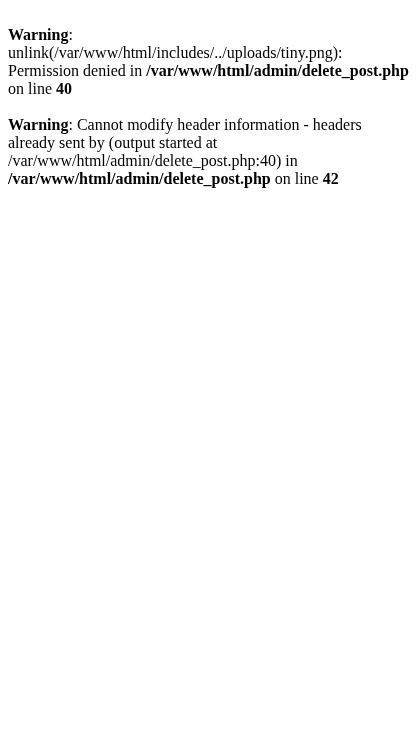

# Del 5: Uppdatera och radera

I denna del implementerar vi redigering och radering – motsvarar [Del 4: Uppdatera och radera](crud-app-4-update-delete.md) i CRUD-appen. Vi använder en Policy för att säkerställa att användare bara kan redigera och radera sina egna inlägg.

**Förutsättning:** Du har genomfört [Del 4: Skapa och läsa inlägg](laravel-crud-4-create-read.md).

---

## Steg 1: Policy för ägarskap

**Jämförelse med CRUD-appen:** I CRUD-appens Del 4 skrev du:
```php
if ($post['user_id'] != $logged_in_user_id) {
    $errors[] = "Du har inte behörighet att redigera detta inlägg.";
    $post = null;
}
```
Du upprepade denna kontroll i varje admin-fil (edit_post.php, delete_post.php). I Laravel samlar du behörighetslogiken i en Policy-klass – en enda plats att uppdatera istället för flera filer.

I CRUD-appen kollade du `$post['user_id'] != $logged_in_user_id` i edit och delete. I Laravel använder vi en **Policy** – en klass som centraliserar behörighetslogik. Användaren får bara redigera och radera sina egna inlägg.

Skapa policyn:

```bash
php artisan make:policy PostPolicy --model=Post
```

**Exempel på utdata:**

```
  INFO  Policy [app/Policies/PostPolicy.php] created successfully.
```

Öppna `app/Policies/PostPolicy.php` och uppdatera metoderna `update` och `delete`:

```php
public function update(User $user, Post $post): bool
{
    return $user->id === $post->user_id;
}

public function delete(User $user, Post $post): bool
{
    return $user->id === $post->user_id;
}
```

Laravel registrerar automatiskt policyn för Post-modellen. Vi använder den i nästa steg med `$this->authorize('update', $post)`.

---

## Steg 2: Edit-vyn och edit()-metoden

Skapa redigeringsformuläret och metoden som visar det.

Lägg till i `PostController`:

```php
public function edit(Post $post)
{
    $this->authorize('update', $post);
    return view('posts.edit', compact('post'));
}
```

**`$this->authorize('update', $post)`** – Anropar Policy:n. Om användaren inte äger inlägget returneras 403 Forbidden automatiskt. Du behöver inte skriva `if ($user->id !== $post->user_id)` – policyn gör det.

Skapa `resources/views/posts/edit.blade.php`:

```blade
@extends('layouts.app')

@section('content')
<h1>Redigera blogginlägg</h1>

<form action="{{ route('posts.update', $post) }}" method="POST" enctype="multipart/form-data">
    @csrf
    @method('PUT')
    <div>
        <label for="title">Titel:</label>
        <input type="text" id="title" name="title" value="{{ old('title', $post->title) }}" required>
        @error('title') <span class="text-red-600">{{ $message }}</span> @enderror
    </div>
    <div>
        <label for="body">Innehåll:</label>
        <textarea id="body" name="body" required>{{ old('body', $post->body) }}</textarea>
        @error('body') <span class="text-red-600">{{ $message }}</span> @enderror
    </div>
    @if($post->image_path)
        <div>
            image_path) }}" alt="" style="max-width: 200px;">
            <label><input type="checkbox" name="delete_image" value="1"> Ta bort nuvarande bild</label>
        </div>
    @endif
    <div>
        <label for="image">Ladda upp ny bild (ersätter nuvarande):</label>
        <input type="file" id="image" name="image" accept="image/jpeg,image/png,image/gif">
    </div>
    <button type="submit">Uppdatera inlägg</button>
</form>
@endsection
```

**OBS:** `@method('PUT')` – HTML-formulär stödjer bara GET och POST. Laravel använder detta dolda fält för att simulera PUT, så routen `Route::put(...)` matchar.

**Jämförelse med CRUD-appen:** I `edit_post.php` skickade du formuläret till samma sida (`edit_post.php?id=...`) och kollade `$_SERVER['REQUEST_METHOD'] === 'POST'`. I Laravel skiljer du på GET (visa formuläret) och PUT (spara ändringar) med separata routes. Dessutom behöver du inte lägga in `?id=` i URL:en – route model binding skickar in rätt post automatiskt.

**Kontrollera att det fungerar:** Gå till `/admin` och klicka "Redigera" på ett inlägg. Du ska se formuläret med befintlig titel och innehåll. Om du försöker redigera ett inlägg som tillhör en annan användare (skapa en annan användare först) ska du få 403 Forbidden.


---

## Steg 3: update()-metoden

Lägg till `update()` i PostController så att ändringar sparas:

```php
public function update(Request $request, Post $post)
{
    $this->authorize('update', $post);

    $validated = $request->validate([
        'title' => 'required|max:255',
        'body' => 'required',
        'image' => 'nullable|image|max:5120',
        'delete_image' => 'nullable|boolean',
    ]);

    $path = $post->image_path;
    if (!empty($validated['delete_image']) && $path) {
        \Storage::disk('public')->delete($path);
        $path = null;
    }
    if ($request->hasFile('image')) {
        if ($path) \Storage::disk('public')->delete($path);
        $path = $request->file('image')->store('posts', 'public');
    }

    $post->update([
        'title' => $validated['title'],
        'body' => $validated['body'],
        'image_path' => $path,
    ]);

    return redirect()->route('posts.admin')->with('success', 'Inlägg uppdaterat!');
}
```

**Jämförelse med CRUD-appen – bildhantering vid redigering:** I CRUD-appens `edit_post.php` skrev du ~50 rader för att hantera tre fall (behålla, ta bort, ersätta bild): `isset($_POST['delete_image'])`, `$_FILES['image']`, `file_exists()`, `unlink()`, `move_uploaded_file()` och städning vid databasfel. I Laravel gör `\Storage::disk('public')->delete($path)` samma sak som `unlink(UPLOAD_PATH . basename($path))`, och `$request->file('image')->store()` ersätter `move_uploaded_file()`. Validering av filtyp/storlek sköts av `'image' => 'nullable|image|max:5120'` i `$request->validate()`.

---

## Steg 4: destroy() och radera-knapp

Lägg till `destroy()` i PostController:

```php
public function destroy(Post $post)
{
    $this->authorize('delete', $post);
    if ($post->image_path) {
        \Storage::disk('public')->delete($post->image_path);
    }
    $post->delete();
    return redirect()->route('posts.admin')->with('success', 'Inlägg raderat!');
}
```

Uppdatera `resources/views/posts/admin.blade.php` – ersätt kommentaren `<!-- Radera-knapp kommer i Del 5 -->` med ett formulär:

```blade
<form action="{{ route('posts.destroy', $post) }}" method="POST" style="display:inline;"
      onsubmit="return confirm('Är du säker på att du vill radera detta inlägg?');">
    @csrf
    @method('DELETE')
    <button type="submit">Radera</button>
</form>
```

Radering ska ske via **POST** (med `@method('DELETE')`), inte GET – samma princip som i CRUD-appen. GET ska inte ha sidoeffekter som radering.

**Kontrollera att det fungerar:** Klicka "Radera" på ett inlägg. Du ska få en bekräftelsedialog. Bekräfta – inlägget ska försvinna från listan. Om inlägget hade en bild ska filen också tas bort från `storage/app/public/posts/`.



---

## Jämförelse: Plain PHP vs. Laravel

| Uppgift | CRUD-app (plain PHP) | Laravel |
|---------|----------------------|---------|
| **Autentisering** | register.php, login.php, logout.php, session-hantering, password_hash | Laravel Breeze – färdigt |
| **Skydda admin-sidor** | `if (!isset($_SESSION['user_id']))` i varje fil | `Route::middleware('auth')` |
| **Databasfrågor** | PDO, prepare, bindParam, fetch | Eloquent: `Post::with('user')->get()` |
| **Hämta ett inlägg** | `filter_input` + `get_post_by_id()` | Route model binding: `show(Post $post)` |
| **Validering** | Manuell `$errors[]`, empty(), filter_var | `$request->validate([...])` |
| **Vyer** | PHP och HTML blandat, `htmlspecialchars()` | Blade: `{{ $post->title }}` (escapas automatiskt) |
| **Ägarskap (edit/delete)** | `$post['user_id'] != $logged_in_user_id` i varje fil | Policy: `$this->authorize('update', $post)` |
| **Bilduppladdning** | `$_FILES`, `move_uploaded_file()`, `uniqid()`, filtyps-koll | `$request->file()->store('posts', 'public')`, validering `'image'` |
| **Ta bort bild** | `file_exists()` + `unlink()` | `\Storage::disk('public')->delete($path)` |
| **CSRF-skydd** | Inte implementerat i CRUD-appen | `@csrf` i varje formulär (automatiskt) |
| **Bild i vy** | `htmlspecialchars(BASE_URL . '/' . $post['image_path'])` | `asset('storage/' . $post->image_path)` |
| **Formulärdata kvar vid fel** | `value="<?php echo htmlspecialchars($title); ?>"` | `value="{{ old('title') }}"` (automatiskt escaped) |
| **Radera via POST** | `<form method="post">` med dolt `post_id`-fält | `@method('DELETE')` + `@csrf` |
| **Sessionsmeddelanden** | `$_GET['created=success']` i URL:en | `->with('success', '...')` + `session('success')` |
| **Modelklass vs PDO** | `class Post { showOne(), create(), updateOne() }` med PDO | `class Post extends Model` med Eloquent |
| **Logout** | session_destroy + cookie-radering manuellt | Breeze POST `/logout` – automatiskt |

I plain PHP skrev du hundratals rader för auth, routing och infrastruktur. I Laravel fokuserar du på applikationslogiken – ramverket löser resten.

---

## I denna del har du lärt dig

*   Att använda Policies för att centralisera behörighetslogik (ägarskap)
*   Att anropa `$this->authorize('update', $post)` för att skydda edit/update/delete
*   Att använda `@method('PUT')` och `@method('DELETE')` i formulär för RESTful routes
*   Att uppdatera och radera poster med Eloquent, samt ta bort associerade filer från storage
*   Hur CRUD-appens manuella ägarskapskontroll, filhantering och sessionsmeddelanden motsvaras av Laravel-funktioner (Policy, Storage, with()/session())

---

**Föregående:** [Del 4: Skapa och läsa inlägg](laravel-crud-4-create-read.md) | **Nästa:** [Sessioner och cookies](sessions.md)
