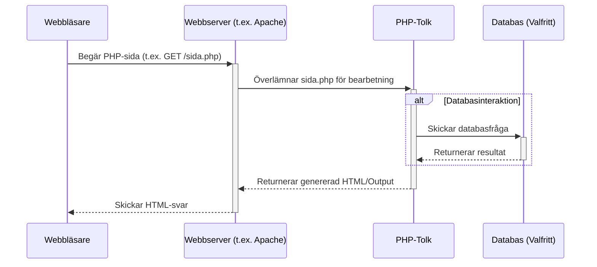

# Introduktion till PHP

PHP (Hypertext Preprocessor) är ett populärt skriptspråk med öppen källkod som främst används för webbutveckling på serversidan. Det skapades ursprungligen av Rasmus Lerdorf 1994 och har sedan dess utvecklats till ett kraftfullt och flexibelt språk som driver en stor del av webben, inklusive välkända plattformar som WordPress och Facebook.

## PHP i modern webbutveckling

Trots framväxten av nyare teknologier förblir PHP ett relevant och ofta använt språk inom webbutveckling. Några anledningar till detta är:

*   **Stor community och ekosystem:** Det finns ett enormt bibliotek av ramverk (t.ex. Laravel, Symfony), paket och verktyg tillgängliga för PHP.
*   **Enkelhet och snabb inlärningskurva:** Många utvecklare anser att PHP är relativt lätt att komma igång med jämfört med andra serverspråk.
*   **Integration med databaser:** PHP har utmärkt stöd för att interagera med olika databaser, särskilt MySQL.
*   **Kostnadseffektivt:** PHP är gratis att använda och många webbhotell erbjuder prisvärda PHP-hostingalternativ.

## Utvecklingsmiljö setup

För att utveckla med PHP lokalt behöver du installera:

1.  **PHP-tolken:** Själva kärnan i PHP som exekverar din kod. Den kan laddas ner från [php.net](https://www.php.net/downloads.php).
2.  **En webbserver:** T.ex. Apache eller Nginx, som hanterar HTTP-förfrågningar och serverar dina PHP-filer.
3.  **En databas:** Ofta MySQL eller MariaDB om din applikation behöver lagra data.

Ett enkelt sätt att få allt detta är att installera ett paket som XAMPP, MAMP eller WAMP, som buntar ihop Apache, MySQL och PHP (och ofta Perl/Python) för enkel installation på Windows, macOS eller Linux.

Alternativt kan du använda verktyg som Docker för att skapa isolerade och konfigurerbara utvecklingsmiljöer.

## PHP och webbservrar

När en användare begär en PHP-sida från en webbserver händer följande:

1.  Webbservern (t.ex. Apache) tar emot förfrågan.
2.  Om filen har ändelsen `.php`, skickar servern filen till PHP-tolken.
3.  PHP-tolken exekverar koden i filen. Detta kan innebära att hämta data från en databas, bearbeta formulärdata, eller utföra annan logik.
4.  Resultatet av PHP-skriptet (vanligtvis HTML, men kan vara JSON, XML etc.) skickas tillbaka till webbservern.
5.  Webbservern skickar det slutliga resultatet (HTML) till användarens webbläsare.



## Grundläggande koncept och syntax

PHP-kod bäddas oftast in direkt i HTML-dokument med hjälp av speciella taggar: `<?php` och `?>`.

```php
<!DOCTYPE html>
<html>
<head>
    <title>Min första PHP-sida</title>
</head>
<body>
    <h1>Välkommen!</h1>
    <p>Dagens datum är <?php echo date('Y-m-d'); ?>.</p> 
    
    <?php
        // Detta är en PHP-kommentar
        $greeting = "Hej från PHP!";
        echo "<p>" . $greeting . "</p>"; 

        $num1 = 5;
        $num2 = 10;
        $sum = $num1 + $num2;
        echo "<p>Summan av $num1 och $num2 är: $sum</p>";
    ?>
</body>
</html>
```

I exemplet ovan:
*   `<?php ... ?>`: Taggarna som omger PHP-koden.
*   `echo`: Används för att skriva ut data till HTML-outputen.
*   `date('Y-m-d')`: En inbyggd PHP-funktion som returnerar dagens datum.
*   `$greeting`, `$num1`, `$num2`, `$sum`: Variabler (börjar alltid med `$` i PHP).
*   `.`: Konkateneringsoperatorn för att slå ihop strängar.
*   `//`: En enkelradskommentar i PHP.

## PHP vs. JavaScript

Det är viktigt att förstå skillnaden mellan PHP och JavaScript, två vanliga språk inom webbutveckling:

*   **PHP (Server-side):**
    *   Körs på **webbservern**.
    *   Används för att hantera data, interagera med databaser, hantera användarsessioner, och generera dynamiskt HTML **innan** det skickas till webbläsaren.
    *   Användaren ser aldrig själva PHP-koden, bara resultatet (oftast HTML).
    *   Bra för backend-logik, databashantering, säkerhetskritiska operationer.

*   **JavaScript (Client-side):**
    *   Körs i **användarens webbläsare**.
    *   Används för att göra webbsidor interaktiva, manipulera HTML och CSS (DOM-manipulation), göra asynkrona anrop (t.ex. med Fetch API) och validera formulärdata **utan** att behöva ladda om sidan.
    *   Användaren kan se JavaScript-koden (oftast).
    *   Bra för användargränssnitt, interaktivitet, realtidsuppdateringar på klientsidan.

**Analogi:** Tänk på en restaurang. PHP är som **kocken** som förbereder maten (datan) i köket (servern) baserat på beställningen (HTTP-förfrågan). JavaScript är som **servitören** som interagerar med gästen (användaren) vid bordet (webbläsaren), tar emot specifika önskemål (användarinteraktioner) och justerar presentationen (webbsidan) direkt.

Även om JavaScript ursprungligen var ett klientspråk, kan det idag även köras på serversidan med plattformar som Node.js (vilket tas upp i kapitel 9). Men när man pratar om traditionell webbutveckling är PHP ett serverspråk och JavaScript (i webbläsaren) ett klientspråk. PHP och JavaScript kompletterar ofta varandra för att skapa rika och dynamiska webbapplikationer.

## Kom igång med PHP-utveckling

För att bygga och köra PHP-applikationer lokalt behöver du en utvecklingsmiljö som inkluderar PHP-tolken, en webbserver och ofta en databas. En traditionell "stack" (samling mjukvara) för detta är LAMP (Linux, Apache, MySQL, PHP) eller LEMP (Linux, Nginx, MySQL, PHP). Istället för att installera dessa tjänster direkt på ditt operativsystem, kommer vi i den här boken att använda **Docker**. 

Docker låter oss definiera och köra applikationer i isolerade "containrar". Detta gör det enklare att:
*   Sätta upp en konsekvent utvecklingsmiljö oavsett ditt operativsystem.
*   Hantera olika versioner av mjukvara (PHP, MySQL etc.) för olika projekt.
*   Simulera produktionsmiljön mer exakt.
*   Dela miljökonfigurationen med andra utvecklare.

Vi kommer att använda en `docker-compose.yml`-fil för att definiera de tjänster (services) som vår PHP-applikation behöver. I vårt fall är det:

1.  **Webbserver (Apache):** Apache är en mycket populär och väletablerad webbserver som ansvarar för att ta emot HTTP-förfrågningar från webbläsare och skicka dem vidare till PHP-tolken för bearbetning av `.php`-filer. Den serverar också statiska filer som HTML, CSS och JavaScript.
2.  **Databas (MariaDB):** MariaDB är en populär relationsdatabas med öppen källkod, skapad av de ursprungliga utvecklarna av MySQL. Den används för att lagra och hämta applikationens data på ett strukturerat sätt. PHP har utmärkt stöd för att kommunicera med MariaDB/MySQL.
3.  **Databashanterare (phpMyAdmin):** phpMyAdmin är ett webbaserat verktyg skrivet i PHP som ger ett grafiskt gränssnitt för att administrera MariaDB/MySQL-databaser. Det är praktiskt för att titta på data, köra SQL-frågor manuellt och hantera databasstrukturen under utveckling.
4.  **PHP:** Själva PHP-tjänsten som kör vår applikationskod.

Nedan följer ett exempel på hur en `docker-compose.yml`-fil kan se ut för att sätta upp denna miljö. (Detaljer kring Docker och Docker Compose täcks mer ingående i andra sammanhang, men detta ger en grundläggande uppfattning).

---

*docker-compose.yml*

```yml
services:
    php:
        build:
            context: .
            dockerfile: Dockerfile
        volumes:
            - ./app/public:/var/www/html
        ports:
            - 8060:80
    mysql:
        image: mariadb:latest
        environment:
            MYSQL_ROOT_PASSWORD: db_root_password
            MYSQL_USER: db_user
            MYSQL_PASSWORD: db_password
            MYSQL_DATABASE: db_fullstack
        volumes:
            - mysqldata:/var/lib/mysql
        ports:
            - 38060:3306
    phpmyadmin:
        image: phpmyadmin
        restart: always
        ports:
            - 8061:80
        environment:
            - PMA_ARBITRARY=1
        depends_on:
            - mysql
volumes:
    mysqldata: {}
```

*Dockerfile*

```yml
FROM php:8-apache
RUN a2enmod ssl && a2enmod rewrite
RUN service apache2 restart
RUN apt-get update && apt-get install -y
RUN docker-php-ext-install mysqli pdo pdo_mysql
```

*Mappstruktur för exemplet ovan*

```yml
project
├───app
│   └───public
│       └───index.php
├───Dockerfile
├───docker-compose.yml
```

---

### Demo: Server-side vs Client-side

För att illustrera skillnaden mellan kod som körs på servern (PHP) och kod som körs i klienten (JavaScript), kan vi skapa en enkel `index.php`-fil:

```php
<!DOCTYPE html>
<html>
<head>
    <title>PHP & JS Demo</title>
</head>
<body>
    <h1>PHP säger:</h1>
    <?php
        // Denna PHP-kod körs på servern
        $serverMessage = "Jag körs på servern!";
        echo "<p>" . htmlspecialchars($serverMessage) . "</p>"; 
    ?>

    <script>
        // Denna JavaScript-kod körs i klientens webbläsare
        console.log("Jag körs på klienten (i webbläsarens konsol)!");
        alert("Hej från JavaScript!"); // Visar en popup i webbläsaren
    </script>
</body>
</html>
```

När du besöker denna sida i webbläsaren:
1.  PHP-koden (`echo ...`) exekveras på servern och genererar HTML-texten `<p>Jag körs på servern!</p>`.
2.  Den kompletta HTML-koden (inklusive `<script>`-taggarna) skickas till webbläsaren.
3.  Webbläsaren renderar HTML:en och exekverar JavaScript-koden inuti `<script>`-taggarna, vilket skriver ut meddelandet till webbläsarkonsolen och visar en `alert`-ruta.

Detta visar tydligt hur PHP genererar innehållet på serversidan medan JavaScript hanterar interaktivitet och logik på klientsidan.