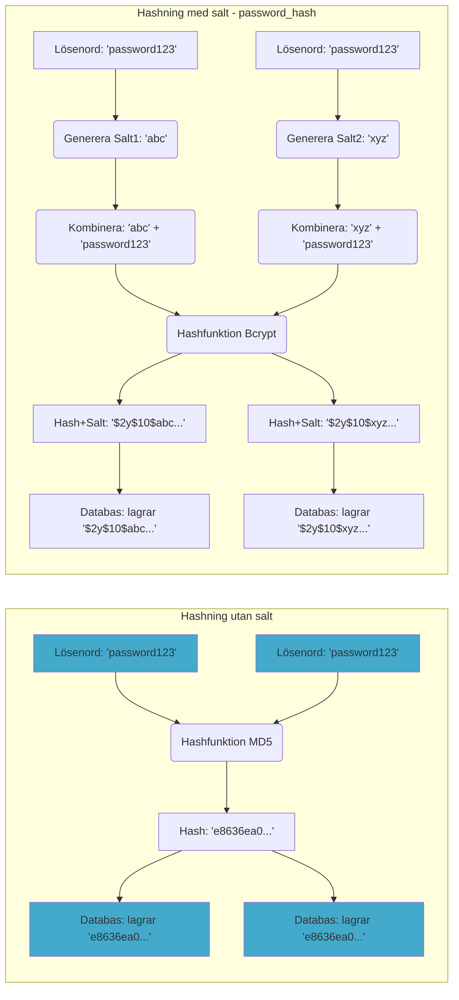

# Webbsäkerhet i PHP: Vanliga Hot och Skydd

Att bygga en fungerande webbapplikation är en sak, men att göra den säker är en helt annan och minst lika viktig uppgift. En osäker applikation kan leda till att användardata läcker, att obehöriga får kontroll över systemet, eller att webbplatsen används för att sprida skadlig kod. Detta avsnitt täcker några av de mest kritiska säkerhetsriskerna och hur du skyddar din PHP-applikation mot dem.

## 1. SQL Injection (SQL-injektion)

**Vad är det?**
SQL Injection är en av de mest kända och farligaste attackerna. Den inträffar när en angripare lyckas "injicera" (infoga) skadlig SQL-kod i en databasfråga via osanerad användarinput (t.ex. från ett formulärfält eller en URL-parameter). Om applikationen bygger ihop SQL-frågan genom att direkt klistra in denna input, kan angriparen manipulera frågan till att göra saker den inte borde, som att:

*   Hämta känslig data (andra användares lösenord, kreditkortsinformation).
*   Modifiera eller radera data.
*   I vissa fall, få kontroll över hela databasservern.

**Exempel på Sårbar Kod:**

Anta att du vill hämta en användare baserat på ett ID från en URL (`login.php?id=123`).

```php
<?php
// MYCKET OSÄKERT EXEMPEL - ANVÄND ALDRIG SÅ HÄR!
require_once 'includes/database.php';

$user_id = $_GET['id']; // Hämta ID direkt från URL
$pdo = connect_db();

// Bygger ihop SQL-frågan genom att klistra in användarinput direkt!
$sql = "SELECT username, email FROM users WHERE id = " . $user_id;

echo "Exekverar: " . $sql . "\n";

// Kör den osäkra frågan
// $stmt = $pdo->query($sql); 
// $user = $stmt->fetch();
// ... visa användardata ...
?>
```

*Problem:* Vad händer om en angripare anropar sidan med `login.php?id=123 OR 1=1`?

SQL-frågan blir då:
`SELECT username, email FROM users WHERE id = 123 OR 1=1`

Villkoret `OR 1=1` är alltid sant, så frågan kommer att returnera **alla** användare i databasen, inte bara användare 123!

Ännu värre, om angriparen skickar `login.php?id=123; DROP TABLE users; --`

SQL-frågan (beroende på databas) kan bli:
`SELECT username, email FROM users WHERE id = 123; DROP TABLE users; --`

Detta skulle kunna radera hela `users`-tabellen! (`;` separerar kommandon, `--` startar en kommentar).

**Hur man Skyddar Sig: Prepared Statements (Förberedda Uttryck)**

Det absolut viktigaste skyddet mot SQL Injection är att **aldrig** klistra in användarinput direkt i SQL-frågor. Använd istället **Prepared Statements**, som vi gör genomgående i `crud-app.md` med PDO.

Så här fungerar det:

1.  **Förbered Frågan:** Skicka SQL-frågan till databasen med platshållare (`:` eller `?`) istället för de faktiska värdena.
2.  **Bind Parametrar:** Tala om för databasen vilka variabler som ska användas för varje platshållare och vilken datatyp de har.
3.  **Exekvera:** Kör den förberedda frågan. Databasen sätter då in värdena på ett säkert sätt, och behandlar dem *alltid* som data, aldrig som SQL-kod.

**Säker Kod (med PDO):**

```php
<?php
// SÄKERT EXEMPEL MED PREPARED STATEMENTS
require_once 'includes/database.php';

$user_id = filter_input(INPUT_GET, 'id', FILTER_VALIDATE_INT); // Validera först input!

if ($user_id) {
    try {
        $pdo = connect_db();

        // 1. Förbered frågan med platshållare
        $sql = "SELECT username, email FROM users WHERE id = :user_id";
        $stmt = $pdo->prepare($sql);

        // 2. Bind parametern (värdet från $user_id)
        $stmt->bindParam(':user_id', $user_id, PDO::PARAM_INT);

        // 3. Exekvera
        $stmt->execute();

        $user = $stmt->fetch();

        if ($user) {
            echo "Användare hittad: " . htmlspecialchars($user['username']);
        } else {
            echo "Användare inte hittad.";
        }

    } catch (PDOException | Exception $e) { // PDOException eller annan valideringsfel
        error_log("SQL Error: " . $e->getMessage());
        echo "Ett fel uppstod.";
    }
} else {
    echo "Ogiltigt ID.";
}
?>
```

Om en angripare nu försöker med `?id=123 OR 1=1`, kommer `filter_input` att returnera `false` (eftersom det inte är ett heltal). Om de försöker med `?id=123; DROP TABLE users; --`, även om det skulle passera `filter_input` (vilket det inte gör), skulle databasen behandla hela strängen `"123; DROP TABLE users; --"` som det värde som ska bindas till `:userid` (och troligen misslyckas med att hitta en match eller ge ett typfel), **inte** som separat SQL-kod.

**Alltid använda Prepared Statements när användarinput är inblandad i SQL-frågor!**

## 2. Cross-Site Scripting (XSS)

**Vad är det?**
XSS inträffar när en angripare lyckas injicera skadlig kod (oftast JavaScript) i en webbsida som sedan visas för *andra* användare. När den andra användarens webbläsare renderar sidan, exekveras den skadliga koden inom kontexten av den legitima webbplatsen.

Detta kan användas för att:

*   Stjäla användarens session cookies (och därmed kapa deras session).
*   Omdirigera användaren till en falsk inloggningssida.
*   Modifiera innehållet på sidan användaren ser.
*   Utföra åtgärder i användarens namn.

Det vanligaste sättet XSS sker är när en webbapplikation tar emot data från en användare (t.ex. en kommentar, ett profilnamn, ett sökord) och sedan skriver ut denna data direkt i HTML-koden **utan att sanera den först**.

**Exempel på Sårbar Kod:**

Anta att du har en gästbok där användare kan lämna meddelanden.

```php
<?php
// OSÄKERT EXEMPEL - VISAR ANVÄNDARINPUT DIREKT!

// Antag att $comment hämtats från databasen, där en användare skrivit:
// <script>alert('XSS Attack! Din cookie: ' + document.cookie);</script>
$comment = "<script>alert('XSS Attack! Din cookie: ' + document.cookie);</script>";

?>
<!DOCTYPE html>
<html>
<body>
    <h1>Kommentarer</h1>
    <div class="comment">
        <?php echo $comment; // SKRIVER UT SKADLIG KOD DIREKT! ?>
    </div>
</body>
</html>
```

När en annan användare besöker sidan, kommer deras webbläsare att se `<script>...</script>`-taggen och exekvera JavaScript-koden inuti den. I detta fall visas en popup med användarens cookies (potentiellt session-ID:t!).

**Hur man Skyddar Sig: Sanera All Output (`htmlspecialchars`)**

Den grundläggande regeln är: **Lita aldrig på data som kommer utifrån** (användarinput, data från databas som kan ha manipulerats etc.). Innan du skriver ut sådan data i ett HTML-sammanhang, måste du **sanera** den så att den behandlas som ren text och inte som HTML-kod.

Den vanligaste och viktigaste funktionen för detta i PHP är `htmlspecialchars()`.

`htmlspecialchars()` konverterar specialtecken som har en HTML-betydelse till deras motsvarande HTML-entiteter:

*   `&` blir `&amp;`
*   `"` (dubbelt citationstecken) blir `&quot;` (om `ENT_QUOTES` är satt)
*   `'` (enkelt citationstecken) blir `&#039;` eller `&apos;` (om `ENT_QUOTES` är satt)
*   `<` (mindre än) blir `&lt;`
*   `>` (större än) blir `&gt;`

**Säker Kod:**

```php
<?php
// SÄKERT EXEMPEL - SANERAR OUTPUT

$comment = "<script>alert('XSS Attack! Din cookie: ' + document.cookie);</script>";

?>
<!DOCTYPE html>
<html>
<body>
    <h1>Kommentarer</h1>
    <div class="comment">
        <?php echo htmlspecialchars($comment, ENT_QUOTES, 'UTF-8'); ?>
    </div>
</body>
</html>
```

Nu kommer HTML-koden som webbläsaren tar emot att se ut ungefär så här:

```html
<div class="comment">
    &lt;script&gt;alert(&#039;XSS Attack! Din cookie: &#039; + document.cookie);&lt;/script&gt;
</div>
```

Webbläsaren kommer att visa detta som text, men **inte** exekvera det som ett skript, eftersom `<` och `>` har omvandlats till ofarliga entiteter.

**Argument till `htmlspecialchars()`:**

*   `$string`: Strängen som ska saneras.
*   `$flags`: Oftast `ENT_QUOTES` för att konvertera både enkel- och dubbelcitationstecken. Detta är viktigt om du skriver ut data inuti HTML-attribut (t.ex. `value="..."`).
*   `$encoding`: Ange teckenkodningen, nästan alltid `'UTF-8'` för moderna webbapplikationer.

**Använd `htmlspecialchars()` konsekvent på ALL data som kommer utifrån innan den skrivs ut i HTML!**

*Not:* Om du behöver skriva ut data i andra sammanhang (t.ex. inuti ett JavaScript-block eller ett CSS-värde) krävs *andra* typer av sanering/kodning. `htmlspecialchars` är specifikt för HTML-kroppen och HTML-attribut.

## 3. Password Hashing (Säker Lösenordshantering)

**Vad är problemet?**
Att lagra användarnas lösenord i klartext i databasen är extremt oansvarigt. Om databasen blir stulen får angriparen tillgång till alla lösenord direkt.

Att använda enkla hash-funktioner som MD5 eller SHA1 är inte heller säkert längre. Dessa är:
*   **Snabba:** Gör dem lätta att knäcka med brute-force-attacker (testa miljontals lösenord per sekund).
*   **Kollisionsbenägna (särskilt MD5):** Olika lösenord kan ge samma hash.
*   **Inte saltade (i sig själva):** Samma lösenord ger alltid samma hash, vilket gör dem sårbara för "rainbow table"-attacker (förberäknade tabeller med hashvärden för vanliga lösenord).

**Hur man Skyddar Sig: Starka, Saltade Hashar (`password_hash` / `password_verify`)**

## Vad är en hashning-funktion?

Innan vi dyker in i PHP:s funktioner, låt oss förstå vad **hashing** (hashning) innebär. En hashfunktion är en matematisk algoritm som tar en indata av valfri storlek (t.ex. ett lösenord) och omvandlar den till en utdata av fast storlek, kallad en **hash** eller ett **hashvärde** (ibland "digest").

Tänk dig en **mixer**: 

1.  Du lägger i **ingredienser** (ditt lösenord, "mittLösenord123").
2.  Du kör **mixern** (hashfunktionen, t.ex. Bcrypt).
3.  Ut kommer en **smoothie** (hashen, t.ex. `$2y$10$abcdef...xyz`).

**Viktiga egenskaper hos kryptografiska hashfunktioner (som används för lösenord):**

*   **Envägsfunktion (One-way):** Det är extremt svårt (praktiskt taget omöjligt) att gå från smoothien (hashen) tillbaka till de ursprungliga ingredienserna (lösenordet). Du kan inte "köra mixern baklänges".
*   **Deterministisk:** Samma ingredienser (samma lösenord *och samma salt*, se nedan) i samma mixer (samma hashfunktion) ger *alltid* exakt samma smoothie (hash).
*   **Snabb att beräkna:** Det ska gå relativt fort att skapa hashen från lösenordet.
*   **Kollisionsresistent:** Det ska vara extremt svårt att hitta två *olika* indata (lösenord) som ger *samma* hash.
*   **Lavineffekt (Avalanche effect):** En liten ändring i indata (t.ex. ändra en bokstav i lösenordet) ska resultera i en helt annorlunda hash.

**Varför inte bara hasha? Problemet med salt.**
Om vi bara använde en enkel hashfunktion (som gamla MD5 eller SHA1) skulle samma lösenord alltid ge samma hash. Angripare kan då använda "rainbow tables" – gigantiska listor med förberäknade hashar för vanliga lösenord. Om din lagrade hash finns i deras tabell, vet de omedelbart ditt lösenord.

Lösningen är **saltning**. Ett **salt** är en slumpmässig datasträng som läggs till lösenordet **innan** det hashas. 

*Liknelse:* Tänk att du lägger till en unik, hemlig krydda (saltet) till dina ingredienser innan du mixar dem. Även om två personer använder exakt samma grundingredienser (lösenord), kommer deras smoothies (hashar) att bli helt olika eftersom de använde olika hemliga kryddor (salt).

Moderna funktioner som PHP:s `password_hash()`:
1.  Genererar ett **unikt, slumpmässigt salt** för varje lösenord.
2.  Kombinerar saltet med lösenordet.
3.  Hashar kombinationen med en stark algoritm (som Bcrypt).
4.  Sparar **både saltet och hashen** tillsammans i en enda sträng i databasen.

När `password_verify()` används, extraherar den saltet från den lagrade strängen, kombinerar det med lösenordet som användaren skrev in, hashar det, och jämför sedan resultatet med den lagrade hashen.


*Diagrammet illustrerar hur samma lösenord utan salt ger samma hash, medan `password_hash` med unika salt ger olika lagrade hashvärden för samma lösenord, vilket skyddar mot rainbow tables.*

PHP har sedan version 5.5 inbyggda, moderna funktioner för säker lösenordshantering:

*   **`password_hash($password, PASSWORD_DEFAULT)`:**
    *   Tar ett lösenord i klartext (`$password`).
    *   Använder en **stark, långsam** hash-algoritm (oftast Bcrypt som standard med `PASSWORD_DEFAULT`). Långsamheten gör brute-force mycket svårare.
    *   Genererar automatiskt ett **unikt, slumpmässigt salt** för varje lösenord.
    *   Kombinerar algoritmen, saltet och hashen till en enda sträng som är säker att lagra i databasen (t.ex. i en `VARCHAR(255)`-kolumn).

*   **`password_verify($password, $hash)`:**
    *   Tar det lösenord användaren anger vid inloggning (`$password`) och den lagrade hashen från databasen (`$hash`).
    *   Extraherar automatiskt algoritmen och saltet från `$hash`.
    *   Hashar det angivna lösenordet med samma algoritm och salt.
    *   Jämför resultatet säkert (mot tidattacker) med den lagrade hashen.
    *   Returnerar `true` om lösenordet matchar, annars `false`.

**Exempel (som i `crud-app.md`):**

```php
<?php
// Vid registrering:
$passwordFromUser = "mittSäkraLösenord123";
$hashedPasswordForDatabase = password_hash($passwordFromUser, PASSWORD_DEFAULT);
// Spara $hashedPasswordForDatabase i users.password_hash

echo "Lagrad hash: " . $hashedPasswordForDatabase . "\n";
// Exempel output: $2y$10$abcdefghijklmnopqrstuvwx/ABCDEFGHIJKLMNOPQRSTU.abcdefghijklm

// Vid inloggning:
$passwordAttempt = "mittSäkraLösenord123"; // Lösenord från formulär
$hashFromDatabase = "$2y$10$abcdefghijklmnopqrstuvwx/ABCDEFGHIJKLMNOPQRSTU.abcdefghijklm"; // Hämtad från DB

if (password_verify($passwordAttempt, $hashFromDatabase)) {
    echo "Lösenordet är korrekt!";
} else {
    echo "Felaktigt lösenord.";
}

// Försök med fel lösenord:
$wrongPasswordAttempt = "felLösenord";
if (password_verify($wrongPasswordAttempt, $hashFromDatabase)) {
    echo "Korrekt?!"; // Körs inte
} else {
    echo "Felaktigt lösenord (som förväntat).";
}
?>
```

**Använd alltid `password_hash()` och `password_verify()` för lösenord!** `PASSWORD_DEFAULT` säkerställer att du automatiskt använder den bästa tillgängliga algoritmen som stöds av din PHP-version.

## 4. Cross-Site Request Forgery (CSRF)

**Vad är det?**
CSRF är en attack där en angripare lurar en inloggad användares webbläsare att skicka en oönskad förfrågan till en webbapplikation där användaren är autentiserad. Angriparen kan inte *se* svaret, men kan få användarens webbläsare att *utföra* en handling.

Exempel: En användare är inloggad på sin blogg (`myblog.com`). De besöker sedan en skadlig webbplats (`evil.com`). På `evil.com` finns en dold bild eller ett formulär som automatiskt skickar en POST-förfrågan till `myblog.com/admin/delete_post.php` med `post_id=42`. Eftersom användaren är inloggad på `myblog.com`, skickar webbläsaren med den giltiga session-cookien, och `delete_post.php` tror att det är användaren själv som vill radera inlägget.

Detta fungerar eftersom webbläsare automatiskt skickar med relevanta cookies (som session-ID) för en domän, oavsett *varifrån* förfrågan initierades.

CSRF-attacker riktar sig främst mot **state-changing requests** (förfrågningar som ändrar data, t.ex. POST, PUT, DELETE), inte rena GET-förfrågningar som bara hämtar data.

**Exempel på Sårbar Kod (Konceptuellt):**

Om `admin/delete_post.php` bara kollar om användaren är inloggad och sedan raderar baserat på `$_POST['post_id']` utan någon ytterligare kontroll, är den sårbar.

```php
<?php
// SÅRBAR DELETE (utan CSRF-skydd)
require_once '../includes/config.php'; 
if (!isset($_SESSION['user_id'])) { exit; }
require_once '../includes/database.php';

if ($_SERVER['REQUEST_METHOD'] === 'POST') {
    $post_id = filter_input(INPUT_POST, 'post_id', FILTER_VALIDATE_INT);
    $logged_in_user_id = $_SESSION['user_id'];
    
    if ($post_id) {
        try {
            $pdo = connect_db();
            // Kanske kontrolleras ägarskap, men ingen CSRF-token!
            $stmt = $pdo->prepare("DELETE FROM posts WHERE id = :id AND user_id = :user_id");
            $stmt->bindParam(':id', $post_id, PDO::PARAM_INT);
            $stmt->bindParam(':user_id', $logged_in_user_id, PDO::PARAM_INT);
            $stmt->execute();
            // ... omdirigering ...
        } catch (PDOException $e) { /* ... */ }
    }
}
?>
```

**Hur man Skyddar Sig: Anti-CSRF Tokens (Synchronizer Token Pattern)**

Den vanligaste metoden är att använda **anti-CSRF tokens**:

1.  **Generera Token:** När servern visar ett formulär som utför en state-changing action (t.ex. skapa, uppdatera, radera), genererar den en unik, slumpmässig, hemlig token (en sträng).
2.  **Lagra Token:** Servern lagrar denna token i användarens session (`$_SESSION['csrf_token']`).
3.  **Skicka Token:** Servern inkluderar samma token som ett dolt fält (`<input type="hidden">`) i HTML-formuläret som skickas till användarens webbläsare.
4.  **Skicka tillbaka Token:** När användaren skickar in formuläret, skickas den dolda token tillbaka till servern tillsammans med övrig formulärdata (i `$_POST`).
5.  **Verifiera Token:** På serversidan, **innan** den state-changing åtgärden utförs, jämför servern token som skickades med formuläret (`$_POST['csrf_token']`) med den token som är lagrad i sessionen (`$_SESSION['csrf_token']`).
    *   Om de **matchar**, är det troligtvis en legitim förfrågan initierad av användaren via formuläret.
    *   Om de **inte matchar** (eller om token saknas), avvisas förfrågan eftersom den kan vara en CSRF-attack (en angripare kan inte gissa eller läsa token i användarens session).

**Exempel på Implementering (Konceptuellt):**

**Generera och visa formulär (t.ex. i `admin/index.php` för delete-knappen):**

```php
<?php
session_start(); // Eller via config.php

// Generera token om den inte redan finns i sessionen
if (empty($_SESSION['csrf_token'])) {
    $_SESSION['csrf_token'] = bin2hex(random_bytes(32)); // Skapa en säker, slumpmässig token
}
$csrf_token = $_SESSION['csrf_token'];

// ... (kod för att lista inlägg) ...

// I loopen för varje post:
?>
<form action="delete_post.php" method="post" style="display: inline;" onsubmit="return confirm('...');">
    <input type="hidden" name="post_id" value="<?php echo $post['id']; ?>">
    <!-- Lägg till den dolda CSRF-token -->
    <input type="hidden" name="csrf_token" value="<?php echo htmlspecialchars($csrf_token); ?>">
    <button type="submit" class="delete-btn">Radera</button>
</form>
<?php 
// ... (resten av loopen) ...
?>
```

**Verifiera på serversidan (t.ex. i `admin/delete_post.php`):**

```php
<?php
require_once '../includes/config.php'; // Ger session_start()
// ... (Session Check) ...
require_once '../includes/database.php';

$errors = [];

if ($_SERVER['REQUEST_METHOD'] === 'POST') {
    // Hämta token från POST och session
    $submitted_token = $_POST['csrf_token'] ?? '';
    $session_token = $_SESSION['csrf_token'] ?? ' '; // Använd blanksteg om ej satt för säker jämförelse

    // 1. Verifiera CSRF-token!
    if (!hash_equals($session_token, $submitted_token)) {
        // Token matchar inte eller saknas!
        $errors[] = "Ogiltig förfrågan (CSRF-skydd). Försök igen.";
        // Avbryt direkt!
    } else {
        // Token är OK, fortsätt med resten av logiken...
        $post_id = filter_input(INPUT_POST, 'post_id', FILTER_VALIDATE_INT);
        // ... (resten av delete-logiken: hämta bild, kontrollera ägarskap, radera) ...
    }
} else {
    $errors[] = "Endast POST-förfrågningar tillåtna.";
}

// ... (Visa fel eller omdirigera) ...
?>
```

*   `bin2hex(random_bytes(32))` genererar en kryptografiskt säker slumpmässig token.
*   `hash_equals($session_token, $submitted_token)` är **viktig** för att jämföra tokens. Den utför en tidsoberoende jämförelse, vilket skyddar mot vissa typer av "timing attacks". Använd **inte** `==` eller `===` för att jämföra hemligheter som CSRF-tokens eller API-nycklar.

**Implementera CSRF-skydd för alla formulär som utför state-changing actions!**

## 5. Filuppladdningssäkerhet

Att tillåta användare att ladda upp filer medför risker:

*   **Skadlig kod:** En användare kan ladda upp en fil som innehåller server-side kod (t.ex. en `.php`-fil) som sedan kan exekveras på servern om den placeras i en webbåtkomlig mapp.
*   **Resursutmattning:** Användare kan ladda upp extremt stora filer som tar upp diskutrymme eller bandbredd.
*   **XSS via filnamn/metadata:** Ibland kan skadlig kod gömmas i filnamn eller filens metadata.

**Grundläggande Skydd (som i `crud-app.md`):**

*   **Validera Filtyp:** Kontrollera filens MIME-typ (`$_FILES['image']['type']`) mot en vitlista av tillåtna typer. **Lita inte blint på detta**, då det kan förfalskas av klienten. En mer robust metod är att använda filinnehållsanalys (t.ex. `finfo_file` i PHP).
*   **Validera Filstorlek:** Kontrollera `$FILES['image']['size']` mot en rimlig maxgräns.
*   **Byt Namn på Filen:** Spara **aldrig** filen med det namn användaren angav. Generera ett unikt, slumpmässigt filnamn (som vi gjorde med `uniqid()`) för att undvika kollisioner och potentiellt skadliga filnamn.
*   **Använd `move_uploaded_file()`:** Detta är den enda säkra funktionen för att flytta en uppladdad fil från dess temporära plats till den slutgiltiga destinationen. Den utför extra kontroller.
*   **Begränsa Mapprättigheter:** Se till att mappen där filer sparas (`uploads/`) inte har exekveringsrättigheter för webbservern.

**Ytterligare Förbättringar:**

*   **Lagra Filer Utanför Webbroten:** Om möjligt, lagra uppladdade filer i en mapp som *inte* är direkt åtkomlig via webben. Skapa sedan ett PHP-skript som agerar mellanhand: det kontrollerar behörighet och skickar sedan ut filens innehåll med rätt `Content-Type`-header.
*   **Skanna Filer:** Använd antivirusprogram eller andra verktyg för att skanna uppladdade filer efter skadlig kod.

## Slutsats

Webbsäkerhet är ett komplext och ständigt föränderligt område. De punkter vi tagit upp här – SQL Injection, XSS, säker lösenordshantering, CSRF och grundläggande filuppladdningssäkerhet – är några av de absolut viktigaste att ha koll på som PHP-utvecklare. Kom ihåg:

*   **Filtrera input, sanera output.**
*   **Använd Prepared Statements för all SQL som involverar extern data.**
*   **Använd `password_hash()` och `password_verify()` för lösenord.**
*   **Skydda state-changing actions med Anti-CSRF tokens.**
*   **Var försiktig med filuppladdningar.**
*   **Håll din PHP-version och dina beroenden uppdaterade.**
*   **Använd alltid HTTPS i produktion.**

Att tänka på säkerhet från början och genom hela utvecklingsprocessen är avgörande för att bygga pålitliga och säkra webbapplikationer.
