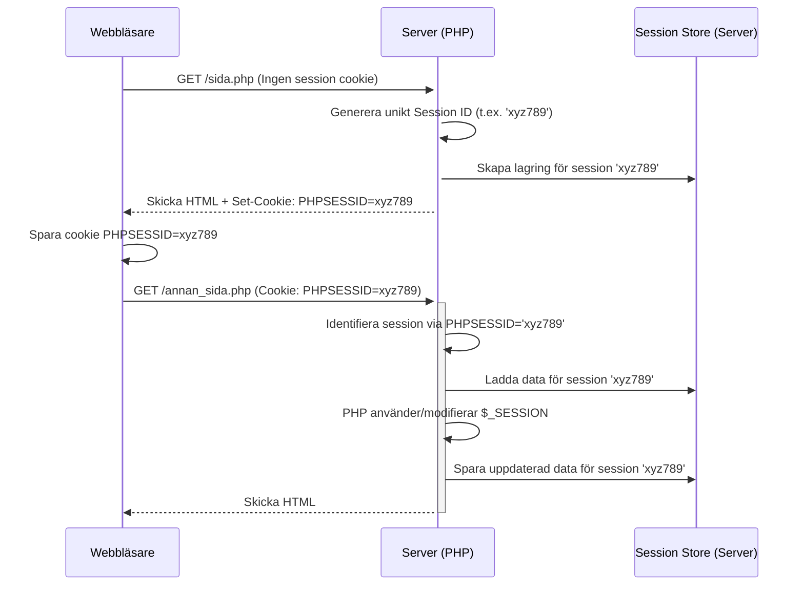

# Sessioner och Cookies: Att Komma Ihåg Användare

En av de grundläggande utmaningarna i webbutveckling är att **HTTP (Hypertext Transfer Protocol)**, protokollet som webbläsare och servrar använder för att kommunicera, är **stateless** (tillståndslöst). Varje HTTP-förfrågan (request) från en webbläsare till en server behandlas som en helt oberoende händelse. Servern har inget inbyggt minne av tidigare förfrågningar från samma användare.

Detta är ett problem när vi vill bygga funktioner som kräver att servern "kommer ihåg" användaren mellan sidladdningar, till exempel:

*   Att hålla en användare inloggad.
*   Att spara innehållet i en kundvagn i en e-handel.
*   Att komma ihåg användarens preferenser (t.ex. språkval).

För att lösa detta behöver vi mekanismer för **state management** (tillståndshantering) över flera HTTP-förfrågningar. De två vanligaste teknikerna för detta i webbutveckling är **cookies** (kakor) och **sessions** (sessioner).

## Vad är Cookies?

En **cookie** är en liten textbaserad datafil som en webbserver kan be webbläsaren att spara på användarens dator. När webbläsaren sedan gör framtida förfrågningar till *samma* webbserver, skickar den automatiskt med de sparade cookies som är relevanta för den servern.

**Hur det fungerar:**

1.  **Server skickar cookie:** Servern inkluderar en `Set-Cookie`-header i sitt HTTP-svar till webbläsaren.
    ```http
    HTTP/1.1 200 OK
    Content-Type: text/html
    Set-Cookie: username=KalleAnka; expires=Fri, 31 Dec 2025 23:59:59 GMT; path=/; HttpOnly
    
    <!-- HTML-innehåll -->
    ```
2.  **Webbläsare sparar cookie:** Webbläsaren tar emot svaret och sparar informationen från `Set-Cookie` (namn, värde, utgångsdatum etc.).
3.  **Webbläsare skickar cookie:** Vid nästa förfrågan till samma domän och sökväg inkluderar webbläsaren en `Cookie`-header med de sparade kakorna.
    ```http
    GET /profile.php HTTP/1.1
    Host: www.example.com
    Cookie: username=KalleAnka
    ```
4.  **Server läser cookie:** Servern (PHP i vårt fall) kan nu läsa värdet från `Cookie`-headern.

### Hantera Cookies i PHP

*   **Sätta en cookie (`setcookie()`):**
    ```php
    <?php
    // setcookie(name, value, expire, path, domain, secure, httponly);
    
    // Sätt en cookie som heter 'user_preference' med värdet 'dark_mode'
    // Giltig i 30 dagar (86400 sekunder/dag * 30)
    $expiry_time = time() + (86400 * 30);
    setcookie('user_preference', 'dark_mode', $expiry_time, '/'); // path='/' gör den giltig på hela sajten
    
    // Sätt en cookie som bara ska skickas över HTTPS och inte vara åtkomlig via JavaScript
    setcookie('session_token', 'abc123xyz', 0, '/', '', true, true);
    // expire = 0 betyder att den raderas när webbläsaren stängs (session cookie)
    ?>
    ```
    **Viktigt:** `setcookie()` måste anropas **innan** någon HTML eller annan output skickas till webbläsaren, eftersom den modifierar HTTP-headers.

*   **Läsa en cookie (`$_COOKIE`):**
    Cookies som skickats av webbläsaren finns tillgängliga i den superglobala arrayen `$_COOKIE`.
    ```php
    <?php
    // Kolla om en cookie finns och hämta dess värde
    if (isset($_COOKIE['user_preference'])) {
        $preference = $_COOKIE['user_preference'];
        echo "Din sparade preferens är: " . htmlspecialchars($preference);
    } else {
        echo "Ingen preferens sparad.";
    }
    ?>
    ```

*   **Ta bort en cookie:** Sätt en ny cookie med samma namn, men med ett utgångsdatum i det förflutna.
    ```php
    <?php
    // Ta bort 'user_preference'-cookien
    setcookie('user_preference', '', time() - 3600, '/'); 
    ?>
    ```

### För- och Nackdelar med Cookies

*   **Fördelar:** Enkla att använda för att spara små mängder icke-känslig data på klientsidan, kan ha lång livslängd.
*   **Nackdelar:**
    *   **Säkerhet:** Data lagras på användarens dator och kan läsas och potentiellt manipuleras.
    *   **Integritet:** Används ofta för spårning mellan webbplatser (tredjepartscookies), vilket lett till striktare regler (GDPR) och webbläsarinställningar.
    *   **Storleksbegränsning:** Webbläsare har gränser för antal cookies per domän och total storlek (ofta runt 4KB per cookie).
    *   **Skickas med varje request:** Kan öka mängden data som skickas i onödan.

## Vad är Sessioner?

Sessioner är ett sätt att lagra användarspecifik information **på servern** under tiden användaren interagerar med webbplatsen. Istället för att lagra all data i webbläsaren (som med cookies), lagrar man bara en unik identifierare (ett **Session ID**) i webbläsaren, oftast via en cookie.

**Hur det fungerar (typiskt flöde):**

1.  **Användare besöker sidan:** Första gången en användare startar en session (eller om ingen giltig session-ID finns) gör PHP följande:
    *   Genererar ett **unikt Session ID** (en lång, slumpmässig sträng).
    *   Skapar en fil (eller databaspost) på servern associerad med detta ID för att lagra sessionsdata.
    *   Skickar Session ID:t till webbläsaren via en `Set-Cookie`-header (oftast med namnet `PHPSESSID`).
2.  **Webbläsare skickar Session ID:** Vid efterföljande förfrågningar skickar webbläsaren tillbaka Session ID-cookien.
3.  **Server identifierar session:** PHP tar emot Session ID:t från cookien, letar upp den associerade sessionfilen på servern och laddar dess innehåll in i den superglobala `$_SESSION`-arrayen.
4.  **PHP använder sessionsdata:** Skriptet kan nu läsa och skriva data till `$_SESSION`-arrayen.
5.  **Data sparas:** När PHP-skriptet avslutas sparas innehållet i `$_SESSION`-arrayen automatiskt tillbaka till sessionfilen på servern.



### Hantera Sessioner i PHP

*   **Starta/Återuppta en session (`session_start()`):**
    Denna funktion *måste* anropas i början av **varje** skript som behöver tillgång till sessionsdata, **innan** någon output skickas.
    ```php
    <?php
    // Måste vara FÖRST i filen (eller innan någon output)
    session_start();
    
    // Nu kan vi använda $_SESSION
    // ...
    ?>
    <!DOCTYPE html>
    <html>
    ...
    ```
    Det är vanligt att inkludera `session_start()` i en gemensam konfigurationsfil (som görs i CRUD-app-exemplet) som inkluderas på alla sidor.

*   **Lagra data (`$_SESSION`):**
    `$_SESSION` är en superglobal associativ array där du kan lagra och hämta sessionsdata.
    ```php
    <?php
    session_start();
    
    // Lagra användarens ID och namn
    $_SESSION['user_id'] = 123;
    $_SESSION['username'] = 'KalleAnka';
    
    // Lagra en enkel räknare
    if (!isset($_SESSION['page_views'])) {
        $_SESSION['page_views'] = 1;
    } else {
        $_SESSION['page_views']++;
    }
    
    echo "Du har besökt " . $_SESSION['page_views'] . " sidor under denna session.";
    ?>
    ```

*   **Läsa data (`$_SESSION`):**
    Du läser data precis som från vilken annan array som helst.
    ```php
    <?php
    session_start();
    
    if (isset($_SESSION['username'])) {
        echo "Välkommen tillbaka, " . htmlspecialchars($_SESSION['username']) . "!";
    } else {
        echo "Välkommen, gäst!";
    }
    ?>
    ```

*   **Ta bort sessionsdata:**
    *   Ta bort en specifik variabel: `unset($_SESSION['variable_name']);`
    *   Ta bort all sessionsdata: `$_SESSION = [];`

*   **Förstöra sessionen helt (`session_destroy()`):**
    För att helt avsluta en session (t.ex. vid utloggning) behöver du göra flera saker:
    ```php
    <?php
    session_start(); // Sessionen måste vara startad för att kunna förstöras
    
    // 1. Ta bort alla sessionsvariabler
    $_SESSION = [];
    
    // 2. Ta bort sessionscookien från webbläsaren
    if (ini_get("session.use_cookies")) {
        $params = session_get_cookie_params();
        setcookie(session_name(), '', time() - 42000,
            $params["path"], $params["domain"],
            $params["secure"], $params["httponly"]
        );
    }
    
    // 3. Förstör sessionen på servern (tar bort sessionfilen)
    session_destroy();
    
    echo "Du har loggats ut och sessionen är förstörd.";
    // Ofta följt av en omdirigering
    // header('Location: login.php');
    // exit;
    ?>
    ```

### Sessioner vs. Cookies: När Använda Vad?

| Egenskap         | Cookies                                  | Sessioner                                      |
|------------------|------------------------------------------|------------------------------------------------|
| **Lagringsplats**| Användarens webbläsare (Klienten)        | Webbservern                                  |
| **Data**         | Liten mängd textdata (ca 4KB)            | Kan lagra komplex data (arrayer, objekt etc.) |
| **Säkerhet**     | Lägre (kan läsas/ändras av klienten)    | Högre (data på servern, bara ID hos klienten) |
| **Livslängd**    | Kan sättas till lång tid (dagar/år)      | Varar tills webbläsaren stängs (default) eller tills den "expirerar" på servern / förstörs manuellt. |
| **Användning**   | Preferenser, "Kom ihåg mig", spårning    | Användarlogin, kundvagnar, temporär data      |
| **Beroende**     | Inget serverberoende (efter satt)      | Kräver serverresurser för lagring          |
| **Identifiering**| Kan användas för att identifiera session | Kräver en identifierare (oftast en cookie)  |

**Tumregel:**
*   Använd **cookies** för att lagra icke-känslig information som du vill ska finnas kvar länge, eller för att identifiera en session.
*   Använd **sessioner** för att lagra känslig eller temporär information som är knuten till en specifik användares besök, särskilt för inloggningsstatus.

## Sessionshantering för Användarautentisering

Sessioner är den vanligaste metoden för att hantera användarinloggning på webbplatser byggda med PHP.

**Inloggningsprocess (Konceptuellt):**

1.  Användaren skickar användarnamn och lösenord (via ett POST-formulär).
2.  Servern (PHP) validerar input.
3.  Servern hämtar användarens data (inklusive den hashade lösenordet) från databasen baserat på användarnamnet.
4.  Servern använder `password_verify()` för att jämföra det inskickade lösenordet med det hashade lösenordet från databasen.
5.  **Om giltigt:**
    a.  Anropa `session_start()`.
    b.  **Viktigt:** Anropa `session_regenerate_id(true);` för att skapa ett nytt session-ID och ogiltigförklara det gamla. Detta skyddar mot **Session Fixation**-attacker, där en angripare försöker lura användaren att använda ett session-ID som angriparen känner till.
    c.  Lagra nödvändig information i `$_SESSION`, **framför allt användarens ID**: `$_SESSION['user_id'] = $user['id'];`.
    d.  Omdirigera användaren till en skyddad sida (t.ex. adminpanelen).
6.  **Om ogiltigt:** Visa ett felmeddelande.

**Kontrollera inloggningsstatus på skyddade sidor:**

```php
<?php
session_start();

if (!isset($_SESSION['user_id'])) {
    // Inte inloggad, skicka till login
    header('Location: login.php');
    exit;
}

// Användaren är inloggad, fortsätt ladda sidan...
$user_id = $_SESSION['user_id'];
// ... hämta mer data baserat på $user_id om det behövs ...
?>
```

**Utloggningsprocess:**
Som visat tidigare: starta sessionen, töm `$_SESSION`, ta bort cookien, förstör sessionen på servern, och omdirigera.

## Säkerhetsaspekter för Sessioner

Eftersom sessioner ofta används för att hantera känslig information som inloggningsstatus, är det viktigt att konfigurera dem säkert.

*   **Session Fixation:** Förhindras främst genom att anropa `session_regenerate_id(true)` direkt efter en lyckad inloggning eller när användarens behörighetsnivå ändras.
*   **Session Hijacking (Kapning):** När en angripare lyckas stjäla en giltig användares session-ID. Detta kan ske genom:
    *   **Nätverksavlyssning:** Om kommunikationen inte är krypterad (HTTP istället för HTTPS), kan ID:t snappas upp.
    *   **Cross-Site Scripting (XSS):** Om en angripare kan köra JavaScript i offrets webbläsare kan de försöka läsa session-cookien (om den inte är skyddad).
    *   Gissning (mycket osannolikt med moderna, långa, slumpmässiga ID:n).
*   **Åtgärder mot Kapning:**
    *   **Använd HTTPS:** Krypterar all kommunikation, inklusive session-cookien.
    *   **`HttpOnly` Cookie Flag:** Sätt `session.cookie_httponly = 1` (i `php.ini` eller via `ini_set`). Detta förhindrar JavaScript från att komma åt cookien, vilket minskar risken vid XSS.
    *   **`Secure` Cookie Flag:** Sätt `session.cookie_secure = 1`. Detta säkerställer att session-cookien *endast* skickas över HTTPS-anslutningar. **Absolut nödvändigt för produktionsmiljöer.**
    *   **`SameSite` Cookie Attribute:** Sätt `session.cookie_samesite = "Lax"` (bra standard) eller `"Strict"`. Detta hjälper till att skydda mot **Cross-Site Request Forgery (CSRF)**-attacker genom att kontrollera när cookien skickas med förfrågningar från andra webbplatser.

### Konfigurera Sessionssäkerhet

Dessa inställningar görs bäst i din `php.ini`-fil för att gälla globalt. Om du inte har tillgång till den, kan de ibland sättas i början av dina skript med `ini_set()` (**innan** `session_start()` anropas), men det är mindre idealiskt.

**Rekommenderade inställningar i `php.ini` (eller motsvarande):**

```ini
; Använd bara cookies för att sprida session ID (säkrare)
session.use_only_cookies = 1

; Skicka bara session cookie över HTTPS
session.cookie_secure = 1

; Gör session cookie otillgänglig för JavaScript
session.cookie_httponly = 1

; Sätt SameSite attributet (Lax är en bra balans)
session.cookie_samesite = "Lax"

; Använd starkare hash-algoritm för session ID (om tillgängligt)
; session.sid_entropy_length = 32 (eller högre)
; session.sid_bits_per_character = 5 (eller 6)
```

## Sammanfattning

Cookies och sessioner är avgörande verktyg för att skapa dynamiska och användarvänliga webbapplikationer genom att överbrygga HTTP:s tillståndslösa natur. Cookies lagrar data på klienten och är bra för icke-känsliga preferenser, medan sessioner lagrar data på servern och är standardmetoden för att hantera inloggningsstatus och annan känslig temporär data. Att förstå hur man använder dem säkert, särskilt genom att skydda session-ID:t och konfigurera cookie-attribut korrekt, är fundamentalt för säker webbutveckling med PHP.
