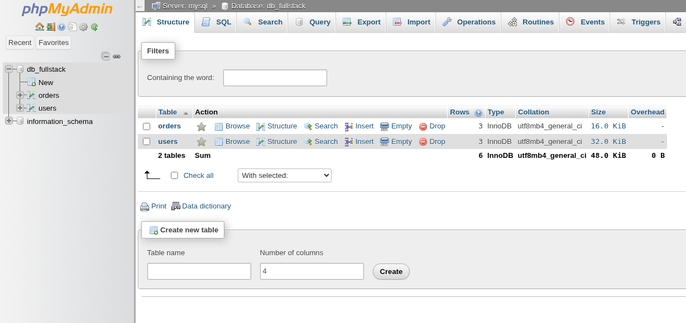
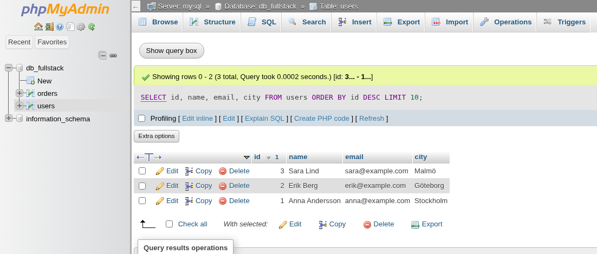
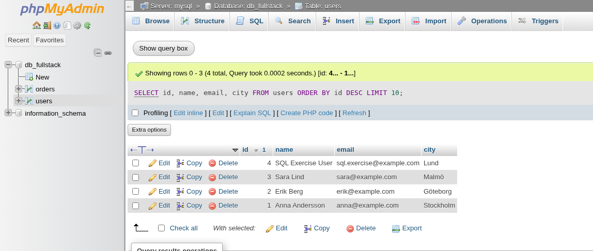
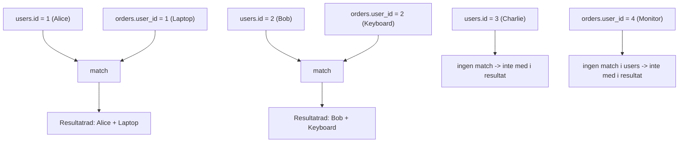
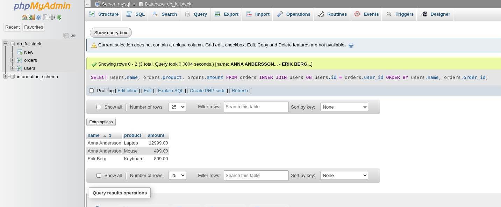

# Introduktion till SQL och Relationsdatabaser

När vi bygger webbapplikationer behöver vi nästan alltid ett sätt att lagra, organisera och hämta data på ett beständigt sätt. Det kan vara användarinformation, produktlistor, blogginlägg eller vad som helst som applikationen behöver komma ihåg mellan besök och över tid. Här kommer databaser in i bilden.

En **database** (databas) är en organiserad samling av data. Det finns olika typer av databaser, men för många traditionella webbapplikationer är **Relational Database Management Systems** (Relationsdatabashanteringssystem, RDBMS) det vanligaste valet. Exempel på populära RDBMS inkluderar MySQL, MariaDB, PostgreSQL, SQLite och Microsoft SQL Server. I det här kapitlet fokuserar vi på MariaDB (som är mycket likt MySQL), eftersom det fungerar bra ihop med PHP.

## Det här ska du kunna efter avsnittet

Efter avsnittet ska du kunna:

*   Förklara hur tabeller, rader, kolumner och relationer används i en relationsdatabas.
*   Skriva SQL-frågor med `SELECT`, `INSERT`, `UPDATE`, `DELETE`, `JOIN`, `ORDER BY` och `LIMIT`.
*   Köra och verifiera SQL-frågor i phpMyAdmin.
*   Köra samma frågor säkert från PHP med PDO och prepared statements.
*   Felsöka vanliga databasproblem i en lokal Docker-miljö.

Kärnan i en relationsdatabas är konceptet med **tables** (tabeller). En tabell organiserar data i:
*   **Rows** (Rader): Varje rad representerar en enskild post eller ett objekt (t.ex. en specifik användare, en produkt).
*   **Columns** (Kolumner): Varje kolumn representerar ett specifikt attribut eller egenskap för posterna (t.ex. användarens namn, produktens pris).
*   **Relations** (Relationer): Data i olika tabeller kan kopplas samman baserat på gemensamma värden, vilket gör att vi kan kombinera information (t.ex. koppla en order till den användare som lade den).

För att kommunicera med ett RDBMS – för att definiera tabellstrukturer, lägga till, ändra, ta bort och hämta data – använder vi ett standardiserat språk som heter **SQL** (Structured Query Language, uttalas ofta "Sequel" eller S-Q-L).

## Arbetsflöde: SQL i phpMyAdmin -> PHP med PDO

I den här lektionen jobbar vi i två steg varje gång du lär dig en ny SQL-del:

1.  **Kör frågan i phpMyAdmin** för att se att SQL-syntaxen fungerar.
2.  **Kör motsvarande logik i PHP (PDO)** för att koppla frågan till din applikation.

Detta ger dig både databasförståelse och praktisk backend-träning.



## Setup: tabellerna som används i screenshots

Om du vill återskapa samma data som i bilderna, kör detta i phpMyAdmin (SQL-fliken) i databasen `db_fullstack`:

```sql
-- Rensa först om tabeller redan finns (viktigt: orders före users pga relation)
DROP TABLE IF EXISTS orders;
DROP TABLE IF EXISTS users;

CREATE TABLE users (
    id INT AUTO_INCREMENT PRIMARY KEY,
    name VARCHAR(100) NOT NULL,
    email VARCHAR(150) NOT NULL UNIQUE,
    city VARCHAR(50),
    created_at TIMESTAMP DEFAULT CURRENT_TIMESTAMP
);

CREATE TABLE orders (
    order_id INT AUTO_INCREMENT PRIMARY KEY,
    user_id INT NOT NULL,
    product VARCHAR(100) NOT NULL,
    amount DECIMAL(10,2) NOT NULL,
    created_at TIMESTAMP DEFAULT CURRENT_TIMESTAMP
);

INSERT INTO users (name, email, city)
VALUES
    ('Alice', 'alice@example.com', 'Stockholm'),
    ('Bob', 'bob@example.com', 'Göteborg'),
    ('Charlie', 'charlie@example.com', 'Malmö');

INSERT INTO orders (user_id, product, amount)
VALUES
    (1, 'Laptop', 12999.00),
    (2, 'Keyboard', 899.00),
    (1, 'Mouse', 499.00),
    (4, 'Monitor', 2999.00);
```

`orders.user_id = 4` finns med medvetet för att kunna visa skillnaden mellan matchande och icke-matchande rader i `INNER JOIN`.

## Grundläggande SQL-Syntax

SQL består av olika **statements** (satser eller kommandon) som talar om för databasen vad den ska göra. Varje sats avslutas vanligtvis med ett semikolon (`;`), även om det ibland är valfritt beroende på verktyget man använder.

Viktiga nyckelord skrivs ofta med versaler av konvention (för läsbarhet), men SQL är generellt inte skiftlägeskänsligt för nyckelord. Tabell- och kolumnnamn kan dock vara skiftlägeskänsliga beroende på databasens konfiguration och operativsystemet.

Vanliga SQL-nyckelord inkluderar:

*   `SELECT`: Hämta data.
*   `INSERT INTO`: Lägga till nya rader.
*   `UPDATE`: Ändra befintliga rader.
*   `DELETE`: Ta bort rader.
*   `CREATE TABLE`: Skapa en ny tabell.
*   `ALTER TABLE`: Ändra en befintlig tabell.
*   `DROP TABLE`: Ta bort en tabell.
*   `FROM`: Anger vilken tabell data ska hämtas från.
*   `WHERE`: Filtrerar vilka rader som ska påverkas.
*   `VALUES`: Anger de värden som ska infogas.
*   `SET`: Anger vilka kolumner och värden som ska uppdateras.

Kommentarer i SQL skrivs antingen med två bindestreck (`--`) för en radskommentar, eller mellan `/*` och `*/` för flerradskommentarer.

```sql
-- Detta är en enradskommentar
SELECT name, email -- Hämta namn och e-post
FROM users
WHERE city = 'Stockholm'; /* Detta är en
   flerradskommentar */
```

## Datatyper i SQL

När vi skapar en tabell måste vi specificera vilken typ av data varje kolumn ska innehålla. Detta kallas **data type** (datatyp). Att välja rätt datatyp är viktigt för:

*   **Data Integrity** (Dataintegritet): Säkerställer att endast giltig data lagras (t.ex. inga bokstäver i en sifferkolumn).
*   **Storage Efficiency** (Lagringseffektivitet): Olika datatyper tar olika mycket plats.
*   **Performance** (Prestanda): Korrekta datatyper kan snabba upp sökningar och jämförelser.

Här är några vanliga datatyper i SQL (specifika namn kan variera något mellan olika RDBMS, men koncepten är desamma):

*   **Heltal:**
    *   `INT` eller `INTEGER`: Standard heltal (ofta 4 bytes).
    *   `TINYINT`: Mycket litet heltal (ofta 1 byte, -128 till 127 eller 0 till 255).
    *   `BIGINT`: Stort heltal (ofta 8 bytes).
*   **Decimaltal:**
    *   `DECIMAL(precision, scale)`: För exakta tal med fast antal decimaler (t.ex. `DECIMAL(10, 2)` för valuta). `precision` är totalt antal siffror, `scale` är antal decimaler.
    *   `FLOAT`, `DOUBLE`: Flyttal för approximativa värden (undviks ofta för valuta).
*   **Strängar (Text):**
    *   `VARCHAR(n)`: Textsträng med variabel längd upp till `n` tecken.
    *   `TEXT`: För längre textstycken utan specifik maxlängd (men det finns gränser).
    *   `CHAR(n)`: Textsträng med fast längd på `n` tecken (fylls ut med mellanslag om kortare).
*   **Datum och Tid:**
    *   `DATE`: Endast datum (YYYY-MM-DD).
    *   `TIME`: Endast tid (HH:MM:SS).
    *   `DATETIME`: Både datum och tid (YYYY-MM-DD HH:MM:SS).
    *   `TIMESTAMP`: Liknar `DATETIME` men används ofta för att automatiskt spåra när en rad skapades eller senast ändrades.
*   **Boolean (Logiskt värde):** SQL har ingen standard `BOOLEAN`-typ. Istället används ofta `TINYINT(1)` där `0` representerar `false` och `1` representerar `true`.

En kolumn kan också tillåta **`NULL`**-värden, vilket betyder att värdet är okänt eller saknas. Motsatsen är att definiera kolumnen med `NOT NULL`, vilket kräver att ett värde alltid anges.

## Skapa och Hantera Tabeller (DDL - Data Definition Language)

SQL-satser som används för att definiera eller ändra strukturen på databasobjekt (som tabeller) kallas **DDL (Data Definition Language)**.

### `CREATE TABLE`

Används för att skapa en ny tabell.

```sql
CREATE TABLE users (
    id INT AUTO_INCREMENT PRIMARY KEY, -- Unik identifierare för varje användare
    name VARCHAR(100) NOT NULL,       -- Användarens namn (max 100 tecken, får ej vara tomt)
    email VARCHAR(150) NOT NULL UNIQUE, -- E-post (max 150 tecken, får ej vara tomt, måste vara unikt)
    city VARCHAR(50),                   -- Stad (max 50 tecken, får vara tomt - NULL tillåtet)
    created_at TIMESTAMP DEFAULT CURRENT_TIMESTAMP -- Tidsstämpel när raden skapades
);
```

**Förklaringar:**

*   `CREATE TABLE users (...)`: Startar definitionen av en tabell med namnet `users`.
*   `id INT AUTO_INCREMENT PRIMARY KEY`: Definierar en kolumn `id` av typen `INT`. `AUTO_INCREMENT` gör att databasen automatiskt tilldelar ett nytt, unikt nummer för varje ny rad. `PRIMARY KEY` (Primärnyckel) markerar denna kolumn som den unika identifieraren för varje rad i tabellen. Ingen rad får ha samma `id`, och `id` får inte vara `NULL`.
*   `name VARCHAR(100) NOT NULL`: En textkolumn för namn, max 100 tecken. `NOT NULL` betyder att denna kolumn måste ha ett värde.
*   `email VARCHAR(150) NOT NULL UNIQUE`: En textkolumn för e-post. `UNIQUE` säkerställer att ingen annan rad i tabellen kan ha samma e-postadress.
*   `city VARCHAR(50)`: En textkolumn för stad. Eftersom `NOT NULL` saknas, tillåts `NULL`-värden här.
*   `created_at TIMESTAMP DEFAULT CURRENT_TIMESTAMP`: En tidsstämpelkolumn. `DEFAULT CURRENT_TIMESTAMP` betyder att om inget värde anges vid `INSERT`, sätts kolumnen automatiskt till den aktuella tidpunkten.

### `ALTER TABLE`

Används för att modifiera en befintlig tabell.

```sql
-- Lägg till en ny kolumn 'phone_number'
ALTER TABLE users
ADD COLUMN phone_number VARCHAR(20);

-- Ändra datatypen för 'city'-kolumnen
ALTER TABLE users
MODIFY COLUMN city VARCHAR(60);

-- Ta bort 'phone_number'-kolumnen
ALTER TABLE users
DROP COLUMN phone_number;
```

### `DROP TABLE`

Används för att permanent ta bort en tabell och all dess data. **Använd med extrem försiktighet!**

```sql
DROP TABLE users;
```

*Not:* I moderna projekt används ofta **migrationsverktyg** (som Phinx, Doctrine Migrations, eller inbyggda i ramverk som Laravel) för att hantera databasstrukturförändringar på ett kontrollerat och versionshanterat sätt, istället för att köra `ALTER TABLE` manuellt.

## Hämta Data (`SELECT`)

Den absolut vanligaste SQL-satsen är `SELECT`, som används för att hämta data från en eller flera tabeller. Detta är en del av **DML (Data Manipulation Language)**.

### Grundläggande `SELECT`

```sql
-- Hämta specifika kolumner från tabellen 'users'
SELECT name, email
FROM users;

-- Hämta alla kolumner (* är en wildcard för alla)
SELECT *
FROM users;
```

### Miniövning: `SELECT` i phpMyAdmin och PHP

1. Kör en fråga i phpMyAdmin som hämtar `id`, `name`, `email` från `users` och sorterar på `id` fallande.
2. Skriv sedan PHP-kod med PDO som kör samma fråga och loopar ut resultatet som en HTML-lista.
3. Testa att lägga till `LIMIT 5` och verifiera att bara fem rader visas.

```php
<?php
// Hint: använd query() när du inte har användarinput.
$stmt = $pdo->query("SELECT id, name, email FROM users ORDER BY id DESC LIMIT 5");
$rows = $stmt->fetchAll();
?>
```

### Filtrera Rader (`WHERE`)

`WHERE`-klausulen används för att specificera villkor som raderna måste uppfylla för att inkluderas i resultatet.

```sql
-- Hämta användare från Stockholm
SELECT name, email
FROM users
WHERE city = 'Stockholm';

-- Hämta användare som INTE är från Stockholm
SELECT name, email
FROM users
WHERE city != 'Stockholm'; -- Eller city <> 'Stockholm'

-- Hämta användare vars id är större än 10
SELECT id, name
FROM users
WHERE id > 10;

-- Hämta användare från Stockholm ELLER Göteborg
SELECT name, city
FROM users
WHERE city = 'Stockholm' OR city = 'Göteborg';

-- Alternativt med IN
SELECT name, city
FROM users
WHERE city IN ('Stockholm', 'Göteborg');

-- Hämta användare vars namn börjar på 'A'
-- % är en wildcard som matchar noll eller flera tecken
SELECT name
FROM users
WHERE name LIKE 'A%';

-- Hämta användare vars namn slutar på 'son'
SELECT name
FROM users
WHERE name LIKE '%son';

-- Hämta användare vars namn innehåller 'an'
SELECT name
FROM users
WHERE name LIKE '%an%';

-- Hämta användare där staden inte är angiven (är NULL)
SELECT name
FROM users
WHERE city IS NULL;

-- Hämta användare där staden ÄR angiven (inte NULL)
SELECT name, city
FROM users
WHERE city IS NOT NULL;

-- Hämta användare från Stockholm som heter Anna
SELECT name, email, city
FROM users
WHERE city = 'Stockholm' AND name = 'Anna';
```

### Miniövning: Filter med parameter

Skapa en PHP-fråga som filtrerar användare på stad från en variabel `$city` med prepared statement. Skriv ut namn + e-post för alla matchningar.

```php
<?php
$city = 'Stockholm';
$stmt = $pdo->prepare("SELECT name, email FROM users WHERE city = :city ORDER BY name");
$stmt->execute([':city' => $city]);
$users = $stmt->fetchAll();
?>
```

### Sortera Resultat (`ORDER BY`)

`ORDER BY` används för att sortera resultatet baserat på en eller flera kolumner.

```sql
-- Hämta alla användare sorterade efter namn i bokstavsordning (stigande, ASC är default)
SELECT name, email
FROM users
ORDER BY name ASC; -- ASC kan utelämnas

-- Hämta alla användare sorterade efter id i fallande ordning (högst id först)
SELECT id, name
FROM users
ORDER BY id DESC;

-- Sortera först på stad, sedan på namn inom varje stad
SELECT name, city
FROM users
ORDER BY city, name;
```

### Begränsa Antal Rader (`LIMIT`)

`LIMIT` används för att begränsa antalet rader som returneras. Används ofta för paginering (att visa data sida för sida).

```sql
-- Hämta de 5 första användarna (baserat på default ordning eller ORDER BY)
SELECT id, name
FROM users
ORDER BY id
LIMIT 5;

-- Hämta 10 användare, men hoppa över de första 20 (används för paginering, sida 3 om 10 per sida)
-- LIMIT offset, count
SELECT id, name
FROM users
ORDER BY id
LIMIT 20, 10;
```

## Lägga till Data (`INSERT INTO`)

`INSERT INTO` används för att lägga till nya rader i en tabell.

```sql
-- Lägg till en ny användare, specificera kolumner
INSERT INTO users (name, email, city)
VALUES ('Kalle Anka', 'kalle@example.com', 'Ankeborg');

-- Lägg till en ny användare utan stad (om 'city' tillåter NULL)
INSERT INTO users (name, email)
VALUES ('Musse Pigg', 'musse@example.com');

-- Lägg till flera användare samtidigt (syntax kan variera lite)
INSERT INTO users (name, email, city)
VALUES
    ('Långben', 'langben@example.com', 'Ankeborg'),
    ('Joakim von Anka', 'joakim@example.com', NULL);
```

*Not:* Om du har en `AUTO_INCREMENT`-kolumn (som `id` i vårt exempel) behöver du inte (och ska oftast inte) ange den i `INSERT`-satsen. Databasen sköter det automatiskt.



### Miniövning: `INSERT` + verifiering i PHP

1. Lägg till en användare i phpMyAdmin med `INSERT`.
2. Gör sedan samma sak via PDO i PHP.
3. Skriv ut det nya ID:t med `lastInsertId()` och kontrollera i phpMyAdmin att raden finns.

```php
<?php
$stmt = $pdo->prepare("INSERT INTO users (name, email, city) VALUES (:name, :email, :city)");
$stmt->execute([
    ':name' => 'Test User',
    ':email' => 'test.user@example.com',
    ':city' => 'Malmö',
]);
echo "Skapad rad med ID: " . $pdo->lastInsertId();
?>
```

## Uppdatera Data (`UPDATE`)

`UPDATE` används för att ändra data i befintliga rader.

```sql
-- Uppdatera staden för användaren med id 5
UPDATE users
SET city = 'Göteborg'
WHERE id = 5;

-- Uppdatera både namn och e-post för användaren med id 10
UPDATE users
SET name = 'Kajsa Anka', email = 'kajsa.anka@example.com'
WHERE id = 10;

-- Uppdatera ALLA användare (MYCKET FARLIGT UTAN WHERE!)
-- UPDATE users SET city = 'Okänd stad'; -- Gör INTE detta utan att vara säker!
```

**VARNING:** `WHERE`-klausulen i `UPDATE` är extremt viktig. Utan den kommer **alla** rader i tabellen att uppdateras!

## Ta bort Data (`DELETE`)

`DELETE` används för att ta bort rader från en tabell.

```sql
-- Ta bort användaren med id 15
DELETE FROM users
WHERE id = 15;

-- Ta bort alla användare från Ankeborg
DELETE FROM users
WHERE city = 'Ankeborg';

-- Ta bort ALLA användare (MYCKET FARLIGT UTAN WHERE!)
-- DELETE FROM users; -- Gör INTE detta utan att vara säker!
```

**VARNING:** Precis som med `UPDATE`, är `WHERE`-klausulen i `DELETE` kritisk. Utan den raderas **alla** rader i tabellen!



### Miniövning: `UPDATE`/`DELETE` med validerat ID

Bygg två små PHP-block:

1. Ett som uppdaterar `city` för en användare baserat på ett validerat heltals-ID.
2. Ett som raderar en användare baserat på ett validerat heltals-ID.

Kontrollera antalet påverkade rader med `rowCount()` efter varje operation.

```php
<?php
$userId = 3; // Byt mot validerad input i riktig kod.
$stmt = $pdo->prepare("UPDATE users SET city = :city WHERE id = :id");
$stmt->execute([':city' => 'Lund', ':id' => $userId]);
echo "Antal uppdaterade rader: " . $stmt->rowCount();
?>
```

## Sammanfogning av Tabeller (`JOIN`)

Ofta är den data vi behöver spridd över flera relaterade tabeller. Till exempel kanske vi har en `users`-tabell och en `orders`-tabell, där `orders`-tabellen innehåller en referens till användaren som lade ordern.

För att kombinera data från flera tabeller i en enda fråga använder vi `JOIN`.

Låt oss anta att vi har tabellerna:

**`users`**
| id | name    |
|----|---------|
| 1  | Alice   |
| 2  | Bob     |
| 3  | Charlie |

**`orders`**
| order_id | user_id | product  |
|----------|---------|----------|
| 101      | 1       | Laptop   |
| 102      | 2       | Keyboard |
| 103      | 1       | Mouse    |
| 104      | 4       | Monitor  |

Observera att `orders.user_id` refererar till `users.id`. Användare med id `3` har inga ordrar, och order `104` tillhör en användare (`4`) som inte finns i `users`-tabellen (i detta exempel).

### `INNER JOIN`

Den vanligaste typen är `INNER JOIN`. Den returnerar endast rader där det finns en matchning i **båda** tabellerna baserat på `JOIN`-villkoret.

```sql
SELECT
    users.name,      -- Hämta användarens namn
    orders.product   -- Hämta produktnamnet från ordern
FROM
    users            -- Börja med users-tabellen
INNER JOIN
    orders           -- Koppla ihop med orders-tabellen
ON
    users.id = orders.user_id; -- Villkoret för kopplingen
```

**Resultat:**

| name  | product  |
|-------|----------|
| Alice | Laptop   |
| Bob   | Keyboard |
| Alice | Mouse    |

*   Alice (id 1) finns i båda tabellerna via `user_id` 1 i `orders` (två gånger).
*   Bob (id 2) finns i båda tabellerna via `user_id` 2 i `orders`.
*   Charlie (id 3) finns bara i `users`, så han inkluderas inte.
*   Order 104 (user_id 4) har ingen matchande användare i `users`, så den inkluderas inte.

**Visualisering av `INNER JOIN`:**



Kort sagt: `INNER JOIN` tar bara med rader där `users.id = orders.user_id` faktiskt matchar.



### Miniövning: `JOIN` till HTML-tabell i PHP

Skriv en PHP-fråga som hämtar användarnamn och produkt med `INNER JOIN` och skriv ut resultatet i en enkel HTML-tabell.

```php
<?php
$sql = "SELECT users.name, orders.product
        FROM users
        INNER JOIN orders ON users.id = orders.user_id
        ORDER BY users.name";
$stmt = $pdo->query($sql);
$rows = $stmt->fetchAll();
?>
```

### Andra `JOIN`-typer (Kort)

*   `LEFT JOIN`: Returnerar alla rader från den *vänstra* tabellen (`users` i exemplet ovan) och matchande rader från den högra (`orders`). Om ingen matchning finns i den högra tabellen, fylls dess kolumner ut med `NULL`. (Charlie skulle komma med, men med `NULL` i produktkolumnen).
*   `RIGHT JOIN`: Motsatsen till `LEFT JOIN`. Returnerar alla rader från den *högra* tabellen och matchande från vänstra. (Order 104 skulle komma med, men med `NULL` i namnkolumnen).
*   `FULL OUTER JOIN`: Returnerar alla rader från båda tabellerna. Om matchning saknas fylls kolumnerna från den andra tabellen ut med `NULL`. (Stöds inte direkt av MySQL/MariaDB, men kan simuleras).

## SQL och PHP med PDO

Nu när du har en grundläggande förståelse för SQL-satser är nästa steg att se hur vi kan exekvera dessa från vår PHP-kod. PHP erbjuder olika sätt att ansluta till och interagera med databaser som MariaDB/MySQL:

1.  **PDO (PHP Data Objects):** Ett databasabstraktionslager som ger ett konsekvent gränssnitt för att arbeta med olika databastyper.
2.  **MySQLi (MySQL Improved Extension):** En specifik extension för att arbeta med MySQL och MariaDB.

_Vi kommer att jobba främst med PDO._

### Ansluta till databasen

Först skapar vi en anslutning med PDO. Du behöver värd, databasnamn, användarnamn och lösenord (samma uppgifter som i `php-intro.md` Docker-exemplet):

```php
<?php
$host = 'mysql';      // eller 'localhost' utan Docker
$dbname = 'db_fullstack';
$username = 'db_user';
$password = 'db_password';
$charset = 'utf8mb4';

$dsn = "mysql:host=$host;dbname=$dbname;charset=$charset";
$options = [
    PDO::ATTR_ERRMODE            => PDO::ERRMODE_EXCEPTION,
    PDO::ATTR_DEFAULT_FETCH_MODE => PDO::FETCH_ASSOC,
];

try {
    $pdo = new PDO($dsn, $username, $password, $options);
} catch (PDOException $e) {
    throw new PDOException("Kunde inte ansluta till databasen.", (int)$e->getCode());
}
?>
```

### SELECT med Prepared Statement

När du hämtar data baserat på användarinput (t.ex. från en URL eller ett formulär) **måste** du använda **prepared statements** för att skydda mot SQL injection. Här är ett exempel som hämtar en användare med ett specifikt ID:

```php
<?php
$user_id = 5; // I praktiken kommer detta från t.ex. $_GET['id'] – validera alltid!

$stmt = $pdo->prepare("SELECT id, username, email FROM users WHERE id = :id");
$stmt->bindParam(':id', $user_id, PDO::PARAM_INT);
$stmt->execute();

$user = $stmt->fetch(); // En rad, eller false om ingen hittas

if ($user) {
    echo "Användare: " . htmlspecialchars($user['username']);
} else {
    echo "Användaren hittades inte.";
}
?>
```

*   `prepare()` – Förbereder SQL-frågan med platshållare (`:id`).
*   `bindParam()` – Binder värdet till platshållaren. Databasen behandlar det som data, inte som SQL-kod.
*   `execute()` – Kör frågan.
*   `fetch()` – Hämtar en rad som associativ array (`PDO::FETCH_ASSOC`).

### INSERT med Prepared Statement

För att lägga till data använder du samma mönster:

```php
<?php
$username = 'nyanvändare';
$email = 'ny@example.com';
$password_hash = password_hash('hemligt', PASSWORD_DEFAULT);

$stmt = $pdo->prepare("INSERT INTO users (username, email, password_hash) VALUES (:username, :email, :password_hash)");
$stmt->bindParam(':username', $username);
$stmt->bindParam(':email', $email);
$stmt->bindParam(':password_hash', $password_hash);
$stmt->execute();

$new_id = $pdo->lastInsertId(); // ID för den nyligen infogade raden
echo "Ny användare skapad med ID: " . $new_id;
?>
```

### Miniövning: Från SQL till funktion i PHP

Skapa en funktion `create_user(PDO $pdo, string $username, string $email, string $password): string` som:

1. hashar lösenordet,
2. kör `INSERT` med prepared statement,
3. returnerar `lastInsertId()` som sträng.

På så sätt börjar du återanvända databaslogik i mindre funktioner, vilket blir viktigt i CRUD-projektet.

## Vanliga fel och snabb felsökning

*   **Fel host i DSN:** I Docker-miljö ska host oftast vara `mysql` (service-namnet), inte `localhost`.
*   **Ingen `WHERE` i `UPDATE`/`DELETE`:** Risk att alla rader påverkas. Lägg alltid till villkor och dubbelkolla före körning.
*   **Fel bindning av datatyp:** Validera heltal innan bindning till `:id` och använd rätt parametertyp när det behövs.
*   **SQL-injektion via strängkonkatenering:** Undvik att bygga SQL med `"... $input ..."`; använd prepared statements.
*   **Svårtolkade PDO-fel:** Aktivera `PDO::ATTR_ERRMODE => PDO::ERRMODE_EXCEPTION` under utveckling.

### Nästa steg: CRUD-applikationen

I avsnittet `crud-app.md` bygger vi en komplett bloggapplikation som använder dessa tekniker:

*   Anslutning via en återanvändbar `connect_db()`-funktion.
*   SELECT, INSERT, UPDATE och DELETE med prepared statements.
*   Hantering av resultat med `fetch()` och `fetchAll()`.
*   Integration med formulär, sessioner och filuppladdning.

Du har nu grunderna för att gå från SQL-kommandon till verklig backend-kod i PHP. Nästa steg är att använda exakt dessa mönster i en större helhet där flera sidor samverkar.

Fortsätt med [CRUD-applikationen](crud-app.md) för att bygga hela flödet end-to-end.

