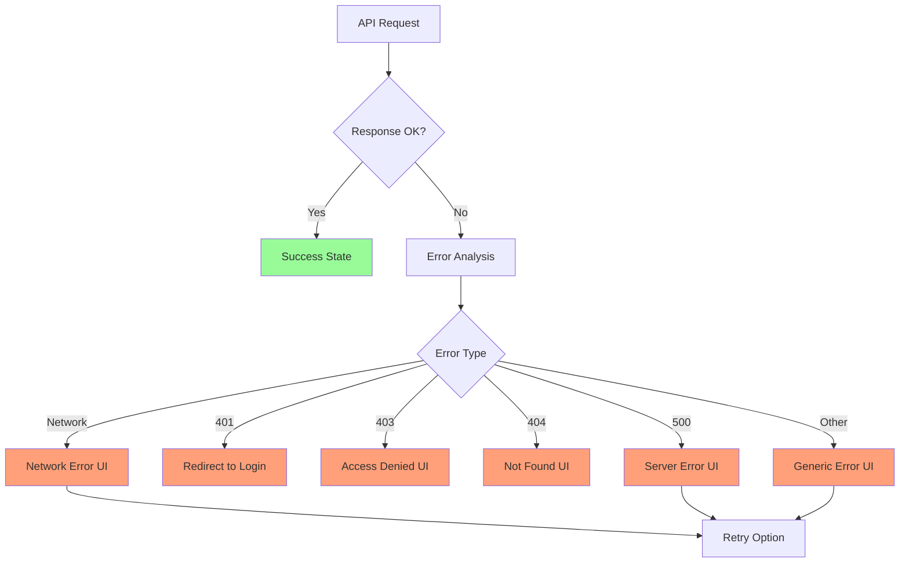

# Konsumera API:er i React: Data från Backend

Modern React-applikationer separerar frontend från backend och kommunicerar via **API:er** (Application Programming Interfaces). Detta kapitel fokuserar på hur vi hämtar, skickar och hanterar data från externa tjänster.

**Mål:** Lära sig använda Fetch API, skapa custom hooks för API-anrop, implementera robust error handling och förstå bästa praxis för datahantering. (Notis: Axios är ett populärt bibliotek om du vill ha extra funktioner.)

## Fetch API: Webbstandardens Sätt

**Fetch API** är den moderna standarden för att göra HTTP-requests i JavaScript. Det är inbyggt i alla moderna webbläsare och behöver inga externa bibliotek.

### Grundläggande Fetch-exempel

```jsx
import { useState, useEffect } from 'react';

function UserList() {
  const [users, setUsers] = useState([]);
  const [loading, setLoading] = useState(true);
  const [error, setError] = useState(null);

  useEffect(() => {
    const fetchUsers = async () => {
      try {
        setLoading(true);
        setError(null);

        const response = await fetch('/api/users');
        
        // Kontrollera om request lyckades
        if (!response.ok) {
          throw new Error(`HTTP error! status: ${response.status}`);
        }

        const userData = await response.json();
        setUsers(userData);
      } catch (err) {
        setError(err.message);
      } finally {
        setLoading(false);
      }
    };

    fetchUsers();
  }, []);

  if (loading) return <div>Laddar användare...</div>;
  if (error) return <div>Fel: {error}</div>;

  return (
    <ul>
      {users.map(user => (
        <li key={user.id}>
          {user.name} - {user.email}
        </li>
      ))}
    </ul>
  );
}
```

### HTTP-metoder med Fetch

```jsx
// GET (standard)
const getUsers = async () => {
  const response = await fetch('/api/users');
  return response.json();
};

// POST - Skapa ny användare
const createUser = async (userData) => {
  const response = await fetch('/api/users', {
    method: 'POST',
    headers: {
      'Content-Type': 'application/json',
    },
    body: JSON.stringify(userData),
  });

  if (!response.ok) {
    throw new Error('Failed to create user');
  }

  return response.json();
};

// PUT - Uppdatera användare
const updateUser = async (userId, userData) => {
  const response = await fetch(`/api/users/${userId}`, {
    method: 'PUT',
    headers: {
      'Content-Type': 'application/json',
    },
    body: JSON.stringify(userData),
  });

  return response.json();
};

// DELETE - Ta bort användare
const deleteUser = async (userId) => {
  const response = await fetch(`/api/users/${userId}`, {
    method: 'DELETE',
  });

  if (!response.ok) {
    throw new Error('Failed to delete user');
  }

  return response.ok;
};
```

### Autentisering med Headers

```jsx
// Token-baserad autentisering
const fetchWithAuth = async (url, options = {}) => {
  const token = localStorage.getItem('authToken');
  
  const config = {
    ...options,
    headers: {
      'Content-Type': 'application/json',
      ...(token && { Authorization: `Bearer ${token}` }),
      ...options.headers,
    },
  };

  const response = await fetch(url, config);

  // Hantera unauthorized
  if (response.status === 401) {
    localStorage.removeItem('authToken');
    // Navigera till login via central hantering (ex. router)
    throw new Error('Unauthorized');
  }

  return response;
};

// Användning
const getProtectedData = async () => {
  const response = await fetchWithAuth('/api/protected-data');
  return response.json();
};
```

## Notis: Axios

Axios är ett populärt bibliotek för HTTP-anrop som erbjuder interceptors och några bekvämligheter. I denna kurs använder vi web standarden Fetch för alla exempel. Om du föredrar Axios kan du enkelt översätta våra fetch-anrop till `axios.get/post/...` och använda interceptors för t.ex. token-hantering.

## Custom Hooks för API-anrop

Custom hooks abstraherar API-logik och gör den återanvändbar mellan komponenter.

### useApi Hook

```jsx
import { useState, useEffect, useCallback } from 'react';

function useApi(apiFunction, dependencies = []) {
  const [data, setData] = useState(null);
  const [loading, setLoading] = useState(true);
  const [error, setError] = useState(null);

  const execute = useCallback(async (...args) => {
    try {
      setLoading(true);
      setError(null);
      const result = await apiFunction(...args);
      setData(result);
      return result;
    } catch (err) {
      setError(err.message);
      throw err;
    } finally {
      setLoading(false);
    }
  }, dependencies);

  useEffect(() => {
    execute();
  }, [execute]);

  const refetch = useCallback(() => execute(), [execute]);

  return { data, loading, error, refetch, execute };
}

// Användning
function UserList() {
  const { data: users, loading, error, refetch } = useApi(getUsers);

  if (loading) return <div>Laddar...</div>;
  if (error) return <div>Fel: {error}</div>;

  return (
    <div>
      <button onClick={refetch}>Uppdatera</button>
      <ul>
        {users?.map(user => (
          <li key={user.id}>{user.name}</li>
        ))}
      </ul>
    </div>
  );
}
```

### Säkerhetsnotis: Tokens och autentisering

- lagring i `localStorage` är sårbar vid XSS. För skyddade sessioner i webben, föredra `httpOnly`-cookies från servern (tillsammans med CSRF-skydd, t.ex. CSRF-token eller SameSite-cookies).
- Undvik hårda redirects i interceptors (t.ex. `window.location.href = '/login'`); signalera istället globalt och låt en central auth-hanterare/router sköta navigeringen.

### useResource Hook för CRUD-operationer (Fetch)

```jsx
function useResource(endpoint) {
  const [data, setData] = useState([]);
  const [loading, setLoading] = useState(false);
  const [error, setError] = useState(null);

  const fetchJson = async (url, options = {}) => {
    const res = await fetch(url, {
      headers: { 'Content-Type': 'application/json', ...(options.headers || {}) },
      ...options,
    });
    const text = await res.text();
    const json = text ? JSON.parse(text) : null;
    if (!res.ok) {
      throw new Error(json?.message || res.statusText || 'Request failed');
    }
    return json;
  };

  // GET - Hämta alla
  const fetchAll = useCallback(async () => {
    try {
      setLoading(true);
      setError(null);
      const result = await fetchJson(endpoint);
      setData(Array.isArray(result) ? result : (result?.data ?? []));
    } catch (err) {
      setError(err.message);
    } finally {
      setLoading(false);
    }
  }, [endpoint]);

  // POST - Skapa ny
  const create = useCallback(async (newItem) => {
    try {
      const result = await fetchJson(endpoint, {
        method: 'POST',
        body: JSON.stringify(newItem)
      });
      setData(prev => [...prev, result]);
      return result;
    } catch (err) {
      setError(err.message);
      throw err;
    }
  }, [endpoint]);

  // PUT - Uppdatera
  const update = useCallback(async (id, updatedItem) => {
    try {
      const result = await fetchJson(`${endpoint}/${id}`, {
        method: 'PUT',
        body: JSON.stringify(updatedItem)
      });
      setData(prev => prev.map(item => item.id === id ? result : item));
      return result;
    } catch (err) {
      setError(err.message);
      throw err;
    }
  }, [endpoint]);

  // DELETE - Ta bort
  const remove = useCallback(async (id) => {
    try {
      await fetchJson(`${endpoint}/${id}`, { method: 'DELETE' });
      setData(prev => prev.filter(item => item.id !== id));
    } catch (err) {
      setError(err.message);
      throw err;
    }
  }, [endpoint]);

  useEffect(() => {
    fetchAll();
  }, [fetchAll]);

  return {
    data,
    loading,
    error,
    create,
    update,
    remove,
    refetch: fetchAll
  };
}

// Användning
function ProductManager() {
  const { data: products, loading, error, create, update, remove } = useResource('/products');

  const handleCreate = async (productData) => {
    try {
      await create(productData);
      alert('Produkt skapad!');
    } catch (error) {
      alert('Fel vid skapande: ' + error.message);
    }
  };

  return (
    <div>
      {loading && <div>Laddar...</div>}
      {error && <div>Fel: {error}</div>}
      
      <ProductForm onSubmit={handleCreate} />
      
      <div className="products">
        {products.map(product => (
          <ProductCard
            key={product.id}
            product={product}
            onUpdate={(data) => update(product.id, data)}
            onDelete={() => remove(product.id)}
          />
        ))}
      </div>
    </div>
  );
}
```

## Avancerad Error Handling



### Error Boundary för API-fel

```jsx
class ApiErrorBoundary extends React.Component {
  constructor(props) {
    super(props);
    this.state = { hasError: false, error: null };
  }

  static getDerivedStateFromError(error) {
    return { hasError: true, error };
  }

  componentDidCatch(error, errorInfo) {
    console.error('API Error:', error, errorInfo);
    // Skicka till error tracking service
  }

  render() {
    if (this.state.hasError) {
      return (
        <div className="api-error">
          <h2>Något gick fel</h2>
          <p>Vi har problem med att hämta data just nu.</p>
          <button onClick={() => this.setState({ hasError: false, error: null })}>
            Försök igen
          </button>
        </div>
      );
    }

    return this.props.children;
  }
}
```

### Global Error Handler (Fetch)

```jsx
// utils/http.js
export class ApiError extends Error {
  constructor(message, status, data) {
    super(message);
    this.name = 'ApiError';
    this.status = status;
    this.data = data;
  }
}

export async function fetchJson(url, options = {}) {
  const res = await fetch(url, {
    headers: { 'Content-Type': 'application/json', ...(options.headers || {}) },
    ...options,
  });

  // Läs säkert ev. JSON-body
  let data = null;
  try {
    const text = await res.text();
    data = text ? JSON.parse(text) : null;
  } catch (_) {
    // Ignorera JSON-parse-fel
  }

  if (!res.ok) {
    const message = data?.message || res.statusText || 'Request failed';
    throw new ApiError(message, res.status, data);
  }

  return data;
}

// Exempel på central felhantering beroende på statuskod
export function handleApiError(error) {
  if (error instanceof ApiError) {
    switch (error.status) {
      case 401:
        localStorage.removeItem('authToken');
        // Navigera till login via din router/händelsebuss
        break;
      case 403:
        // Visa "Access denied"-vy
        break;
      case 404:
        // Visa "Not found"-vy
        break;
      default:
        // Visa generiskt felmeddelande
        break;
    }
  } else {
    // Nätverksfel eller oväntat fel
  }
}
```

### Retry Logic och Exponential Backoff

```jsx
const retryWithBackoff = async (fn, maxRetries = 3, baseDelay = 1000) => {
  for (let attempt = 1; attempt <= maxRetries; attempt++) {
    try {
      return await fn();
    } catch (error) {
      if (attempt === maxRetries) {
        throw error;
      }

      // Exponential backoff: 1s, 2s, 4s...
      const delay = baseDelay * Math.pow(2, attempt - 1);
      console.log(`Attempt ${attempt} failed, retrying in ${delay}ms...`);
      
      await new Promise(resolve => setTimeout(resolve, delay));
    }
  }
};

// Usage
const fetchUserWithRetry = async (userId) => {
  return retryWithBackoff(
    () => fetch(`/api/users/${userId}`).then(r => {
      if (!r.ok) throw new Error(`HTTP ${r.status}`);
      return r.json();
    }),
    3, // Max 3 försök
    1000 // Start med 1 sekund
  );
};
```

## Caching och Performance

### Simple In-Memory Cache

```jsx
class ApiCache {
  constructor(ttl = 5 * 60 * 1000) { // 5 minuter default
    this.cache = new Map();
    this.ttl = ttl;
  }

  set(key, data) {
    this.cache.set(key, {
      data,
      timestamp: Date.now()
    });
  }

  get(key) {
    const item = this.cache.get(key);
    
    if (!item) return null;
    
    if (Date.now() - item.timestamp > this.ttl) {
      this.cache.delete(key);
      return null;
    }
    
    return item.data;
  }

  clear() {
    this.cache.clear();
  }
}

const apiCache = new ApiCache();

// Cached API hook
function useCachedApi(key, apiFunction, dependencies = []) {
  const [data, setData] = useState(() => apiCache.get(key));
  const [loading, setLoading] = useState(!data);
  const [error, setError] = useState(null);

  useEffect(() => {
    const fetchData = async () => {
      const cached = apiCache.get(key);
      if (cached) {
        setData(cached);
        setLoading(false);
        return;
      }

      try {
        setLoading(true);
        setError(null);
        const result = await apiFunction();
        apiCache.set(key, result);
        setData(result);
      } catch (err) {
        setError(err.message);
      } finally {
        setLoading(false);
      }
    };

    fetchData();
  }, [key, ...dependencies]);

  return { data, loading, error };
}
```

### Request Deduplication

```jsx
// Förhindra duplicerade requests
const pendingRequests = new Map();

const deduplicatedFetch = async (url, options) => {
  const requestKey = `${url}:${JSON.stringify(options)}`;
  
  if (pendingRequests.has(requestKey)) {
    return pendingRequests.get(requestKey);
  }

  const promise = fetch(url, options).finally(() => {
    pendingRequests.delete(requestKey);
  });

  pendingRequests.set(requestKey, promise);
  return promise;
};
```

## Real-time Data med WebSockets

```jsx
function useWebSocket(url) {
  const [socket, setSocket] = useState(null);
  const [lastMessage, setLastMessage] = useState(null);
  const [connectionStatus, setConnectionStatus] = useState('Disconnected');

  useEffect(() => {
    const ws = new WebSocket(url);
    
    ws.onopen = () => {
      setConnectionStatus('Connected');
      setSocket(ws);
    };

    ws.onmessage = (event) => {
      const message = JSON.parse(event.data);
      setLastMessage(message);
    };

    ws.onclose = () => {
      setConnectionStatus('Disconnected');
      setSocket(null);
    };

    ws.onerror = (error) => {
      console.error('WebSocket error:', error);
      setConnectionStatus('Error');
    };

    return () => {
      ws.close();
    };
  }, [url]);

  const sendMessage = (message) => {
    if (socket && socket.readyState === WebSocket.OPEN) {
      socket.send(JSON.stringify(message));
    }
  };

  return { lastMessage, connectionStatus, sendMessage };
}

// Usage
function ChatComponent() {
  const { lastMessage, connectionStatus, sendMessage } = useWebSocket('ws://localhost:8080');
  const [messages, setMessages] = useState([]);

  useEffect(() => {
    if (lastMessage) {
      setMessages(prev => [...prev, lastMessage]);
    }
  }, [lastMessage]);

  return (
    <div>
      <div>Status: {connectionStatus}</div>
      <div>
        {messages.map((msg, index) => (
          <div key={index}>{msg.text}</div>
        ))}
      </div>
      <input
        onKeyPress={(e) => {
          if (e.key === 'Enter') {
            sendMessage({ text: e.target.value });
            e.target.value = '';
          }
        }}
      />
    </div>
  );
}
```

## Best Practices

### 1. Environment Configuration

```jsx
// config/api.js
const API_CONFIG = {
  development: {
    baseURL: 'http://localhost:3001/api',
    timeout: 5000
  },
  production: {
    baseURL: 'https://api.myapp.com',
    timeout: 10000
  },
  test: {
    baseURL: 'http://test-api.myapp.com',
    timeout: 3000
  }
};

const currentConfig = API_CONFIG[process.env.NODE_ENV] || API_CONFIG.development;

export default currentConfig;
```

### 2. Type Safety med TypeScript

```typescript
// types/api.ts
interface User {
  id: number;
  name: string;
  email: string;
  role: 'admin' | 'user';
}

interface ApiResponse<T> {
  data: T;
  success: boolean;
  message?: string;
}

// services/userService.ts
async function fetchJson<T>(url: string, options: RequestInit = {}): Promise<T> {
  const res = await fetch(url, {
    headers: { 'Content-Type': 'application/json', ...(options.headers || {}) },
    ...options,
  });
  if (!res.ok) throw new Error(`HTTP ${res.status}`);
  return res.json() as Promise<T>;
}

const getUsers = async (): Promise<User[]> => {
  const response = await fetchJson<ApiResponse<User[]>>('/users');
  return response.data;
};
```

### 3. Loading States och Optimistic Updates

```jsx
function useOptimisticUpdate() {
  const [optimisticData, setOptimisticData] = useState(null);
  const [isOptimistic, setIsOptimistic] = useState(false);

  const performOptimisticUpdate = async (optimisticValue, apiCall) => {
    setOptimisticData(optimisticValue);
    setIsOptimistic(true);

    try {
      const result = await apiCall();
      setOptimisticData(result);
      return result;
    } catch (error) {
      setOptimisticData(null);
      throw error;
    } finally {
      setIsOptimistic(false);
    }
  };

  return { optimisticData, isOptimistic, performOptimisticUpdate };
}
```

## Sammanfattning

API-integration är grundläggande för moderna React-applikationer:

*   **Fetch API** är webstandarden för HTTP-requests
*   **Axios** erbjuder mer funktionalitet och bättre error handling
*   **Custom hooks** abstraherar API-logik för återanvändning
*   **Error handling** är kritiskt för bra användarupplevelse
*   **Caching** förbättrar prestanda och minskar server-belastning
*   **WebSockets** möjliggör real-time kommunikation

Nästa steg är att bygga kompletta applikationer med praktiska övningar.
