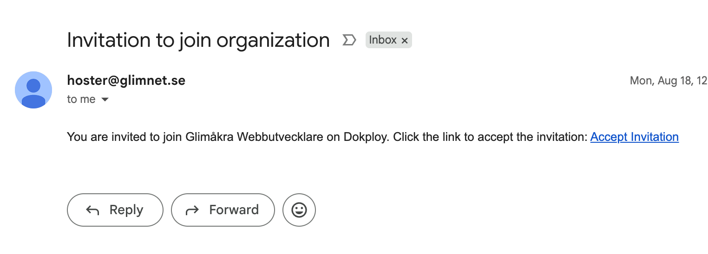
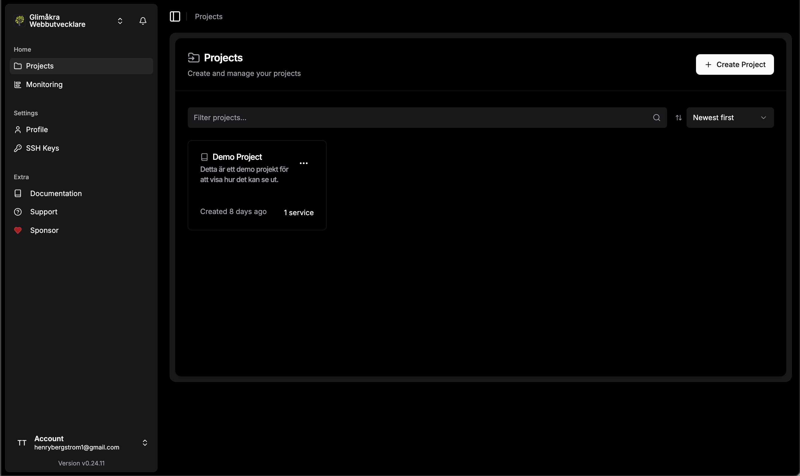
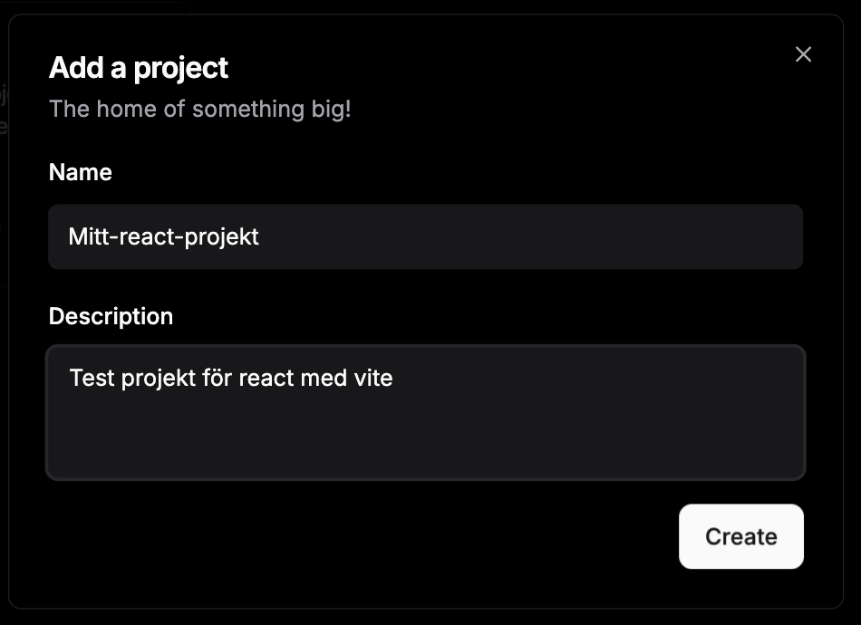
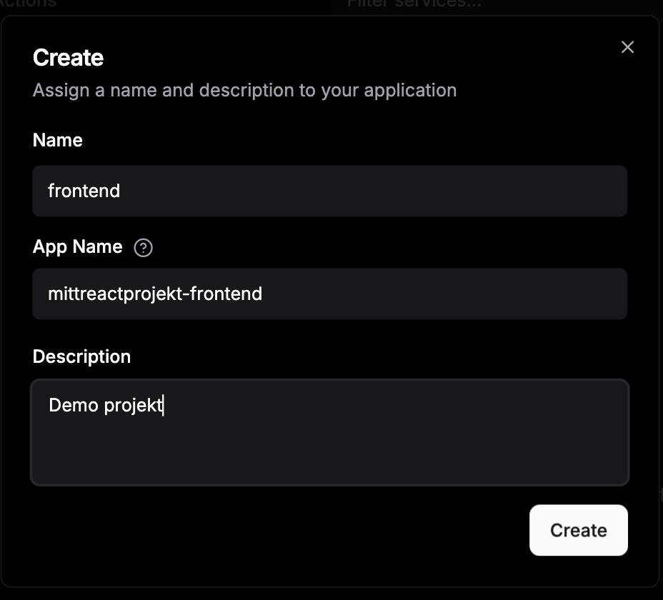

# Glimåkra Webbutvecklare - Kursbok

# Deployment med Dokploy: Från Kod till Live-webbplats

Modern webbutveckling handlar inte bara om att skriva kod - den måste också köras någonstans där användare kan komma åt den. Dokploy är en open source-plattform som gör det enkelt att deploya (publicera) dina React-applikationer på internet.

**Mål:** Lära sig att använda Dokploy för att deploya React-applikationer, förstå deployment-processen, och hantera domäner och SSL-certifikat.

## Vad är Dokploy?

**Dokploy** är en self-hosted deployment-plattform som fungerar som ett alternativ till Netlify, Vercel och Heroku. Den låter dig:

- 🚀 Deploya applikationer direkt från Git-repositories
- 🌐 Hantera domäner och SSL-certifikat automatiskt
- 📊 Övervaka dina applikationers prestanda
- 🔧 Konfigurera miljövariabler och databaser

För denna kurs använder vi Dokploy-instansen på **hoster.glimnet.se**.

## Förberedelser

### 1. Kontrollera din React-applikation

Innan deployment, se till att din React-app fungerar lokalt:

```bash
# Installera dependencies
npm install

# Testa att appen startar
npm run dev

# Testa att appen kan byggas för produktion
npm run build
```

### 2. Pusha kod till GitHub

Din kod måste finnas i ett GitHub-repository för att Dokploy ska kunna komma åt den:

```bash
# Initiera git (om inte redan gjort)
git init

# Lägg till alla filer
git add .

# Committa ändringarna
git commit -m "Initial commit"

# Lägg till remote repository
git remote add origin https://github.com/ditt-användarnamn/ditt-repo.git

# Pusha till GitHub
git push -u origin main
```

## Steg 1: Skapa Dokploy-konto

### Registrering

1. Ge lärare din email 
2. Gå till din email inbox och klicka på inbjudan
3. Gå till **https://hoster.glimnet.se**
3. Fyll i dina uppgifter:
   - E-postadress
   - Lösenord
   - Bekräfta lösenord




### Första inloggningen

4. Logga in med dina nya uppgifter
5. Du kommer att se Dokploy dashboard




## Steg 2: Skapa ett nytt projekt

### Projektinställningar

1. Klicka på "**New Project**" eller "**Nytt projekt**"
2. Ge projektet ett beskrivande namn (t.ex. "Min React App")
3. Välj projekttyp: **Application**



## Steg 3: Skapa en ny Service

### Projektinställningar

1. Klicka på "**New Service**" eller "**Ny Service**"
2. Ge projektet ett beskrivande namn (t.ex. "Min React App")
3. Välj projekttyp: **Application**




### Anslut GitHub Repository

4. Välj **Git** som källa
5. Ange URL till ditt GitHub-repository:
   ```
   https://github.com/ditt-användarnamn/ditt-repo.git
   ```
6. Välj branch (vanligtvis `main` eller `master`)
7. Spara


## Steg 3: Konfigurera Build-inställningar

### Deployment Type

Dokploy kommer automatiskt att detektera att det är en React/Vite-applikation, men du kan behöva justera inställningarna:

**Build Type**: Välj **Railpack** (rekommenderat för React/Vite)


### Avancerade inställningar (vid behov)

Om din applikation kräver specifika inställningar, kan du skapa konfigurationsfiler:

**`package.json`** - Se till att du har rätt scripts:
```json
{
  "scripts": {
    "dev": "vite",
    "build": "vite build",
    "preview": "vite preview"
  },
  "dependencies": {
    "react": "^18.0.0",
    "react-dom": "^18.0.0"
  }
}
```

## Steg 4: Domän och SSL-konfiguration

### Konfigurera domän

1. Gå till **Domains**-fliken i ditt projekt
2. Klicka på "**Add Domain**"
3. Fyll i domäninställningar:
   - **Host**: `ditt-projektnamn.hoster.glimnet.se`
   - **Path**: `/` (root)
   - **Internal Path**: `/` (viktigt!)
   - **Container Port**: `80`


### SSL-certifikat

4. Aktivera **HTTPS**
5. Välj **Let's Encrypt** som Certificate Provider
6. Systemet kommer automatiskt att skaffa och installera SSL-certifikat


## Steg 5: Deploya applikationen

### Starta deployment

1. Gå tillbaka till **General**-fliken
2. Klicka på "**Deploy**"-knappen
3. Vänta medan Dokploy:
   - Klonar din kod från GitHub
   - Installerar dependencies (`npm install`)
   - Bygger applikationen (`npm run build`)
   - Startar containern


### Övervaka deployment

4. Gå till **Deployments**-fliken för att se status
5. Klicka på den senaste deploymenten för att se loggar
6. Vänta tills status visar "✅ Done"


## Steg 6: Testa din live-webbplats

### Första testet

1. När deploymenten är klar, klicka på domänlänken eller gå till:
   ```
   https://ditt-projektnamn.hoster.glimnet.se
   ```

2. Din React-applikation ska nu vara live på internet! 🎉

### Felsökning vid problem

Om webbplatsen inte fungerar, kontrollera:

- **404-fel**: Kontrollera att Internal Path är satt till `/`
- **502 Bad Gateway**: Kontrollera att Container Port är `80`
- **Build-fel**: Kontrollera deployment logs för felmeddelanden

## Steg 7: Uppdatera applikationen

### Automatisk deployment

Dokploy kan konfigureras för automatisk deployment vid kod-ändringar:

1. Gå till **Settings** → **Git**
2. Aktivera **Auto Deploy**
3. Välj branch att övervaka (t.ex. `main`)

Nu kommer Dokploy automatiskt att deploya när du pushar ändringar till GitHub!

### Manuell deployment

För manuell uppdatering:

1. Pusha dina ändringar till GitHub:
   ```bash
   git add .
   git commit -m "Uppdatering av applikation"
   git push
   ```

2. Gå till Dokploy dashboard
3. Klicka "**Deploy**" igen

## Avancerade funktioner

### Miljövariabler

För att lägga till miljövariabler (t.ex. API-nycklar):

1. Gå till **Environment**-fliken
2. Lägg till variabler:
   ```
   VITE_API_URL=https://api.example.com
   VITE_APP_NAME=Min App
   ```

**[PRINTSCREEN: Environment variables]**

### Custom domän

För att använda en subdomän på hoster.glimnet.se (t.ex. `min-app.hoster.glimnet.se`):

1. Gå till "Domains"-fliken i Dokploy
2. Klicka på "Add Domain"
3. Ange önskad subdomän i formatet `[namn].hoster.glimnet.se`
4. SSL-certifikat genereras automatiskt

Detta ger dig en säker HTTPS-anslutning utan extra konfiguration.

### Monitoring och loggar

Övervaka din applikation:

1. **Logs**-fliken: Se applikationsloggar
2. **Monitoring**-fliken: Prestanda och resursanvändning
3. **Deployments**-fliken: Historik över deployments

## Vanliga problem och lösningar

### Problem: "Build failed"

**Orsak**: Fel i koden eller missing dependencies

**Lösning**:
1. Kontrollera deployment logs
2. Testa `npm run build` lokalt
3. Fixa eventuella fel och pusha igen

### Problem: "404 Not Found"

**Orsak**: Fel Internal Path eller routing-problem

**Lösning**:
1. Kontrollera att Internal Path är `/`
2. Kontrollera att Container Port är `80`
3. För React Router: Lägg till `try_files` konfiguration

### Problem: "502 Bad Gateway"

**Orsak**: Applikationen startar inte korrekt

**Lösning**:
1. Kontrollera Container Port (ska vara `80` för Railpack)
2. Kontrollera applikationsloggar
3. Testa att appen fungerar lokalt

## Säkerhet och best practices

### 1. Miljövariabler för känslig data

```bash
# ❌ Lägg aldrig känslig data direkt i koden
const API_KEY = "abc123secret";

# ✅ Använd miljövariabler
const API_KEY = import.meta.env.VITE_API_KEY;
```

### 2. HTTPS överallt

- Använd alltid HTTPS för produktion
- Dokploy hanterar SSL-certifikat automatiskt
- Omdirigera HTTP till HTTPS

### 3. Regelbundna uppdateringar

- Håll dependencies uppdaterade
- Testa ändringar lokalt innan deployment
- Använd versionshantering (Git tags) för viktiga releases

## Sammanfattning

Deployment med Dokploy gör det enkelt att få din React-applikation live på internet:

1. **Förbered** din kod och pusha till GitHub
2. **Skapa** Dokploy-konto och projekt
3. **Konfigurera** build-inställningar och domän
4. **Deploya** och övervaka processen
5. **Testa** din live-webbplats
6. **Uppdatera** genom att pusha ändringar

Med Dokploy kan du fokusera på att utveckla fantastiska applikationer medan plattformen hanterar infrastrukturen åt dig!

## Nästa steg

Nu när du kan deploya React-applikationer, utforska:

- **Databaser**: Lägg till PostgreSQL eller MongoDB
- **API:er**: Bygg och deploya backend-tjänster
- **Monitoring**: Sätt upp aviseringar för driftstörningar
- **CI/CD**: Automatisera testing och deployment

**Grattis! Du har nu deployat din första React-applikation! 🚀**

---

*Behöver du hjälp? Kontakta lärare eller kolla in [Dokploy dokumentation](https://docs.dokploy.com) för mer avancerade funktioner.*
