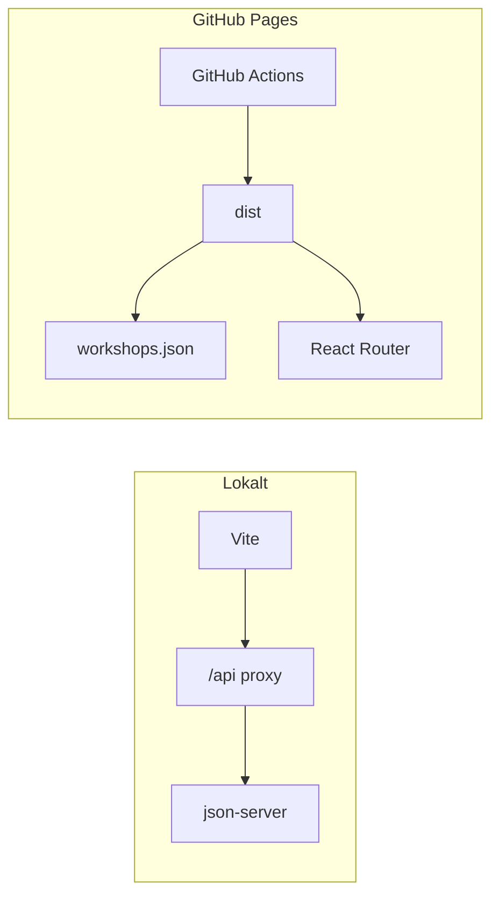

# Publicera Kulturverkstan med GitHub Pages

Nu fungerar lista, detalj, bokning, bekräftelse och demo-API lokalt. I den här
lektionen bygger du en statisk produktionsversion och publicerar den med
GitHub Actions till GitHub Pages.

> **Mål:** Bygga `dist`, publicera med GitHub Actions och kontrollera att startsidan, en direktlänk till en route och hämtningen av `workshops.json` fungerar.

GitHub Pages serverar **bara filer**. Det är samma idé som i
[Jekyll-lektionen](../kapitel_6/jekyll.md): pusha, bygg, visa statiska filer.
Skillnaden är byggaren. Jekyll byggs av GitHub. Här bygger **GitHub Actions**
med Node, precis som testerna i
[grupparbetet](../grupparbete/testning-och-actions.md).

json-server är kursinfrastruktur på din dator. Den följer inte med online.
Därför gör appen två saker i produktion:

- **GET** hämtar `workshops.json` från den publicerade sajten. Effect, loading,
  error och empty finns kvar.
- **POST** har ingen server att spara mot. `createBooking` returnerar
  bokningsobjektet så att bekräftelsen visas. Inget lagras på GitHub Pages.


```mermaid
flowchart LR
  subgraph local [Lokalt]
    ViteDev[Vite] --> Proxy["/api proxy"]
    Proxy --> JsonServer[json-server]
  end
  subgraph pages [GitHub Pages]
    Actions[GitHub Actions] --> Dist[dist]
    Dist --> StaticJSON[workshops.json]
    Dist --> SPA[React Router]
  end
```

## 1. Statisk workshopdata

Skapa `public/workshops.json`. Vite kopierar allt i `public/` till `dist/` vid
bygget. Innehållet ska vara **samma array** som `GET /api/workshops` returnerar,
inte hela `db.json`.

Kopiera `workshops`-arrayen från `db.json` till filen. Resultatet ska börja med
`[` och sluta med `]`.

Kontrollera att filen har tre objekt med id `keramik`, `vavning` och `foto`.

> I en riktig app skulle du inte duplicera datan. Här är det medvetet: lokalt
> finns en server, online finns en fil.

## 2. Ett produktionsspår i `src/api.js`

Ersätt `getWorkshops` och `createBooking` så att de väljer källa utifrån
om appen är byggd eller inte.

```js
function workshopsUrl() {
  if (import.meta.env.PROD) {
    return `${import.meta.env.BASE_URL}workshops.json`;
  }

  return '/api/workshops';
}

export async function getWorkshops(signal) {
  const response = await fetch(workshopsUrl(), { signal });

  if (!response.ok) {
    throw new Error(`Servern svarade med status ${response.status}.`);
  }

  return response.json();
}

export async function createBooking(booking) {
  if (import.meta.env.PROD) {
    return booking;
  }

  const response = await fetch('/api/bookings', {
    method: 'POST',
    headers: { 'Content-Type': 'application/json' },
    body: JSON.stringify(booking),
  });

  if (!response.ok) {
    throw new Error(`Servern svarade med status ${response.status}.`);
  }

  return response.json();
}
```

`import.meta.env.PROD` är `false` under `npm run dev` och `true` i en byggd
app. `import.meta.env.BASE_URL` är `/` lokalt och `/reponamn/` på en
projektsajt hos GitHub Pages.

Lokalt med `npm run dev` händer alltså samma sak som i API-lektionen. POST
sparas i `db.json`. Online syns bekräftelsen, men `bookings` på GitHub är
tomt — det finns ingen process som tar emot POST.

## 3. Vite `base` och router-`basename`

En projektsajt ligger på `https://användarnamn.github.io/reponamn/`, inte i
webbrotten. Utan `base` letar index.html efter `/assets/...` och får 404.
Det är samma fallgrop som Jekylls `baseurl`.

Uppdatera `vite.config.js`. Behåll React-pluginen och proxyn:

```js
import { defineConfig } from 'vite';
import react from '@vitejs/plugin-react';

const repository = process.env.GITHUB_REPOSITORY?.split('/')[1];
const isUserSite = repository?.endsWith('.github.io');

export default defineConfig({
  base: repository && !isUserSite ? `/${repository}/` : '/',
  plugins: [react()],
  server: {
    proxy: {
      '/api': 'http://localhost:3001',
    },
  },
});
```

`GITHUB_REPOSITORY` sätts automatiskt i Actions (`ägare/reponamn`). På din
dator är den osatt, så `base` blir `/` och `npm run dev` beter sig som
tidigare.

Om repot heter `dittnamn.github.io` är det en **användarsajt** i roten.
Då ska `base` vara `/`, vilket `isUserSite` tar hand om.

React Router måste veta samma prefix. Routing-lektionen satte redan

```jsx
<BrowserRouter basename={import.meta.env.BASE_URL}>
```

Kontrollera att raden finns kvar efter API-lektionens `App`-ersättning.
`Link` till `/book/keramik` får automatiskt rätt prefix. Du ska inte skriva
reponamnet i länkarna.

Lägg till förhandsgranskning i `package.json` under `scripts`:

```json
{
  "scripts": {
    "vite": "vite",
    "api": "node server.cjs",
    "dev": "concurrently -k -n API,VITE \"npm:api\" \"npm:vite\"",
    "build": "vite build",
    "preview": "vite preview",
    "start": "node server.cjs"
  }
}
```

`npm start` startar fortfarande bara det lokala demo-API:t. Det är inte
hosting.

## 4. Lokal produktionskontroll

Kör i Kulturverkstans projektmapp:

```bash
npm run build
npm run preview
```

Öppna adressen som terminalen visar. Det här är den statiska appen, samma
sorts filer som Pages kommer att servera. `import.meta.env.PROD` är `true`,
så Network ska visa `workshops.json` — inte `/api/workshops`.

Kontrollera:

- startsidan visar tre workshops,
- `/workshops/keramik` fungerar via en länk i appen,
- en bokning leder till `/confirm`,
- Network visar en GET mot `workshops.json`.

Skriv in `/book/keramik` direkt i adressfältet och ladda om. Lokalt med
`vite preview` brukar det fungera. På GitHub Pages gör vi extra filen
`404.html` i nästa steg, annars ger omladdning 404.

Avsluta med `Ctrl+C`.

## Checkpoint 1: bygget är grönt

Du är klar med den lokala delen när `npm run build` avslutas utan fel och
`npm run preview` visar listan från `workshops.json`.

## 5. Pusha till GitHub

Kontrollera att `node_modules` och `dist` ignoreras:

```gitignore
node_modules/
dist/
.env
```

Committa och pusha när workflow-filen i nästa avsnitt också finns:

```bash
git add .
git commit -m "förbered kulturverkstan för github pages"
git push
```

Kontrollera på GitHub att `public/workshops.json`, `src/api.js`,
`vite.config.js` och `package-lock.json` finns, men inte `node_modules`.

## 6. GitHub Actions-workflow

Skapa `.github/workflows/deploy.yml`:

```yaml
name: Deploy to GitHub Pages

on:
  push:
    branches: [main]
  workflow_dispatch:

permissions:
  contents: read
  pages: write
  id-token: write

concurrency:
  group: pages
  cancel-in-progress: true

jobs:
  build:
    runs-on: ubuntu-latest
    steps:
      - uses: actions/checkout@v4
      - uses: actions/setup-node@v4
        with:
          node-version: 22
          cache: npm
      - run: npm ci
      - run: npm run build
      - name: SPA fallback for GitHub Pages
        run: cp dist/index.html dist/404.html
      - uses: actions/upload-pages-artifact@v3
        with:
          path: dist

  deploy:
    needs: build
    runs-on: ubuntu-latest
    environment:
      name: github-pages
      url: ${{ steps.deployment.outputs.page_url }}
    steps:
      - name: Deploy to GitHub Pages
        id: deployment
        uses: actions/deploy-pages@v4
```

`cp dist/index.html dist/404.html` är SPA-tricket. GitHub Pages har ingen
Node-server som kan skicka `index.html` för `/book/keramik`. Okända sökvägar
serverar `404.html`. När den filen är en kopia av `index.html` startar React
Router och visar rätt vy.

Om din standardbranch heter `master` i stället för `main`, ändra `branches`
i workflow-filen.

## 7. Aktivera GitHub Pages

1. Öppna repositoryt på GitHub.
2. Gå till **Settings → Pages**.
3. Under **Source**, välj **GitHub Actions**.
4. Om första körningen redan har misslyckats: öppna **Actions**, välj
   workflowen och kör **Re-run jobs**.

När jobbet `deploy` är grönt finns en publik URL, ofta
`https://användarnamn.github.io/reponamn/`.

Öppna den i ett privat webbläsarfönster. Det avslöjar om du råkar vara
beroende av något som bara finns lokalt.

## Se → förutsäg → kör → ändra → kontrollera → förklara

1. **Se:** hitta `npm run build` och kopieringen av `404.html` i Action-loggen.
2. **Förutsäg:** vad händer med CSS och JS om `base` saknas på en projektsajt?
3. **Kör:** öppna den publika startsidan och Network. Vilken URL har
   `workshops.json`?
4. **Ändra:** uppdatera en workshoptext i både `db.json` och
   `public/workshops.json`, committa och pusha.
5. **Kontrollera:** texten ska synas efter nästa deployment. En ny bokning
   online ska visa bekräftelse men inte finnas kvar efter omladdning av
   `/confirm`.
6. **Förklara:** varför fungerar `POST /api/bookings` lokalt men inte på Pages?

## Första hjälpen

| Symptom | Kontroll |
|---|---|
| Builden misslyckas | Kör `npm run build` lokalt och läs det första felet |
| Vit sida, fel i Console om `/assets/` | Saknas `base` i `vite.config.js`, eller matchar det inte reponamnet? |
| Länkar går till fel app | Har `BrowserRouter` `basename={import.meta.env.BASE_URL}`? |
| Startsida fungerar, F5 på `/book/keramik` ger 404 | Saknas `cp dist/index.html dist/404.html` i workflowen? |
| `workshops.json` ger 404 | Ligger filen i `public/` och börjar den med `[`? |
| Fortfarande `/api/workshops` i Network på Pages | Körs den byggda appen (`PROD`) eller har du öppnat `localhost:5173`? |
| Workflowen körs inte | Heter branchen `main`, och är Pages-källan **GitHub Actions**? |
| Användarsajt (`namn.github.io`) får fel sökvägar | `base` ska vara `/` — kontrollera `isUserSite` |

## Slutcheckpoint

Du är klar när:

- den publika startsidan visar workshops från `workshops.json`,
- `/workshops/keramik` och `/book/keramik` går att öppna via länkar och via
  omladdning,
- `/confirm` visar ett hjälpsamt tomläge efter en direkt omladdning,
- en bokning online visar bekräftelse utan att sparas på servern,
- en ny push leder till en ny fungerande deployment.

> **Commit-förslag:** `git commit -m "publicera kulturverkstan på github pages"`
