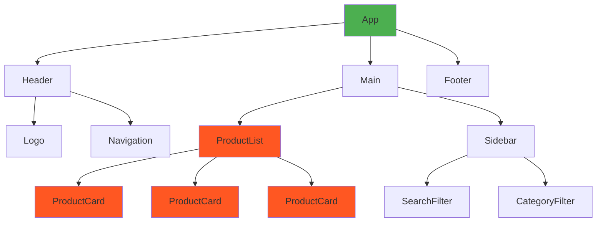

# Kapitel 8: Frontend-ramverk med React

I de tidigare kapitlen har vi byggt grunderna för webbutveckling med HTML, CSS, JavaScript och PHP. Vi har lärt oss skapa dynamiska webbapplikationer med server-side rendering och databaser. Nu är det dags att ta steget in i modern frontend-utveckling med **React**.

Detta kapitel introducerar dig till komponentsbaserad utveckling och Single Page Applications (SPA) - en arkitektur som dominerar moderna webbapplikationer. Istället för att generera HTML på servern och skicka hela sidor, bygger vi interaktiva användargränssnitt som körs i webbläsaren och kommunicerar med servern via API:er.

**Vad är React?** React är ett JavaScript-bibliotek utvecklat av Facebook (Meta) för att bygga användargränssnitt. Det fokuserar på att skapa återanvändbara komponenter och hanterar effektivt uppdateringar av DOM:en genom sitt Virtual DOM-system.

## Varför React? 

1. **Komponentbaserad arkitektur:** Bygg applikationer som LEGO-block där varje komponent har sitt eget ansvar
2. **Återanvändbarhet:** Skriv en gång, använd överallt
3. **Prestanda:** Virtual DOM optimerar uppdateringar automatiskt  
4. **Stort ekosystem:** Omfattande community och bibliotek
5. **Industristandard:** Används av företag som Facebook, Netflix, Airbnb, Uber

**Single Page Applications (SPA)** skiljer sig från traditionella webbapplikationer genom att:
- Ladda appen en gång, sedan uppdatera innehållet dynamiskt
- Navigering sker utan att hela sidan laddas om
- Snabbare användarupplevelse efter initial laddning
- Tydlig separation mellan frontend och backend

## Vad är en Komponentbaserad arkitektur?

En **komponent** är en JavaScript-funktion eller klass som returnerar JSX och representerar en del av användargränssnittet. Tänk på det som en anpassad HTML-tagg som du själv definierar.



*Diagram: Komponenthierarki för en e-handelsapplikation*

I detta kapitel kommer vi att:

*   **Din första komponent:** Lära dig skapa och organisera React-komponenter
*   **Skriva markup med JSX:** Kombinera JavaScript och HTML-liknande syntax
*   **Props och interaktivitet:** Skicka data mellan komponenter och hantera events
*   **State:** Ge komponenter minne för att reagera på förändringar
*   **Formulär:** Hantera användarinput på ett kontrollerat sätt
*   **API-integration:** Hämta och skicka data till backend-tjänster
*   **Routing:** Bygga Single Page Applications med navigation
*   **Deployment:** Publicera din app på internet

**Förutsättningar:** Du bör ha god kunskap i JavaScript (ES6+), HTML, CSS och grundläggande förståelse för API:er från tidigare kapitel.

## Program som ska vara installerade

Innan vi börjar behöver du ha följande verktyg installerade:

### NVM (Node Version Manager)
NVM används för att hantera olika versioner av Node.js. Det låter dig enkelt byta mellan olika Node.js-versioner.

**Installation:**
- Windows: Ladda ner och installera [nvm-windows](https://github.com/coreybutler/nvm-windows/releases)
- macOS/Linux: Kör följande kommando i terminalen:
  ```bash
  curl -o- https://raw.githubusercontent.com/nvm-sh/nvm/v0.39.0/install.sh | bash
  ```

Efter installation, kör följande kommandon för att installera och använda senaste LTS-versionen av Node.js:
```bash
nvm install --lts # installera senaste long-term-support versionen
nvm use --lts # använd den
```


Verifiera installationen genom att köra:
```bash
node --version # v22.18.0 eller högre
````

Låt oss börja vår resa in i modern frontend-utveckling!
