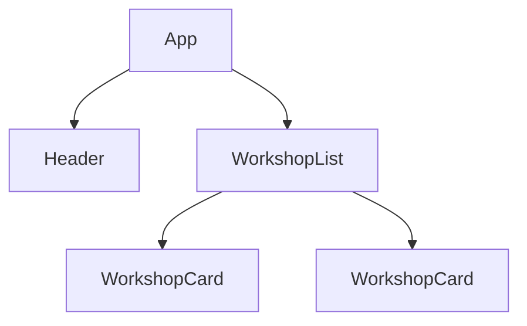

# Kapitel 8: React – bygg Kulturverkstan

I det här kapitlet bygger du **Kulturverkstan**, en liten app där en besökare kan hitta en workshop, välja en tid och göra en bokning. Appen börjar som en enkel sida och växer lite i taget. Du behöver alltså inte förstå hela React på en gång.

> **Så lär du dig i kapitlet**
> Du får först se ett litet exempel. Sedan förutsäger du resultatet, kör koden, ändrar en sak och kontrollerar vad som hände. Till sist förklarar du med egna ord. Att skriva och undersöka koden är viktigare än att memorera den.

## Mål

Efter kapitlet ska du kunna:

1. Dela upp ett gränssnitt i komponenter och skicka data med props.
2. Göra gränssnittet interaktivt med state, events och ett tillgängligt formulär.
3. Hämta data, navigera mellan sidor och publicera en enkel React-app.

## Se resultatet framför dig

Den färdiga appen har fyra vyer:

- `/` visar alla workshops.
- `/workshops/:workshopId` visar information om en workshop.
- `/book/:workshopId` visar bokningsformuläret.
- `/confirm` visar den bokning som användaren just skickade.

En workshop innehåller samma slags data genom hela kapitlet:

```js
const workshop = {
  id: "keramik",
  title: "Keramik för nybörjare",
  category: "Hantverk",
  description: "Forma och dekorera en egen liten skål.",
  durationMinutes: 120,
  priceSek: 350,
  slots: [
    { id: "keramik-lor-10", label: "Lördag 10.00", placesLeft: 4 },
  ],
};
```

En bokning använder följande fält:

```js
const booking = {
  workshopId: "keramik",
  slotId: "keramik-lor-10",
  name: "Samira Ali",
  email: "samira@example.com",
  participants: 1,
  message: "Jag är nybörjare.",
};
```

Du kommer känna igen namnen i alla lektioner. Det gör det lättare att fokusera på React i stället för att lära känna ett nytt exempel varje gång.

## Vad är React?

React är ett JavaScript-bibliotek för att bygga användargränssnitt. I vanlig HTML skriver du sidan som ett dokument. I React delar du upp gränssnittet i små **komponenter**. En komponent är oftast en JavaScript-funktion som returnerar markup.


```mermaid
graph TD
    App --> Header
    App --> WorkshopList
    WorkshopList --> WorkshopCardA[WorkshopCard]
    WorkshopList --> WorkshopCardB[WorkshopCard]
```

`App` är roten. Den visar en `Header` och en `WorkshopList`. Listan visar flera exemplar av samma `WorkshopCard`, men med olika innehåll.

Kulturverkstan blir till sist en **Single Page Application (SPA)**. Webbläsaren laddar appen och React byter sedan innehåll utan att ladda ett helt nytt HTML-dokument vid varje navigering. Du behöver inte kunna mer om SPA ännu. Vi återkommer till det när vi lägger till routing.

## Fyra delar

| Del | Fokus | Kulturverkstan efter delen |
| --- | --- | --- |
| 1 | JavaScript-brygga, Vite, JSX, komponenter och props | Visar en lista med workshops från en array |
| 2 | Events, state, formulär och uppdateringar | Besökaren kan välja tid och fylla i en bokning |
| 3 | Routing, Effects och början på API | Har fyra appvyer och hämtar workshopdata |
| 4 | API-flöde, felsökning och publicering | Kan skapa en bokning lokalt mot `/api` och finns online på GitHub Pages |

Varje del innehåller gemensam kodning, korta övningar och tid att bygga vidare själv. Det är normalt att behöva gå tillbaka till tidigare exempel.

## Vad är viktigast?

Innehållet märks i tre nivåer:

- **Måste kunna:** kapitlets kärna och det som behövs i caseprojektet.
- **Bra att kunna:** extra träning när kärnan fungerar.
- **Fördjupning:** Context, reducers och custom hooks. Vänta med detta tills grunderna sitter.

Du ligger inte efter om du stannar vid **Måste kunna**.

## Innan du börjar

Du behöver:

- en kodeditor, till exempel Visual Studio Code,
- en terminal,
- Git,
- Node.js 22 LTS (`v22.12.0` eller senare) och npm,
- en modern webbläsare.

Kontrollera Node och npm i terminalen:

```bash
node --version
npm --version
```

Båda kommandona ska skriva ut ett versionsnummer. Om ett kommando inte hittas behöver du installera Node.js LTS eller aktivera rätt version med NVM innan du går vidare.

## Så ser en arbetsrunda ut

1. **Se:** Läs det lilla exemplet.
2. **Förutsäg:** Säg eller skriv vad du tror kommer visas.
3. **Kör:** Prova i appen.
4. **Ändra:** Ändra bara en sak.
5. **Kontrollera:** Jämför med det förväntade resultatet.
6. **Förklara:** Beskriv varför resultatet ändrades.

> **Följ med:** Kör versionskontrollerna ovan i din terminal.
>
> **Fyll i:** `node --version` visar `__________` på min dator.
>
> **Gör själv:** Förklara för en klasskamrat skillnaden mellan Kulturverkstans data och det som besökaren ser på sidan.

## Första hjälpen

| Problem | Kontrollera först |
| --- | --- |
| `node: command not found` | Är Node.js LTS installerat och är terminalen omstartad? |
| Du vet inte vad ett ord betyder | Läs stycket närmast före koden och slå upp ordet i kapitlets sammanhang. |
| Exemplet känns för stort | Gå tillbaka till senaste checkpoint och ändra bara en rad. |
| Du får ett fel | Läs det första felmeddelandet och leta efter filnamn och radnummer. |

## Checkpoint

Du är klar med introduktionen när:

- `node --version` och `npm --version` fungerar,
- du kan beskriva Kulturverkstan med en mening,
- du kan peka ut `App`, `WorkshopList` och `WorkshopCard` i komponentträdet.

> **Commit-förslag:** Du har inte skapat React-projektet ännu. Efter nästa lektion kan du använda `git commit -m "Starta Kulturverkstan med Vite"`.

Nästa steg är [JavaScript-bryggan](./javascript-brygga.md). Där repeterar du bara den JavaScript som du snart använder i React.
