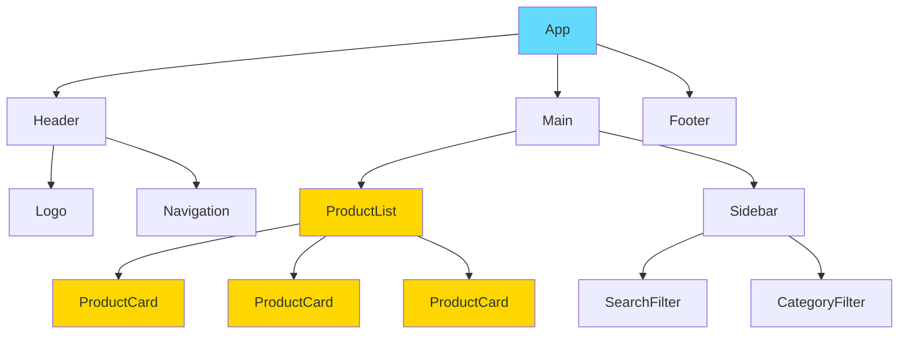
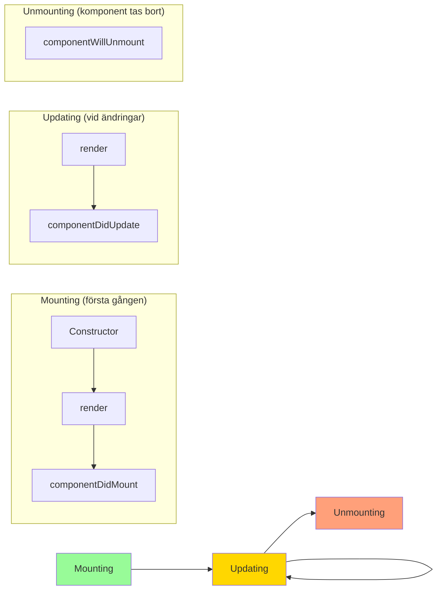

# Komponentbaserad Arkitektur: Byggstenar för Moderna Applikationer

Komponenter är hjärtat i React. Istället för att bygga monolitiska webbsidor, delar vi upp användargränssnittet i små, återanvändbara bitar som kan kombineras för att skapa komplexa applikationer.

**Mål:** Förstå komponentkonceptet, lära sig skillnaden mellan funktionella och klasskomponenter, bemästra props och children, samt förstå komponentlivscykeln.

## Vad är en Komponent?

En **komponent** är en JavaScript-funktion eller klass som returnerar JSX och representerar en del av användargränssnittet. Tänk på det som en anpassad HTML-tagg som du själv definierar.



*Diagram: Komponenthierarki för en e-handelsapplikation*

## Funktionella Komponenter: Det Moderna Sättet

Sedan React 16.8 och introduktionen av **Hooks** är funktionella komponenter standardsättet att skriva React-kod.

### Grundläggande Komponent

```jsx
// Enkel funktionell komponent
function Greeting() {
  return <h1>Hej världen!</h1>;
}

// Arrow function syntax (också vanlig)
const Greeting = () => {
  return <h1>Hej världen!</h1>;
};

// Kort syntax för enkel return
const Greeting = () => <h1>Hej världen!</h1>;
```

### Komponent med Logik

```jsx
function UserProfile() {
  const user = {
    name: "Anna Andersson",
    age: 28,
    email: "anna@example.com",
    avatar: "/images/anna.jpg"
  };

  const isAdult = user.age >= 18;

  return (
    <div className="user-profile">
      
      <h2>{user.name}</h2>
      <p>Ålder: {user.age} {isAdult && "✅ Myndig"}</p>
      <p>E-post: {user.email}</p>
    </div>
  );
}
```

## Props: Data till Komponenter

**Props** (properties) är hur vi skickar data från en föräldrakomponent till en barnkomponent. Det är Reacts sätt att göra komponenter flexibla och återanvändbara.

```jsx
// Komponent som tar emot props
function ProductCard({ name, price, image, onSale }) {
  return (
    <div className="product-card">
      
      <h3>{name}</h3>
      <p className={onSale ? "sale-price" : "regular-price"}>
        {price} kr {onSale && "🏷️ REA!"}
      </p>
    </div>
  );
}

// Föräldrakomponent som skickar props
function ProductList() {
  const products = [
    { id: 1, name: "T-shirt", price: 199, image: "/tshirt.jpg", onSale: true },
    { id: 2, name: "Jeans", price: 599, image: "/jeans.jpg", onSale: false },
    { id: 3, name: "Sneakers", price: 899, image: "/shoes.jpg", onSale: true }
  ];

  return (
    <div className="product-list">
      {products.map(product => (
        <ProductCard
          key={product.id}
          name={product.name}
          price={product.price}
          image={product.image}
          onSale={product.onSale}
        />
      ))}
    </div>
  );
}
```

### Props Destructuring och Default Values

```jsx
// Destructuring i funktionsparametern
function Button({ text, type = "button", onClick, disabled = false }) {
  return (
    <button 
      type={type}
      onClick={onClick}
      disabled={disabled}
      className={`btn btn-${type}`}
    >
      {text}
    </button>
  );
}

// Alternativ: destructuring i funktionskroppen
function Button(props) {
  const { text, type = "button", onClick, disabled = false } = props;
  
  return (
    <button 
      type={type}
      onClick={onClick}
      disabled={disabled}
    >
      {text}
    </button>
  );
}

// Användning
function App() {
  return (
    <div>
      <Button text="Klicka här" onClick={() => alert('Klickad!')} />
      <Button text="Skicka" type="submit" />
      <Button text="Inaktiv" disabled={true} />
    </div>
  );
}
```

## Props Children: Flexibel Komponentsammansättning

**props.children** är en speciell prop som innehåller allt som placeras mellan komponentens öppnings- och stängningstaggar.

```jsx
// Wrapper-komponent som använder children
function Card({ title, className = "", children }) {
  return (
    <div className={`card ${className}`}>
      <div className="card-header">
        <h3>{title}</h3>
      </div>
      <div className="card-body">
        {/* Här renderas children */}
        {children}
      </div>
    </div>
  );
}

// Med children parameter
function Card({ title, className = "", children }) {
  return (
    <div className={`card ${className}`}>
      <div className="card-header">
        <h3>{title}</h3>
      </div>
      <div className="card-body">
        {children}
      </div>
    </div>
  );
}

// Användning - allt mellan <Card> och </Card> blir children
function Dashboard() {
  return (
    <div className="dashboard">
      <Card title="Användarstatistik">
        <p>Totalt antal användare: 1,234</p>
        <p>Aktiva användare: 856</p>
        <button>Visa mer</button>
      </Card>

      <Card title="Senaste beställningar" className="orders-card">
        <ul>
          <li>Beställning #1001 - 599 kr</li>
          <li>Beställning #1002 - 299 kr</li>
          <li>Beställning #1003 - 899 kr</li>
        </ul>
      </Card>
    </div>
  );
}
```

## Klasskomponenter: Det Äldre Sättet

Före hooks använde React klasskomponenter för att hantera state och lifecycle. Du kommer fortfarande stöta på dem i äldre kodbaser.

```jsx
import React, { Component } from 'react';

class ClassCounter extends Component {
  constructor(props) {
    super(props);
    this.state = {
      count: 0
    };
  }

  // Lifecycle-metod
  componentDidMount() {
    console.log('Component har monterats');
  }

  componentDidUpdate(prevProps, prevState) {
    if (prevState.count !== this.state.count) {
      console.log(`Count ändrades från ${prevState.count} till ${this.state.count}`);
    }
  }

  componentWillUnmount() {
    console.log('Component kommer att avmonteras');
  }

  // Event handler
  incrementCount = () => {
    this.setState({ count: this.state.count + 1 });
  }

  render() {
    return (
      <div>
        <h2>Räknare: {this.state.count}</h2>
        <button onClick={this.incrementCount}>
          Öka
        </button>
      </div>
    );
  }
}
```

## Component Lifecycle: Komponentens Livscykel

Komponenter går igenom olika faser under sin livstid. Med funktionella komponenter hanteras detta via **useEffect** hook.



### Funktionell Komponent med Lifecycle

```jsx
import { useState, useEffect } from 'react';

function Timer() {
  const [seconds, setSeconds] = useState(0);
  const [isRunning, setIsRunning] = useState(false);

  // componentDidMount + componentDidUpdate
  useEffect(() => {
    let interval = null;
    
    if (isRunning) {
      interval = setInterval(() => {
        setSeconds(prev => prev + 1);
      }, 1000);
    } else {
      clearInterval(interval);
    }

    // componentWillUnmount (cleanup)
    return () => {
      if (interval) {
        clearInterval(interval);
      }
    };
  }, [isRunning]); // Dependency array - kör när isRunning ändras

  // Kör bara en gång (mounting)
  useEffect(() => {
    console.log('Timer component har monterats');
    
    // Cleanup (unmounting)
    return () => {
      console.log('Timer component avmonteras');
    };
  }, []); // Tom array = kör bara en gång

  const toggleTimer = () => {
    setIsRunning(!isRunning);
  };

  const resetTimer = () => {
    setSeconds(0);
    setIsRunning(false);
  };

  return (
    <div className="timer">
      <h2>Timer: {seconds} sekunder</h2>
      <button onClick={toggleTimer}>
        {isRunning ? 'Pausa' : 'Starta'}
      </button>
      <button onClick={resetTimer}>
        Återställ
      </button>
    </div>
  );
}
```

## Best Practices för Komponenter

### 1. Håll Komponenter Små och Fokuserade

```jsx
// ❌ För stor komponent
function BlogPost({ post, user, comments, relatedPosts }) {
  return (
    <article>
      {/* Hundratals rader kod... */}
    </article>
  );
}

// ✅ Uppdelade komponenter
function BlogPost({ post }) {
  return (
    <article>
      <BlogHeader post={post} />
      <BlogContent content={post.content} />
      <BlogFooter postId={post.id} />
    </article>
  );
}

function BlogHeader({ post }) {
  return (
    <header>
      <h1>{post.title}</h1>
      <AuthorInfo author={post.author} />
      <PublishDate date={post.publishedAt} />
    </header>
  );
}
```

### 2. Använda PropTypes för Typkontroll (Optional)

```jsx
import PropTypes from 'prop-types';

function ProductCard({ name, price, image, onSale }) {
  return (
    <div className="product-card">
      
      <h3>{name}</h3>
      <p className={onSale ? "sale-price" : "regular-price"}>
        {price} kr
      </p>
    </div>
  );
}

ProductCard.propTypes = {
  name: PropTypes.string.isRequired,
  price: PropTypes.number.isRequired,
  image: PropTypes.string.isRequired,
  onSale: PropTypes.bool
};

ProductCard.defaultProps = {
  onSale: false
};
```

### 3. Komponentnamnskonventioner

```jsx
// ✅ PascalCase för komponenter
function UserProfile() { }
function ProductCard() { }
function NavigationMenu() { }

// ✅ camelCase för funktioner och variabler
const handleClick = () => { };
const userName = "Anna";
const isLoading = true;

// ✅ Beskrivande namn
function LoadingSpinner() { }  // Bättre än Spinner()
function ErrorMessage() { }   // Bättre än Error()
```

## Sammanfattning

Komponentbaserad arkitektur är grunden för skalbar React-utveckling:

*   **Funktionella komponenter** är det moderna sättet att bygga komponenter
*   **Props** gör komponenter flexibla och återanvändbara
*   **Props.children** möjliggör flexibel komponentsammansättning
*   **Lifecycle** hanteras med useEffect i funktionella komponenter
*   **Småkomponenter** är lättare att förstå, testa och underhålla

I nästa avsnitt ska vi lära oss hantera state och interaktivitet med React hooks.
