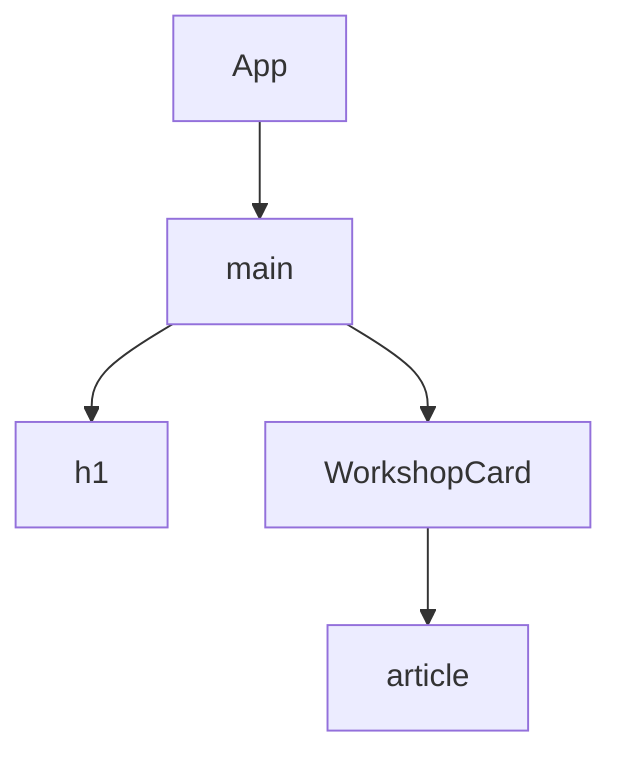

# Komponenter: bygg Kulturverkstans workshoplista

I förra avsnittet startade du React-appen. Nu delar du upp gränssnittet i små delar och visar Kulturverkstans workshops från data. Vi använder samma app genom resten av kapitlet.

> **Mål**
>
> Efter lektionen kan du:
>
> - skapa och använda funktionskomponenter i olika filer,
> - skicka data från en förälder till ett barn med props,
> - rendera en lista med `map`, stabila `key`-värden och ett enkelt villkor.

**Förkunskaper:** Du har en startad Vite-app och kan skriva enkel JSX.

**Efter lektionen har appen:** en rubrik och ett kort för varje workshop. Kortet visar även om det finns platser kvar.

## Börja med något som syns

Öppna `src/App.jsx` och ersätt innehållet med detta:

```jsx
function WorkshopCard() {
  return (
    <article>
      <h2>Keramik för nybörjare</h2>
      <p>Forma och dekorera en egen liten skål.</p>
    </article>
  );
}

export default function App() {
  return (
    <main>
      <h1>Kulturverkstan</h1>
      <WorkshopCard />
    </main>
  );
}
```

Spara filen. I webbläsaren ska du nu se rubriken **Kulturverkstan** och ett workshopkort.

> **Kom ihåg:** Ett komponentnamn börjar med stor bokstav. `<WorkshopCard />` betyder “rendera komponenten”, medan `<article>` är ett vanligt HTML-element.

## Så fungerar en komponent

En React-komponent är en JavaScript-funktion som returnerar JSX. Komponenten ska ha ett tydligt ansvar. Här ansvarar `WorkshopCard` för ett kort och `App` för hela sidan.


```mermaid
graph TD
  App --> Main[main]
  Main --> Heading[h1]
  Main --> WorkshopCard
  WorkshopCard --> Article[article]
```

Trädet hjälper dig att svara på två frågor:

- Vilken komponent äger sidan? `App`.
- Vilken komponent ska ändras om kortets utseende ändras? `WorkshopCard`.

## Se → förutsäg → kör → ändra → kontrollera → förklara

### 1. Se: samma komponent med olika props

**Props** är värden som en förälder skickar till ett barn. Läs koden utan att köra den först.

<!-- react-playground -->
```jsx
function WorkshopCard({ title, category }) {
  return (
    <article>
      <h2>{title}</h2>
      <p>Kategori: {category}</p>
    </article>
  );
}

export default function App() {
  return (
    <main>
      <h1>Kulturverkstan</h1>
      <WorkshopCard title="Keramik för nybörjare" category="Hantverk" />
      <WorkshopCard title="Väv din första provbit" category="Textil" />
    </main>
  );
}
```

### 2. Förutsäg

Skriv ner dina svar innan du kör:

1. Hur många `article`-element visas?
2. Vilken text visas efter den andra rubriken?
3. Vad händer om den andra `category` ändras till `Foto`?

### 3. Kör

Kör exemplet eller kopiera det till `src/App.jsx`. Kontrollera dina svar i webbläsaren.

### 4. Ändra

Lägg till en prop som heter `durationMinutes`. Visa exempelvis `120 minuter` i varje kort. Ge de två workshopparna olika tider.

<details>
<summary>Tips 1</summary>

Ta emot värdet tillsammans med `title` och `category`.

</details>

<details>
<summary>Tips 2</summary>

Du kan skriva `<p>{durationMinutes} minuter</p>` i komponentens JSX.

</details>

### 5. Kontrollera

- [ ] Två kort visas.
- [ ] Samma komponent används två gånger.
- [ ] Varje kort visar sin egen titel, kategori och längd.
- [ ] Det finns ingen kopia av hela `WorkshopCard`-funktionen.

### 6. Förklara

Förklara med en mening för en klasskamrat: varför är `title` en prop i stället för hårdkodad text i `WorkshopCard`?

## Flytta komponenten till en egen fil

När en komponent växer får den en egen fil. Skapa `src/components/WorkshopCard.jsx`:

```jsx
export default function WorkshopCard({ title, category, durationMinutes }) {
  return (
    <article>
      <h2>{title}</h2>
      <p>Kategori: {category}</p>
      <p>{durationMinutes} minuter</p>
    </article>
  );
}
```

Importera den högst upp i `src/App.jsx`:

```jsx
import WorkshopCard from "./components/WorkshopCard.jsx";

export default function App() {
  return (
    <main>
      <h1>Kulturverkstan</h1>
      <WorkshopCard
        title="Keramik för nybörjare"
        category="Hantverk"
        durationMinutes={120}
      />
    </main>
  );
}
```

`export default` gör komponenten till filens huvudsakliga export. `import` gör att en annan fil kan använda den. Sökvägen börjar med `./` eftersom `components` ligger i samma mapp som `App.jsx`.

> **Måste kunna:** skapa en funktionskomponent, exportera den och importera den med rätt relativ sökväg.

## Visa workshops från en array

Att skriva ett nytt `<WorkshopCard>` för varje workshop fungerar dåligt när data förändras. Spara i stället workshopparna i `src/data/workshops.js`:

```js
export const workshops = [
  {
    id: "keramik",
    title: "Keramik för nybörjare",
    category: "Hantverk",
    description: "Forma och dekorera en egen liten skål.",
    durationMinutes: 120,
    priceSek: 350,
    slots: [
      {
        id: "keramik-lor-10",
        label: "Lördag 10.00–12.00",
        placesLeft: 6,
      },
      {
        id: "keramik-ons-18",
        label: "Onsdag 18.00–20.00",
        placesLeft: 2,
      },
    ],
  },
  {
    id: "vavning",
    title: "Väv din första provbit",
    category: "Textil",
    description: "Lär dig grunderna i färg, varp och inslag i en liten bordsvävstol.",
    durationMinutes: 150,
    priceSek: 425,
    slots: [
      {
        id: "vavning-son-13",
        label: "Söndag 13.00–15.30",
        placesLeft: 4,
      },
    ],
  },
  {
    id: "foto",
    title: "Fotopromenad i byn",
    category: "Foto",
    description: "Öva komposition och ljus med mobilen eller en egen kamera.",
    durationMinutes: 90,
    priceSek: 200,
    slots: [
      {
        id: "foto-tor-17",
        label: "Torsdag 17.30–19.00",
        placesLeft: 8,
      },
      {
        id: "foto-lor-14",
        label: "Lördag 14.00–15.30",
        placesLeft: 0,
      },
    ],
  },
];
```

Varje workshop följer samma form:

```text
Workshop
├── id, title, category, description
├── durationMinutes, priceSek
└── slots
    └── id, label, placesLeft
```

`id` är ett stabilt unikt värde. Det ska inte ändras när listan sorteras eller filtreras.

Skapa `src/components/WorkshopList.jsx`:

```jsx
import WorkshopCard from "./WorkshopCard.jsx";

export default function WorkshopList({ workshops }) {
  return (
    <section aria-labelledby="workshops-heading">
      <h2 id="workshops-heading">Aktuella workshops</h2>
      {workshops.map((workshop) => (
        <WorkshopCard key={workshop.id} workshop={workshop} />
      ))}
    </section>
  );
}
```

`map` går igenom arrayen och skapar ett kort för varje objekt. `key={workshop.id}` hjälper React att känna igen rätt kort när listan ändras. Använd inte arrayens index som `key` när objekten redan har ett id.

Ändra `WorkshopCard.jsx` så att hela objektet tas emot:

```jsx
export default function WorkshopCard({ workshop }) {
  const placesLeft = workshop.slots.reduce(
    (total, slot) => total + slot.placesLeft,
    0,
  );

  return (
    <article>
      <p>{workshop.category}</p>
      <h3>{workshop.title}</h3>
      <p>{workshop.description}</p>
      <p>
        {workshop.durationMinutes} minuter · {workshop.priceSek} kr
      </p>
      {placesLeft > 0 ? (
        <p>{placesLeft} platser kvar</p>
      ) : (
        <p>Fullbokad</p>
      )}
    </article>
  );
}
```

Villkoret `placesLeft > 0 ? ... : ...` väljer en av två texter. Här behövs ännu ingen state: resultatet kan räknas ut direkt från props.

Till sist använder `App.jsx` listan:

```jsx
import WorkshopList from "./components/WorkshopList.jsx";
import { workshops } from "./data/workshops.js";

export default function App() {
  return (
    <main>
      <h1>Kulturverkstan</h1>
      <p>Hitta en workshop och boka din plats.</p>
      <WorkshopList workshops={workshops} />
    </main>
  );
}
```

## Bygg vidare med minskande stöd

### Följ med: kontrollera den tredje workshopen

Leta upp workshopen med id `foto` i datafilen. Kontrollera att båda tiderna
finns och att kortet räknar ihop `8` lediga platser. Den fullbokade tiden ska
bidra med `0` till summan.

### Fyll i: visa prisnivå

Fyll i luckorna så att kortet visar “Gratis” när priset är noll:

```jsx
<p>{workshop._____ === 0 ? "_____" : `${workshop.priceSek} kr`}</p>
```

<details>
<summary>Lösningsförslag</summary>

```jsx
<p>{workshop.priceSek === 0 ? "Gratis" : `${workshop.priceSek} kr`}</p>
```

</details>

### Gör själv: tom lista

**Bra att kunna:** Ändra `WorkshopList` så att texten “Inga workshops hittades” visas när arrayen är tom. Testa genom att tillfälligt skicka `[]` från `App`.

**Klar när:** tom text visas för `[]`, men rubrik och kort visas igen när `workshops` skickas in.

<details>
<summary>Tips 1</summary>

Kontrollera `workshops.length` innan du kör `map`.

</details>

<details>
<summary>Tips 2</summary>

En tidig `return` kan göra villkoret lättare att läsa.

</details>

## Första hjälpen

| Symptom | Trolig orsak | Så kontrollerar du |
| --- | --- | --- |
| `WorkshopCard is not defined` | Importen saknas eller namnet skiljer sig | Jämför exportnamn, importnamn och sökväg |
| Sidan blir tom efter en ändring | Ett syntaxfel stoppar renderingen | Läs det första röda felet i terminalen eller Console |
| `map is not a function` | `workshops` är inte en array | Logga värdet och kontrollera propens namn |
| Varning om unik `key` | `key` saknas eller ligger inuti kortet | Sätt `key={workshop.id}` där `map` skapar komponenten |
| Inget syns från komponenten | Namnet börjar med liten bokstav eller `return` saknas | Kontrollera stor bokstav och komponentens `return` |

## Checkpoint

Gör checkpointen utan att kopiera en färdig lösning:

1. Kontrollera att keramik, vävning och foto kommer från datafilen.
2. Rendera alla workshops genom `WorkshopList`.
3. Visa titel, kategori, tid, pris och antal platser i `WorkshopCard`.
4. Sätt tillfälligt båda fototillfällena till `placesLeft: 0` och visa “Fullbokad”. Återställ sedan värdena till `8` och `0`.
5. Skapa med flit en felaktig importsökväg, läs felet och rätta den igen.

**Klar när:** minst tre kort visas från arrayen, varje kort har en stabil `key`, det fullbokade läget går att testa och du kan förklara dataflödet `App → WorkshopList → WorkshopCard`.

> **Fördjupning:** Skissa komponentträdet på papper och markera vilka props som passerar varje pil. Skapa inga nya abstraktioner ännu.

## Sammanfattning och commit

- En komponent är en funktion som returnerar JSX.
- Props skickar data från en förälder till ett barn.
- `map` gör data till komponenter och varje komponent behöver en stabil `key`.
- Villkorlig rendering väljer vad användaren ser.

Spara ett tydligt steg i Git:

```bash
git add src
git commit -m "Bygg workshoplista med komponenter"
```

I nästa avsnitt gör du listan interaktiv med events och state.
