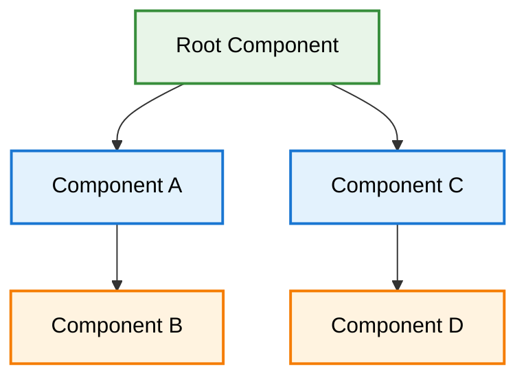
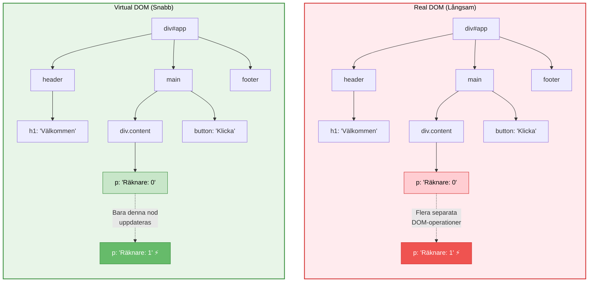

# Din Första React-komponent

React är ett JavaScript-bibliotek för att bygga användargränssnitt. UI byggs från små enheter som knappar, text och bilder. React låter dig kombinera dem till återanvändbara, nästlade **komponenter**. Från webbplatser till mobilappar - allt på skärmen kan delas upp i komponenter.

**Mål:** Skapa din första React-komponent, förstå JSX-syntax och sätta upp en utvecklingsmiljö.

## Vad är en Komponent?

En **komponent** är en JavaScript-funktion som returnerar markup (JSX). Komponenter kan vara så små som en knapp, eller så stora som en hel sida.

```jsx
// Din första komponent - en enkel funktion som returnerar JSX
function Välkomstmeddelande() {
  return <h1>Hej från React!</h1>;
}

// Använd komponenten som en HTML-tagg
function App() {
  return (
    <div>
      <Välkomstmeddelande />
      <Välkomstmeddelande />
      <Välkomstmeddelande />
    </div>
  );
}
```

**Prova detta!** Skapa en ny React-app och ersätt innehållet i `App.js` med koden ovan.

## Komponenter Överallt

React-applikationer byggs från isolerade UI-delar som kallas komponenter. Här är en `Galleri`-komponent som renderar tre `Profil`-komponenter:

```jsx
function Profil() {
  return (
    
  );
}

function Galleri() {
  return (
    <section>
      <h1>Fantastiska forskare</h1>
      <Profil />
      <Profil />
      <Profil />
    </section>
  );
}
```

## Importera och Exportera Komponenter

Du kan deklarera många komponenter i en fil, men stora filer kan bli svåra att navigera. För att lösa detta kan du **exportera** en komponent till sin egen fil och sedan **importera** den komponenten från en annan fil:

```jsx
// Profil.js
function Profil() {
  return (
    
  );
}

export default Profil;
```

```jsx
// Galleri.js
import Profil from './Profil.js';

function Galleri() {
  return (
    <section>
      <h1>Fantastiska forskare</h1>
      <Profil />
      <Profil />
      <Profil />
    </section>
  );
}

export default Galleri;
```

## Ditt UI som ett Träd

React använder träd för att modellera relationerna mellan komponenter och moduler.

En React render-träd är en representation av förälder- och barnrelationen mellan komponenter.



Komponenter nära toppen av trädet, nära root-komponenten, betraktas som toppnivå-komponenter. Komponenter utan barnkomponenter är löv-komponenter. Denna kategorisering av komponenter är användbar för att förstå dataflöde och renderingsprestanda.

## Virtual DOM: Prestanda Under Huven (Fördjupning)

Nu när du förstår grunderna, låt oss titta på **Virtual DOM** - ett av Reacts mest innovativa koncept.

**Virtual DOM-processen:**

1. **Skapande:** React skapar en virtuell representation av DOM:en i JavaScript
2. **Jämförelse (Diffing):** När något ändras jämför React den nya Virtual DOM med den föregående  
3. **Minimal uppdatering:** Bara de delar som faktiskt ändrats uppdateras i den riktiga DOM:en

**Virtual DOM:s verkliga fördelar:**
- **Batching**: Flera state-ändringar → en DOM-uppdatering
- **Smart diffing**: Hoppar över onödiga uppdateringar
- **Förutsägbarhet**: Deklarativ kod istället för imperativ DOM-manipulation

### Virtual DOM vs Real DOM: Träd-struktur

För att förstå Virtual DOM bättre, låt oss visualisera hur React hanterar ändringar i en HTML-struktur:



**Skillnaden förklarad:**

### Vänta - uppdateras verkligen "hela trädet" i traditionell JS?

Nej, det är en förenkling! När du gör:
```javascript
document.querySelector("#counter").innerText = "Räknare: 1";
```

...så uppdateras bara den specifika noden. **Men** - här är varför Virtual DOM ändå ger fördelar:

**Traditionell DOM-manipulation (flera uppdateringar)**:
```javascript
// Varje rad triggar separat DOM-operation och potentiell repaint
document.querySelector("#name").innerText = "Anna";     // Operation 1
document.querySelector("#age").innerText = "25";        // Operation 2  
document.querySelector("#status").innerText = "Online"; // Operation 3

// Vid komplex logik - många manuella DOM-operationer
if (user.isLoggedIn) {
  document.querySelector("#login-btn").style.display = "none";
  document.querySelector("#user-menu").style.display = "block";
  document.querySelector("#username").innerText = user.name;
  // ... potentiellt 10+ fler DOM-operationer
}
```

**Virtual DOM (React approach)**:
```jsx
// React batchar alla dessa till EN DOM-uppdatering
function UserProfile({ user }) {
  return (
    <div>
      <span id="name">{user.name}</span>
      <span id="age">{user.age}</span>
      <span id="status">{user.isOnline ? "Online" : "Offline"}</span>
      {user.isLoggedIn ? (
        <UserMenu user={user} />
      ) : (
        <LoginButton />
      )}
    </div>
  );
}
// → React optimerar till minimal antal DOM-operationer
```

**Virtual DOM:s verkliga fördelar:**
- **Batching**: Flera state-ändringar → en DOM-uppdatering
- **Smart diffing**: Hoppar över onödiga uppdateringar (om värdet inte ändrats)
- **Förutsägbarhet**: Deklarativ kod istället för imperativ DOM-manipulation
- **Komplexitet**: Hanterar komplexa UI-förändringar elegant

### Praktiskt exempel

Tänk dig denna React-komponent:

```jsx
function Counter() {
  const [count, setCount] = useState(0);
  
  return (
    <div id="app">
      <header>
        <h1>Välkommen</h1>
      </header>
      <main>
        <div className="content">
          <p>Räknare: {count}</p> {/* Bara denna rad ändras */}
        </div>
        <button onClick={() => setCount(count + 1)}>
          Klicka
        </button>
      </main>
      <footer>Footer innehåll</footer>
    </div>
  );
}
```

När `count` ändras:
1. **Virtual DOM** skapas med det nya värdet
2. **Diffing algoritm** jämför gamla och nya Virtual DOM
3. **Minimal uppdatering** - bara `<p>`-elementet uppdateras i Real DOM
4. **Resultat** - snabb rendering utan onödig omritning

## UI som funktion av state

Grunden i React är att se UI som en funktion av state: UI = f(state). Ett minimalt exempel:

```jsx
import { useState } from 'react';

export default function Counter() {
  const [count, setCount] = useState(0);
  return (
    <div>
      <p>Count: {count}</p>
      <button onClick={() => setCount(c => c + 1)}>+1</button>
    </div>
  );
}
```

## Skriva Markup med JSX

Varje React-komponent är en JavaScript-funktion som kan innehålla markup som React renderar i webbläsaren. React-komponenter använder en syntax-utökning som kallas **JSX** för att representera den markup:en.

JSX ser ut som HTML, men är lite striktare och kan visa dynamisk information. Om vi klistrar in befintlig HTML-markup i en React-komponent fungerar det inte alltid:

```jsx
// Detta fungerar inte riktigt!
function TodoLista() {
  return (
    <h1>Hedy Lamarrs Todos</h1>
    
    <ul>
      <li>Uppfinn nya trafikljus
      <li>Repetera en filmscen  
      <li>Förbättra spektrumteknologi
    </ul>
  );
}
```

Om du har befintlig HTML som detta kan du fixa det med en konverterare, eller följa JSX-reglerna:

```jsx
function TodoLista() {
  return (
    <>
      <h1>Hedy Lamarrs Todos</h1>
      
      <ul>
        <li>Uppfinn nya trafikljus</li>
        <li>Repetera en filmscen</li>
        <li>Förbättra spektrumteknologi</li>
      </ul>
    </>
  );
}
```

## JavaScript i JSX med Klammerparenteser

JSX låter dig skriva HTML-liknande markup inuti en JavaScript-fil, vilket håller renderingslogik och innehåll på samma plats. Ibland vill du lägga till lite JavaScript-logik eller referera till en dynamisk egenskap inuti den markup:en. I denna situation kan du använda klammerparenteser i din JSX för att "öppna ett fönster" till JavaScript:

```jsx
const person = {
  name: 'Gregorio Y. Zara',
  theme: {
    backgroundColor: 'black',
    color: 'pink'
  }
};

function TodoLista() {
  return (
    <div style={person.theme}>
      <h1>{person.name}s Todos</h1>
      
      <ul>
        <li>Förbättra videotelefonen</li>
        <li>Förbered flygföreläsningar</li>
        <li>Arbeta på alkoholdrivna motorn</li>
      </ul>
    </div>
  );
}
```

## Skicka Props till en Komponent

React-komponenter använder **props** för att kommunicera med varandra. Varje föräldrakomponent kan skicka information till sina barnkomponenter genom att ge dem props. Props kan påminna dig om HTML-attribut, men du kan skicka vilket JavaScript-värde som helst genom dem, inklusive objekt, arrayer, funktioner och till och med JSX!

```jsx
function Avatar({ person, size }) {
  return (
    
  );
}

function Profil() {
  return (
    <div>
      <Avatar
        size={100}
        person={{ 
          name: 'Katsuko Saruhashi', 
          imageId: 'YfeOqp2' 
        }}
      />
    </div>
  );
}
```

## Villkorlig Rendering

Dina komponenter behöver ofta visa olika saker beroende på olika villkor. I React kan du villkorligt rendera JSX med JavaScript-syntax som `if`-satser, `&&` och `? :` operatorer.

I detta exempel används JavaScript `&&` operatorn för att villkorligt rendera en bockmarkering:

```jsx
function Item({ name, isPacked }) {
  return (
    <li className="item">
      {name} {isPacked && '✅'}
    </li>
  );
}

function PackingList() {
  return (
    <section>
      <h1>Sally Rides Packlista</h1>
      <ul>
        <Item 
          isPacked={true} 
          name="Rymddräkt" 
        />
        <Item 
          isPacked={true} 
          name="Hjälm med gyllene blad" 
        />
        <Item 
          isPacked={false} 
          name="Foto av Tam" 
        />
      </ul>
    </section>
  );
}
```

## Rendera Listor

Du vill ofta visa flera liknande komponenter från en samling data. Du kan använda JavaScripts `map()` med React för att transformera din dataarray till en array av komponenter.

För varje arrayobjekt behöver du specificera en `key`. Vanligtvis vill du använda ett ID från databasen som `key`. Keys låter React hålla reda på varje objekts plats i listan även om listan ändras.

```jsx
const people = [
  { id: 0, name: 'Creola Katherine Johnson', profession: 'matematiker' },
  { id: 1, name: 'Mario José Molina-Pasquel', profession: 'kemist' },
  { id: 2, name: 'Mohammad Abdus Salam', profession: 'fysiker' },
];

function ScientistList() {
  const listItems = people.map(person =>
    <li key={person.id}>
      <p>
        <b>{person.name}</b> är en {person.profession}.
      </p>
    </li>
  );
  
  return (
    <article>
      <h1>Forskare</h1>
      <ul>{listItems}</ul>
    </article>
  );
}
```

**Viktigt om keys:**
- Använd alltid en unik `key` för varje listelement
- Keys hjälper React att förstå vilka element som ändrats
- Använd aldrig array-index som key om listan kan ändras

## Hålla Komponenter Rena

Vissa JavaScript-funktioner är **rena**. En ren funktion:

* **Sköter sina egna affärer.** Den ändrar inte några objekt eller variabler som existerade innan den anropades.
* **Samma input, samma output.** Givet samma input ska en ren funktion alltid returnera samma resultat.

Genom att strikt bara skriva dina komponenter som rena funktioner kan du undvika en hel klass av förvirrande buggar och oförutsägbart beteende när din kodbas växer. Här är ett exempel på en oren komponent:

```jsx
let guest = 0;

function Cup() {
  // Dåligt: ändrar en redan existerande variabel!
  guest = guest + 1;
  return <h2>Tekopp för gäst #{guest}</h2>;
}

function TeaSet() {
  return (
    <>
      <Cup />
      <Cup />
      <Cup />
    </>
  );
}
```

Du kan göra denna komponent ren genom att skicka en prop istället för att modifiera en redan existerande variabel:

```jsx
function Cup({ guest }) {
  return <h2>Tekopp för gäst #{guest}</h2>;
}

function TeaSet() {
  return (
    <>
      <Cup guest={1} />
      <Cup guest={2} />
      <Cup guest={3} />
    </>
  );
}
```

## Utvecklingsmiljö: Kom Igång Snabbt

### Snabbstart med Vite (Rekommenderat)

```bash
# Skapa nytt projekt med Vite
npm create vite@latest min-react-app -- --template react
cd min-react-app

# Installera dependencies
npm install

# Starta utvecklingsserver
npm run dev
```

### Din Första React-app

När du har skapat projektet, öppna `src/App.jsx` och ersätt innehållet med:

```jsx
function App() {
  return (
    <div>
      <h1>Min första React-app!</h1>
      <p>Välkommen till React-världen!</p>
    </div>
  );
}

export default App;
```

**Prova att ändra texten och se hur sidan uppdateras direkt!**

## JSX-regler att komma ihåg

```jsx
// 1. Måste ha ett parent element (eller React Fragment)
// ❌ Fel - flera root elements
function BadComponent() {
  return (
    <h1>Titel</h1>
    <p>Text</p>
  );
}

// ✅ Rätt - ett parent element
function GoodComponent() {
  return (
    <div>
      <h1>Titel</h1>
      <p>Text</p>
    </div>
  );
}

// ✅ Eller använd React Fragment
function GoodComponentFragment() {
  return (
    <>
      <h1>Titel</h1>
      <p>Text</p>
    </>
  );
}

// 2. JavaScript-uttryck inom {}
function DynamicComponent() {
  const products = ['Äpple', 'Banan', 'Citron'];
  const price = 25;

  return (
    <div>
      <h2>Produkter ({products.length})</h2>
      <p>Pris: {price} kr</p>
      <ul>
        {products.map(product => (
          <li key={product}>{product}</li>
        ))}
      </ul>
    </div>
  );
}
```

## Utvecklingsmiljö: Kom Igång Snabbt

### Snabbstart utan tooling

Vill du prova React direkt? Testa en minimal demo via CDN/online-sandbox (t.ex. StackBlitz):

```html
<!doctype html>
<div id="root"></div>
<script type="module">
  import React from 'https://esm.sh/react';
  import ReactDOM from 'https://esm.sh/react-dom/client';

  function App() {
    return React.createElement('h1', null, 'Hej från React!');
  }

  const root = ReactDOM.createRoot(document.getElementById('root'));
  root.render(React.createElement(App));

  // För riktig utveckling: använd Vite (se nedan)
}</script>
```

### Alternativ 1: Vite (Rekommenderat)

```bash
# Skapa nytt projekt med Vite
npm create vite@latest min-react-app -- --template react
cd min-react-app

# Installera dependencies
npm install

# Starta utvecklingsserver
npm run dev
```

### Alternativ 2: Create React App (historiskt)

```bash
# Skapa nytt projekt
npx create-react-app min-react-app
cd min-react-app

# Starta utvecklingsserver
npm start
```

### Projektstruktur (Create React App)

```
min-react-app/
  ├── public/
  │   ├── index.html        # HTML template
  │   └── favicon.ico
  ├── src/
  │   ├── App.js           # Main component
  │   ├── App.css          # Styles för App
  │   ├── index.js         # Entry point
  │   └── index.css        # Global styles
  ├── package.json         # Dependencies och scripts
  └── README.md
```

## Din Första React-komponent

Låt oss titta på en enkel komponent:

```jsx
// src/App.js
import './App.css';

function App() {
  const message = "Välkommen till React!";
  const currentYear = new Date().getFullYear();

  return (
    <div className="App">
      <header className="App-header">
        <h1>{message}</h1>
        <p>Året är {currentYear}</p>
        <button onClick={() => alert('Hej från React!')}>
          Klicka mig!
        </button>
      </header>
    </div>
  );
}

export default App;
```

```jsx
// src/index.js - Entry point
import React from 'react';
import ReactDOM from 'react-dom/client';
import App from './App';
import './index.css';

const root = ReactDOM.createRoot(document.getElementById('root'));
root.render(<App />);
```

Notis:
- Med den nya JSX-transformen (React 17+) behöver du inte längre `import React from 'react'` i varje komponentfil. Vissa mallar kan fortfarande inkludera importen – båda fungerar.
- I React 18 kör `StrictMode` effekter två gånger i utvecklingsläge för att upptäcka biverkningar. Det påverkar inte produktion.

## React Developer Tools

Installera **React Developer Tools** i din webbläsare:
- [Chrome Extension](https://chrome.google.com/webstore/detail/react-developer-tools/fmkadmapgofadopljbjfkapdkoienihi)
- [Firefox Extension](https://addons.mozilla.org/en-US/firefox/addon/react-devtools/)

Detta ger dig:
- Komponentträd-visning
- Props och state inspektion
- Prestanda-profiling
- Debugging-verktyg

## Vad händer härnäst?

Nu har du lärt dig grunderna för att beskriva UI:t med React! I nästa avsnitt kommer vi att utforska:

* **Lägga till interaktivitet** - hantera events och state
* **Hantera state** - ge komponenter minne
* **Formulär** - samla in användarinput
* **API-integration** - hämta data från servrar

**Är du redo?** Gå vidare till nästa lektion för att lära dig hur du gör dina komponenter interaktiva!


