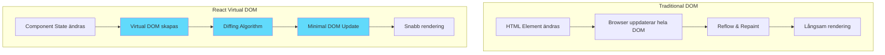

# Introduktion till React: Moderna Användargränssnitt

React revolutionerade hur vi bygger webbapplikationer när det lanserades 2013. Istället för att manipulera DOM:en direkt eller använda jQuery för att uppdatera sidor, introducerade React ett **deklarativt** sätt att beskriva användargränssnitt.

**Mål:** Förstå vad React är, hur Virtual DOM fungerar, lära sig JSX-syntax och sätta upp en utvecklingsmiljö.

## Vad är React?

React är ett JavaScript-bibliotek (inte ett ramverk!) för att bygga användargränssnitt. Det fokuserar på:

*   **Komponenter:** Återanvändbara byggblock för din UI
*   **Deklarativ stil:** Beskriv *hur* UI:t ska se ut, inte *vad* som ska göras
*   **Virtual DOM:** Effektiv uppdatering av den riktiga DOM:en
*   **Unidirektionellt dataflöde:** Data flödar nedåt, events uppåt

## Virtual DOM: Prestanda Under Huven

Ett av Reacts mest innovativa koncept är **Virtual DOM**. Men vad innebär det egentligen?



**Virtual DOM-processen:**

1. **Skapande:** React skapar en virtuell representation av DOM:en i JavaScript
2. **Jämförelse (Diffing):** När något ändras jämför React den nya Virtual DOM med den föregående
3. **Minimal uppdatering:** Bara de delar som faktiskt ändrats uppdateras i den riktiga DOM:en

Detta gör uppdateringar mer förutsägbara och ofta snabbare än traditionella manuella DOM-uppdateringar, särskilt i större applikationer.

## UI som funktion av state

Grunden i React är att se UI som en funktion av state: UI = f(state). Ett minimalt exempel:

```jsx
import { useState } from 'react';

export default function Counter() {
  const [count, setCount] = useState(0);
  return (
    <div>
      <p>Count: {count}</p>
      <button onClick={() => setCount(c => c + 1)}>+1</button>
    </div>
  );
}
```

## JSX: JavaScript och HTML i Harmoni

**JSX** (JavaScript XML) är Reacts syntax-tillägg som låter oss skriva HTML-liknande kod direkt i JavaScript. Det är inte obligatoriskt, men gör koden mycket mer läsbar.

### Grundläggande JSX-exempel

```jsx
// JSX - ser ut som HTML men är faktiskt JavaScript
function Welcome() {
  const name = "Anna";
  const isLoggedIn = true;

  return (
    <div className="welcome-container">
      <h1>Hej {name}!</h1>
      {isLoggedIn ? (
        <p>Du är inloggad</p>
      ) : (
        <p>Vänligen logga in</p>
      )}
    </div>
  );
}
```

**Viktig skillnad mellan JSX och HTML:**

| HTML | JSX | Anledning |
|------|-----|-----------|
| `class` | `className` | `class` är reserverat ord i JavaScript |
| `for` | `htmlFor` | `for` är reserverat ord i JavaScript |
| `onclick` | `onClick` | CamelCase för alla events |
| Strängattribut | `{}` för JavaScript | Dynamiska värden |

### JSX-regler att komma ihåg

```jsx
// 1. Måste ha ett parent element (eller React Fragment)
// ❌ Fel - flera root elements
function BadComponent() {
  return (
    <h1>Titel</h1>
    <p>Text</p>
  );
}

// ✅ Rätt - ett parent element
function GoodComponent() {
  return (
    <div>
      <h1>Titel</h1>
      <p>Text</p>
    </div>
  );
}

// ✅ Eller använd React Fragment
function GoodComponentFragment() {
  return (
    <>
      <h1>Titel</h1>
      <p>Text</p>
    </>
  );
}

// 2. JavaScript-uttryck inom {}
function DynamicComponent() {
  const products = ['Äpple', 'Banan', 'Citron'];
  const price = 25;

  return (
    <div>
      <h2>Produkter ({products.length})</h2>
      <p>Pris: {price} kr</p>
      <ul>
        {products.map(product => (
          <li key={product}>{product}</li>
        ))}
      </ul>
    </div>
  );
}
```

## Utvecklingsmiljö: Kom Igång Snabbt

### Snabbstart utan tooling

Vill du prova React direkt? Testa en minimal demo via CDN/online-sandbox (t.ex. StackBlitz):

```html
<!doctype html>
<div id="root"></div>
<script type="module">
  import React from 'https://esm.sh/react';
  import ReactDOM from 'https://esm.sh/react-dom/client';

  function App() {
    return React.createElement('h1', null, 'Hej från React!');
  }

  const root = ReactDOM.createRoot(document.getElementById('root'));
  root.render(React.createElement(App));

  // För riktig utveckling: använd Vite (se nedan)
}</script>
```

### Alternativ 1: Vite (Rekommenderat)

```bash
# Skapa nytt projekt med Vite
npm create vite@latest min-react-app -- --template react
cd min-react-app

# Installera dependencies
npm install

# Starta utvecklingsserver
npm run dev
```

### Alternativ 2: Create React App (historiskt)

```bash
# Skapa nytt projekt
npx create-react-app min-react-app
cd min-react-app

# Starta utvecklingsserver
npm start
```

### Projektstruktur (Create React App)

```
min-react-app/
  ├── public/
  │   ├── index.html        # HTML template
  │   └── favicon.ico
  ├── src/
  │   ├── App.js           # Main component
  │   ├── App.css          # Styles för App
  │   ├── index.js         # Entry point
  │   └── index.css        # Global styles
  ├── package.json         # Dependencies och scripts
  └── README.md
```

## Din Första React-komponent

Låt oss titta på en enkel komponent:

```jsx
// src/App.js
import './App.css';

function App() {
  const message = "Välkommen till React!";
  const currentYear = new Date().getFullYear();

  return (
    <div className="App">
      <header className="App-header">
        <h1>{message}</h1>
        <p>Året är {currentYear}</p>
        <button onClick={() => alert('Hej från React!')}>
          Klicka mig!
        </button>
      </header>
    </div>
  );
}

export default App;
```

```jsx
// src/index.js - Entry point
import React from 'react';
import ReactDOM from 'react-dom/client';
import App from './App';
import './index.css';

const root = ReactDOM.createRoot(document.getElementById('root'));
root.render(<App />);
```

Notis:
- Med den nya JSX-transformen (React 17+) behöver du inte längre `import React from 'react'` i varje komponentfil. Vissa mallar kan fortfarande inkludera importen – båda fungerar.
- I React 18 kör `StrictMode` effekter två gånger i utvecklingsläge för att upptäcka biverkningar. Det påverkar inte produktion.

## React Developer Tools

Installera **React Developer Tools** i din webbläsare:
- [Chrome Extension](https://chrome.google.com/webstore/detail/react-developer-tools/fmkadmapgofadopljbjfkapdkoienihi)
- [Firefox Extension](https://addons.mozilla.org/en-US/firefox/addon/react-devtools/)

Detta ger dig:
- Komponentträd-visning
- Props och state inspektion
- Prestanda-profiling
- Debugging-verktyg

## Sammanfattning

React är ett kraftfullt bibliotek som förändrar hur vi tänker på frontend-utveckling:

*   **Virtual DOM** optimerar prestanda genom smarta uppdateringar
*   **JSX** kombinerar JavaScript och HTML på ett naturligt sätt
*   **Komponentbaserad arkitektur** skapar återanvändbar och underhållbar kod
*   **Utvecklingsverktyg** gör debugging och utveckling effektivt

I nästa avsnitt dyker vi djupare in i komponenter och hur de fungerar tillsammans för att bygga kompletta applikationer.
