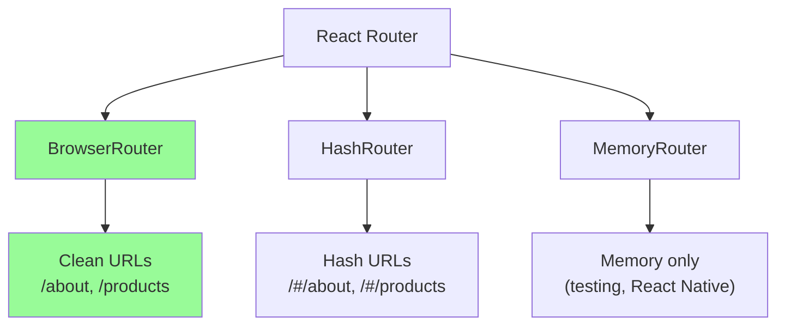

# Routing med React Router: Navigation i SPA:er

I traditionella webbapplikationer hanteras navigation av servern - varje URL motsvarar en specifik fil eller endpoint. I Single Page Applications behöver vi **client-side routing** för att hantera navigation utan att ladda om hela sidan.

**React Router** är det de facto-standardbiblioteket för routing i React-applikationer.

**Mål:** Lära sig React Router, implementera BrowserRouter, konfigurera routes, hantera navigation programmatiskt och skapa protected routes.

## Installation och Grundkonfiguration

### Installation

```bash
npm install react-router-dom
```

### Grundläggande Router Setup

```jsx
// App.js
import { BrowserRouter as Router, Routes, Route } from 'react-router-dom';
import Layout from './components/Layout';
import Home from './pages/Home';
import About from './pages/About';
import Contact from './pages/Contact';
import NotFound from './pages/NotFound';

function App() {
  return (
    <Router>
      <Layout>
        <Routes>
          <Route path="/" element={<Home />} />
          <Route path="/about" element={<About />} />
          <Route path="/contact" element={<Contact />} />
          <Route path="*" element={<NotFound />} />
        </Routes>
      </Layout>
    </Router>
  );
}

export default App;
```

## Router-typer

React Router erbjuder flera router-typer för olika användningsfall:



### BrowserRouter (Rekommenderad)

```jsx
import { BrowserRouter } from 'react-router-dom';

// Ger rena URLs: example.com/about
function App() {
  return (
    <BrowserRouter>
      {/* Routes här */}
    </BrowserRouter>
  );
}
```

### HashRouter (Fallback)

```jsx
import { HashRouter } from 'react-router-dom';

// Ger hash URLs: example.com/#/about
// Användbart för statiska hostar som GitHub Pages
function App() {
  return (
    <HashRouter>
      {/* Routes här */}
    </HashRouter>
  );
}
```

## Routes och Route Configuration

### Grundläggande Routes

```jsx
import { Routes, Route } from 'react-router-dom';

function AppRoutes() {
  return (
    <Routes>
      {/* Exact match för hem-sidan */}
      <Route path="/" element={<Home />} />
      
      {/* Enkla routes */}
      <Route path="/about" element={<About />} />
      <Route path="/services" element={<Services />} />
      <Route path="/contact" element={<Contact />} />
      
      {/* 404 - måste vara sist */}
      <Route path="*" element={<NotFound />} />
    </Routes>
  );
}
```

### Nested Routes (Nästlade routes)

```jsx
// Huvudroutes
function App() {
  return (
    <Router>
      <Routes>
        <Route path="/" element={<Layout />}>
          {/* Child routes */}
          <Route index element={<Home />} />
          <Route path="about" element={<About />} />
          <Route path="products/*" element={<ProductRoutes />} />
        </Route>
      </Routes>
    </Router>
  );
}

// Layout-komponent med Outlet
import { Outlet } from 'react-router-dom';

function Layout() {
  return (
    <div>
      <header>
        <Navigation />
      </header>
      <main>
        <Outlet /> {/* Här renderas child routes */}
      </main>
      <footer>
        <Footer />
      </footer>
    </div>
  );
}

// Produktroutes som separata komponenter (v6, relativa paths)
function ProductRoutes() {
  return (
    <Routes>
      <Route index element={<ProductList />} />
      <Route path=":id" element={<ProductDetail />} />
      <Route path="categories" element={<ProductCategories />} />
      <Route path="categories/:category" element={<CategoryProducts />} />
    </Routes>
  );
}
```

### Dynamiska Routes med Parameters

```jsx
import { useParams } from 'react-router-dom';

// Route configuration
<Route path="/users/:userId" element={<UserProfile />} />
<Route path="/posts/:postId/comments/:commentId" element={<Comment />} />

// I komponenten
function UserProfile() {
  const { userId } = useParams();
  const [user, setUser] = useState(null);

  useEffect(() => {
    fetch(`/api/users/${userId}`)
      .then(res => res.json())
      .then(setUser);
  }, [userId]);

  if (!user) return <div>Laddar...</div>;

  return (
    <div>
      <h1>{user.name}</h1>
      <p>{user.email}</p>
    </div>
  );
}

// Query parameters
function ProductList() {
  const [searchParams, setSearchParams] = useSearchParams();
  const category = searchParams.get('category');
  const sort = searchParams.get('sort');

  const updateSearch = (newCategory) => {
    setSearchParams({ category: newCategory, sort });
  };

  return (
    <div>
      <h2>Produkter {category && `i kategorin ${category}`}</h2>
      <button onClick={() => updateSearch('electronics')}>
        Elektronik
      </button>
    </div>
  );
}
```

## Navigation

### Link Component

```jsx
import { Link } from 'react-router-dom';

function Navigation() {
  return (
    <nav>
      {/* Grundläggande länkar */}
      <Link to="/">Hem</Link>
      <Link to="/about">Om oss</Link>
      <Link to="/products">Produkter</Link>
      
      {/* Dynamiska länkar */}
      <Link to={`/users/${user.id}`}>Min profil</Link>
      
      {/* Med state (för att skicka data) */}
      <Link 
        to="/checkout" 
        state={{ from: 'cart', items: cartItems }}
      >
        Till kassan
      </Link>
      
      {/* Ersätt current history entry */}
      <Link to="/login" replace>
        Logga in
      </Link>
    </nav>
  );
}
```

### NavLink för Aktiva Länkar

```jsx
import { NavLink } from 'react-router-dom';

function Navigation() {
  return (
    <nav>
      <NavLink 
        to="/" 
        className={({ isActive }) => isActive ? 'active' : ''}
      >
        Hem
      </NavLink>
      
      <NavLink 
        to="/products" 
        style={({ isActive }) => ({
          color: isActive ? 'red' : 'blue'
        })}
      >
        Produkter
      </NavLink>
      
      {/* Med custom active class (v6) */}
      <NavLink 
        to="/about"
        className={({ isActive }) => `nav-link ${isActive ? 'current' : ''}`}
      >
        Om oss
      </NavLink>
    </nav>
  );
}
```

### Programmatisk Navigation

```jsx
import { useNavigate, useLocation } from 'react-router-dom';

function LoginForm() {
  const navigate = useNavigate();
  const location = useLocation();

  const handleLogin = async (credentials) => {
    try {
      await login(credentials);
      
      // Navigera tillbaka till föregående sida eller hem
      const from = location.state?.from?.pathname || '/';
      navigate(from, { replace: true });
    } catch (error) {
      setError('Inloggning misslyckades');
    }
  };

  const goBack = () => {
    navigate(-1); // Gå tillbaka i historiken
  };

  const goToProducts = () => {
    navigate('/products', { 
      state: { from: 'login' },
      replace: false 
    });
  };

  return (
    <form onSubmit={handleLogin}>
      {/* Formulärfält */}
      <button type="button" onClick={goBack}>
        Tillbaka
      </button>
      <button type="submit">
        Logga in
      </button>
    </form>
  );
}
```

## Protected Routes

Skydda routes som kräver autentisering eller auktorisation.

### Enkel Protected Route

```jsx
import { Navigate, useLocation } from 'react-router-dom';
import { useAuth } from '../contexts/AuthContext';

function ProtectedRoute({ children }) {
  const { user, loading } = useAuth();
  const location = useLocation();

  if (loading) {
    return <div>Laddar...</div>;
  }

  if (!user) {
    // Spara nuvarande location för att navigera tillbaka efter login
    return <Navigate to="/login" state={{ from: location }} replace />;
  }

  return children;
}

// Användning
function App() {
  return (
    <Routes>
      <Route path="/" element={<Home />} />
      <Route path="/login" element={<Login />} />
      
      {/* Skyddade routes */}
      <Route 
        path="/dashboard" 
        element={
          <ProtectedRoute>
            <Dashboard />
          </ProtectedRoute>
        } 
      />
      
      <Route 
        path="/profile" 
        element={
          <ProtectedRoute>
            <Profile />
          </ProtectedRoute>
        } 
      />
    </Routes>
  );
}
```

### Avancerad Protected Route med Roller

```jsx
function ProtectedRoute({ children, requiredRole = null }) {
  const { user, loading } = useAuth();
  const location = useLocation();

  if (loading) {
    return <LoadingSpinner />;
  }

  if (!user) {
    return <Navigate to="/login" state={{ from: location }} replace />;
  }

  if (requiredRole && user.role !== requiredRole) {
    return <Navigate to="/unauthorized" replace />;
  }

  return children;
}

// Route Guard Hook
function useRouteGuard() {
  const { user } = useAuth();
  const navigate = useNavigate();

  const requireAuth = useCallback(() => {
    if (!user) {
      navigate('/login');
      return false;
    }
    return true;
  }, [user, navigate]);

  const requireRole = useCallback((role) => {
    if (!user) {
      navigate('/login');
      return false;
    }
    if (user.role !== role) {
      navigate('/unauthorized');
      return false;
    }
    return true;
  }, [user, navigate]);

  return { requireAuth, requireRole };
}

// Användning
function AdminPanel() {
  const { requireRole } = useRouteGuard();

  useEffect(() => {
    requireRole('admin');
  }, [requireRole]);

  return <div>Admin Panel</div>;
}
```

## Avancerade Routing Patterns

### Route Configuration Object

```jsx
import { createBrowserRouter, RouterProvider } from 'react-router-dom';

const router = createBrowserRouter([
  {
    path: '/',
    element: <Layout />,
    errorElement: <ErrorPage />,
    children: [
      {
        index: true,
        element: <Home />
      },
      {
        path: 'products',
        element: <ProductsLayout />,
        children: [
          {
            index: true,
            element: <ProductList />
          },
          {
            path: ':id',
            element: <ProductDetail />,
            loader: async ({ params }) => {
              return fetch(`/api/products/${params.id}`);
            }
          }
        ]
      },
      {
        path: 'admin',
        element: <ProtectedRoute requiredRole="admin"><AdminLayout /></ProtectedRoute>,
        children: [
          {
            path: 'users',
            element: <UserManagement />
          },
          {
            path: 'settings',
            element: <Settings />
          }
        ]
      }
    ]
  }
]);

function App() {
  return <RouterProvider router={router} />;
}
```

### Data Loading med Loaders

```jsx
// Modern data loading pattern (React Router v6.4+)
const router = createBrowserRouter([
  {
    path: '/products/:id',
    element: <ProductDetail />,
    loader: async ({ params }) => {
      const product = await fetch(`/api/products/${params.id}`);
      if (!product.ok) {
        throw new Response('Product not found', { status: 404 });
      }
      return product.json();
    },
    errorElement: <ProductError />
  }
]);

// I komponenten
function ProductDetail() {
  const product = useLoaderData();
  
  return (
    <div>
      <h1>{product.name}</h1>
      <p>{product.description}</p>
    </div>
  );
}
```

### Route Transitions och Animations

```jsx
import { AnimatePresence, motion } from 'framer-motion';
import { useLocation } from 'react-router-dom';

function AnimatedRoutes() {
  const location = useLocation();

  return (
    <AnimatePresence mode="wait">
      <Routes location={location} key={location.pathname}>
        <Route 
          path="/" 
          element={
            <motion.div
              initial={{ opacity: 0, x: -100 }}
              animate={{ opacity: 1, x: 0 }}
              exit={{ opacity: 0, x: 100 }}
              transition={{ duration: 0.3 }}
            >
              <Home />
            </motion.div>
          } 
        />
        {/* Andra routes... */}
      </Routes>
    </AnimatePresence>
  );
}
```

## Error Handling och 404 Pages

### Error Boundaries för Routes

```jsx
class RouteErrorBoundary extends React.Component {
  constructor(props) {
    super(props);
    this.state = { hasError: false };
  }

  static getDerivedStateFromError(error) {
    return { hasError: true };
  }

  componentDidCatch(error, errorInfo) {
    console.error('Route error:', error, errorInfo);
  }

  render() {
    if (this.state.hasError) {
      return (
        <div className="error-page">
          <h2>Något gick fel</h2>
          <p>Vi ber om ursäkt för besväret.</p>
          <Link to="/">Gå tillbaka till startsidan</Link>
        </div>
      );
    }

    return this.props.children;
  }
}

// 404 Component
function NotFound() {
  const location = useLocation();

  return (
    <div className="not-found">
      <h1>404 - Sidan hittades inte</h1>
      <p>Sidan <code>{location.pathname}</code> existerar inte.</p>
      <Link to="/">Gå till startsidan</Link>
    </div>
  );
}
```

## Best Practices

### 1. Route Organization

```jsx
// routes/index.js - Centraliserad route configuration
export const routes = {
  home: '/',
  about: '/about',
  products: '/products',
  productDetail: (id) => `/products/${id}`,
  userProfile: (userId) => `/users/${userId}`,
  admin: {
    base: '/admin',
    users: '/admin/users',
    settings: '/admin/settings'
  }
};

// Användning
<Link to={routes.productDetail(product.id)}>
  {product.name}
</Link>
```

### 2. Route Guards

```jsx
// Reusable route guard component
function RouteGuard({ 
  children, 
  requireAuth = false, 
  requiredRole = null,
  fallback = null 
}) {
  const { user, loading } = useAuth();
  const location = useLocation();

  if (loading) return <LoadingSpinner />;

  if (requireAuth && !user) {
    return <Navigate to="/login" state={{ from: location }} replace />;
  }

  if (requiredRole && (!user || user.role !== requiredRole)) {
    return fallback || <Navigate to="/unauthorized" replace />;
  }

  return children;
}
```

### 3. SEO-vänliga Routes

```jsx
// Dynamiska titles baserat på route
function useDocumentTitle(title) {
  useEffect(() => {
    const prevTitle = document.title;
    document.title = title;
    return () => {
      document.title = prevTitle;
    };
  }, [title]);
}

function ProductDetail() {
  const { id } = useParams();
  const [product, setProduct] = useState(null);

  useDocumentTitle(product ? `${product.name} - Min Butik` : 'Laddar...');

  // ...
}
```

## Sammanfattning

React Router är kraftfullt verktyg för navigation i React-applikationer:

*   **BrowserRouter** ger rena URLs och är bästa valet för de flesta applikationer
*   **Routes och Route** konfigurerar URL-mappningar till komponenter
*   **Link och NavLink** skapar navigerbara länkar
*   **useNavigate** möjliggör programmatisk navigation
*   **Protected Routes** skyddar känsligt innehåll
*   **Dynamic routes** hanterar parametrar och query strings

Nästa steg är att lära sig konsumera API:er för att hämta och skicka data till backend-tjänster.
