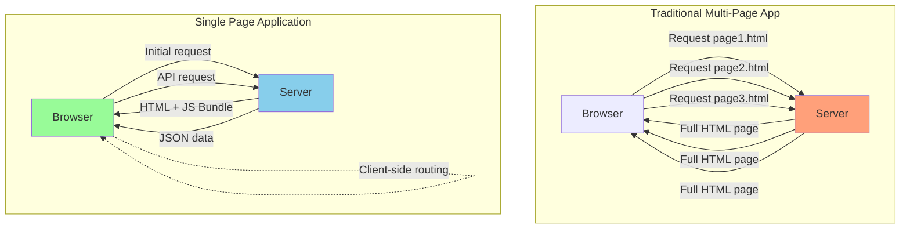

# Single Page Application: Modern Webbapplikationsarkitektur

En **Single Page Application (SPA)** är en webbapplikation som laddar en enda HTML-sida och dynamiskt uppdaterar innehållet när användaren interagerar med appen. Detta skiljer sig från traditionella webbsidor där varje klick resulterar i en ny sidladdning från servern.

**Mål:** Förstå SPA-arkitektur, lära sig state management för större applikationer, optimera prestanda och förstå build- och deployment-processen.

## SPA vs Traditionella Webbapplikationer



### Fördelar med SPA

**Användarupplevelse:**
- Snabbare navigering efter initial laddning
- Smidigare övergångar mellan vyer
- Möjlighet för offline-funktionalitet
- App-liknande känsla

**Utveckling:**
- Tydlig separation mellan frontend och backend
- Återanvändbar API för flera klienter
- Modern utvecklingsworkflow med hot reloading

### Nackdelar med SPA

**Initial Prestanda:**
- Större initial JavaScript-bundle
- Längre tid till första visning
- Komplicerad state management

**SEO och Tillgänglighet:**
- Kräver Server-Side Rendering (SSR) för SEO
- Komplexare routing-implementation
- Potential för minnesläckor

## SPA-arkitektur med React

### Grundläggande Applikationsstruktur

```jsx
// App.js - Huvudkomponent med routing
import { BrowserRouter as Router, Routes, Route } from 'react-router-dom';
import { AuthProvider } from './contexts/AuthContext';
import { ThemeProvider } from './contexts/ThemeContext';
import Layout from './components/Layout';
import Home from './pages/Home';
import About from './pages/About';
import Products from './pages/Products';
import ProductDetail from './pages/ProductDetail';
import Login from './pages/Login';
import Dashboard from './pages/Dashboard';
import NotFound from './pages/NotFound';

function App() {
  return (
    <AuthProvider>
      <ThemeProvider>
        <Router>
          <Layout>
            <Routes>
              <Route path="/" element={<Home />} />
              <Route path="/about" element={<About />} />
              <Route path="/products" element={<Products />} />
              <Route path="/products/:id" element={<ProductDetail />} />
              <Route path="/login" element={<Login />} />
              <Route path="/dashboard" element={<Dashboard />} />
              <Route path="*" element={<NotFound />} />
            </Routes>
          </Layout>
        </Router>
      </ThemeProvider>
    </AuthProvider>
  );
}

export default App;
```

### Layout-komponent med Navigation

```jsx
// components/Layout.js
import { useState } from 'react';
import { Link, useLocation, useNavigate } from 'react-router-dom';
import { useAuth } from '../contexts/AuthContext';
import { useTheme } from '../contexts/ThemeContext';

function Layout({ children }) {
  const [mobileMenuOpen, setMobileMenuOpen] = useState(false);
  const { user, logout } = useAuth();
  const { theme, toggleTheme } = useTheme();
  const location = useLocation();
  const navigate = useNavigate();

  const handleLogout = async () => {
    await logout();
    navigate('/');
    setMobileMenuOpen(false);
  };

  const isActive = (path) => location.pathname === path;

  return (
    <div className={`app ${theme}`}>
      <header className="header">
        <div className="container">
          <Link to="/" className="logo">
            <h1>Min SPA</h1>
          </Link>

          {/* Desktop Navigation */}
          <nav className="desktop-nav">
            <Link 
              to="/" 
              className={isActive('/') ? 'active' : ''}
            >
              Hem
            </Link>
            <Link 
              to="/products" 
              className={isActive('/products') ? 'active' : ''}
            >
              Produkter
            </Link>
            <Link 
              to="/about" 
              className={isActive('/about') ? 'active' : ''}
            >
              Om oss
            </Link>
          </nav>

          {/* User Actions */}
          <div className="user-actions">
            <button onClick={toggleTheme} className="theme-toggle">
              {theme === 'light' ? '🌙' : '☀️'}
            </button>

            {user ? (
              <div className="user-menu">
                <Link to="/dashboard">Dashboard</Link>
                <button onClick={handleLogout}>Logga ut</button>
              </div>
            ) : (
              <Link to="/login" className="login-btn">
                Logga in
              </Link>
            )}

            {/* Mobile Menu Toggle */}
            <button 
              className="mobile-menu-toggle"
              onClick={() => setMobileMenuOpen(!mobileMenuOpen)}
            >
              ☰
            </button>
          </div>
        </div>

        {/* Mobile Navigation */}
        {mobileMenuOpen && (
          <nav className="mobile-nav">
            <Link to="/" onClick={() => setMobileMenuOpen(false)}>Hem</Link>
            <Link to="/products" onClick={() => setMobileMenuOpen(false)}>Produkter</Link>
            <Link to="/about" onClick={() => setMobileMenuOpen(false)}>Om oss</Link>
            {user && (
              <Link to="/dashboard" onClick={() => setMobileMenuOpen(false)}>
                Dashboard
              </Link>
            )}
          </nav>
        )}
      </header>

      <main className="main">
        {children}
      </main>

      <footer className="footer">
        <div className="container">
          <p>&copy; 2024 Min SPA. Alla rättigheter förbehållna.</p>
        </div>
      </footer>
    </div>
  );
}

export default Layout;
```

## State Management för Större Applikationer

### Context API för Global State

```jsx
// contexts/AppContext.js - Kombinerad state management
import { createContext, useContext, useReducer, useEffect } from 'react';

const AppContext = createContext();

// Action types
const ACTIONS = {
  SET_LOADING: 'SET_LOADING',
  SET_ERROR: 'SET_ERROR',
  CLEAR_ERROR: 'CLEAR_ERROR',
  SET_USER: 'SET_USER',
  SET_PRODUCTS: 'SET_PRODUCTS',
  ADD_TO_CART: 'ADD_TO_CART',
  REMOVE_FROM_CART: 'REMOVE_FROM_CART',
  CLEAR_CART: 'CLEAR_CART',
  SET_THEME: 'SET_THEME'
};

// Initial state
const initialState = {
  loading: false,
  error: null,
  user: null,
  products: [],
  cart: [],
  theme: 'light'
};

// Reducer function
function appReducer(state, action) {
  switch (action.type) {
    case ACTIONS.SET_LOADING:
      return { ...state, loading: action.payload };
    
    case ACTIONS.SET_ERROR:
      return { ...state, error: action.payload, loading: false };
    
    case ACTIONS.CLEAR_ERROR:
      return { ...state, error: null };
    
    case ACTIONS.SET_USER:
      return { ...state, user: action.payload };
    
    case ACTIONS.SET_PRODUCTS:
      return { ...state, products: action.payload };
    
    case ACTIONS.ADD_TO_CART:
      const existingItem = state.cart.find(item => item.id === action.payload.id);
      if (existingItem) {
        return {
          ...state,
          cart: state.cart.map(item =>
            item.id === action.payload.id
              ? { ...item, quantity: item.quantity + 1 }
              : item
          )
        };
      }
      return {
        ...state,
        cart: [...state.cart, { ...action.payload, quantity: 1 }]
      };
    
    case ACTIONS.REMOVE_FROM_CART:
      return {
        ...state,
        cart: state.cart.filter(item => item.id !== action.payload)
      };
    
    case ACTIONS.CLEAR_CART:
      return { ...state, cart: [] };
    
    case ACTIONS.SET_THEME:
      return { ...state, theme: action.payload };
    
    default:
      return state;
  }
}

// Provider component
export function AppProvider({ children }) {
  const [state, dispatch] = useReducer(appReducer, initialState);

  // Load initial data
  useEffect(() => {
    const loadInitialData = async () => {
      try {
        dispatch({ type: ACTIONS.SET_LOADING, payload: true });
        
        // Load user from localStorage
        const savedUser = localStorage.getItem('user');
        if (savedUser) {
          dispatch({ type: ACTIONS.SET_USER, payload: JSON.parse(savedUser) });
        }

        // Load theme from localStorage
        const savedTheme = localStorage.getItem('theme') || 'light';
        dispatch({ type: ACTIONS.SET_THEME, payload: savedTheme });

        // Load products
        const response = await fetch('/api/products');
        const products = await response.json();
        dispatch({ type: ACTIONS.SET_PRODUCTS, payload: products });

      } catch (error) {
        dispatch({ type: ACTIONS.SET_ERROR, payload: error.message });
      } finally {
        dispatch({ type: ACTIONS.SET_LOADING, payload: false });
      }
    };

    loadInitialData();
  }, []);

  // Save user to localStorage when it changes
  useEffect(() => {
    if (state.user) {
      localStorage.setItem('user', JSON.stringify(state.user));
    } else {
      localStorage.removeItem('user');
    }
  }, [state.user]);

  // Save theme to localStorage when it changes
  useEffect(() => {
    localStorage.setItem('theme', state.theme);
    document.documentElement.setAttribute('data-theme', state.theme);
  }, [state.theme]);

  // Action creators
  const actions = {
    setLoading: (loading) => dispatch({ type: ACTIONS.SET_LOADING, payload: loading }),
    setError: (error) => dispatch({ type: ACTIONS.SET_ERROR, payload: error }),
    clearError: () => dispatch({ type: ACTIONS.CLEAR_ERROR }),
    setUser: (user) => dispatch({ type: ACTIONS.SET_USER, payload: user }),
    addToCart: (product) => dispatch({ type: ACTIONS.ADD_TO_CART, payload: product }),
    removeFromCart: (productId) => dispatch({ type: ACTIONS.REMOVE_FROM_CART, payload: productId }),
    clearCart: () => dispatch({ type: ACTIONS.CLEAR_CART }),
    toggleTheme: () => {
      const newTheme = state.theme === 'light' ? 'dark' : 'light';
      dispatch({ type: ACTIONS.SET_THEME, payload: newTheme });
    }
  };

  return (
    <AppContext.Provider value={{ state, actions }}>
      {children}
    </AppContext.Provider>
  );
}

// Custom hook
export function useApp() {
  const context = useContext(AppContext);
  if (!context) {
    throw new Error('useApp must be used within AppProvider');
  }
  return context;
}
```

## Performance Optimization

### Code Splitting och Lazy Loading

```jsx
// Lazy load components
import { lazy, Suspense } from 'react';
import LoadingSpinner from './components/LoadingSpinner';

// Lazy loaded pages
const Dashboard = lazy(() => import('./pages/Dashboard'));
const AdminPanel = lazy(() => import('./pages/AdminPanel'));
const Reports = lazy(() => import('./pages/Reports'));

function App() {
  return (
    <Router>
      <Routes>
        <Route path="/" element={<Home />} />
        <Route 
          path="/dashboard" 
          element={
            <Suspense fallback={<LoadingSpinner />}>
              <Dashboard />
            </Suspense>
          } 
        />
        <Route 
          path="/admin" 
          element={
            <Suspense fallback={<LoadingSpinner />}>
              <AdminPanel />
            </Suspense>
          } 
        />
        <Route 
          path="/reports" 
          element={
            <Suspense fallback={<LoadingSpinner />}>
              <Reports />
            </Suspense>
          } 
        />
      </Routes>
    </Router>
  );
}
```

### Memoization och Optimization

```jsx
import { memo, useMemo, useCallback } from 'react';

// Memoized list component
const ProductList = memo(function ProductList({ products, onAddToCart }) {
  const sortedProducts = useMemo(() => {
    return products.sort((a, b) => a.name.localeCompare(b.name));
  }, [products]);

  return (
    <div className="product-grid">
      {sortedProducts.map(product => (
        <ProductCard
          key={product.id}
          product={product}
          onAddToCart={onAddToCart}
        />
      ))}
    </div>
  );
});

// Memoized product card
const ProductCard = memo(function ProductCard({ product, onAddToCart }) {
  const handleAddToCart = useCallback(() => {
    onAddToCart(product);
  }, [product, onAddToCart]);

  return (
    <div className="product-card">
      
      <h3>{product.name}</h3>
      <p>{product.price} kr</p>
      <button onClick={handleAddToCart}>
        Lägg i kundvagn
      </button>
    </div>
  );
});
```

### Virtual Scrolling för Stora Listor

```jsx
import { FixedSizeList as List } from 'react-window';

function VirtualizedProductList({ products }) {
  const Row = ({ index, style }) => {
    const product = products[index];
    
    return (
      <div style={style} className="virtual-list-item">
        <ProductCard product={product} />
      </div>
    );
  };

  return (
    <List
      height={600}
      itemCount={products.length}
      itemSize={200}
      className="virtual-list"
    >
      {Row}
    </List>
  );
}
```

## Build och Deployment

### Optimering för Produktion

```bash
# Build för produktion
npm run build

# Analysera bundle size
npm install --save-dev webpack-bundle-analyzer
npx webpack-bundle-analyzer build/static/js/*.js
```

### Environment Variables

```bash
# .env.local
REACT_APP_API_URL=https://api.example.com
REACT_APP_GOOGLE_ANALYTICS_ID=GA_TRACKING_ID
REACT_APP_VERSION=$npm_package_version
```

```jsx
// config/env.js
const config = {
  apiUrl: process.env.REACT_APP_API_URL || 'http://localhost:3001',
  googleAnalyticsId: process.env.REACT_APP_GOOGLE_ANALYTICS_ID,
  version: process.env.REACT_APP_VERSION || '1.0.0',
  isDevelopment: process.env.NODE_ENV === 'development',
  isProduction: process.env.NODE_ENV === 'production'
};

export default config;
```

### Service Worker för Caching

```jsx
// public/sw.js
const CACHE_NAME = 'spa-cache-v1';
const urlsToCache = [
  '/',
  '/static/js/bundle.js',
  '/static/css/main.css',
  '/manifest.json'
];

self.addEventListener('install', (event) => {
  event.waitUntil(
    caches.open(CACHE_NAME)
      .then((cache) => cache.addAll(urlsToCache))
  );
});

self.addEventListener('fetch', (event) => {
  event.respondWith(
    caches.match(event.request)
      .then((response) => {
        // Return cached version or fetch from network
        return response || fetch(event.request);
      })
  );
});
```

### Deployment till olika plattformar

```bash
# Netlify
npm run build
# Dra och släpp build-mappen till Netlify

# Vercel
npm install -g vercel
vercel --prod

# GitHub Pages
npm install --save-dev gh-pages
# Lägg till i package.json:
# "homepage": "https://username.github.io/repository-name",
# "predeploy": "npm run build",
# "deploy": "gh-pages -d build"
npm run deploy
```

## Monitoring och Analytics

### Error Tracking

```jsx
// utils/errorTracking.js
class ErrorTracker {
  static init() {
    if (process.env.NODE_ENV === 'production') {
      window.addEventListener('error', this.handleError);
      window.addEventListener('unhandledrejection', this.handlePromiseRejection);
    }
  }

  static handleError(event) {
    console.error('Global error:', event.error);
    // Skicka till error tracking service
    this.sendToService({
      type: 'javascript_error',
      message: event.error.message,
      stack: event.error.stack,
      url: window.location.href,
      userAgent: navigator.userAgent
    });
  }

  static handlePromiseRejection(event) {
    console.error('Unhandled promise rejection:', event.reason);
    this.sendToService({
      type: 'promise_rejection',
      message: event.reason.toString(),
      url: window.location.href
    });
  }

  static sendToService(errorData) {
    fetch('/api/errors', {
      method: 'POST',
      headers: { 'Content-Type': 'application/json' },
      body: JSON.stringify(errorData)
    }).catch(err => console.error('Failed to send error:', err));
  }
}

export default ErrorTracker;
```

## Sammanfattning

Single Page Applications erbjuder många fördelar för moderna webbapplikationer:

*   **Smidig användarupplevelse** med snabb navigering
*   **Tydlig separation** mellan frontend och backend
*   **Modern arkitektur** som skalrar bra
*   **Rich interaktivitet** som desktop-applikationer

**Viktiga aspekter att tänka på:**
- Performance optimization med code splitting
- Proper state management för komplex data
- Build-optimering för produktionsmiljö
- Error tracking och monitoring
- SEO-considerations för offentliga applikationer

I nästa avsnitt lär vi oss implementera routing med React Router för navigation.
