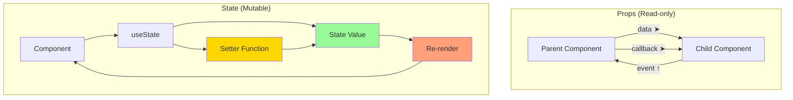

# State och Props: Hantera Data och Interaktivitet

State är vad som gör React-applikationer levande och interaktiva. Medan props låter oss skicka data nedåt i komponenthierarkin, ger state komponenter möjligheten att "komma ihåg" och reagera på förändringar.

**Mål:** Bemästra useState och useEffect hooks, förstå skillnaden mellan state och props, lära sig hantera props drilling och implementera Context API för global state.

## State vs Props: Fundamentala Skillnader



| Aspect | Props | State |
|--------|-------|-------|
| **Ägare** | Föräldrakomponent | Komponenten själv |
| **Mutabilitet** | Read-only | Kan ändras |
| **Syfte** | Skicka data till komponenter | Hantera lokal komponentdata |
| **Re-rendering** | Utlöses när props ändras | Utlöses när state ändras |

## useState Hook: Lokal State Management

`useState` är grunden för att hantera state i funktionella komponenter.

### Grundläggande Användning

```jsx
import { useState } from 'react';

function Counter() {
  // useState returnerar en array med [värde, setter-funktion]
  const [count, setCount] = useState(0); // 0 är initial value
  
  const increment = () => setCount(count + 1);
  const decrement = () => setCount(count - 1);
  const reset = () => setCount(0);

  return (
    <div className="counter">
      <h2>Räknare: {count}</h2>
      <button onClick={increment}>+</button>
      <button onClick={decrement}>-</button>
      <button onClick={reset}>Reset</button>
    </div>
  );
}
```

### Olika Typer av State

```jsx
function UserForm() {
  // Primitiva värden
  const [name, setName] = useState('');
  const [age, setAge] = useState(0);
  const [isSubscribed, setIsSubscribed] = useState(false);
  
  // Arrays
  const [hobbies, setHobbies] = useState([]);
  
  // Objekt
  const [user, setUser] = useState({
    firstName: '',
    lastName: '',
    email: ''
  });

  // Funktioner som initial value (för tunga beräkningar)
  const [expensiveValue, setExpensiveValue] = useState(() => {
    return someExpensiveCalculation();
  });

  const addHobby = (hobby) => {
    setHobbies([...hobbies, hobby]); // Skapa ny array
  };

  const updateUser = (field, value) => {
    setUser(prevUser => ({
      ...prevUser,    // Kopiera befintliga värden
      [field]: value  // Uppdatera specifikt fält
    }));
  };

  return (
    <form>
      <input
        type="text"
        value={user.firstName}
        onChange={(e) => updateUser('firstName', e.target.value)}
        placeholder="Förnamn"
      />
      <input
        type="text"
        value={user.lastName}
        onChange={(e) => updateUser('lastName', e.target.value)}
        placeholder="Efternamn"
      />
      <input
        type="email"
        value={user.email}
        onChange={(e) => updateUser('email', e.target.value)}
        placeholder="E-post"
      />
    </form>
  );
}
```

### State Batching och Funktionella Updates

```jsx
function AdvancedCounter() {
  const [count, setCount] = useState(0);

  // ❌ Problematiskt - baserat på nuvarande värde
  const incrementTwice = () => {
    setCount(count + 1);
    setCount(count + 1); // Fortfarande baserat på samma värde!
  };

  // ✅ Bättre - funktionell update
  const incrementTwiceProperly = () => {
    setCount(prev => prev + 1);
    setCount(prev => prev + 1); // Använder uppdaterat värde
  };

  // ✅ Batch updates automatiskt
  const handleMultipleUpdates = () => {
    setCount(prev => prev + 1);
    // React batchar dessa tillsammans
    console.log('This will run after all updates');
  };

  return (
    <div>
      <p>Count: {count}</p>
      <button onClick={incrementTwice}>+2 (Fel)</button>
      <button onClick={incrementTwiceProperly}>+2 (Rätt)</button>
    </div>
  );
}
```

## useEffect Hook: Side Effects och Lifecycle

`useEffect` hanterar "side effects" - allt som inte är direkt kopplat till rendering.

### Grundläggande useEffect Patterns

```jsx
import { useState, useEffect } from 'react';

function UserProfile({ userId }) {
  const [user, setUser] = useState(null);
  const [loading, setLoading] = useState(true);
  const [error, setError] = useState(null);

  // Pattern 1: Kör efter varje render
  useEffect(() => {
    console.log('Component rendered');
  });

  // Pattern 2: Kör bara en gång (componentDidMount)
  useEffect(() => {
    console.log('Component mounted');
  }, []); // Tom dependency array

  // Pattern 3: Kör när specifika värden ändras
  useEffect(() => {
    const fetchUser = async () => {
      try {
        setLoading(true);
        setError(null);
        
        const response = await fetch(`/api/users/${userId}`);
        if (!response.ok) throw new Error('Användare hittades inte');
        
        const userData = await response.json();
        setUser(userData);
      } catch (err) {
        setError(err.message);
      } finally {
        setLoading(false);
      }
    };

    if (userId) {
      fetchUser();
    }
  }, [userId]); // Kör när userId ändras

  // Pattern 4: Cleanup (componentWillUnmount)
  useEffect(() => {
    const timer = setInterval(() => {
      console.log('Timer tick');
    }, 1000);

    // Cleanup function
    return () => {
      clearInterval(timer);
      console.log('Timer cleared');
    };
  }, []);

  if (loading) return <div>Laddar...</div>;
  if (error) return <div>Fel: {error}</div>;
  if (!user) return <div>Ingen användare vald</div>;

  return (
    <div>
      <h2>{user.name}</h2>
      <p>{user.email}</p>
    </div>
  );
}
```

### useEffect Best Practices

```jsx
function SearchComponent() {
  const [query, setQuery] = useState('');
  const [results, setResults] = useState([]);
  const [loading, setLoading] = useState(false);

  useEffect(() => {
    // Undvik onödiga API-anrop
    if (!query.trim()) {
      setResults([]);
      return;
    }

    const searchTimer = setTimeout(async () => {
      setLoading(true);
      
      try {
        const response = await fetch(`/api/search?q=${encodeURIComponent(query)}`);
        const data = await response.json();
        setResults(data.results);
      } catch (error) {
        console.error('Search failed:', error);
        setResults([]);
      } finally {
        setLoading(false);
      }
    }, 300); // Debounce 300ms

    // Cleanup - avbryt föregående timer
    return () => clearTimeout(searchTimer);
  }, [query]);

  return (
    <div>
      <input
        type="text"
        value={query}
        onChange={(e) => setQuery(e.target.value)}
        placeholder="Sök..."
      />
      
      {loading && <p>Söker...</p>}
      
      <ul>
        {results.map(result => (
          <li key={result.id}>{result.title}</li>
        ))}
      </ul>
    </div>
  );
}
```

## Props Drilling: Problem och Lösningar

**Props drilling** uppstår när data behöver passas genom många komponentnivåer.

```jsx
// ❌ Props drilling problem
function App() {
  const [user, setUser] = useState({ name: 'Anna', theme: 'dark' });
  
  return (
    <div>
      <Header user={user} setUser={setUser} />
      <Main user={user} setUser={setUser} />
    </div>
  );
}

function Header({ user, setUser }) {
  return (
    <header>
      <Logo />
      <Navigation user={user} setUser={setUser} />
    </header>
  );
}

function Navigation({ user, setUser }) {
  return (
    <nav>
      <UserMenu user={user} setUser={setUser} />
    </nav>
  );
}

function UserMenu({ user, setUser }) {
  const toggleTheme = () => {
    setUser(prev => ({
      ...prev,
      theme: prev.theme === 'light' ? 'dark' : 'light'
    }));
  };

  return (
    <div>
      <span>Hej {user.name}!</span>
      <button onClick={toggleTheme}>
        Tema: {user.theme}
      </button>
    </div>
  );
}
```

## Context API: Global State Management

Context API löser props drilling genom att skapa en "global" state som komponenter kan accessa direkt.

```jsx
import { createContext, useContext, useState } from 'react';

// 1. Skapa Context
const UserContext = createContext();

// 2. Skapa Provider Component
function UserProvider({ children }) {
  const [user, setUser] = useState({
    name: 'Anna',
    theme: 'light',
    isAuthenticated: false
  });

  const login = (userData) => {
    setUser(prev => ({
      ...prev,
      ...userData,
      isAuthenticated: true
    }));
  };

  const logout = () => {
    setUser({
      name: '',
      theme: 'light',
      isAuthenticated: false
    });
  };

  const toggleTheme = () => {
    setUser(prev => ({
      ...prev,
      theme: prev.theme === 'light' ? 'dark' : 'light'
    }));
  };

  const value = {
    user,
    login,
    logout,
    toggleTheme
  };

  return (
    <UserContext.Provider value={value}>
      {children}
    </UserContext.Provider>
  );
}

// 3. Custom hook för att använda context
function useUser() {
  const context = useContext(UserContext);
  
  if (!context) {
    throw new Error('useUser must be used within UserProvider');
  }
  
  return context;
}

// 4. Använd Context i komponenter
function App() {
  return (
    <UserProvider>
      <div className="app">
        <Header />
        <Main />
        <Footer />
      </div>
    </UserProvider>
  );
}

function Header() {
  return (
    <header>
      <Logo />
      <Navigation />
    </header>
  );
}

// Ingen props drilling längre!
function Navigation() {
  const { user, toggleTheme, logout } = useUser();

  return (
    <nav>
      <span>Hej {user.name}!</span>
      <button onClick={toggleTheme}>
        Tema: {user.theme}
      </button>
      {user.isAuthenticated && (
        <button onClick={logout}>
          Logga ut
        </button>
      )}
    </nav>
  );
}

function Main() {
  const { user } = useUser();
  
  return (
    <main className={`theme-${user.theme}`}>
      {user.isAuthenticated ? (
        <Dashboard />
      ) : (
        <LoginForm />
      )}
    </main>
  );
}

function LoginForm() {
  const { login } = useUser();
  const [formData, setFormData] = useState({ name: '', email: '' });

  const handleSubmit = (e) => {
    e.preventDefault();
    login(formData);
  };

  return (
    <form onSubmit={handleSubmit}>
      <input
        type="text"
        value={formData.name}
        onChange={(e) => setFormData(prev => ({ ...prev, name: e.target.value }))}
        placeholder="Namn"
      />
      <input
        type="email"
        value={formData.email}
        onChange={(e) => setFormData(prev => ({ ...prev, email: e.target.value }))}
        placeholder="E-post"
      />
      <button type="submit">Logga in</button>
    </form>
  );
}
```

## Avancerade State Patterns

### Custom Hooks för State Logic

```jsx
// Custom hook för formulärhantering
function useForm(initialValues) {
  const [values, setValues] = useState(initialValues);
  const [errors, setErrors] = useState({});

  const setValue = (name, value) => {
    setValues(prev => ({ ...prev, [name]: value }));
    // Rensa fel när användaren rättar
    if (errors[name]) {
      setErrors(prev => ({ ...prev, [name]: '' }));
    }
  };

  const setError = (name, error) => {
    setErrors(prev => ({ ...prev, [name]: error }));
  };

  const reset = () => {
    setValues(initialValues);
    setErrors({});
  };

  return {
    values,
    errors,
    setValue,
    setError,
    reset
  };
}

// Custom hook för localStorage
function useLocalStorage(key, defaultValue) {
  const [value, setValue] = useState(() => {
    try {
      const item = window.localStorage.getItem(key);
      return item ? JSON.parse(item) : defaultValue;
    } catch (error) {
      console.error(`Error reading localStorage key "${key}":`, error);
      return defaultValue;
    }
  });

  const setStoredValue = (newValue) => {
    try {
      setValue(newValue);
      window.localStorage.setItem(key, JSON.stringify(newValue));
    } catch (error) {
      console.error(`Error setting localStorage key "${key}":`, error);
    }
  };

  return [value, setStoredValue];
}

// Användning av custom hooks
function UserPreferences() {
  const { values, setValue, errors, setError } = useForm({
    theme: 'light',
    language: 'sv',
    notifications: true
  });

  const [settings, setSettings] = useLocalStorage('userSettings', values);

  const handleSave = () => {
    if (!values.language) {
      setError('language', 'Språk är obligatoriskt');
      return;
    }

    setSettings(values);
    alert('Inställningar sparade!');
  };

  return (
    <div>
      <h2>Användarinställningar</h2>
      
      <select
        value={values.theme}
        onChange={(e) => setValue('theme', e.target.value)}
      >
        <option value="light">Ljust tema</option>
        <option value="dark">Mörkt tema</option>
      </select>

      <select
        value={values.language}
        onChange={(e) => setValue('language', e.target.value)}
      >
        <option value="">Välj språk</option>
        <option value="sv">Svenska</option>
        <option value="en">Engelska</option>
      </select>
      {errors.language && <span className="error">{errors.language}</span>}

      <label>
        <input
          type="checkbox"
          checked={values.notifications}
          onChange={(e) => setValue('notifications', e.target.checked)}
        />
        Aktivera notifikationer
      </label>

      <button onClick={handleSave}>Spara inställningar</button>
    </div>
  );
}
```

## Best Practices för State Management

### 1. Håll State så Lokalt som Möjligt

```jsx
// ❌ Onödig global state
function App() {
  const [modalOpen, setModalOpen] = useState(false);
  const [modalContent, setModalContent] = useState('');
  
  return (
    <div>
      <Header />
      <Main modalOpen={modalOpen} setModalOpen={setModalOpen} />
      {modalOpen && <Modal content={modalContent} />}
    </div>
  );
}

// ✅ Lokal state där den behövs
function ProductCard({ product }) {
  const [showDetails, setShowDetails] = useState(false);
  
  return (
    <div className="product-card">
      <h3>{product.name}</h3>
      <button onClick={() => setShowDetails(!showDetails)}>
        {showDetails ? 'Dölj' : 'Visa'} detaljer
      </button>
      {showDetails && <ProductDetails product={product} />}
    </div>
  );
}
```

### 2. Normalisera Komplex State

```jsx
// ❌ Nested state structure
const [state, setState] = useState({
  posts: [
    {
      id: 1,
      title: 'Post 1',
      author: { id: 1, name: 'Anna' },
      comments: [
        { id: 1, text: 'Bra inlägg!', author: { id: 2, name: 'Erik' } }
      ]
    }
  ]
});

// ✅ Normalized state structure
const [state, setState] = useState({
  posts: { 1: { id: 1, title: 'Post 1', authorId: 1, commentIds: [1] } },
  authors: { 1: { id: 1, name: 'Anna' }, 2: { id: 2, name: 'Erik' } },
  comments: { 1: { id: 1, text: 'Bra inlägg!', authorId: 2 } }
});
```

## Sammanfattning

State och props är grunden för interaktiva React-applikationer:

*   **useState** hanterar lokal komponentstate
*   **useEffect** hanterar side effects och lifecycle
*   **Props drilling** kan lösas med **Context API**
*   **Custom hooks** abstraherar återanvändbar state-logik
*   Håll state så lokalt som möjligt
*   Normalisera komplex data-strukturer

I nästa avsnitt lär vi oss bygga Single Page Applications med routing.
