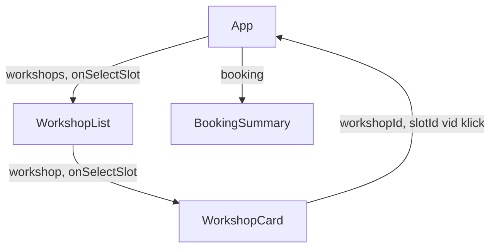

# Events och state: välj en workshop

Kulturverkstan visar nu workshops från data. I den här lektionen gör du listan interaktiv: besökaren kan filtrera, välja ett tillfälle och se en bokningssammanfattning.

> **Mål**
>
> Efter lektionen kan du:
>
> - reagera på events och spara ett värde med `useState`,
> - uppdatera state-objekt och state-arrayer utan mutation,
> - placera gemensam state i närmaste gemensamma förälder.

**Förkunskaper:** Din app har `WorkshopList`, `WorkshopCard` och workshopdata från föregående lektion.

**Efter lektionen har appen:** kategorifilter, valbara tider och en sammanfattning av det valda bokningssteget. Formuläret och de riktiga sidorna kommer senare.

## Börja med något som syns

State är en komponents minne. När state ändras renderar React komponenten igen med det nya värdet.

Lägg till en liten räknare i `src/App.jsx` för att prova:

<!-- react-playground -->
```jsx
import { useState } from "react";

export default function App() {
  const [participants, setParticipants] = useState(1);

  function increaseParticipants() {
    setParticipants((current) => current + 1);
  }

  return (
    <main>
      <h1>Kulturverkstan</h1>
      <p>Antal deltagare: {participants}</p>
      <button type="button" onClick={increaseParticipants}>
        Lägg till deltagare
      </button>
    </main>
  );
}
```

Klicka på knappen. Siffran ska ändras utan att sidan laddas om.

`useState(1)` ger två värden:

- `participants` är värdet i den aktuella renderingen.
- `setParticipants` ber React att spara ett nytt värde och rendera igen.

`onClick={increaseParticipants}` skickar funktionen till React. Skriv inte `onClick={increaseParticipants()}`; då körs den under renderingen i stället för vid klicket.

## Se → förutsäg → kör → ändra → kontrollera → förklara

### 1. Se: state uppdateras från föregående värde

```jsx
function increaseParticipants() {
  setParticipants((current) => current + 1);
}
```

Funktionen `current => current + 1` kallas en **funktionell uppdatering**. Den ska användas när nästa värde beror på det föregående.

### 2. Förutsäg

Svara innan du kör:

1. Vad står det efter tre klick om startvärdet är `1`?
2. Ändras variabeln direkt, eller ber setter-funktionen React om en ny rendering?
3. Vad skulle en “Minska”-knapp behöva göra?

### 3. Kör

Kör exemplet. Öppna React DevTools om det finns installerat och leta upp värdet `participants` i `App`.

### 4. Ändra

Lägg till knappen **Minska deltagare**. Antalet får inte bli lägre än 1.

<details>
<summary>Tips 1</summary>

Använd en funktionell uppdatering även när du minskar.

</details>

<details>
<summary>Tips 2</summary>

`Math.max(1, current - 1)` väljer det största av 1 och det uträknade värdet.

</details>

### 5. Kontrollera

- [ ] Båda knapparna ändrar siffran.
- [ ] Värdet kan inte bli 0 eller negativt.
- [ ] Event handlers skickas utan parenteser.
- [ ] Uppdateringarna använder den senaste staten.

### 6. Förklara

Förklara skillnaden mellan värdet `participants` och funktionen `setParticipants` med egna ord.

## Events skickar användarens val uppåt

Ett barn får fortfarande data via props. När något händer kan barnet anropa en funktion som också skickats via props.

Ändra `WorkshopCard.jsx`:

```jsx
export default function WorkshopCard({ workshop, onSelectSlot }) {
  return (
    <article>
      <p>{workshop.category}</p>
      <h3>{workshop.title}</h3>
      <p>{workshop.description}</p>
      <p>
        {workshop.durationMinutes} minuter · {workshop.priceSek} kr
      </p>

      <h4>Välj tid</h4>
      {workshop.slots.map((slot) => (
        <button
          key={slot.id}
          type="button"
          disabled={slot.placesLeft === 0}
          onClick={() => onSelectSlot(workshop.id, slot.id)}
        >
          {slot.label} · {slot.placesLeft} platser kvar
        </button>
      ))}
    </article>
  );
}
```

Pilen `() => onSelectSlot(workshop.id, slot.id)` skapar en funktion som körs först vid klicket. Den skickar två id:n uppåt. En fullbokad tid går inte att välja eftersom knappen är `disabled`.

Ändra `WorkshopList.jsx` så att funktionen förs vidare:

```jsx
import WorkshopCard from "./WorkshopCard.jsx";

export default function WorkshopList({ workshops, onSelectSlot }) {
  if (workshops.length === 0) {
    return <p>Inga workshops hittades.</p>;
  }

  return (
    <section aria-labelledby="workshops-heading">
      <h2 id="workshops-heading">Aktuella workshops</h2>
      {workshops.map((workshop) => (
        <WorkshopCard
          key={workshop.id}
          workshop={workshop}
          onSelectSlot={onSelectSlot}
        />
      ))}
    </section>
  );
}
```

Data går nedåt. Information om events går uppåt:


```mermaid
graph TD
  App -->|workshops, onSelectSlot| WorkshopList
  WorkshopList -->|workshop, onSelectSlot| WorkshopCard
  WorkshopCard -->|workshopId, slotId vid klick| App
  App -->|booking| BookingSummary
```

## Uppdatera ett objekt utan mutation

Bokningen har den form som resten av appen ska använda:

```text
Booking
├── workshopId
├── slotId
├── name
├── email
├── participants
└── message
```

Lägg state i `App`, eftersom både workshoplistan och den kommande sammanfattningen behöver valet:

```jsx
const [booking, setBooking] = useState({
  workshopId: "",
  slotId: "",
  name: "",
  email: "",
  participants: 1,
  message: "",
});

function handleSelectSlot(workshopId, slotId) {
  setBooking((current) => ({
    ...current,
    workshopId,
    slotId,
  }));
}
```

`...current` kopierar alla gamla fält. Raderna efteråt ersätter bara `workshopId` och `slotId`.

Skriv inte så här:

```jsx
// Fel: objektet i state muteras.
booking.slotId = slotId;
```

React behöver ett nytt objekt för att uppdateringen ska vara tydlig och förutsägbar.

## Lyft state till en gemensam förälder

Skapa `src/components/BookingSummary.jsx`:

```jsx
export default function BookingSummary({ booking, workshops }) {
  const workshop = workshops.find((item) => item.id === booking.workshopId);
  const slot = workshop
    ? workshop.slots.find((item) => item.id === booking.slotId)
    : undefined;

  if (!workshop || !slot) {
    return <p>Välj en ledig tid för att börja din bokning.</p>;
  }

  return (
    <aside aria-labelledby="summary-heading">
      <h2 id="summary-heading">Din bokning</h2>
      <p>Workshop: {workshop.title}</p>
      <p>Tid: {slot.label}</p>
      <p>Deltagare: {booking.participants}</p>
    </aside>
  );
}
```

`WorkshopList` och `BookingSummary` är syskon. Därför kan inget av dem ensamt äga den gemensamma staten. Deras närmaste gemensamma förälder, `App`, äger `booking` och skickar rätt props till båda.

En sammanhängande `App.jsx` ser nu ut så här:

```jsx
import { useState } from "react";
import BookingSummary from "./components/BookingSummary.jsx";
import WorkshopList from "./components/WorkshopList.jsx";
import { workshops } from "./data/workshops.js";

export default function App() {
  const [category, setCategory] = useState("Alla");
  const [booking, setBooking] = useState({
    workshopId: "",
    slotId: "",
    name: "",
    email: "",
    participants: 1,
    message: "",
  });

  const visibleWorkshops =
    category === "Alla"
      ? workshops
      : workshops.filter((workshop) => workshop.category === category);

  const selectedWorkshop = workshops.find(
    (workshop) => workshop.id === booking.workshopId,
  );
  const selectedSlot = selectedWorkshop
    ? selectedWorkshop.slots.find((slot) => slot.id === booking.slotId)
    : undefined;

  function handleSelectSlot(workshopId, slotId) {
    setBooking((current) => ({
      ...current,
      workshopId,
      slotId,
      participants: 1,
    }));
  }

  function changeParticipants(amount) {
    if (!selectedSlot) return;

    setBooking((current) => ({
      ...current,
      participants: Math.min(
        selectedSlot.placesLeft,
        Math.max(1, current.participants + amount),
      ),
    }));
  }

  function clearSelection() {
    setBooking((current) => ({
      ...current,
      workshopId: "",
      slotId: "",
      participants: 1,
    }));
  }

  return (
    <main>
      <h1>Kulturverkstan</h1>
      <p>Hitta en workshop och boka din plats.</p>

      <div aria-label="Filtrera workshops">
        {["Alla", "Hantverk", "Textil", "Foto"].map((item) => (
          <button
            key={item}
            type="button"
            aria-pressed={category === item}
            onClick={() => setCategory(item)}
          >
            {item}
          </button>
        ))}
      </div>

      <WorkshopList
        workshops={visibleWorkshops}
        onSelectSlot={handleSelectSlot}
      />

      <BookingSummary booking={booking} workshops={workshops} />

      {booking.slotId && (
        <div>
          <button
            type="button"
            disabled={booking.participants <= 1}
            onClick={() => changeParticipants(-1)}
          >
            Minska deltagare
          </button>
          <button
            type="button"
            disabled={
              !selectedSlot ||
              booking.participants >= selectedSlot.placesLeft
            }
            onClick={() => changeParticipants(1)}
          >
            Lägg till deltagare
          </button>
          <button type="button" onClick={clearSelection}>
            Rensa val
          </button>
        </div>
      )}
    </main>
  );
}
```

`visibleWorkshops` är inte state. Det räknas fram från `category` och `workshops` under varje rendering. Spara inte ett värde i state när React kan räkna fram det från annan data.

> **Måste kunna:** äg gemensam state i närmaste gemensamma förälder och skicka data nedåt samt event-funktioner uppåt.

## Uppdatera arrayer utan mutation

Ibland ligger en array i state. Följande fristående övning sparar id:n för workshops som besökaren vill jämföra:

```jsx
const [savedWorkshopIds, setSavedWorkshopIds] = useState([]);

function saveWorkshop(workshopId) {
  setSavedWorkshopIds((current) => [...current, workshopId]);
}

function removeWorkshop(workshopId) {
  setSavedWorkshopIds((current) =>
    current.filter((id) => id !== workshopId),
  );
}
```

- `[...current, workshopId]` skapar en ny array med ett nytt id sist.
- `filter` skapar en ny array utan det valda id:t.
- `map` används när ett värde i varje eller något arrayobjekt ska ersättas.

Undvik `push`, `pop`, `splice` och direkt tilldelning på en state-array. De muterar den befintliga arrayen.

## Bygg vidare med minskande stöd

### Följ med: markera valt filter

Kopiera filterknapparna från den kompletta `App`-koden. Klicka mellan **Alla**, **Hantverk**, **Textil** och **Foto**. Kontrollera både listan och `aria-pressed` i webbläsarens elementinspektör.

### Fyll i: återställ bokningen

Fyll i luckorna så att en knapp rensar workshop och tid men behåller resten av bokningen:

```jsx
function clearSelection() {
  setBooking((current) => ({
    _____,
    workshopId: _____,
    slotId: _____,
  }));
}
```

<details>
<summary>Lösningsförslag</summary>

```jsx
function clearSelection() {
  setBooking((current) => ({
    ...current,
    workshopId: "",
    slotId: "",
  }));
}
```

</details>

### Gör själv: testa deltagargränsen

**Bra att kunna:** Den kompletta `App`-koden hindrar redan besökaren från att
välja fler deltagare än det finns platser. Undersök och testa lösningen:

1. Välj keramiktiden som har två platser kvar.
2. Klicka på plus tills knappen blir inaktiverad.
3. Peka ut raden som använder `placesLeft` som högsta värde.
4. Rensa valet och kontrollera att deltagarantalet återställs till `1`.

**Klar när:** minus stannar på 1, plus stannar vid antalet lediga platser och sammanfattningen visar rätt antal.

<details>
<summary>Tips 1</summary>

Följ de två `find`-anropen som räknar fram `selectedWorkshop` och
`selectedSlot` i `App`.

</details>

<details>
<summary>Tips 2</summary>

Knappen kan använda `disabled={booking.participants >= selectedSlot.placesLeft}` när en vald tid finns.

</details>

## Felsök med flit

Ändra tillfälligt en knapp från:

```jsx
onClick={() => changeParticipants(1)}
```

till:

```jsx
onClick={changeParticipants(1)}
```

Förutsäg vad som händer, spara och läs sedan det första felet. Återställ den korrekta raden. Förklara varför React behöver få en funktion i `onClick`.

## Första hjälpen

| Symptom | Trolig orsak | Så kontrollerar du |
| --- | --- | --- |
| Funktionen körs direkt | Du anropar den i `onClick` | Skicka funktionsnamnet eller en arrow function |
| Klicket ändrar inget | Setter-funktionen anropas inte | Logga i event handlern och kontrollera propens namn |
| Andra bokningsfält försvinner | Det gamla objektet kopierades inte | Lägg `...current` först i det nya objektet |
| Listan eller sammanfattningen visar gammalt värde | En state-array eller ett state-objekt har muterats | Använd spread, `map` eller `filter` för en ny referens |
| Filtrering ger tom lista | Kategoritexten matchar inte data exakt | Jämför värden och stora/små bokstäver |
| `Cannot read properties of undefined` | Ingen workshop eller tid är vald ännu | Kontrollera att värdet finns innan du läser dess egenskaper |

## Checkpoint

Genomför hela flödet utan att titta på en färdig lösning:

1. Filtrera workshoppar på kategori.
2. Välj ett ledigt tillfälle i ett kort.
3. Visa workshop, tid och antal deltagare i `BookingSummary`.
4. Öka och minska deltagare utan att mutera bokningsobjektet.
5. Rensa valet med en egen knapp.
6. Skapa och rätta event-felet från felsökningsövningen.

**Klar när:** filtreringen fungerar för alla fyra val, en fullbokad tid går inte att välja, sammanfattningen uppdateras utan sidladdning, deltagarantalet håller sig mellan 1 och antalet lediga platser, valet kan rensas och du kan peka ut vilken komponent som äger varje state-värde.

> **Fördjupning:** Rita stateflödet på papper. Markera data nedåt med en färg och events uppåt med en annan. Context, reducers och custom hooks tas upp först i fördjupningsdelen.

## Sammanfattning och commit

- Events beskriver vad användaren gjorde.
- `useState` sparar värden mellan renderingar.
- Funktionella uppdateringar använder den senaste staten.
- State-objekt och state-arrayer ersätts med nya kopior; de muteras inte.
- Gemensam state lyfts till närmaste gemensamma förälder.

Spara steget i Git:

```bash
git add src
git commit -m "Lägg till val och state i bokningsflödet"
```

I nästa avsnitt bygger du det tillgängliga bokningsformuläret.
