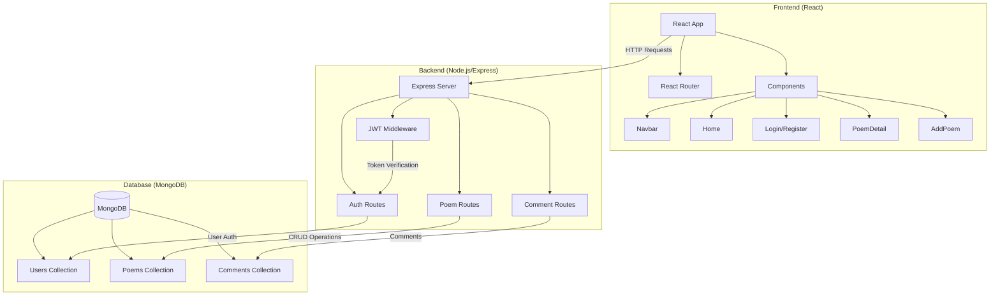
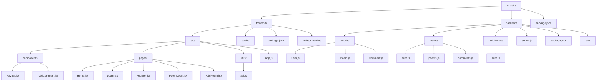
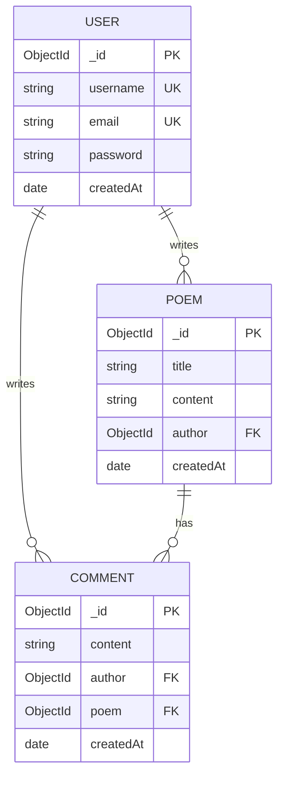
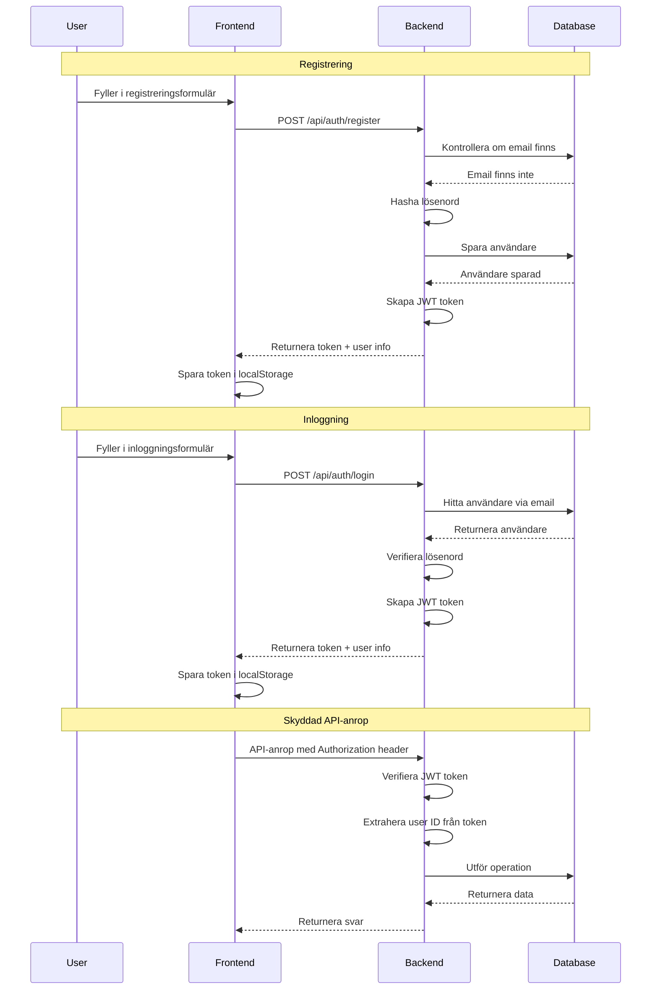
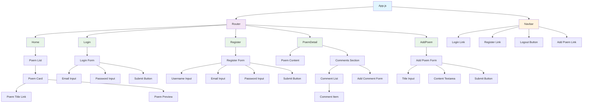
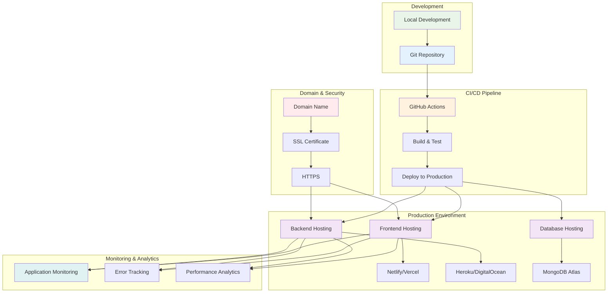

# Demo App - Poem Collector

# Projektbeskrivning

Vi ska bygga en Poesi-samlingsapp där användare kan registrera sig, logga in och dela sina egna dikter. Varje dikt är kopplad till en författare (användare), och andra användare kan kommentera på dikterna. Applikationen kommer att ha följande funktioner:
- Användarhantering: Registrering, inloggning och autentisering.
- Dikthantering: Skapa, läsa, uppdatera och ta bort dikter.
- Kommentarer: Användare kan kommentera på dikter.

Teknologier som används:
- React med React Router för enkel navigering.
- Node.js med Express, skriven med ES2015 (ES6) syntax som använder import istället för require.
- Databas: MongoDB med Mongoose för lagring av användare, dikter och kommentarer.



## Mappstruktur

Projektets mappstruktur kommer att organiseras enligt följande:
```
Projekt/
    frontend/
    backend/
    package.json
```
- frontend/: Innehåller all frontend-kod byggd med React.
- backend/: Innehåller all backend-kod med Express och MongoDB.
- package.json: I rotmappen för att hantera skript som påverkar både frontend och backend.

Skript i package.json:
- "setup": Installerar beroenden i både frontend och backend.
- "frontend-dev": Startar utvecklingsservern för frontend.
- "backend-dev": Startar utvecklingsservern för backend.



## Planering och arkitektur

### Funktioner

- Användarautentisering: Registrera och logga in användare med säker lösenordshantering.
- Dikthantering: CRUD-operationer (Create, Read, Update, Delete) för dikter.
- Kommentarssystem: Möjlighet att kommentera på dikter.
- Navigering: Användarvänlig navigering mellan olika sidor i applikationen.

### Databasschema

Vi använder MongoDB för att lagra data. Här är en översikt av databasschemat:

#### User

- username: String (unik och krävs)
- email: String (unik och krävs)
- password: String (hashad och krävs)
- createdAt: Date (standardvärde: aktuellt datum)

#### Poem

- title: String (krävs)
- content: String (krävs)
- author: ObjectId (referens till en användare)
- createdAt: Date (standardvärde: aktuellt datum)

#### Comment

- content: String (krävs)
- author: ObjectId (referens till en användare)
- poem: ObjectId (referens till en dikt)
- createdAt: Date (standardvärde: aktuellt datum)



## Setup av projektmiljö

Initialisera projektet

1.	Skapa projektmappen:
```bash
mkdir poesi-app
cd poesi-app
```

2.	Skapa frontend och backend-mappar:
```bash
mkdir frontend backend
```

3.	Initiera NPM i rotmappen:
```bash
npm init -y
```

4.	Uppdatera package.json med skript:
```json
{
  "scripts": {
    "setup": "cd frontend && npm install && cd ../backend && npm install",
    "frontend-dev": "cd frontend && npm run start",
    "backend-dev": "cd backend && npm run dev"
  }
}
```


Backend-setup

1.	Gå till backend-mappen och initiera NPM:
```bash
cd backend
npm init -y
```

2.	Installera beroenden:
```bash
npm install express mongoose bcrypt jsonwebtoken cors
```

3.	Installera utvecklingsberoenden:
```bash
npm install -D nodemon
```

4.	Uppdatera package.json skript:
```json
{
  "scripts": {
    "dev": "nodemon server.js"
  }
}
```


## Frontend-setup

1.	Gå till frontend-mappen och skapa en React-app:
```bash
cd ../frontend
npm create vite@latest # Välj React och javascript
```

2.	Installera React Router:

```bash
npm install react-router-dom
```

## Backend 

Vi börjar med att implementera och testa __poems__-rutterna och använder cURL för att verifiera funktionaliteten. När __poems__ fungerar korrekt, lägger vi till __users__ och autentisering med JSON Web Tokens (JWT). Slutligen implementerar vi __comments__.

## Projektmapp

1. Skapa en fil server.js i backend-mappen:
```bash
touch server.js
```
Lägg till följande kod i server.js:
```js
import express from 'express';
import mongoose from 'mongoose';
import cors from 'cors';
// TODO: Använd routes
//import poemRoutes from './routes/poems';

// Konfigurera miljövariabler
process.loadEnvFile()

// Skapa Express-applikationen
const server = express();

// Middleware
server.use(cors());
server.use(express.json());

// Test route
server.get('/', (req, res) => {
  res.json({message: "Hello from poem app!"});
})

// TODO: Använd routes
//server.use('/api/poems', poemRoutes);

// Anslut till MongoDB och starta servern
const PORT = process.env.PORT || 5000;

mongoose
  .connect(process.env.MONGODB_URI, { useNewUrlParser: true, useUnifiedTopology: true })
  .then(() => {
    server.listen(PORT, () => console.log(`Servern körs på port ${PORT}`));
  })
  .catch((error) => console.error(error));
```

3. Skapa .env-fil

Skapa en .env-fil i backend-mappen:
```bash
touch .env
```
Lägg till följande innehåll och ersätt din_mongodb_connection_string med din faktiska MongoDB-anslutningssträng:
```txt
MONGODB_URI=din_mongodb_connection_string
```
4. Starta Servern

Lägg till följande skript i din package.json:
```json
"scripts": {
  "start": "node server.js",
  "dev": "nodemon server.js"
}
```

Starta servern i utvecklingsläge:
```bash
npm run dev
```

Testa serverns test route:
```bash
curl localhost:3000 # Borde ge svaret {"message": "Hello from poem app!"}
```
Skapa Poem Model

Skapa en mapp models och skapa filen Poem.js:
```bash
mkdir models
touch models/Poem.js
```
Lägg till följande kod i models/Poem.js:
```js
import mongoose from 'mongoose';

const poemSchema = new mongoose.Schema({
  title: { type: String, required: true },
  content: { type: String, required: true },
  createdAt: { type: Date, default: Date.now },
});

export default mongoose.model('Poem', poemSchema);
```

### Implementera Poems Routes

Skapa en mapp routes och skapa filen poems.js:
```bash
mkdir routes
touch routes/poems.js
```
Lägg till följande kod i routes/poems.js:
```js
import express from 'express';
import Poem from '../models/Poem';
const router = express.Router();

// Hämta alla dikter
router.get('/', async (req, res) => {
  try {
    const poems = await Poem.find().sort({ createdAt: -1 });
    res.json(poems);
  } catch (error) {
    res.status(500).json({ message: 'Serverfel' });
  }
});

// Skapa en ny dikt
router.post('/', async (req, res) => {
  const { title, content } = req.body;
  try {
    const poem = new Poem({ title, content });
    await poem.save();
    res.status(201).json(poem);
  } catch (error) {
    res.status(400).json({ message: 'Invalid data' });
  }
});

export default router;
```

**Nu kan du kommentera in `poemRoutes` i `server.js`.**

Då har vi två routes för poems:
- `GET /api/poems`: hämtar alla dikter i databasen
- `POST /api/poems`: skapar en ny dikt med title och content

### Testa Poems Routes med cURL

Testa GET Request

Kör följande cURL-kommando i terminalen för att hämta alla dikter:
```bash
curl -X GET http://localhost:5000/api/poems
```

#### Förväntat Resultat

Eftersom databasen är tom bör du få en tom array:
```
[]
```
Testa POST Request

Skapa en ny dikt genom att skicka en POST-request:
```bash
curl -X POST http://localhost:5000/api/poems \
  -H "Content-Type: application/json" \
  -d '{
    "title": "Min Första Dikt",
    "content": "Detta är innehållet i min första dikt."
  }'
```
#### Förväntat Resultat

Du bör få tillbaka den skapade dikten med ett unikt _id:
```json
{
  "_id": "5f9d88b8b5e1b12d4c8e1a1e",
  "title": "Min Första Dikt",
  "content": "Detta är innehållet i min första dikt.",
  "createdAt": "2023-10-31T12:34:56.789Z",
  "__v": 0
}
```
Verifiera att Dikten Har Sparats

Kör GET-requesten igen:
```bash
curl -X GET http://localhost:5000/api/poems
```
#### Förväntat Resultat

Nu bör du se den nyligen skapade dikten i arrayen:
```json
[
  {
    "_id": "5f9d88b8b5e1b12d4c8e1a1e",
    "title": "Min Första Dikt",
    "content": "Detta är innehållet i min första dikt.",
    "createdAt": "2023-10-31T12:34:56.789Z",
    "__v": 0
  }
]
```
### Felhantering

Skicka Tomma Fält vid POST

Om du försöker skapa en dikt utan nödvändiga fält:
```bash
curl -X POST http://localhost:5000/api/poems \
  -H "Content-Type: application/json" \
  -d '{}'
```
#### Förväntat Resultat

Du bör få ett felmeddelande:
```json
{
  "message": "Invalid data"
}
```
Servern returnerar statuskod `400 Bad Request`.

### Lägga till Users och Autentisering

Nu när __poems__ fungerar korrekt, låt oss lägga till __users__ och autentisering med JSON Web Tokens.

## Autentisering

Autentisering handlar om att verifiera att en användare verkligen är den de utger sig för att vara. I webbutveckling är detta kritiskt för att skydda användares data och begränsa åtkomst till vissa funktioner.

JWT (JSON Web Tokens) är en modern standard för att hantera autentisering genom att:

Skapa en krypterad token när användaren loggar in
Låta klienten spara denna token
Skicka med token vid varje efterföljande request
Verifiera token på serversidan
Fördelar med JWT:

- Stateless: Servern behöver inte spara sessions-information
- Säkert: Tokens är signerade och kan inte manipuleras
- Flexibelt: Kan innehålla anpassad användardata
- Skalbart: Fungerar bra i från 10 till 1000000 användare

#### Ett typiskt JWT-flöde:

1. Användaren skickar inloggningsuppgifter 
```json
{email: "user@example.com", password: "123456"}
```
2. Servern verifierar och skapar en token 
```js
jwt.sign({userId: user._id}, "hemlig_nyckel"))
```
3. Klienten sparar token 
```js
localStorage.setItem('token', receivedToken)
```
4. Vid API-anrop inkluderas token 
```js
headers: { Authorization: 'Bearer ' + token }
```
5. Servern verifierar token innan den ger åtkomst till skyddade routes.

För att skydda routes använder vi middleware, som vi kan kalla `authMiddleware` som kontrollerar token innan förfrågan tillåts fortsätta. Detta ger oss ett elegant sätt att:

- Kontrollera behörighet
- Identifiera användaren
- Neka åtkomst för ogiltiga tokens



1. Installera Nödvändiga Paket
```bash
npm install bcrypt jsonwebtoken
```
2. Skapa User Model

Skapa filen models/User.js:
```bash
touch models/User.js
```
Lägg till följande kod:
```js
import mongoose from'mongoose';

const userSchema = new mongoose.Schema({
  username: { type: String, required: true, unique: true },
  email: { type: String, required: true, unique: true },
  password: { type: String, required: true },
  createdAt: { type: Date, default: Date.now },
});

export default mongoose.model('User', userSchema);
```
3. Skapa Auth Routes

Skapa filen routes/auth.js:
```bash
touch routes/auth.js
```
Lägg till följande kod:
```js
import express from 'express';
import bcrypt from 'bcrypt';
import jwt from 'jsonwebtoken';
import User from '../models/User';
const router = express.Router();

// Registrering
router.post('/register', async (req, res) => {
  const { username, email, password } = req.body;
  try {
    // Kontrollera om användaren redan finns
    const existingUser = await User.findOne({ email });
    if (existingUser) return res.status(400).json({ message: 'E-postadressen already exists' });

    // Hasha lösenordet
    const hashedPassword = await bcrypt.hash(password, 10);

    // Skapa ny användare
    const user = new User({ username, email, password: hashedPassword });
    await user.save();

    // Skapa JWT-token
    const token = jwt.sign({ id: user._id }, process.env.JWT_SECRET, { expiresIn: '1h' });

    res.status(201).json({ token, user: { id: user._id, username: user.username } });
  } catch (error) {
    res.status(500).json({ message: 'Serverfel' });
  }
});

// Inloggning
router.post('/login', async (req, res) => {
  const { email, password } = req.body;
  try {
    // Hitta användaren
    const user = await User.findOne({ email });
    if (!user) return res.status(400).json({ message: 'Användaren finns inte' });

    // Kontrollera lösenordet
    const isMatch = await bcrypt.compare(password, user.password);
    if (!isMatch) return res.status(400).json({ message: 'Fel lösenord' });

    // Skapa JWT-token
    const token = jwt.sign({ id: user._id }, process.env.JWT_SECRET, { expiresIn: '1h' });

    res.json({ token, user: { id: user._id, username: user.username } });
  } catch (error) {
    res.status(500).json({ message: 'Serverfel' });
  }
});

export default router;
```

4. Uppdatera .env-filen

Lägg till en hemlig nyckel för JWT:
```
JWT_SECRET=din_hemliga_nyckel
```
5. Uppdatera server.js

Importera och använd authRoutes:
```js
import authRoutes from './routes/auth';
server.use('/api/auth', authRoutes);
```
6. Skapa Autentiseringsmiddleware

Skapa filen middleware/auth.js:
```bash
mkdir middleware
touch middleware/auth.js
```
Lägg till följande kod:
```js
import jwt from 'jsonwebtoken';

function authMiddleware(req, res, next) {
  const token = req.header('Authorization')?.split(' ')[1];
  if (!token) return res.status(401).json({ message: 'No token provided, authorization denied' });

  try {
    const decoded = jwt.verify(token, process.env.JWT_SECRET);
    req.user = decoded;
    next();
  } catch (error) {
    res.status(400).json({ message: 'Invalid token' });
  }
};

export default {
  authMiddleware
}
```

7. Uppdatera Poems Routes för Att Kräva Autentisering vid Skapande

Uppdatera routes/poems.js:

```js
import authMiddleware from '../middleware/auth';

// Skapa en ny dikt
router.post('/', authMiddleware, async (req, res) => {
  const { title, content } = req.body;
  try {
    const poem = new Poem({ title, content, author: req.user.id });
    await poem.save();
    res.status(201).json(poem);
  } catch (error) {
    res.status(400).json({ message: 'Invalid data' });
  }
});
```

8. Testa Auth Routes med cURL

Registrering
```bash
curl -X POST http://localhost:5000/api/auth/register \
  -H "Content-Type: application/json" \
  -d '{
    "username": "användarnamn",
    "email": "email@example.com",
    "password": "lösenord"
  }'
```
Förväntat Resultat
```json
{
  "token": "JWT_TOKEN_HÄR",
  "user": {
    "id": "USER_ID_HÄR",
    "username": "användarnamn"
  }
}
```
Inloggning
```bash
curl -X POST http://localhost:5000/api/auth/login \
  -H "Content-Type: application/json" \
  -d '{
    "email": "email@example.com",
    "password": "lösenord"
  }'
```
Förväntat Resultat
```json
{
  "token": "JWT_TOKEN_HÄR",
  "user": {
    "id": "USER_ID_HÄR",
    "username": "användarnamn"
  }
}
```

### Felhantering

- Fel lösenord:
Om du anger fel lösenord vid inloggning får du:
```json
{
  "message": "Fel lösenord"
}
```

- Användaren finns inte:
Om e-postadressen inte finns i systemet:
```json
{
  "message": "Användaren finns inte"
}
```


9. Testa Skyddade Poems Routes med cURL

Använd JWT-token från inloggningen för att skapa en ny dikt.
```bash
curl -X POST http://localhost:5000/api/poems \
  -H "Content-Type: application/json" \
  -H "Authorization: Bearer JWT_TOKEN_HÄR" \
  -d '{
    "title": "En Dikt av En Inloggad Användare",
    "content": "Innehållet i dikten."
  }'
```
Förväntat Resultat

Den nya dikten bör skapas och returneras.

Felhantering

- Ingen Token:
Om du inte inkluderar Authorization-huvudet:
```json
{
  "message": "No token provided, authorization denied"
}
```

- Ogiltig token:
Om token är ogiltig eller utgått:
```json
{
  "message": "Invalid token"
}
```


## Implementera Comments

Nu när användarautentisering fungerar kan vi lägga till kommentarer.

1. Skapa Comment Model

Skapa filen models/Comment.js:
```bash
touch models/Comment.js
```
Lägg till följande kod:
```js
import mongoose from 'mongoose';

const commentSchema = new mongoose.Schema({
  content: { type: String, required: true },
  author: { type: mongoose.Schema.Types.ObjectId, ref: 'User' },
  poem: { type: mongoose.Schema.Types.ObjectId, ref: 'Poem' },
  createdAt: { type: Date, default: Date.now },
});

export default mongoose.model('Comment', commentSchema);
```
2. Skapa Comments Routes

Skapa filen routes/comments.js:
```bash
touch routes/comments.js
```
Lägg till följande kod:
```js
import express from 'express';
import Comment from '../models/Comment';
import authMiddleware from '../middleware/auth';
const router = express.Router();

// Lägg till en kommentar
router.post('/:poemId', authMiddleware, async (req, res) => {
  const { content } = req.body;
  const { poemId } = req.params;
  try {
    const comment = new Comment({ content, author: req.user.id, poem: poemId });
    await comment.save();
    res.status(201).json(comment);
  } catch (error) {
    res.status(400).json({ message: 'Invalid data' });
  }
});

// Hämta kommentarer för en dikt
router.get('/:poemId', async (req, res) => {
  const { poemId } = req.params;
  try {
    const comments = await Comment.find({ poem: poemId }).populate('author', 'username');
    res.json(comments);
  } catch (error) {
    res.status(500).json({ message: 'Serverfel' });
  }
});

module.exports = router;
```

3. Uppdatera server.js

Importera och använd commentRoutes:
```js
import commentRoutes from './routes/comments';

server.use('/api/comments', commentRoutes);
```
4. Testa Comments Routes med cURL

### Lägg till en Kommentar

Använd en giltig JWT-token för att lägga till en kommentar till en dikt med poemId.
```bash
curl -X POST http://localhost:5000/api/comments/POEM_ID_HÄR \
  -H "Content-Type: application/json" \
  -H "Authorization: Bearer JWT_TOKEN_HÄR" \
  -d '{
    "content": "Detta är en kommentar."
  }'
```
#### Förväntat Resultat

Den nya kommentaren bör skapas och returneras.

Hämta Kommentarer för en Dikt
```bash
curl -X GET http://localhost:5000/api/comments/POEM_ID_HÄR
```
#### Förväntat Resultat

En array av kommentarer för den specifika dikten returneras.

Felhantering

- Invalid data:
Om content saknas vid skapande av kommentar:
```json
{
  "message": "Invalid data"
}
```

- Serverfel:
Vid oväntade fel returneras:
```json
{
  "message": "Server error"
}
```

## Frontend-integration

## Strukturera frontend

- Komponenter:
    - Navbar: Navigeringsmeny.
    - Home: Startsida som visar alla dikter.
    - Login: Inloggningsformulär.
    - Register: Registreringsformulär.
    - PoemDetail: Visar en specifik dikt och dess kommentarer.
    - AddPoem: Formulär för att lägga upp en ny dikt.
    - AddComment: Formulär för att lägga till en kommentar.

### Implementera React Routes 

I App.js:
```js
import { BrowserRouter as Router, Route, Routes } from 'react-router-dom';
import Navbar from './components/Navbar';
import Home from './pages/Home';
import Login from './pages/Login';
import Register from './pages/Register';
import PoemDetail from './pages/PoemDetail';
import AddPoem from './pages/AddPoem';

function App() {
  return (
    <Router>
      <Navbar />
      <Routes>
        <Route path="/" exact component={Home} />
        <Route path="/login" component={Login} />
        <Route path="/register" component={Register} />
        <Route path="/poems/:id" component={PoemDetail} />
        <Route path="/add-poem" component={AddPoem} />
      </Routes>
    </Router>
  );
}

export default App;
```

Sedan skapar vi React komponenter för varje sida. Men vänta med backend integreringen.

Exempelvis `pages/Home.jsx`:

```js
import { Link } from 'react-router-dom';

function Home() {
  // Sample data for poems
  const poems = [
    { id: 1, title: 'The Road Not Taken' },
    { id: 2, title: 'Stopping by Woods on a Snowy Evening' },
  ];

  return (
    <div>
      <h1>Welcome to the Poetry App</h1>
      <ul>
        {poems.map(poem => (
          <li key={poem.id}>
            <Link to={`/poems/${poem.id}`}>{poem.title}</Link>
          </li>
        ))}
      </ul>
    </div>
  );
}

export default Home;
```

Försök sedan själv att implementera resten av sidorna. `Login.jsx`, `Register.jsx`, `PoemDetail.jsx`, `AddPoem.jsx`

## Anslutning till backend-API
Med fetch kan vi skicka HTTP-förfrågningar till vår backend. Eftersom merparten av en fetch HTTP request är identiskt är det hjälpsamt att ha en hjälpfunktion.

```js
// utils/api.js

const apiBaseUrl = 'http://localhost:3000/api';

function api(endpoint, options = {}) {
  const token = localStorage.getItem('token');

  // Sätt standardheaders
  const headers = {
    'Content-Type': 'application/json',
    ...options.headers,
  };

  // Lägg till Authorization-header om token finns
  if (token) {
    headers['Authorization'] = `Bearer ${token}`;
  }

  // Kombinera standardinställningar med inkommande options
  const config = {
    ...options,
    headers,
  };

  return fetch(`${apiBaseUrl}${endpoint}`, config)
    .then((response) => {
      if (!response.ok) {
        // Hantera fel genom att kasta ett undantag
        return response.json().then((error) => {
          throw error;
        });
      }
      // Returnera svarets JSON-data
      return response.json();
    })
    .catch((error) => {
      // Global felhantering (valfritt)
      console.error('API-fel:', error);
      throw error;
    });
}

export default api;
```


- Exempel på användning i en komponent:
```js
import { useEffect, useState } from 'react';
import api from '../utils/api';

function Home() {
  const [poems, setPoems] = useState([]);

  useEffect(() => {
    api.get('/poems')
      .then((response) => setPoems(response.data))
      .catch((error) => console.error(error));
  }, []);

  return (
    <main>
      <h1>Welcome to the Poetry App</h1>
      <ul>
        {poems.map(poem => (
          <li key={poem.id}>
            <Link to={`/poems/${poem.id}`}>{poem.title}</Link>
          </li>
        ))}
      </ul>
    </main>
  );
}

export default Home;
```




## Testning och felsökning

### Backend-testning

- Använd Postman eller Insomnia för att testa API-endpoints.
- Enhetstester: Implementera tester med Mocha eller Jest för kritiska funktioner.

### Frontend-testning

- Webbläsarens utvecklarverktyg: Inspektera element, nätverkstrafik och konsol för att hitta fel.
- React Developer Tools: För att inspektera komponenternas tillstånd och props.

### Vanliga problem

- CORS-fel: Se till att cors-middleware är korrekt konfigurerad i backend. Det bör räcka med att skriva `server.use(cors())` i `backend/server.js`
- Felaktig token: Kontrollera att token lagras och skickas korrekt.
- Databasanslutningsproblem: Verifiera MongoDB-anslutningssträngen och att databasen körs.

```mermaid
flowchart TD
    A[Problem upptäckt] --> B{Typ av problem?}
    
    B -->|Frontend| C[Kontrollera webbläsarens utvecklarverktyg]
    B -->|Backend| D[Kontrollera serverloggar]
    B -->|Database| E[Kontrollera databasanslutning]
    
    C --> C1[Inspektera Console för fel]
    C --> C2[Kontrollera Network tab]
    C --> C3[Kontrollera React DevTools]
    
    C1 --> F{JavaScript fel?}
    F -->|Ja| F1[Kontrollera syntax och imports]
    F -->|Nej| C2
    
    C2 --> G{CORS fel?}
    G -->|Ja| G1[Verifiera cors() middleware i backend]
    G -->|Nej| H{API-anrop misslyckas?}
    
    H -->|Ja| H1[Kontrollera API-endpoints]
    H -->|Nej| C3
    
    D --> D1[Kontrollera server.js konfiguration]
    D --> D2[Verifiera miljövariabler]
    D --> D3[Kontrollera routes och middleware]
    
    D1 --> I{Server startar inte?}
    I -->|Ja| I1[Kontrollera port och dependencies]
    I -->|Nej| D2
    
    D2 --> J{Miljövariabler saknas?}
    J -->|Ja| J1[Kontrollera .env fil]
    J -->|Nej| D3
    
    E --> E1[Verifiera MongoDB URI]
    E --> E2[Kontrollera databasstatus]
    E --> E3[Testa anslutning]
    
    E1 --> K{URI korrekt?}
    K -->|Nej| K1[Uppdatera MONGODB_URI]
    K -->|Ja| E2
    
    E2 --> L{Databas körs?}
    L -->|Nej| L1[Starta MongoDB]
    L -->|Ja| E3
    
    F1 --> M[Testa lösning]
    G1 --> M
    H1 --> M
    I1 --> M
    J1 --> M
    K1 --> M
    L1 --> M
    
    M --> N{Lösning fungerar?}
    N -->|Ja| O[Problem löst!]
    N -->|Nej| P[Gå tillbaka till relevant steg]
    
    P --> B
    
    style A fill:#ffebee
    style O fill:#e8f5e8
    style B fill:#fff3e0
    style C fill:#e3f2fd
    style D fill:#e3f2fd
    style E fill:#e3f2fd
```

## Deploying till produktion

### Backend-deploy

- Hosting: Använd en molntjänst som Heroku, DigitalOcean eller AWS.
- Miljövariabler: Konfigurera miljövariabler på servern för MONGODB_URI och JWT_SECRET.
- Bygg för produktion: Säkerställ att alla beroenden är installerade och att servern körs korrekt.

### Frontend-deploy

- Bygg frontend:
```bash
npm run build
```

- Hosting: Använd tjänster som Netlify, Vercel eller hosta statiska filer på samma server som backend.

### Domän och SSL

- Domännamn: Köp och konfigurera ett domännamn.
- SSL-certifikat: Använd Let’s Encrypt för att säkra applikationen med HTTPS.

### CI/CD-pipeline

- Automatiserad deployment: Använd GitHub Actions eller liknande för att automatisera bygg och deployment vid varje push till huvudgrenen.



Genom att följa denna guide har vi byggt en fullständig webbapplikation med en modern tech stack. Projektet täcker viktiga koncept som:
- Fullstack-utveckling med Node.js, Express och React.
- Hantering av användarautentisering med JWT.
- Kommunikation mellan frontend och backend med RESTful API:er.
- Databasinteraktion med MongoDB och Mongoose.
- Deployment av en fullständig applikation till produktion.

Detta projekt ger en praktisk inblick i att bygga skalbara och underhållbara webbapplikationer, vilket är en värdefull erfarenhet för alla blivande webbutvecklare.