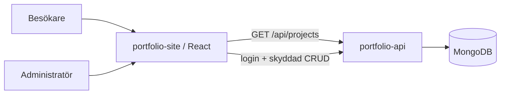

# Capstone: Fullstack-portfolio

Det här är kapitlets sammanhängande capstone efter övningarna. Du tar
`portfolio-api` som du nyss byggde och kopplar det till din befintliga
`portfolio-site`, eller till React-projektet från kapitel 8. Resultatet blir en
portfolio där besökare kan se projekt och där en administratör kan logga in för
att skapa, redigera och ta bort dem.

Du ska inte starta ett nytt, fristående tema. Fortsätt på samma domänmodell,
endpoints och säkerhetsregler som i övningarna.

## Slutprodukt

Applikationen har två tydliga lägen:

- **Publik portfolio:** visar projekt från API:et utan inloggning.
- **Administration:** låter en administratör logga in och hantera projekt.


```mermaid
flowchart LR
    V[Besökare] --> F[portfolio-site / React]
    A[Administratör] --> F
    F -->|GET /api/projects| E[portfolio-api]
    F -->|login + skyddad CRUD| E
    E --> M[(MongoDB)]
```

Frontend och backend kommunicerar med HTTP och JSON. Projektlistan uppdateras
när klienten gör ett nytt API-anrop. Det är inte en realtidslösning.

## Arkitektur och ansvar

### Frontend

- renderar en publik projektlista
- visar laddnings-, tom- och feltillstånd
- innehåller ett adminformulär för inloggning
- skickar JWT i `Authorization` vid skrivande anrop
- visar formulär för att skapa och redigera projekt
- uppdaterar lokal vy efter create, update och delete

### Backend

- exponerar ett dokumenterat REST-kontrakt
- validerar all inkommande projektdata
- lagrar projekt och admin i MongoDB
- hashar adminlösenord med bcrypt
- utfärdar och verifierar kortlivade JWT
- håller läsning publik och skyddar alla ändringar
- tillåter endast konfigurerade frontend-origins med CORS

## Föreslagen mappstruktur

Följande visar ansvarsgränserna; behåll gärna frontendens befintliga filnamn.

```text
fullstack-portfolio/
├── portfolio-site/
│   ├── src/
│   │   ├── api/
│   │   │   └── client.js
│   │   ├── components/
│   │   │   ├── ProjectList.jsx
│   │   │   ├── ProjectForm.jsx
│   │   │   └── AdminLogin.jsx
│   │   └── App.jsx
│   ├── .env.example
│   └── package.json
└── portfolio-api/
    ├── src/
    │   ├── config/
    │   │   └── database.js
    │   ├── middleware/
    │   │   ├── authenticate.js
    │   │   └── errorHandler.js
    │   ├── models/
    │   │   ├── Admin.js
    │   │   └── Project.js
    │   ├── routes/
    │   │   ├── auth.js
    │   │   └── projects.js
    │   ├── app.js
    │   └── server.js
    ├── test/
    │   └── projects.test.js
    ├── scripts/
    │   └── seedAdmin.js
    ├── .env.example
    └── package.json
```

## Backendens endpoint-kontrakt

Bestäm kontraktet innan frontend byggs. Då kan båda delarna utvecklas mot samma
förväntningar.

| Metod | Endpoint | Behörighet | Lyckat svar |
|---|---|---|---|
| `GET` | `/api/health` | Publik | `200` statusobjekt |
| `GET` | `/api/projects` | Publik | `200` array |
| `GET` | `/api/projects/:id` | Publik | `200` projekt |
| `POST` | `/api/auth/login` | Publik | `200` token |
| `POST` | `/api/projects` | Admin | `201` skapat projekt |
| `PATCH` | `/api/projects/:id` | Admin | `200` uppdaterat projekt |
| `DELETE` | `/api/projects/:id` | Admin | `204` utan body |

Ett projekt representeras exempelvis så här:

```json
{
  "_id": "66a1234567890abcdef1234",
  "title": "Tillgänglig väderapp",
  "description": "En responsiv prognosapp med tangentbordsstöd.",
  "technologies": ["React", "Express", "MongoDB"],
  "imageUrl": "https://example.com/weather.webp",
  "repositoryUrl": "https://github.com/example/weather",
  "liveUrl": "https://weather.example.com",
  "featured": true,
  "createdAt": "2026-07-11T10:00:00.000Z",
  "updatedAt": "2026-07-11T10:00:00.000Z"
}
```

Fel ska ha ett konsekvent format:

```json
{
  "error": "Projektet finns inte"
}
```

## Milstolpe 1: stabilisera API-grunden

Utgå från övning 2. Supertest ska kunna importera appen utan att öppna en port.

`src/app.js`:

```javascript
import cors from 'cors';
import express from 'express';
import helmet from 'helmet';
import projectsRouter from './routes/projects.js';
import authRouter from './routes/auth.js';
import { errorHandler } from './middleware/errorHandler.js';

const app = express();

const allowedOrigins = (process.env.FRONTEND_URLS || '')
  .split(',')
  .map(origin => origin.trim())
  .filter(Boolean);

app.use(helmet());
app.use(cors({
  origin(origin, callback) {
    if (!origin || allowedOrigins.includes(origin)) {
      return callback(null, true);
    }
    callback(new Error('Origin tillåts inte av CORS'));
  }
}));
app.use(express.json({ limit: '100kb' }));

app.get('/api/health', (req, res) => {
  res.json({ status: 'ok', service: 'portfolio-api' });
});

app.use('/api/auth', authRouter);
app.use('/api/projects', projectsRouter);

app.use('/api', (req, res) => {
  res.status(404).json({ error: 'Endpointen finns inte' });
});

app.use(errorHandler);

export default app;
```

`src/server.js`:

```javascript
import 'dotenv/config';
import mongoose from 'mongoose';
import app from './app.js';

const port = process.env.PORT || 3000;

try {
  await mongoose.connect(process.env.MONGODB_URI);
  app.listen(port, () => console.log(`portfolio-api körs på port ${port}`));
} catch (error) {
  console.error('Databasanslutningen misslyckades', error);
  process.exit(1);
}
```

### Checkpoint 1

- Health endpoint svarar utan databasdata i svaret.
- Okända API-routes ger JSON och `404`.
- Servern startar inte om MongoDB-anslutningen misslyckas.
- Frontendens lokala origin finns i `FRONTEND_URLS`.

## Milstolpe 2: publik projektlista

Implementera först läsflödet från databas till skärm. Besökaren ska inte behöva
ett konto eller en token.

En representativ publik route:

```javascript
import { Router } from 'express';
import Project from '../models/Project.js';

const router = Router();

router.get('/', async (req, res, next) => {
  try {
    const projects = await Project.find().sort({
      featured: -1,
      createdAt: -1
    });
    res.json(projects);
  } catch (error) {
    next(error);
  }
});

export default router;
```

Frontendens API-klient kan centralisera basadress och felhantering:

```javascript
const apiBaseUrl = import.meta.env.VITE_API_URL;

async function parseResponse(response) {
  if (response.status === 204) return null;

  const data = await response.json();
  if (!response.ok) {
    throw new Error(data.error || 'API-anropet misslyckades');
  }
  return data;
}

export async function getProjects() {
  const response = await fetch(`${apiBaseUrl}/api/projects`);
  return parseResponse(response);
}
```

I React:

```jsx
import { useEffect, useState } from 'react';
import { getProjects } from './api/client.js';

export function ProjectList() {
  const [state, setState] = useState({
    projects: [],
    loading: true,
    error: ''
  });

  useEffect(() => {
    getProjects()
      .then(projects => setState({ projects, loading: false, error: '' }))
      .catch(error => setState({
        projects: [],
        loading: false,
        error: error.message
      }));
  }, []);

  if (state.loading) return <p>Laddar projekt…</p>;
  if (state.error) return <p role="alert">{state.error}</p>;
  if (!state.projects.length) return <p>Inga projekt publicerade ännu.</p>;

  return (
    <section aria-labelledby="projects-heading">
      <h2 id="projects-heading">Projekt</h2>
      {state.projects.map(project => (
        <article key={project._id}>
          <h3>{project.title}</h3>
          <p>{project.description}</p>
          <p>{project.technologies.join(', ')}</p>
        </article>
      ))}
    </section>
  );
}
```

### Checkpoint 2

- En ny webbläsarsession kan läsa projekt utan token.
- Laddning, tom lista och nätverksfel har synliga tillstånd.
- Listans nyckel är MongoDB-fältet `_id`.
- API-adressen kommer från miljön, inte från hårdkodad produktionsadress.

## Milstolpe 3: admininloggning

Administratören skapas med ett lokalt seed-skript eller en skyddad
driftsprocess. Lägg inte till publik registrering i den här capstonen.

Inloggningsrouten verifierar hash och ger en kortlivad token:

```javascript
import { Router } from 'express';
import jwt from 'jsonwebtoken';
import Admin from '../models/Admin.js';

const router = Router();

router.post('/login', async (req, res, next) => {
  try {
    const admin = await Admin
      .findOne({ email: req.body.email })
      .select('+passwordHash');

    const valid = admin && await admin.verifyPassword(req.body.password);
    if (!valid) {
      return res.status(401).json({ error: 'Fel e-post eller lösenord' });
    }

    const token = jwt.sign(
      { sub: admin.id, role: 'admin' },
      process.env.JWT_SECRET,
      { expiresIn: '1h' }
    );

    res.json({ token });
  } catch (error) {
    next(error);
  }
});

export default router;
```

Håll helst token i React state eller annan minnesbaserad state:

```jsx
const [token, setToken] = useState('');

async function login(credentials) {
  const response = await fetch(`${apiBaseUrl}/api/auth/login`, {
    method: 'POST',
    headers: { 'Content-Type': 'application/json' },
    body: JSON.stringify(credentials)
  });
  const data = await parseResponse(response);
  setToken(data.token);
}
```

Minneslagring betyder att administratören får logga in igen efter omladdning,
men token lämnas inte kvar i beständig webbläsarlagring. `localStorage` är
enklare för beständig inloggning men JavaScript på sidan kan läsa värdet. En
XSS-sårbarhet kan därför stjäla token. Använd inte `localStorage` som om det
vore en säker hemlighetsbehållare. Ett mer avancerat alternativ är en säker,
`HttpOnly`, `Secure`, `SameSite`-cookie tillsammans med CSRF-skydd.

### Checkpoint 3

- Fel e-post och fel lösenord ger samma generella svar.
- Token innehåller inte lösenord eller lösenordshash.
- Token försvinner vid omladdning om du valt minneslagring.
- Adminvyn visas bara efter lyckad inloggning.

## Milstolpe 4: skyddad administration

Återanvänd samma autentiseringsmiddleware på alla skrivande routes:

```javascript
import jwt from 'jsonwebtoken';

export function authenticateAdmin(req, res, next) {
  const [scheme, token] = (req.headers.authorization || '').split(' ');

  if (scheme !== 'Bearer' || !token) {
    return res.status(401).json({ error: 'Autentisering krävs' });
  }

  try {
    const payload = jwt.verify(token, process.env.JWT_SECRET);
    if (payload.role !== 'admin') {
      return res.status(403).json({ error: 'Åtkomst nekad' });
    }
    req.auth = payload;
    next();
  } catch {
    res.status(401).json({ error: 'Ogiltig eller utgången token' });
  }
}
```

Frontendklienten skickar token endast när det behövs:

```javascript
export async function saveProject(project, token, id = '') {
  const response = await fetch(`${apiBaseUrl}/api/projects/${id}`, {
    method: id ? 'PATCH' : 'POST',
    headers: {
      'Content-Type': 'application/json',
      Authorization: `Bearer ${token}`
    },
    body: JSON.stringify(project)
  });
  return parseResponse(response);
}

export async function deleteProject(id, token) {
  const response = await fetch(`${apiBaseUrl}/api/projects/${id}`, {
    method: 'DELETE',
    headers: { Authorization: `Bearer ${token}` }
  });
  return parseResponse(response);
}
```

Efter en mutation kan du antingen uppdatera React state med API-svaret eller
hämta listan igen. Vid `401` ska frontend rensa token och visa inloggningen.
Frontendens dolda knappar är bara användargränssnitt; det är backendens
middleware som upprätthåller säkerheten.

### Checkpoint 4

- Admin kan skapa, redigera och ta bort ett projekt.
- Besökaren kan fortfarande bara läsa.
- Ett direkt skrivande API-anrop utan token ger `401`.
- Listan visar den senaste serverdatan efter varje ändring.

## Milstolpe 5: tester och felvägar

Behåll testerna från övning 4 och komplettera dem med projektets viktigaste
kontrakt:

- health endpoint ger `200`
- projektlistan är publik
- valideringsfel ger `400`
- okänt projekt ger `404`
- POST, PATCH och DELETE ger `401` utan token
- admin-token tillåter samtliga skrivande operationer
- DELETE ger `204` utan JSON-body
- felaktig och utgången token avvisas

Testa även frontend manuellt:

1. Stoppa backend och kontrollera frontendens felmeddelande.
2. Starta backend och kontrollera tomt tillstånd.
3. Logga in och skapa ett projekt.
4. Ladda om sidan och kontrollera att projektet finns kvar.
5. Redigera projektet och kontrollera publik vy.
6. Ta bort projektet och kontrollera att det försvinner.

### Checkpoint 5

- Backendtesterna använder en separat testdatabas.
- Tester kan köras upprepade gånger utan kvarvarande testdata.
- Frontend fastnar inte i ett evigt laddningstillstånd vid fel.
- API-fel visas begripligt utan att läcka stack traces.

## CORS och miljövariabler

`cors()` utan begränsning är bekvämt lokalt men för brett för den här
produktionen. Använd en kommaseparerad allowlist:

```text
FRONTEND_URLS=http://localhost:5173,https://portfolio.example.com
```

Backendens `.env.example`:

```text
PORT=3000
MONGODB_URI=mongodb://127.0.0.1:27017/portfolio
JWT_SECRET=replace-with-a-long-random-value
JWT_EXPIRES_IN=1h
FRONTEND_URLS=http://localhost:5173
ADMIN_EMAIL=admin@example.com
ADMIN_PASSWORD=replace-only-when-seeding
```

Frontendens `.env.example`:

```text
VITE_API_URL=http://localhost:3000
```

Variabler med prefixet `VITE_` byggs in i frontendpaketet och är synliga för
besökaren. Lägg därför aldrig `JWT_SECRET`, databas-URI eller adminlösenord där.

## Deployment-checklista

### Backend och databas

- [ ] Sätt `NODE_ENV=production`.
- [ ] Sätt en unik, lång `JWT_SECRET` i plattformens secret-hantering.
- [ ] Sätt produktionsvärdet för `MONGODB_URI`.
- [ ] Begränsa databasens nätverksåtkomst och använd en egen databasanvändare.
- [ ] Sätt exakt produktionsorigin i `FRONTEND_URLS`.
- [ ] Kör tester före deployment.
- [ ] Kontrollera att startkommandot är `npm start`.
- [ ] Kontrollera `/api/health` över HTTPS efter deployment.
- [ ] Seed:a admin en gång och ta bort tillfälligt adminlösenord ur miljön.

### Frontend

- [ ] Sätt `VITE_API_URL` till backendens publika HTTPS-adress.
- [ ] Bygg med `npm run build`.
- [ ] Kontrollera att inga hemligheter finns i den byggda JavaScript-koden.
- [ ] Testa projektlista, login och CRUD från produktionsdomänen.
- [ ] Kontrollera responsivitet, tangentbordsnavigering och felmeddelanden.

## Acceptanskriterier

Capstonen är klar när:

- den befintliga portfolion visar projekt hämtade från MongoDB via API:et
- `GET /api/projects` fungerar utan autentisering
- admin kan logga in med ett hashat, seed:at konto
- POST, PATCH och DELETE kräver en giltig admin-JWT
- formulären valideras både i frontend och backend
- lyckade ändringar syns i den publika listan efter ett nytt API-anrop
- frontend hanterar laddning, tom data, `401` och nätverksfel
- CORS använder en miljöstyrd allowlist
- hemligheter saknas i repository och frontendbundle
- backendens centrala flöden täcks av Jest och Supertest
- både frontend och backend fungerar via HTTPS i produktionsmiljön

## Slutlig checkpoint

Demonstrera hela flödet för en annan person:

1. Öppna den publika portfolion och visa projekten.
2. Logga in som administratör.
3. Skapa ett projekt och visa det i publik vy.
4. Redigera projektet och ladda om sidan.
5. Ta bort projektet.
6. Visa ett avvisat skrivförsök utan token.
7. Kör backendens testsvit.

Du har nu en enda sammanhängande fullstackprodukt från Express och MongoDB till
React, autentisering, testning och deployment. Om du senare vill lägga till
serverdrivna uppdateringar kan du fortsätta med
[WebSockets i kapitel 10](../kapitel_10/websockets.md); nuvarande lösning gör
vanliga HTTP-anrop och ska inte beskrivas som realtid.
