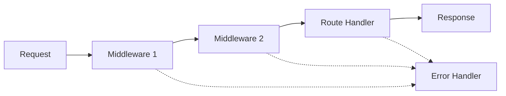

# Express.js - Webbramverk för Node.js

Express.js är det mest populära webbramverket för Node.js. Det gör det enkelt att bygga webbapplikationer och API:er med minimal kod och maximal flexibilitet. Express kallas ofta "det minimala och flexibla Node.js-webbramverket" - det ger dig de verktyg du behöver utan att vara i vägen.

## Vad är Express.js?

Express.js är ett snabbt, minimalt och flexibelt webbramverk för Node.js som tillhandahåller:

- **Routing**: Hantera olika URL:er och HTTP-metoder
- **Middleware support**: Modulär requesthantering 
- **Template engines**: Dynamisk HTML-generering
- **Static file serving**: Servera CSS, bilder och JavaScript-filer
- **Error handling**: Robust felhantering
- **HTTP utilities**: Förenklade verktyg för HTTP-förfrågningar

### Varför använda Express?

```javascript
// Utan Express - ren Node.js
const http = require('http');
const url = require('url');

const server = http.createServer((req, res) => {
  const parsedUrl = url.parse(req.url, true);
  
  if (parsedUrl.pathname === '/' && req.method === 'GET') {
    res.writeHead(200, { 'Content-Type': 'text/html' });
    res.end('<h1>Välkommen!</h1>');
  } else if (parsedUrl.pathname === '/api/users' && req.method === 'GET') {
    res.writeHead(200, { 'Content-Type': 'application/json' });
    res.end(JSON.stringify({ users: [] }));
  } else {
    res.writeHead(404, { 'Content-Type': 'text/plain' });
    res.end('Sidan finns inte');
  }
});

// Med Express - samma funktionalitet
const express = require('express');
const app = express();

app.get('/', (req, res) => {
  res.send('<h1>Välkommen!</h1>');
});

app.get('/api/users', (req, res) => {
  res.json({ users: [] });
});

app.listen(3000);
```

## Installation och Setup

### Installera Express

```bash
# Skapa nytt projekt
mkdir min-express-app
cd min-express-app

# Initiera npm
npm init -y

# Installera Express
npm install express

# Installera utvecklingsverktyg (valfritt men rekommenderat)
npm install --save-dev nodemon
```

### Din första Express-applikation

Skapa `app.js`:

```javascript
const express = require('express');
const app = express();
const PORT = 3000;

// Grundläggande route
app.get('/', (req, res) => {
  res.send('Hej från Express!');
});

// Starta servern
app.listen(PORT, () => {
  console.log(`Servern körs på http://localhost:${PORT}`);
});
```

Kör applikationen:
```bash
node app.js
```

## Routing i Express

Routing bestämmer hur applikationen svarar på olika endpoint-förfrågningar.

### Grundläggande Routes

```javascript
const express = require('express');
const app = express();

// GET route
app.get('/', (req, res) => {
  res.send('GET request till startsidan');
});

// POST route
app.post('/users', (req, res) => {
  res.send('POST request för att skapa användare');
});

// PUT route
app.put('/users/:id', (req, res) => {
  res.send(`PUT request för användare ${req.params.id}`);
});

// DELETE route
app.delete('/users/:id', (req, res) => {
  res.send(`DELETE request för användare ${req.params.id}`);
});

// Route som matchar alla HTTP-metoder
app.all('/secret', (req, res) => {
  res.send('Åtkomst till hemlig sektion!');
});
```

### Route Parameters

```javascript
// Grundläggande parameter
app.get('/users/:id', (req, res) => {
  const userId = req.params.id;
  res.send(`Användare ID: ${userId}`);
});

// Flera parametrar
app.get('/users/:userId/posts/:postId', (req, res) => {
  const { userId, postId } = req.params;
  res.json({ userId, postId });
});

// Valfria parametrar
app.get('/posts/:year/:month?', (req, res) => {
  const { year, month } = req.params;
  res.json({ year, month: month || 'alla månader' });
});

// Regex patterns
app.get('/files/*', (req, res) => {
  const filePath = req.params[0];
  res.send(`Filsökväg: ${filePath}`);
});
```

### Query Parameters

```javascript
// URL: /search?q=express&category=web&sort=date
app.get('/search', (req, res) => {
  const { q, category, sort } = req.query;
  
  res.json({
    searchTerm: q,
    category: category || 'alla',
    sortBy: sort || 'relevans'
  });
});

// Med standardvärden och validering
app.get('/products', (req, res) => {
  const page = parseInt(req.query.page) || 1;
  const limit = parseInt(req.query.limit) || 10;
  const category = req.query.category;
  
  // Validering
  if (page < 1 || limit < 1 || limit > 100) {
    return res.status(400).json({ 
      error: 'Ogiltiga parametrar' 
    });
  }
  
  res.json({ page, limit, category });
});
```

## Middleware i Express

Middleware är funktioner som körs under request-response-cykeln. De kan:
- Köra kod
- Modifiera request och response-objekten  
- Avsluta request-response-cykeln
- Anropa nästa middleware i stacken



### Inbyggt Middleware

```javascript
const express = require('express');
const app = express();

// Parsa JSON-requests
app.use(express.json());

// Parsa URL-encoded data (formulär)
app.use(express.urlencoded({ extended: true }));

// Servera statiska filer
app.use(express.static('public'));

// Servera statiska filer från specifik sökväg
app.use('/assets', express.static('public'));
```

### Custom Middleware

```javascript
// Logging middleware
const logger = (req, res, next) => {
  const timestamp = new Date().toISOString();
  console.log(`${timestamp} - ${req.method} ${req.url}`);
  next(); // Viktigt! Anropa next() för att fortsätta
};

// Använd middleware globalt
app.use(logger);

// Autentiserings-middleware
const requireAuth = (req, res, next) => {
  const token = req.headers.authorization;
  
  if (!token) {
    return res.status(401).json({ error: 'Token required' });
  }
  
  // Verifiera token (förenklad)
  if (token === 'Bearer valid-token') {
    req.user = { id: 1, name: 'John Doe' };
    next();
  } else {
    res.status(403).json({ error: 'Invalid token' });
  }
};

// Använd middleware för specifika routes
app.get('/profile', requireAuth, (req, res) => {
  res.json({ user: req.user });
});
```

### Middleware för felhantering

```javascript
// Error-handling middleware (måste ha 4 parametrar)
const errorHandler = (err, req, res, next) => {
  console.error(err.stack);
  
  // Olika feltyper
  if (err.name === 'ValidationError') {
    return res.status(400).json({ error: 'Valideringsfel' });
  }
  
  if (err.name === 'CastError') {
    return res.status(400).json({ error: 'Ogiltigt ID-format' });
  }
  
  // Generiskt fel
  res.status(500).json({ error: 'Något gick fel!' });
};

// Placera error handler sist
app.use(errorHandler);

// Async error handling
const asyncHandler = (fn) => {
  return (req, res, next) => {
    Promise.resolve(fn(req, res, next)).catch(next);
  };
};

app.get('/async-route', asyncHandler(async (req, res) => {
  const data = await someAsyncOperation();
  res.json(data);
}));
```

## Response-metoder

Express ger flera metoder för att skicka svar:

```javascript
app.get('/examples', (req, res) => {
  // Olika response-metoder
  res.send('Text eller HTML');
  res.json({ key: 'value' });
  res.status(404).send('Inte hittad');
  res.redirect('/other-page');
  res.sendFile(__dirname + '/index.html');
});

// Kedja metoder
app.get('/api/users', (req, res) => {
  res
    .status(200)
    .set('Content-Type', 'application/json')
    .json({ users: [] });
});

// Sätt headers
app.get('/api/data', (req, res) => {
  res.set({
    'Content-Type': 'application/json',
    'X-Custom-Header': 'MinApplikation'
  });
  res.json({ data: 'värde' });
});
```

## Router för modulär kod

Express Router låter dig skapa modulära route-handlers:

```javascript
// routes/users.js
const express = require('express');
const router = express.Router();

// Middleware för alla user-routes
router.use((req, res, next) => {
  console.log('User route accessed');
  next();
});

// Routes
router.get('/', (req, res) => {
  res.json({ users: [] });
});

router.get('/:id', (req, res) => {
  res.json({ user: { id: req.params.id } });
});

router.post('/', (req, res) => {
  res.status(201).json({ message: 'Användare skapad' });
});

module.exports = router;

// app.js
const userRoutes = require('./routes/users');
app.use('/api/users', userRoutes);
```

## Praktiskt exempel: Todo API

Låt oss bygga ett komplett Todo API:

```javascript
const express = require('express');
const app = express();

// Middleware
app.use(express.json());

// In-memory data (i verkligheten använd databas)
let todos = [
  { id: 1, text: 'Lär dig Express', completed: false },
  { id: 2, text: 'Bygg ett API', completed: false }
];

let nextId = 3;

// GET alla todos
app.get('/api/todos', (req, res) => {
  const { completed } = req.query;
  
  let filteredTodos = todos;
  if (completed !== undefined) {
    const isCompleted = completed === 'true';
    filteredTodos = todos.filter(todo => todo.completed === isCompleted);
  }
  
  res.json(filteredTodos);
});

// GET specifik todo
app.get('/api/todos/:id', (req, res) => {
  const id = parseInt(req.params.id);
  const todo = todos.find(t => t.id === id);
  
  if (!todo) {
    return res.status(404).json({ error: 'Todo inte hittad' });
  }
  
  res.json(todo);
});

// POST ny todo
app.post('/api/todos', (req, res) => {
  const { text } = req.body;
  
  if (!text || text.trim().length === 0) {
    return res.status(400).json({ error: 'Text krävs' });
  }
  
  const newTodo = {
    id: nextId++,
    text: text.trim(),
    completed: false
  };
  
  todos.push(newTodo);
  res.status(201).json(newTodo);
});

// PUT uppdatera todo
app.put('/api/todos/:id', (req, res) => {
  const id = parseInt(req.params.id);
  const todoIndex = todos.findIndex(t => t.id === id);
  
  if (todoIndex === -1) {
    return res.status(404).json({ error: 'Todo inte hittad' });
  }
  
  const { text, completed } = req.body;
  
  if (text !== undefined) {
    if (!text || text.trim().length === 0) {
      return res.status(400).json({ error: 'Text kan inte vara tom' });
    }
    todos[todoIndex].text = text.trim();
  }
  
  if (completed !== undefined) {
    todos[todoIndex].completed = Boolean(completed);
  }
  
  res.json(todos[todoIndex]);
});

// DELETE todo
app.delete('/api/todos/:id', (req, res) => {
  const id = parseInt(req.params.id);
  const todoIndex = todos.findIndex(t => t.id === id);
  
  if (todoIndex === -1) {
    return res.status(404).json({ error: 'Todo inte hittad' });
  }
  
  todos.splice(todoIndex, 1);
  res.status(204).send();
});

// Error handling
app.use((err, req, res, next) => {
  console.error(err.stack);
  res.status(500).json({ error: 'Något gick fel!' });
});

// 404 handler
app.use('*', (req, res) => {
  res.status(404).json({ error: 'Endpoint finns inte' });
});

const PORT = process.env.PORT || 3000;
app.listen(PORT, () => {
  console.log(`Todo API körs på port ${PORT}`);
});
```

## Testa API:et

```bash
# Hämta alla todos
curl http://localhost:3000/api/todos

# Skapa ny todo
curl -X POST http://localhost:3000/api/todos \
  -H "Content-Type: application/json" \
  -d '{"text": "Min nya todo"}'

# Uppdatera todo
curl -X PUT http://localhost:3000/api/todos/1 \
  -H "Content-Type: application/json" \
  -d '{"completed": true}'

# Ta bort todo
curl -X DELETE http://localhost:3000/api/todos/1
```

## Best Practices

### Projektstruktur

```
myapp/
├── app.js                 # Huvudapplikation
├── package.json
├── routes/               # Route-moduler
│   ├── users.js
│   ├── posts.js
│   └── auth.js
├── middleware/           # Custom middleware
│   ├── auth.js
│   └── validation.js
├── models/              # Datamodeller
│   └── User.js
├── controllers/         # Route handlers
│   └── userController.js
├── config/             # Konfiguration
│   └── database.js
└── public/             # Statiska filer
    ├── css/
    ├── js/
    └── images/
```

### Säkerhet

```javascript
const helmet = require('helmet');
const rateLimit = require('express-rate-limit');

// Grundläggande säkerhet
app.use(helmet());

// Rate limiting
const limiter = rateLimit({
  windowMs: 15 * 60 * 1000, // 15 minuter
  max: 100 // Max 100 requests per IP
});
app.use(limiter);

// Input sanitering
const mongoSanitize = require('express-mongo-sanitize');
app.use(mongoSanitize());
```

### Miljövariabler

```javascript
require('dotenv').config();

const PORT = process.env.PORT || 3000;
const DB_URL = process.env.DB_URL || 'mongodb://localhost:27017/myapp';
const JWT_SECRET = process.env.JWT_SECRET || 'fallback-secret';
```

Express.js ger dig en solid grund för att bygga skalbara webb-API:er. Med dess flexibla middleware-system och rena syntax kan du skapa allt från enkla webbsidor till komplexa enterprise-applikationer.

Nästa steg är att lära dig om databaser och hur du integrerar MongoDB med Express för att skapa fullständiga backend-lösningar!
