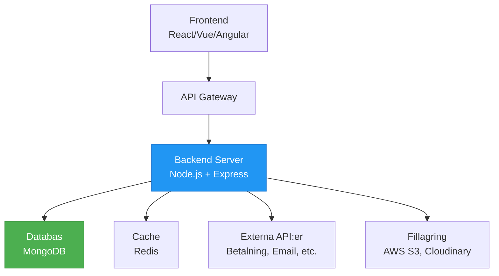
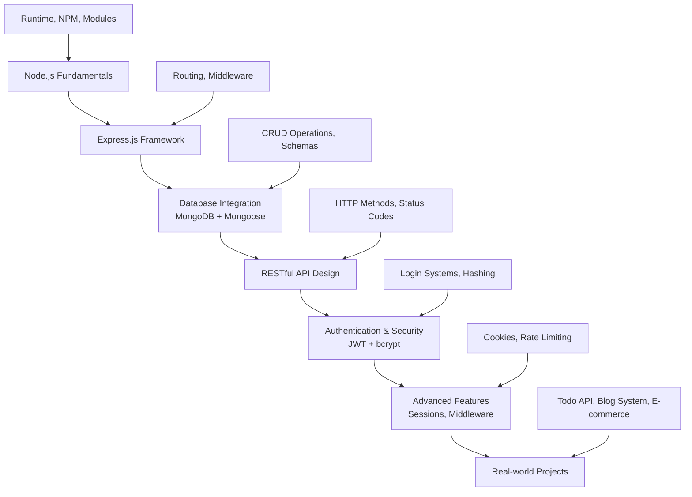
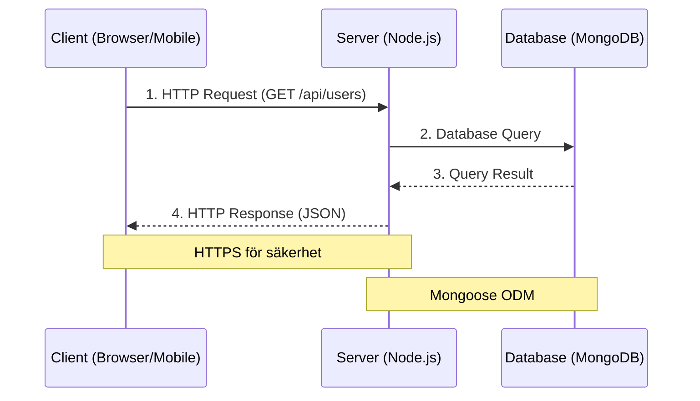
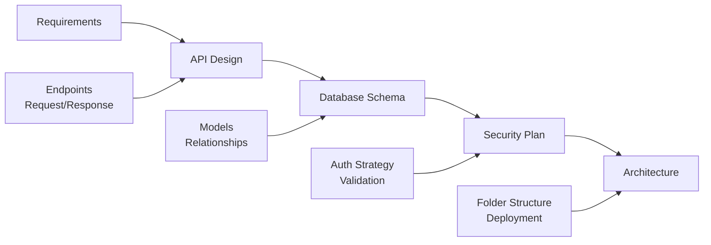
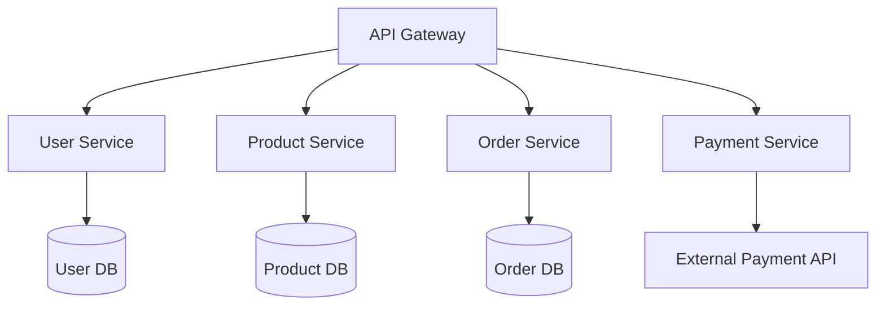

# Backend-utveckling med Node.js

Välkommen till backend-utveckling! I detta kapitel ska vi utforska hur man bygger robusta serverapplikationer med Node.js och Express. Backend är hjärtat i alla moderna webbapplikationer - det hanterar databasoperationer, autentisering, API:er och mycket mer.

## Vad är Backend-utveckling?

Backend-utveckling handlar om att skapa serversidan av webbapplikationer. Medan frontend fokuserar på vad användaren ser och interagerar med, ansvarar backend för:

- **Datahantering**: Lagra, hämta och uppdatera data i databaser
- **Autentisering**: Verifiera användares identitet och hantera inloggningar  
- **API:er**: Skapa endpoints som frontend kan kommunicera med
- **Säkerhet**: Skydda applikationer mot attacker och säkerställa dataintegrity
- **Skalbarhet**: Hantera tusentals samtidiga användare
- **Integrationer**: Kommunicera med externa tjänster och system



### Full-Stack Development Landscape

Modern webbutveckling involverar många komponenter som arbetar tillsammans:

**Frontend Technologies**:
- React, Vue.js, Angular för användarinterface
- Mobile apps med React Native eller Flutter
- Desktop apps med Electron

**Backend Technologies**:
- **Runtime**: Node.js, Python, Java, C#, Go, Rust
- **Frameworks**: Express.js, Nest.js, Fastify (Node.js)
- **Databaser**: MongoDB, PostgreSQL, MySQL, Redis
- **Cloud Services**: AWS, Google Cloud, Azure

## Varför Node.js för Backend?

Node.js har revolutionerat backend-utveckling genom att låta JavaScript-utvecklare bygga hela applikationer:

### Fördelar med Node.js

**1. JavaScript Everywhere**
```javascript
// Frontend (React)
const user = await fetch('/api/users/me');

// Backend (Express)
app.get('/api/users/me', (req, res) => {
  res.json({ id: 1, name: 'John' });
});
```

**2. Non-blocking I/O**
```javascript
// Traditionell blocking I/O (PHP, Python)
const data1 = database.query('SELECT * FROM users');     // Väntar
const data2 = database.query('SELECT * FROM posts');     // Väntar

// Node.js non-blocking
const data1Promise = database.query('SELECT * FROM users');  // Körs parallellt
const data2Promise = database.query('SELECT * FROM posts');  // Körs parallellt
const [data1, data2] = await Promise.all([data1Promise, data2Promise]);
```

**3. Enorm Ekosystem (NPM)**
```bash
npm install express mongoose bcrypt jsonwebtoken socket.io
# 2+ miljoner paket tillgängliga
```

**4. Hög Prestanda för I/O-intensiva Applikationer**
- Event-driven arkitektur
- Single-threaded event loop
- Perfekt för real-time applikationer
- Skalbar för tusentals samtidiga anslutningar

### När Node.js är bäst

✅ **Utmärkt för**:
- RESTful API:er och GraphQL
- Real-time applikationer (chat, gaming)
- Mikroservices
- Single Page Applications (SPAs)
- Prototyping och snabb utveckling

❌ **Undvik för**:
- CPU-intensiva beräkningar
- Legacy system integration
- Stora enterprise-applikationer med komplex affärslogik

## Kapitelets mål och progression

I detta kapitel kommer du att lära dig:



### Kapitelstruktur

**Grund (Kapitel 1-3)**:
1. **Node.js Introduction** - Runtime, moduler och grundläggande koncept
2. **Express.js** - Webbramverk, routing och middleware  
3. **MongoDB & Mongoose** - Databasintegration och ODM

**Intermediär (Kapitel 4-6)**:
4. **RESTful APIs** - API-design, HTTP-metoder och best practices
5. **Authentication** - JWT, bcrypt, säkerhet och middleware
6. **Sessions & Cookies** - Traditionell autentisering och användarhantering

**Avancerat (Kapitel 7-8)**:
7. **Praktiska Övningar** - Fyra progressiva projekt
8. **Teknisk Intervju** - Förberedelse för backend-intervjuer

## Utvecklingsmiljö och verktyg

### Nödvändiga verktyg

**1. Node.js och NPM**
```bash
# Installera Node.js (inkluderar NPM)
# Från nodejs.org eller via package manager

# Kontrollera installation
node --version     # v18.x.x eller senare
npm --version      # 9.x.x eller senare
```

**2. Code Editor**
- **VS Code** (rekommenderas) med extensions:
  - Node.js Extension Pack
  - REST Client eller Thunder Client
  - MongoDB for VS Code
  - Bracket Pair Colorizer

**3. Databas**
```bash
# MongoDB lokalt
brew install mongodb-community
# Eller använd MongoDB Atlas (cloud)

# Redis för sessions/caching (valfritt)
brew install redis
```

**4. Testing och API-verktyg**
- **Postman** eller **Insomnia** för API-testning
- **MongoDB Compass** för databashantering
- **Git** för versionshantering

### Projektstruktur (Best Practices)

```
backend-project/
├── server.js              # Entry point
├── package.json           # Dependencies och scripts
├── .env                   # Environment variables
├── .gitignore            # Git ignore fil
├── config/               # Konfiguration
│   ├── database.js       # Databasanslutning
│   └── jwt.js           # JWT-konfiguration
├── models/              # Datamodeller (Mongoose schemas)
│   ├── User.js
│   └── Post.js
├── controllers/         # Route handlers/business logic
│   ├── authController.js
│   └── postController.js
├── routes/             # API routes
│   ├── auth.js
│   └── posts.js
├── middleware/         # Custom middleware
│   ├── auth.js
│   ├── validation.js
│   └── errorHandler.js
├── utils/             # Utility functions
│   └── helpers.js
├── tests/            # Test files
│   └── auth.test.js
└── docs/            # API documentation
    └── api.md
```

## Grundläggande Backend-koncept

### Client-Server Architecture



### API Design Principles

**RESTful URLs**:
```javascript
GET    /api/users           // Hämta alla användare
GET    /api/users/123       // Hämta specifik användare  
POST   /api/users           // Skapa ny användare
PUT    /api/users/123       // Uppdatera användare (helt)
PATCH  /api/users/123       // Uppdatera användare (delvis)
DELETE /api/users/123       // Ta bort användare

// Hierarkiska resurser
GET    /api/users/123/posts // Användarens inlägg
POST   /api/users/123/posts // Skapa inlägg för användare
```

**HTTP Status Codes**:
```javascript
200  // OK - Lyckad GET/PUT/PATCH
201  // Created - Lyckad POST
204  // No Content - Lyckad DELETE
400  // Bad Request - Klientfel
401  // Unauthorized - Autentisering krävs
403  // Forbidden - Otillåten åtkomst
404  // Not Found - Resurs finns inte
500  // Internal Server Error - Serverfel
```

### Säkerhetsfundament

**1. Input Validation**
```javascript
const { body, validationResult } = require('express-validator');

const validateUser = [
  body('email').isEmail().normalizeEmail(),
  body('password').isLength({ min: 6 }),
  body('name').trim().escape()
];
```

**2. Authentication & Authorization**
```javascript
// Autentisering: "Vem är du?"
const authenticate = (req, res, next) => {
  const token = req.headers.authorization?.split(' ')[1];
  // Verifiera JWT token
};

// Auktorisation: "Vad får du göra?"
const authorize = (roles) => {
  return (req, res, next) => {
    if (!roles.includes(req.user.role)) {
      return res.status(403).json({ error: 'Otillåten' });
    }
    next();
  };
};
```

**3. Data Protection**
```javascript
const bcrypt = require('bcrypt');

// Hash lösenord
const hashedPassword = await bcrypt.hash(password, 12);

// Verifiera lösenord  
const isValid = await bcrypt.compare(password, hashedPassword);
```

## Backend Development Workflow

### 1. Planering och Design


### 2. Implementation Process
```javascript
// 1. Setup projekt
npm init -y
npm install express mongoose bcrypt jsonwebtoken

// 2. Basic server
const express = require('express');
const app = express();

// 3. Middleware
app.use(express.json());

// 4. Routes
app.get('/api/health', (req, res) => {
  res.json({ status: 'OK' });
});

// 5. Database connection
mongoose.connect(process.env.MONGODB_URI);

// 6. Start server
app.listen(3000, () => {
  console.log('Server körs på port 3000');
});
```

### 3. Testing Strategy
```javascript
// Unit tests - testa funktioner isolerat
describe('Auth Controller', () => {
  test('should hash password correctly', async () => {
    const password = 'test123';
    const hashed = await hashPassword(password);
    expect(hashed).not.toBe(password);
  });
});

// Integration tests - testa API endpoints
describe('POST /api/users', () => {
  test('should create new user', async () => {
    const response = await request(app)
      .post('/api/users')
      .send({ name: 'Test', email: 'test@test.com' });
    
    expect(response.status).toBe(201);
    expect(response.body.name).toBe('Test');
  });
});
```

## Modern Backend Trends

### Microservices Architecture


### Serverless och Cloud-Native
```javascript
// AWS Lambda function
exports.handler = async (event) => {
  const user = JSON.parse(event.body);
  
  // Process user data
  const result = await createUser(user);
  
  return {
    statusCode: 201,
    body: JSON.stringify(result)
  };
};
```

### Real-time Features
```javascript
// Socket.io för real-time
const io = require('socket.io')(server);

io.on('connection', (socket) => {
  socket.on('join-room', (roomId) => {
    socket.join(roomId);
  });
  
  socket.on('message', (data) => {
    io.to(data.room).emit('new-message', data);
  });
});
```

## Redo att börja?

Nu har du en översikt av backend-utveckling med Node.js! I de kommande kapitlen kommer vi att dyka djupt in i varje område:

**Nästa steg**:
1. 🚀 **Node.js Intro** - Lär dig runtime och grundläggande moduler
2. 🛠️ **Express.js** - Bygg ditt första web API
3. 🗄️ **MongoDB** - Integrera databas för persistent data
4. 🔐 **Authentication** - Säkra dina applikationer
5. 🏗️ **Praktiska projekt** - Bygg verkliga applikationer

Varje kapitel innehåller:
- 📖 Detaljerade förklaringar med kod-exempel
- 🎯 Praktiska övningar och utmaningar  
- 💡 Best practices och säkerhetstips
- 🔧 Verktyg och tekniker från industrin

Backend-utveckling är en av de mest givande karriärvägarna inom tech - du bygger infrastrukturen som driver hela den digitala världen. Låt oss komma igång!
