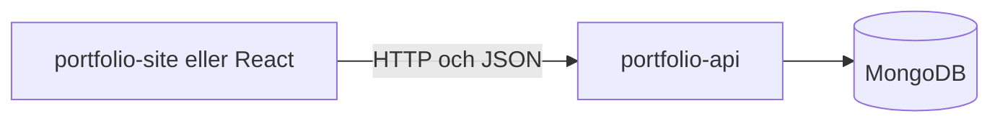

# Backend-utveckling med Node.js

I [JavaScript-kapitlet](../kapitel_5/index.md) hämtade du data från andras
API:er. Nu bygger du servern som tar emot requests, arbetar med en databas och
skickar JSON tillbaka till frontend.

> **Så här lär du dig Node.js i den här boken**  
> Lektionerna innehåller simulerade terminaler där du ser kommandon och
> förväntad output. Kör sedan samma steg i din **riktiga terminal**. Varje
> lektion fortsätter på samma projekt och avslutas med en checkpoint.

---

## Vårt projekt: `portfolio-api`

Genom hela kapitlet bygger du backend till `portfolio-site`:

```mermaid
flowchart LR
    Frontend[portfolio-site eller React] -->|HTTP och JSON| API[portfolio-api]
    API --> Database[(MongoDB)]
```

API:t börjar som en enkel Node-server och växer stegvis till en Express-app
med databas, CRUD, autentisering och automatiska tester. I kapitlets capstone
kopplar du ihop frontend och backend till en fullstack-portfolio.

## Vad du kommer att lära dig

1. Köra JavaScript utanför webbläsaren med Node.js och npm.
2. Förstå HTTP genom att bygga en server utan ramverk.
3. Strukturera routes och middleware med Express.
4. Lagra portfolio-projekt i MongoDB med Mongoose.
5. Designa ett REST-API med tydliga statuskoder.
6. Skydda ändringar med JWT, samt förstå sessioner som alternativ.
7. Testa Express-applikationen med Jest och Supertest.
8. Ansluta din frontend till ett eget driftsatt API.

## Förutsättningar

- JavaScript, Promises och `async`/`await` från kapitel 4–5.
- Grundläggande Git och terminalvana.
- En editor och möjlighet att installera aktuell Node.js LTS.
- Ett kostnadsfritt MongoDB Atlas-konto när databasdelen börjar.

> **Kodpolicy:**  
> All ny kod använder **ES modules** (`import`/`export`) och
> `"type": "module"` i `package.json`. CommonJS (`require`/`module.exports`)
> nämns som äldre syntax men blandas inte in i projektet.

## Arbetsflöde

Efter varje lektion:

1. Kör servern och kontrollera checkpointen.
2. Läs eventuella felmeddelanden i terminalen.
3. Committa ett fungerande steg med Git.

Det klassöverskridande grupparbetet, där år 2 äger API:t och år 1 äger frontend, finns i
[Grupparbete: frontend och API](../grupparbete/index.md). Det kapitlet lär inte om Express
på nytt – det lär hur ni dokumenterar kontraktet, kör Docker och granskar varandras PR:er.

När du är redo börjar du med
[Node.js – från fetch till ett eget API](./node-intro.md).
