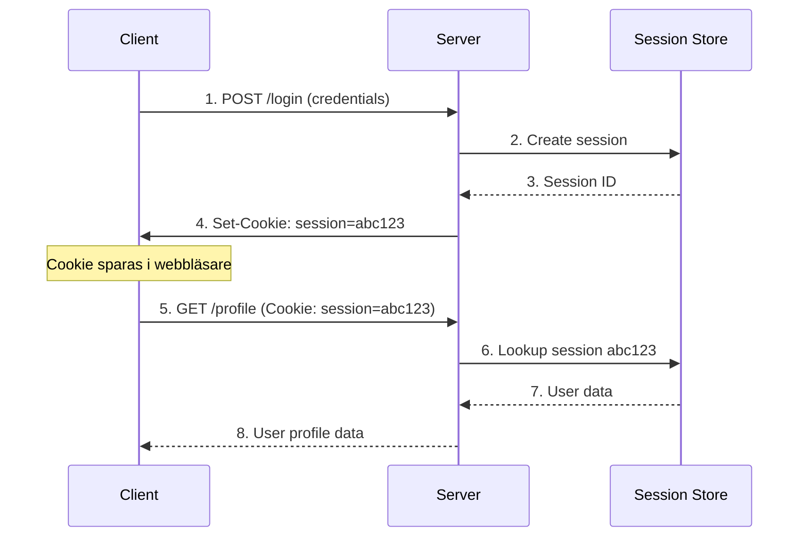

# Sessionshantering och Cookies

Sessioner är ett sätt att lagra information om en användare över flera HTTP-förfrågningar. Eftersom HTTP är stateless behöver vi sessioner för att komma ihåg inloggade användare och deras preferenser. Låt oss utforska hur sessioner fungerar och när de är att föredra framför JWT.

## Vad är sessioner och cookies?

**Sessions**: Server-side lagring av användardata som identifieras med ett unikt session-ID.

**Cookies**: Små textfiler som lagras i användarens webbläsare och skickas med varje HTTP-förfrågan.



### Sessioner vs JWT

| Aspekt | Sessioner | JWT |
|--------|-----------|-----|
| **Lagring** | Server-side | Client-side (token) |
| **Skalbarhet** | Kräver delad session store | Stateless, enkelt att skala |
| **Säkerhet** | Svårare att manipulera | Kan dekodas (ej krypterad) |
| **Invalidering** | Omedelbar (ta bort från server) | Svår (vänta på expiry) |
| **Prestanda** | Databaslookup för varje request | Ingen server-lookup |
| **Datalagring** | Obegränsad (server-side) | Begränsad (cookie/header size) |

## Implementera sessioner i Express

### Grundläggande setup

```javascript
const express = require('express');
const session = require('express-session');
const MongoStore = require('connect-mongo');

const app = express();

// Session middleware
app.use(session({
  secret: process.env.SESSION_SECRET || 'your-secret-key',
  resave: false,               // Spara inte om inget har ändrats
  saveUninitialized: false,    // Spara inte tomma sessioner
  name: 'sessionId',           // Ändra från default 'connect.sid'
  cookie: {
    secure: process.env.NODE_ENV === 'production', // HTTPS only i produktion
    httpOnly: true,             // Förhindra XSS-attacker
    maxAge: 1000 * 60 * 60 * 24 // 24 timmar
  },
  store: MongoStore.create({
    mongoUrl: process.env.MONGODB_URI,
    touchAfter: 24 * 3600 // Lazy session update
  })
}));
```

### Session-baserad autentisering

```javascript
const bcrypt = require('bcrypt');
const User = require('../models/User');

class SessionAuthController {
  // Registrera användare
  static async register(req, res) {
    try {
      const { username, email, password } = req.body;
      
      // Kontrollera om användaren finns
      const existingUser = await User.findOne({ 
        $or: [{ email }, { username }] 
      });
      
      if (existingUser) {
        return res.status(409).json({ 
          error: 'Användare finns redan' 
        });
      }
      
      // Hasha lösenord
      const hashedPassword = await bcrypt.hash(password, 12);
      
      // Skapa användare
      const user = new User({
        username,
        email,
        password: hashedPassword
      });
      
      await user.save();
      
      // Logga in automatiskt efter registrering
      req.session.userId = user._id;
      req.session.user = {
        id: user._id,
        username: user.username,
        email: user.email,
        role: user.role
      };
      
      res.status(201).json({
        message: 'Användare registrerad och inloggad',
        user: req.session.user
      });
      
    } catch (error) {
      console.error('Registration error:', error);
      res.status(500).json({ error: 'Registreringsfel' });
    }
  }
  
  // Logga in
  static async login(req, res) {
    try {
      const { email, password } = req.body;
      
      // Hitta användare
      const user = await User.findOne({ email }).select('+password');
      
      if (!user) {
        return res.status(401).json({ 
          error: 'Ogiltiga inloggningsuppgifter' 
        });
      }
      
      // Verifiera lösenord
      const isValidPassword = await bcrypt.compare(password, user.password);
      
      if (!isValidPassword) {
        return res.status(401).json({ 
          error: 'Ogiltiga inloggningsuppgifter' 
        });
      }
      
      // Skapa session
      req.session.userId = user._id;
      req.session.user = {
        id: user._id,
        username: user.username,
        email: user.email,
        role: user.role
      };
      
      // Uppdatera senaste inloggning
      user.lastLogin = new Date();
      await user.save();
      
      res.json({
        message: 'Inloggning lyckades',
        user: req.session.user
      });
      
    } catch (error) {
      console.error('Login error:', error);
      res.status(500).json({ error: 'Inloggningsfel' });
    }
  }
  
  // Logga ut
  static async logout(req, res) {
    try {
      req.session.destroy((err) => {
        if (err) {
          return res.status(500).json({ error: 'Kunde inte logga ut' });
        }
        
        res.clearCookie('sessionId');
        res.json({ message: 'Utloggning lyckades' });
      });
    } catch (error) {
      res.status(500).json({ error: 'Utloggningsfel' });
    }
  }
  
  // Hämta profil
  static async getProfile(req, res) {
    try {
      const user = await User.findById(req.session.userId).select('-password');
      
      if (!user) {
        return res.status(404).json({ error: 'Användare inte hittad' });
      }
      
      res.json(user);
    } catch (error) {
      res.status(500).json({ error: 'Kunde inte hämta profil' });
    }
  }
  
  // Kontrollera session-status
  static checkSession(req, res) {
    if (req.session.userId) {
      res.json({ 
        authenticated: true, 
        user: req.session.user 
      });
    } else {
      res.json({ 
        authenticated: false 
      });
    }
  }
}

module.exports = SessionAuthController;
```

## Konfigurera session-lagring

### In-Memory Store (endast utveckling)

```javascript
// Standard - endast för utveckling
app.use(session({
  secret: 'dev-secret',
  resave: false,
  saveUninitialized: false
  // Ingen store specificerad = MemoryStore
}));
```

### MongoDB Store

```javascript
const MongoStore = require('connect-mongo');

app.use(session({
  secret: process.env.SESSION_SECRET,
  resave: false,
  saveUninitialized: false,
  store: MongoStore.create({
    mongoUrl: process.env.MONGODB_URI,
    dbName: 'sessions',
    collectionName: 'sessions',
    ttl: 24 * 60 * 60, // 24 timmar
    autoRemove: 'native'
  }),
  cookie: {
    maxAge: 1000 * 60 * 60 * 24 // 24 timmar
  }
}));
```

### Redis Store (hög prestanda)

```javascript
const redis = require('redis');
const RedisStore = require('connect-redis')(session);

const redisClient = redis.createClient({
  host: process.env.REDIS_HOST || 'localhost',
  port: process.env.REDIS_PORT || 6379,
  password: process.env.REDIS_PASSWORD
});

app.use(session({
  store: new RedisStore({ client: redisClient }),
  secret: process.env.SESSION_SECRET,
  resave: false,
  saveUninitialized: false,
  cookie: {
    secure: false, // true för HTTPS
    httpOnly: true,
    maxAge: 1000 * 60 * 60 * 24
  }
}));
```

## Arbeta med cookies

### Sätta och läsa cookies

```javascript
// Sätta cookies
app.get('/set-cookie', (req, res) => {
  // Enkel cookie
  res.cookie('username', 'johndoe');
  
  // Cookie med options
  res.cookie('preferences', JSON.stringify({
    theme: 'dark',
    language: 'sv'
  }), {
    maxAge: 30 * 24 * 60 * 60 * 1000, // 30 dagar
    httpOnly: false, // Tillgänglig för JavaScript
    secure: process.env.NODE_ENV === 'production',
    signed: true // Signerad cookie
  });
  
  res.json({ message: 'Cookies satta' });
});

// Läsa cookies (kräver cookie-parser middleware)
const cookieParser = require('cookie-parser');
app.use(cookieParser(process.env.COOKIE_SECRET));

app.get('/get-cookies', (req, res) => {
  res.json({
    cookies: req.cookies,        // Osignerade cookies
    signedCookies: req.signedCookies // Signerade cookies
  });
});

// Ta bort cookie
app.get('/clear-cookie', (req, res) => {
  res.clearCookie('username');
  res.json({ message: 'Cookie borttagen' });
});
```

### Cookie-säkerhet

```javascript
// Säkra cookie-inställningar för produktion
const secureCookieSettings = {
  httpOnly: true,      // Förhindra XSS
  secure: true,        // Endast HTTPS
  sameSite: 'strict',  // CSRF-skydd
  maxAge: 24 * 60 * 60 * 1000 // 24 timmar
};

// Miljöspecifika inställningar
const cookieSettings = process.env.NODE_ENV === 'production' 
  ? secureCookieSettings 
  : { 
      httpOnly: true,
      secure: false,
      sameSite: 'lax',
      maxAge: 24 * 60 * 60 * 1000
    };

app.use(session({
  secret: process.env.SESSION_SECRET,
  cookie: cookieSettings,
  // ... andra inställningar
}));
```

## Säkerhet i sessionshantering

### Session Hijacking Prevention

```javascript
// Regenera session-ID efter inloggning
const regenerateSession = (req, res, next) => {
  const oldSessionData = req.session;
  
  req.session.regenerate((err) => {
    if (err) {
      return next(err);
    }
    
    // Återställ sessionsdata
    Object.assign(req.session, oldSessionData);
    req.session.save(next);
  });
};

// Använd efter lyckad inloggning
app.post('/login', async (req, res, next) => {
  // ... autentiseringslogik
  
  if (loginSuccessful) {
    regenerateSession(req, res, () => {
      req.session.userId = user._id;
      res.json({ message: 'Inloggad' });
    });
  }
});
```

### CSRF-skydd med sessions

```javascript
const csrf = require('csurf');

// CSRF-middleware
const csrfProtection = csrf({
  cookie: {
    httpOnly: true,
    secure: process.env.NODE_ENV === 'production'
  }
});

app.use(csrfProtection);

// Skicka CSRF-token till frontend
app.get('/api/csrf-token', (req, res) => {
  res.json({ csrfToken: req.csrfToken() });
});

// Alla POST/PUT/DELETE-routes är nu skyddade
app.post('/api/data', (req, res) => {
  // CSRF-token valideras automatiskt
  res.json({ success: true });
});
```

### Session Timeout och Activity Tracking

```javascript
// Middleware för att kontrollera session-timeout
const sessionTimeout = (timeoutMinutes = 30) => {
  return (req, res, next) => {
    if (req.session.userId) {
      const now = Date.now();
      const lastActivity = req.session.lastActivity || now;
      const timeDiff = now - lastActivity;
      
      if (timeDiff > timeoutMinutes * 60 * 1000) {
        req.session.destroy();
        return res.status(401).json({ 
          error: 'Session har gått ut på grund av inaktivitet' 
        });
      }
      
      // Uppdatera senaste aktivitet
      req.session.lastActivity = now;
    }
    
    next();
  };
};

app.use(sessionTimeout(30)); // 30 minuters timeout
```

## Avancerad sessionshantering

### Multi-device Sessions

```javascript
// Schema för att lagra flera aktiva sessioner per användare
const activeSessionSchema = new mongoose.Schema({
  userId: { type: mongoose.Schema.Types.ObjectId, ref: 'User', required: true },
  sessionId: { type: String, required: true },
  deviceInfo: {
    userAgent: String,
    ip: String,
    device: String,
    browser: String
  },
  createdAt: { type: Date, default: Date.now },
  lastActivity: { type: Date, default: Date.now },
  isActive: { type: Boolean, default: true }
});

const ActiveSession = mongoose.model('ActiveSession', activeSessionSchema);

// Logga aktiva sessioner
const trackSession = async (req, res, next) => {
  if (req.session.userId) {
    await ActiveSession.findOneAndUpdate(
      { sessionId: req.sessionID },
      {
        userId: req.session.userId,
        sessionId: req.sessionID,
        deviceInfo: {
          userAgent: req.get('User-Agent'),
          ip: req.ip,
          // Parse user agent för device/browser info
        },
        lastActivity: new Date()
      },
      { upsert: true }
    );
  }
  next();
};

// Hämta alla aktiva sessioner för användare
app.get('/api/active-sessions', async (req, res) => {
  try {
    const sessions = await ActiveSession.find({
      userId: req.session.userId,
      isActive: true
    });
    
    res.json(sessions);
  } catch (error) {
    res.status(500).json({ error: 'Kunde inte hämta sessioner' });
  }
});

// Logga ut från specifik session
app.delete('/api/sessions/:sessionId', async (req, res) => {
  try {
    await ActiveSession.findOneAndUpdate(
      { 
        sessionId: req.params.sessionId,
        userId: req.session.userId
      },
      { isActive: false }
    );
    
    res.json({ message: 'Session avslutad' });
  } catch (error) {
    res.status(500).json({ error: 'Kunde inte avsluta session' });
  }
});
```

### Session Data Encryption

```javascript
const crypto = require('crypto');

class SessionEncryption {
  static encrypt(text, key) {
    const algorithm = 'aes-256-gcm';
    const iv = crypto.randomBytes(16);
    const cipher = crypto.createCipher(algorithm, key);
    
    let encrypted = cipher.update(text, 'utf8', 'hex');
    encrypted += cipher.final('hex');
    
    const authTag = cipher.getAuthTag();
    
    return {
      encrypted,
      iv: iv.toString('hex'),
      authTag: authTag.toString('hex')
    };
  }
  
  static decrypt(encryptedData, key) {
    const algorithm = 'aes-256-gcm';
    const decipher = crypto.createDecipher(algorithm, key);
    
    decipher.setAuthTag(Buffer.from(encryptedData.authTag, 'hex'));
    
    let decrypted = decipher.update(encryptedData.encrypted, 'hex', 'utf8');
    decrypted += decipher.final('utf8');
    
    return decrypted;
  }
}

// Custom session serialization
app.use(session({
  // ... andra inställningar
  store: new CustomStore({
    serialize: (session) => {
      const key = process.env.SESSION_ENCRYPTION_KEY;
      const sessionData = JSON.stringify(session);
      return SessionEncryption.encrypt(sessionData, key);
    },
    deserialize: (encryptedSession) => {
      const key = process.env.SESSION_ENCRYPTION_KEY;
      const sessionData = SessionEncryption.decrypt(encryptedSession, key);
      return JSON.parse(sessionData);
    }
  })
}));
```

## Komplett exempel: Session-baserad auth

```javascript
// routes/sessionAuth.js
const express = require('express');
const router = express.Router();
const SessionAuthController = require('../controllers/SessionAuthController');

// Middleware för att kontrollera session
const requireAuth = (req, res, next) => {
  if (!req.session.userId) {
    return res.status(401).json({ error: 'Inloggning krävs' });
  }
  next();
};

const requireRole = (roles) => {
  return (req, res, next) => {
    if (!req.session.user || !roles.includes(req.session.user.role)) {
      return res.status(403).json({ error: 'Otillåten åtkomst' });
    }
    next();
  };
};

// Publika routes
router.post('/register', SessionAuthController.register);
router.post('/login', SessionAuthController.login);
router.get('/session-status', SessionAuthController.checkSession);

// Skyddade routes
router.post('/logout', requireAuth, SessionAuthController.logout);
router.get('/profile', requireAuth, SessionAuthController.getProfile);
router.get('/admin', requireAuth, requireRole(['admin']), (req, res) => {
  res.json({ message: 'Admin-område' });
});

module.exports = router;
```

Sessioner erbjuder en traditionell och säker metod för användarautentisering, särskilt lämplig för traditionella webbapplikationer. Medan JWT är bättre för API:er och mikroservices, ger sessioner bättre kontroll över säkerhet och användarhantering.

Nästa steg är att utforska den kompletta demo-applikationen som kombinerar alla dessa koncept!
