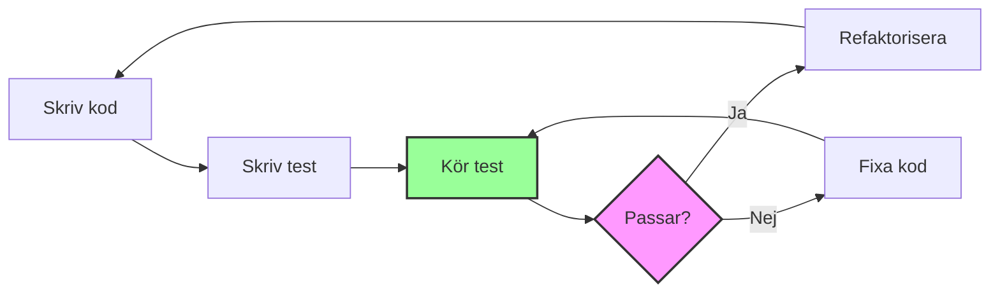

# Testning med Jest

## Varför testa kod?

När du skriver kod behöver du veta att den fungerar som förväntat. Manuell testning (köra programmet och testa manuellt) är tidskrävande och lätt att glömma bort när du gör ändringar. **Automatiserad testning** låter dig verifiera att din kod fungerar korrekt, snabbt och konsekvent.



### Fördelar med testning

- **Säkerhet vid ändringar**: Test hjälper dig att upptäcka om ändringar bryter befintlig funktionalitet
- **Dokumentation**: Test visar hur koden ska användas
- **Refaktorisering**: Du kan förbättra koden utan att oroa dig för att bryta något
- **Snabbare utveckling**: Mindre tid åt manuell testning
- **Självförtroende**: Veta att din kod fungerar ger trygghet

## Vad är Jest?

Jest är ett populärt testramverk (test framework) för JavaScript, särskilt utvecklat för att fungera bra med Node.js, React och andra moderna JavaScript-projekt. Jest kommer med många funktioner inbyggda, så du behöver inte installera många extra paket.

### Varför Jest?

- ✅ **Enkel setup**: Fungerar direkt utan mycket konfiguration
- ✅ **Snabb**: Optimerad för prestanda
- ✅ **Bra felmeddelanden**: Tydliga meddelanden när test misslyckas
- ✅ **Mocks och spies**: Inbyggt stöd för att testa isolerat
- ✅ **Code coverage**: Se hur mycket av koden som testas
- ✅ **Watch mode**: Automatisk omkörning när filer ändras

## Installation och Setup

### Steg 1: Installera Jest

```bash
# Initiera projekt om du inte redan har package.json
npm init -y

# Installera Jest som utvecklingsberoende
npm install --save-dev jest
```

### Steg 2: Konfigurera package.json

För att använda ES6-moduler behöver du först lägga till en rad i `package.json`:

```json
{
  "name": "mitt-test-projekt",
  "version": "1.0.0",
  "type": "module"
}
```

**Vad gör detta?**
- `"type": "module"` aktiverar ES6-moduler (import/export) i hela projektet

Nu behöver du lägga till ett test-script (script för att köra test). Vad behöver du tänka på?
- Jest behöver köras med en speciell flagga för att fungera med ES6-moduler
- Scriptet ska ligga under `"scripts"` i `package.json`

**Din uppgift**: Lägg till ett `"scripts"`-objekt med en `"test"`-property. Värdet ska köra Jest med flaggan `--experimental-vm-modules`. Titta på Node.js-kommandot i Steg 1 för att se hur Jest körs.

<details>
<summary>Visa lösning</summary>

```json
{
  "name": "mitt-test-projekt",
  "version": "1.0.0",
  "type": "module",
  "scripts": {
    "test": "node --experimental-vm-modules node_modules/jest/bin/jest.js",
    "test:watch": "node --experimental-vm-modules node_modules/jest/bin/jest.js --watch"
  }
}
```

**Förklaring**:
- `--experimental-vm-modules`: Behövs för att Jest ska fungera med ES6-moduler
- `test:watch`: Kör test automatiskt när filer ändras (valfritt men användbart)
</details>

### Steg 3: Skapa din första test

Låt oss börja enkelt. Skapa en fil `math.js` med en funktion att testa:

```javascript
// math.js
export function add(a, b) {
  return a + b;
}
```

Nu skapar du din första testfil `math.test.js`. Tänk på:
- Du behöver importera funktionen från `math.js`
- Använd `test()` för att definiera ett test
- Använd `expect()` för att verifiera resultatet

**Din uppgift**: Skapa ett test som verifierar att `add(2, 3)` returnerar `5`.

<details>
<summary>Visa lösning</summary>

```javascript
// math.test.js
import { add } from './math.js';

test('adderar två tal korrekt', () => {
  expect(add(2, 3)).toBe(5);
});
```

**Förklaring**:
- `import { add }`: Importerar funktionen från math.js
- `test('beskrivning', ...)`: Skapar ett testfall med en beskrivning
- `expect(add(2, 3))`: Kör funktionen och förbereder för verifiering
- `.toBe(5)`: Verifierar att resultatet är exakt 5
</details>

Kör testet:

```bash
npm test
```

Du bör se något som:

```
PASS  ./math.test.js
  ✓ adderar två tal korrekt

Test Suites: 1 passed, 1 total
Tests:       1 passed, 1 total
```

**Bra jobbat!** Du har skapat ditt första test. Nu är det din tur att öva.

#### Övning: Lägg till fler funktioner och test

1. **Lägg till `subtract()` i `math.js`**:
   - Skapa funktionen som subtraherar två tal
   - Lägg till ett test som verifierar `subtract(5, 3)` blir `2`

2. **Lägg till `multiply()` i `math.js`**:
   - Skapa funktionen som multiplicerar två tal
   - Lägg till ett test som verifierar `multiply(4, 3)` blir `12`

3. **Utmaning: Lägg till `divide()` med felhantering**:
   - Funktionen ska dividera två tal
   - Om den andra parametern är 0, ska den kasta ett fel med `throw new Error('Division med noll är inte tillåten')`
   - Skriv två test:
     - Ett som testar normal division, t.ex. `divide(10, 2)` blir `5`
     - Ett som testar att fel kastas: `expect(() => divide(10, 0)).toThrow('Division med noll är inte tillåten')`

**Tips**: Tänk på hur du testade `add()` - använd samma struktur för de andra funktionerna!

## Grundläggande Jest-koncept

### Test struktur

Du har redan använt `test()` och `expect()`. Låt oss förstå strukturen bättre:

#### `test()` - Ett testfall

`test()` (eller `it()`) definierar ett enskilt testfall:

```javascript
test('beskrivning av vad testet gör', () => {
  // Din testkod här
});
```

#### `expect()` - Verifiering (assertion)

`expect()` används för att verifiera att resultatet stämmer:

```javascript
expect(actualValue).toBe(expectedValue);
```

#### `describe()` - Gruppera relaterade test

När du har flera test kan du gruppera dem med `describe()` för bättre struktur:

```javascript
describe('Matematiska funktioner', () => {
  test('adderar två tal', () => {
    expect(add(2, 3)).toBe(5);
  });
  
  test('subtraherar två tal', () => {
    expect(subtract(5, 3)).toBe(2);
  });
});
```

**Övning**: Uppdatera din `math.test.js` och gruppera dina test under en `describe('Matematiska funktioner', ...)`.

#### Arrange-Act-Assert mönster

Ett bra sätt att strukturera test är att följa Arrange-Act-Assert mönstret:

```javascript
test('beräknar dubbelt värde', () => {
  // Arrange (Förbered) - förbered testdata
  const input = 5;
  const expected = 10;
  
  // Act (Utför) - kör funktionen
  const result = double(input);
  
  // Assert (Verifiera) - kontrollera resultatet
  expect(result).toBe(expected);
});
```

Detta gör testen lättare att förstå och underhålla.

### Matchers (Matchare)

Matchers är metoder som används med `expect()` för att verifiera värden. Du har redan använt `.toBe()` - låt oss lära oss fler!

#### `toBe()` - Exakt likhet

Du känner redan till `toBe()`. Den använder `===` för jämförelse:

```javascript
expect(5).toBe(5);
expect('hej').toBe('hej');
```

**Viktigt**: `toBe()` fungerar inte för objekt och arrays (de jämförs med referens, inte värde).

**Övning**: Skriv ett test som använder `toBe()` för att verifiera att två tal är lika.

#### `toEqual()` - Värde-likhet för objekt och arrays

För att jämföra objekt och arrays använder du `toEqual()`:

```javascript
expect({ name: 'Anna' }).toEqual({ name: 'Anna' });
expect([1, 2, 3]).toEqual([1, 2, 3]);
```

**Övning**: Skapa ett objekt `{ age: 25 }` och skriv ett test som verifierar att det är lika med `{ age: 25 }` med `toEqual()`.

#### `not` - Negering

Du kan använda `.not` för att invertera vilken matcher som helst:

```javascript
expect(5).not.toBe(3);
expect('hej').not.toBe('adjö');
```

**Övning**: Skriv ett test som verifierar att `10` inte är lika med `5`.

#### Jämförelse för tal

```javascript
expect(10).toBeGreaterThan(5);      // Större än
expect(5).toBeLessThan(10);         // Mindre än
expect(5).toBeGreaterThanOrEqual(5); // Större eller lika
expect(5).toBeLessThanOrEqual(10);   // Mindre eller lika
```

**Viktigt för flyttal**: På grund av avrundningsfel i JavaScript använder du `toBeCloseTo()` för decimaltal:

```javascript
expect(0.1 + 0.2).toBeCloseTo(0.3);
```

**Övning**: Skriv test som verifierar:
- `15` är större än `10`
- `0.1 + 0.2` är ungefär lika med `0.3` (använd `toBeCloseTo`)

#### Strängar

```javascript
const message = 'Hej världen';

expect(message).toContain('världen');  // Innehåller delsträng
expect(message).toMatch(/världen/);   // Matchar regex
expect(message).toHaveLength(11);     // Längd
```

**Övning**: Testa att strängen `'JavaScript'` innehåller `'Script'` och har längden `10`.

#### Arrays

```javascript
const fruits = ['äpple', 'banan', 'apelsin'];

expect(fruits).toContain('banan');           // Array innehåller element
expect(fruits).toHaveLength(3);              // Array-längd
expect(fruits).toEqual(['äpple', 'banan', 'apelsin']); // Exakt lika array
```

**Övning**: Skapa en array `[1, 2, 3]` och skriv test som verifierar:
- Arrayen innehåller `2`
- Arrayen har längden `3`

#### Objekt

```javascript
const user = { name: 'Anna', age: 25 };

expect(user).toHaveProperty('name');          // Har property
expect(user).toHaveProperty('age', 25);     // Har property med värde
expect(user.name).toBe('Anna');              // Direkt access
```

**Övning**: Skapa ett objekt `{ city: 'Stockholm', country: 'Sverige' }` och verifiera:
- Objektet har propertyn `city`
- `city` har värdet `'Stockholm'`

#### Booleans och null/undefined

```javascript
expect(true).toBeTruthy();        // Alla "truthy" värden
expect(false).toBeFalsy();        // Alla "falsy" värden
expect(null).toBeNull();          // Exakt null
expect(undefined).toBeUndefined(); // Exakt undefined
expect('text').toBeDefined();     // Inte undefined
```

**Övning**: Skriv test som verifierar:
- `null` är `null`
- Ett tal (t.ex. `5`) är truthy

#### Funktioner och fel

När du testar att en funktion kastar fel, måste du wrappa anropet i en arrow function:

```javascript
function throwError() {
  throw new Error('Något gick fel');
}

expect(() => throwError()).toThrow();                    // Kastar något fel
expect(() => throwError()).toThrow('Något gick fel');   // Kastar specifikt felmeddelande
expect(() => throwError()).toThrow(Error);               // Kastar Error-typ
```

**Övning**: Om du har `divide()` från tidigare, testa att den kastar fel när du försöker dividera med noll.

## Testa Express API:er

När du testar web API:er behöver du simulera HTTP-requests (förfrågningar). För detta använder vi `supertest`.

### Installera Supertest

```bash
npm install --save-dev supertest
```

### Steg 1: Skapa en enkel modell att testa

Börja med en enkel modell som hanterar posts i minnet. Skapa `models/Post.js`:

```javascript
// models/Post.js
let posts = [];
let nextId = 1;

function getAllPosts() {
  return posts;
}

function getPostById(id) {
  const post = posts.find(p => p.id === parseInt(id));
  if (!post) {
    throw new Error(`Post med id ${id} hittades inte`);
  }
  return post;
}

function createPost(title, content) {
  if (!title || title.trim().length === 0) {
    throw new Error('Titel krävs');
  }
  if (!content || content.trim().length === 0) {
    throw new Error('Innehåll krävs');
  }

  const newPost = {
    id: nextId++,
    title: title.trim(),
    content: content.trim(),
    createdAt: new Date().toISOString()
  };
  
  posts.push(newPost);
  return newPost;
}

function resetPosts() {
  posts = [];
  nextId = 1;
}

export default {
  getAllPosts,
  getPostById,
  createPost,
  resetPosts
};
```

**Din uppgift**: Skapa funktionerna `updatePost(id, title, content)` och `deletePost(id)`. Tänk på:
- `updatePost` ska hitta posten med `getPostById()` och uppdatera title/content om de anges
- `deletePost` ska hitta och ta bort posten, kasta fel om den inte finns
- Glöm inte att lägga till dem i export-objektet

### Steg 2: Testa modellen direkt

Innan vi testar API:et kan vi testa modellen direkt. Skapa `models/Post.test.js`:

```javascript
import PostModel from './Post.js';

describe('Post Model', () => {
  beforeEach(() => {
    PostModel.resetPosts();
  });

  test('getAllPosts returnerar tom array initialt', () => {
    const posts = PostModel.getAllPosts();
    expect(posts).toEqual([]);
  });

  test('createPost skapar en ny post', () => {
    const post = PostModel.createPost('Titel', 'Innehåll');
    
    expect(post).toHaveProperty('id');
    expect(post.title).toBe('Titel');
    expect(post.content).toBe('Innehåll');
    expect(post).toHaveProperty('createdAt');
  });
});
```

**Din uppgift**: Lägg till test för:
- `getPostById()` - verifiera att den hittar en post och kastar fel om den inte finns
- `createPost()` - testa att den kastar fel om title eller content saknas
- Om du implementerade `updatePost()` och `deletePost()` - skriv test för dem också!

### Steg 3: Skapa Express-route

Skapa en enkel route i `routes/posts.js`:

```javascript
import express from 'express';
import PostModel from '../models/Post.js';

const router = express.Router();

router.get('/', (req, res) => {
  try {
    const posts = PostModel.getAllPosts();
    res.json(posts);
  } catch (error) {
    res.status(500).json({ error: error.message });
  }
});
```

**Din uppgift**: Lägg till route för `GET /:id` som:
- Använder `PostModel.getPostById(req.params.id)`
- Returnerar posten som JSON om den finns
- Returnerar 404 med felmeddelande om posten inte finns

### Steg 4: Testa route med Supertest

Skapa `routes/posts.test.js`:

```javascript
import request from 'supertest';
import express from 'express';
import postsRouter from './posts.js';
import PostModel from '../models/Post.js';

const app = express();
app.use(express.json());
app.use('/api/posts', postsRouter);

describe('GET /api/posts', () => {
  beforeEach(() => {
    PostModel.resetPosts();
  });

  test('returnerar tom array när inga posts finns', async () => {
    const response = await request(app)
      .get('/api/posts')
      .expect(200)
      .expect('Content-Type', /json/);
    
    expect(response.body).toEqual([]);
  });
});
```

**Förklaring**:
- `request(app)` skapar en request till Express-appen
- `.get('/api/posts')` gör en GET-request
- `.expect(200)` verifierar statuskoden
- `response.body` är JSON-svaret

**Din uppgift**: Skriv test för:
- GET `/api/posts` när det finns posts (skapa några med `PostModel.createPost()` först)
- GET `/api/posts/:id` - testa både lyckat fall och 404-fall

### Steg 5: POST-route med validering

Lägg till POST-route i `routes/posts.js`:

```javascript
router.post('/', (req, res) => {
  try {
    const { title, content } = req.body;
    const newPost = PostModel.createPost(title, content);
    res.status(201).json(newPost);
  } catch (error) {
    res.status(400).json({ error: error.message });
  }
});
```

**Din uppgift**: Skriv test för POST `/api/posts` som verifierar:
- En post skapas korrekt med title och content
- 400 returneras om title saknas
- 400 returneras om content saknas
- Whitespace trimmas från title och content

**Tips**: Använd `.send({ title: '...', content: '...' })` för att skicka JSON-data.

### Utmaning: Komplettera API:et

Om du implementerade `updatePost()` och `deletePost()` i Steg 1:
1. Lägg till routes för PUT `/api/posts/:id` och DELETE `/api/posts/:id`
2. Skriv tester för dessa routes
3. Tänk på alla edge cases (saknad post, saknade/tomma fält, etc.)

<details>
<summary>Visa komplett lösningsförslag</summary>

Här är ett komplett lösningsförslag för hela API:et med tester:

#### Komplett Post.js

```javascript
// models/Post.js
let posts = [];
let nextId = 1;

function getAllPosts() {
  return posts;
}

function getPostById(id) {
  const post = posts.find(p => p.id === parseInt(id));
  if (!post) {
    throw new Error(`Post med id ${id} hittades inte`);
  }
  return post;
}

function createPost(title, content) {
  if (!title || title.trim().length === 0) {
    throw new Error('Titel krävs');
  }
  if (!content || content.trim().length === 0) {
    throw new Error('Innehåll krävs');
  }

  const newPost = {
    id: nextId++,
    title: title.trim(),
    content: content.trim(),
    createdAt: new Date().toISOString()
  };
  
  posts.push(newPost);
  return newPost;
}

function updatePost(id, title, content) {
  const post = getPostById(id);
  
  if (title !== undefined) {
    if (!title || title.trim().length === 0) {
      throw new Error('Titel kan inte vara tom');
    }
    post.title = title.trim();
  }
  
  if (content !== undefined) {
    if (!content || content.trim().length === 0) {
      throw new Error('Innehåll kan inte vara tomt');
    }
    post.content = content.trim();
  }
  
  post.updatedAt = new Date().toISOString();
  return post;
}

function deletePost(id) {
  const postIndex = posts.findIndex(p => p.id === parseInt(id));
  if (postIndex === -1) {
    throw new Error(`Post med id ${id} hittades inte`);
  }
  const deletedPost = posts[postIndex];
  posts.splice(postIndex, 1);
  return deletedPost;
}

function resetPosts() {
  posts = [];
  nextId = 1;
}

export default {
  getAllPosts,
  getPostById,
  createPost,
  updatePost,
  deletePost,
  resetPosts
};
```

#### Komplett Post.test.js

```javascript
// models/Post.test.js
import PostModel from './Post.js';

describe('Post Model', () => {
  beforeEach(() => {
    PostModel.resetPosts();
  });

  test('getAllPosts returnerar tom array initialt', () => {
    const posts = PostModel.getAllPosts();
    expect(posts).toEqual([]);
  });

  test('createPost skapar en ny post', () => {
    const post = PostModel.createPost('Titel', 'Innehåll');
    
    expect(post).toHaveProperty('id');
    expect(post.title).toBe('Titel');
    expect(post.content).toBe('Innehåll');
    expect(post).toHaveProperty('createdAt');
  });

  test('getPostById hittar en post', () => {
    const createdPost = PostModel.createPost('Titel', 'Innehåll');
    const foundPost = PostModel.getPostById(createdPost.id);
    
    expect(foundPost).toEqual(createdPost);
  });

  test('getPostById kastar fel om post inte finns', () => {
    expect(() => PostModel.getPostById(999)).toThrow('Post med id 999 hittades inte');
  });

  test('createPost kastar fel om title saknas', () => {
    expect(() => PostModel.createPost('', 'Innehåll')).toThrow('Titel krävs');
    expect(() => PostModel.createPost(null, 'Innehåll')).toThrow('Titel krävs');
  });

  test('createPost kastar fel om content saknas', () => {
    expect(() => PostModel.createPost('Titel', '')).toThrow('Innehåll krävs');
    expect(() => PostModel.createPost('Titel', null)).toThrow('Innehåll krävs');
  });

  test('updatePost uppdaterar en post', () => {
    const createdPost = PostModel.createPost('Original', 'Originalt innehåll');
    const updatedPost = PostModel.updatePost(createdPost.id, 'Ny titel', 'Nytt innehåll');
    
    expect(updatedPost.title).toBe('Ny titel');
    expect(updatedPost.content).toBe('Nytt innehåll');
    expect(updatedPost).toHaveProperty('updatedAt');
  });

  test('updatePost uppdaterar endast title om content saknas', () => {
    const createdPost = PostModel.createPost('Original', 'Innehåll');
    const updatedPost = PostModel.updatePost(createdPost.id, 'Ny titel');
    
    expect(updatedPost.title).toBe('Ny titel');
    expect(updatedPost.content).toBe('Innehåll');
  });

  test('updatePost kastar fel om post inte finns', () => {
    expect(() => PostModel.updatePost(999, 'Titel', 'Innehåll')).toThrow('hittades inte');
  });

  test('deletePost tar bort en post', () => {
    const createdPost = PostModel.createPost('Att ta bort', 'Innehåll');
    const deletedPost = PostModel.deletePost(createdPost.id);
    
    expect(deletedPost.id).toBe(createdPost.id);
    expect(PostModel.getAllPosts()).toHaveLength(0);
  });

  test('deletePost kastar fel om post inte finns', () => {
    expect(() => PostModel.deletePost(999)).toThrow('Post med id 999 hittades inte');
  });
});
```

#### Komplett routes/posts.js

```javascript
// routes/posts.js
import express from 'express';
import PostModel from '../models/Post.js';

const router = express.Router();

router.get('/', (req, res) => {
  try {
    const posts = PostModel.getAllPosts();
    res.json(posts);
  } catch (error) {
    res.status(500).json({ error: error.message });
  }
});

router.get('/:id', (req, res) => {
  try {
    const post = PostModel.getPostById(req.params.id);
    res.json(post);
  } catch (error) {
    res.status(404).json({ error: error.message });
  }
});

router.post('/', (req, res) => {
  try {
    const { title, content } = req.body;
    const newPost = PostModel.createPost(title, content);
    res.status(201).json(newPost);
  } catch (error) {
    res.status(400).json({ error: error.message });
  }
});

router.put('/:id', (req, res) => {
  try {
    const { title, content } = req.body;
    const updatedPost = PostModel.updatePost(req.params.id, title, content);
    res.json(updatedPost);
  } catch (error) {
    const statusCode = error.message.includes('hittades inte') ? 404 : 400;
    res.status(statusCode).json({ error: error.message });
  }
});

router.delete('/:id', (req, res) => {
  try {
    const deletedPost = PostModel.deletePost(req.params.id);
    res.json(deletedPost);
  } catch (error) {
    res.status(404).json({ error: error.message });
  }
});

export default router;
```

#### Komplett routes/posts.test.js

```javascript
// routes/posts.test.js
import request from 'supertest';
import express from 'express';
import postsRouter from './posts.js';
import PostModel from '../models/Post.js';

const app = express();
app.use(express.json());
app.use('/api/posts', postsRouter);

describe('Posts API', () => {
  beforeEach(() => {
    PostModel.resetPosts();
  });

  describe('GET /api/posts', () => {
    test('returnerar tom array när inga posts finns', async () => {
      const response = await request(app)
        .get('/api/posts')
        .expect(200)
        .expect('Content-Type', /json/);
      
      expect(response.body).toEqual([]);
    });

    test('returnerar alla posts', async () => {
      PostModel.createPost('Första posten', 'Innehåll här');
      PostModel.createPost('Andra posten', 'Mer innehåll');
      
      const response = await request(app)
        .get('/api/posts')
        .expect(200);
      
      expect(response.body).toHaveLength(2);
      expect(response.body[0]).toHaveProperty('id');
      expect(response.body[0]).toHaveProperty('title');
      expect(response.body[0]).toHaveProperty('content');
    });
  });

  describe('GET /api/posts/:id', () => {
    test('returnerar post med korrekt id', async () => {
      const createdPost = PostModel.createPost('Test post', 'Innehåll');
      
      const response = await request(app)
        .get(`/api/posts/${createdPost.id}`)
        .expect(200);
      
      expect(response.body.id).toBe(createdPost.id);
      expect(response.body.title).toBe('Test post');
      expect(response.body.content).toBe('Innehåll');
    });

    test('returnerar 404 om post inte finns', async () => {
      const response = await request(app)
        .get('/api/posts/999')
        .expect(404);
      
      expect(response.body).toHaveProperty('error');
      expect(response.body.error).toContain('hittades inte');
    });
  });

  describe('POST /api/posts', () => {
    test('skapar ny post med korrekt data', async () => {
      const newPost = {
        title: 'Ny post',
        content: 'Detta är innehållet'
      };
      
      const response = await request(app)
        .post('/api/posts')
        .send(newPost)
        .expect(201)
        .expect('Content-Type', /json/);
      
      expect(response.body).toHaveProperty('id');
      expect(response.body.title).toBe('Ny post');
      expect(response.body.content).toBe('Detta är innehållet');
      expect(response.body).toHaveProperty('createdAt');
    });

    test('returnerar 400 om titel saknas', async () => {
      const response = await request(app)
        .post('/api/posts')
        .send({ content: 'Innehåll utan titel' })
        .expect(400);
      
      expect(response.body).toHaveProperty('error');
      expect(response.body.error).toBe('Titel krävs');
    });

    test('returnerar 400 om innehåll saknas', async () => {
      const response = await request(app)
        .post('/api/posts')
        .send({ title: 'Titel utan innehåll' })
        .expect(400);
      
      expect(response.body).toHaveProperty('error');
      expect(response.body.error).toBe('Innehåll krävs');
    });

    test('trimmar whitespace från titel och innehåll', async () => {
      const response = await request(app)
        .post('/api/posts')
        .send({ title: '  Titel  ', content: '  Innehåll  ' })
        .expect(201);
      
      expect(response.body.title).toBe('Titel');
      expect(response.body.content).toBe('Innehåll');
    });
  });

  describe('PUT /api/posts/:id', () => {
    test('uppdaterar post med ny data', async () => {
      const createdPost = PostModel.createPost('Original', 'Originalt innehåll');
      
      const response = await request(app)
        .put(`/api/posts/${createdPost.id}`)
        .send({ title: 'Uppdaterad titel', content: 'Uppdaterat innehåll' })
        .expect(200);
      
      expect(response.body.title).toBe('Uppdaterad titel');
      expect(response.body.content).toBe('Uppdaterat innehåll');
      expect(response.body).toHaveProperty('updatedAt');
    });

    test('uppdaterar endast titel om content saknas', async () => {
      const createdPost = PostModel.createPost('Original', 'Innehåll');
      
      const response = await request(app)
        .put(`/api/posts/${createdPost.id}`)
        .send({ title: 'Ny titel' })
        .expect(200);
      
      expect(response.body.title).toBe('Ny titel');
      expect(response.body.content).toBe('Innehåll');
    });

    test('returnerar 404 om post inte finns', async () => {
      const response = await request(app)
        .put('/api/posts/999')
        .send({ title: 'Ny titel', content: 'Nytt innehåll' })
        .expect(404);
      
      expect(response.body).toHaveProperty('error');
    });

    test('returnerar 400 om titel är tom', async () => {
      const createdPost = PostModel.createPost('Titel', 'Innehåll');
      
      const response = await request(app)
        .put(`/api/posts/${createdPost.id}`)
        .send({ title: '', content: 'Innehåll' })
        .expect(400);
      
      expect(response.body.error).toContain('kan inte vara tom');
    });
  });

  describe('DELETE /api/posts/:id', () => {
    test('tar bort post och returnerar den', async () => {
      const createdPost = PostModel.createPost('Att ta bort', 'Innehåll');
      
      const response = await request(app)
        .delete(`/api/posts/${createdPost.id}`)
        .expect(200);
      
      expect(response.body.id).toBe(createdPost.id);
      
      // Verifiera att posten faktiskt är borttagen
      const getResponse = await request(app)
        .get(`/api/posts/${createdPost.id}`)
        .expect(404);
    });

    test('returnerar 404 om post inte finns', async () => {
      const response = await request(app)
        .delete('/api/posts/999')
        .expect(404);
      
      expect(response.body).toHaveProperty('error');
    });
  });
});
```

#### app.js (för att köra servern)

```javascript
// app.js
import express from 'express';
import postsRouter from './routes/posts.js';

const app = express();

app.use(express.json());
app.use('/api/posts', postsRouter);

export default app;
```

</details>

## Setup och Teardown

Ibland behöver du förbereda data eller städa upp mellan test. Jest ger dig hooks (krokar) för detta.

### `beforeEach()` - Körs före varje test

Du har redan sett `beforeEach()` i våra exempel. Den används för att säkerställa att varje test börjar med en ren miljö:

```javascript
describe('Post Model', () => {
  beforeEach(() => {
    PostModel.resetPosts(); // Rensa alla posts före varje test
  });

  test('test 1', () => {
    // Posts är nu tomma
  });

  test('test 2', () => {
    // Posts är återigen tomma, oavsett vad test 1 gjorde
  });
});
```

**Övning**: Om du har flera test i din `math.test.js`, vad skulle du kunna förbereda i `beforeEach()`? (Tips: kanske skapa testdata?)

### `afterEach()` - Körs efter varje test

`afterEach()` körs efter varje test, användbar för städning:

```javascript
describe('Filer', () => {
  afterEach(() => {
    // Ta bort temporära filer efter varje test
    fs.unlinkSync('temp-file.txt');
  });
});
```

**Övning**: När tror du `afterEach()` är användbar? Ge ett exempel.

### `beforeAll()` och `afterAll()` - Körs en gång

Dessa körs en gång före/efter alla test i ett `describe`-block. Användbart för tunga operationer:

```javascript
describe('Databas-test', () => {
  // Körs EN gång före alla test
  beforeAll(async () => {
    await connectToDatabase(); // Anslut till databas
  });

  // Körs EN gång efter alla test
  afterAll(async () => {
    await closeDatabase(); // Stäng anslutning
  });

  test('test 1', () => {
    // Databasen är redan ansluten
  });

  test('test 2', () => {
    // Samma databasanslutning används
  });
});
```

**Övning**: I vilka situationer skulle `beforeAll()` vara bättre än `beforeEach()`? (Tips: tänk på kostnad/tid)

## Organisera dina test

### Filnamn och struktur

Jest letar automatiskt efter testfiler med dessa namn:
- Filer i `__tests__`-mapp
- Filer som slutar på `.test.js`
- Filer som slutar på `.spec.js`

**Rekommenderad struktur**:

```
projekt/
├── src/
│   ├── math.js
│   ├── user.js
│   └── utils.js
├── tests/
│   ├── math.test.js
│   ├── user.test.js
│   └── utils.test.js
└── package.json
```

### Konfigurera testmapp

Du kan konfigurera Jest att leta i specifika mappar genom att skapa `jest.config.js`:

```javascript
// jest.config.js
export default {
  testMatch: ['**/tests/**/*.test.js'],
  testEnvironment: 'node',
  collectCoverageFrom: [
    'src/**/*.js',
    '!src/**/*.test.js'
  ]
};
```

## Best Practices (Bästa praxis)

### 1. Testa en sak i taget

```javascript
// ❌ Dåligt - testar flera saker
test('användare funktioner', () => {
  const user = createUser('Anna', 'anna@test.com');
  expect(user.getName()).toBe('Anna');
  user.updateName('Kalle');
  expect(user.getName()).toBe('Kalle');
  expect(user.isValidEmail()).toBe(true);
});

// ✅ Bra - separata test
test('skapar användare med korrekt namn', () => {
  const user = createUser('Anna', 'anna@test.com');
  expect(user.getName()).toBe('Anna');
});

test('uppdaterar användarens namn', () => {
  const user = createUser('Anna', 'anna@test.com');
  user.updateName('Kalle');
  expect(user.getName()).toBe('Kalle');
});

test('validerar email korrekt', () => {
  const user = createUser('Anna', 'anna@test.com');
  expect(user.isValidEmail()).toBe(true);
});
```

### 2. Använd beskrivande namn

```javascript
// ❌ Dåligt
test('test 1', () => { ... });
test('funktion fungerar', () => { ... });

// ✅ Bra
test('räknar ut summan av två positiva tal', () => { ... });
test('kastar fel när man försöker dividera med noll', () => { ... });
```

### 3. Testa edge cases (Gränsfall)

```javascript
describe('add funktion', () => {
  test('adderar positiva tal', () => {
    expect(add(2, 3)).toBe(5);
  });

  test('adderar negativa tal', () => {
    expect(add(-2, -3)).toBe(-5);
  });

  test('adderar med noll', () => {
    expect(add(5, 0)).toBe(5);
    expect(add(0, 5)).toBe(5);
  });

  test('hanterar decimaltal', () => {
    expect(add(0.1, 0.2)).toBeCloseTo(0.3);
  });
});
```

### 4. Arrange-Act-Assert mönster

```javascript
test('beräknar ålder från födelsedatum', () => {
  // Arrange (Förbered)
  const birthDate = new Date('1990-01-01');
  const today = new Date('2024-01-01');
  
  // Act (Utför)
  const age = calculateAge(birthDate, today);
  
  // Assert (Verifiera)
  expect(age).toBe(34);
});
```

**Övning**: Skriv om ett av dina tidigare test med tydlig Arrange-Act-Assert-struktur med kommentarer.

## Code Coverage (Kodtäckning)

Code coverage visar hur mycket av din kod som testas. Kör med coverage-flaggan:

```bash
npm test -- --coverage
```

Detta ger dig en rapport som visar:
- **Statements**: Hur många kodrader som kördes
- **Branches**: Hur många if/else-vägar som testades
- **Functions**: Hur många funktioner som anropades
- **Lines**: Hur många rader som täcktes

```javascript
// Exempel på vad coverage kan visa

// math.js - 100% coverage
export function add(a, b) {
  return a + b;  // ✅ Täckt av test
}

export function subtract(a, b) {
  return a - b;  // ✅ Täckt av test
}

// user.js - 80% coverage
export function updateName(newName) {
  if (!newName) {  // ✅ Täckt av test
    throw new Error('Namn krävs');
  }
  this.name = newName;  // ✅ Täckt av test
}

export function sendEmail() {
  // ❌ Inte täckt - inget test för denna funktion
  console.log('Skickar email...');
}
```

## Vanliga problem och lösningar

### Problem: "Cannot find module"

**Orsak**: ES6-moduler kräver att filer har `.js`-ändelse i imports.

**Lösning**:
```javascript
// ✅ Rätt
import { add } from './math.js';

// ❌ Fel
import { add } from './math';
```

### Problem: "SyntaxError: Unexpected token 'export'"

**Orsak**: Node.js försöker använda CommonJS istället för ES6-moduler.

**Lösning**: Se till att `package.json` innehåller `"type": "module"`.

### Problem: Test timeout

**Orsak**: Asynkron kod tar för lång tid.

**Lösning**: Öka timeout eller fixa koden:
```javascript
test('långsam async operation', async () => {
  // Standard timeout är 5000ms, öka om nödvändigt
}, 10000); // 10 sekunder
```

## Sammanfattning

I denna lektion har du lärt dig:

✅ **Varför testa**: Säkerhet vid ändringar, dokumentation, snabbare utveckling  
✅ **Jest setup**: Installera och konfigurera Jest med ES6-moduler  
✅ **Grundläggande test**: `describe`, `test`, `expect` och olika matchers  
✅ **Teststruktur**: Organisera test med Arrange-Act-Assert mönstret  
✅ **Setup/Teardown**: Använda `beforeEach`, `afterEach`, `beforeAll`, `afterAll`  
✅ **API-testning**: Testa Express-routes med Supertest  
✅ **Best practices**: Hur du skriver bra test  

### Nästa steg

- Öva på att skriva test för dina egna funktioner
- Lär dig om mocks (låtsaskod) för att isolera test
- Utforska mer avancerade testscenarion
- Lär dig om test-driven development (TDD) - skriv testet först, sedan koden

Kom ihåg: **Bra test ger dig trygghet och hjälper dig bygga robust kod!**

